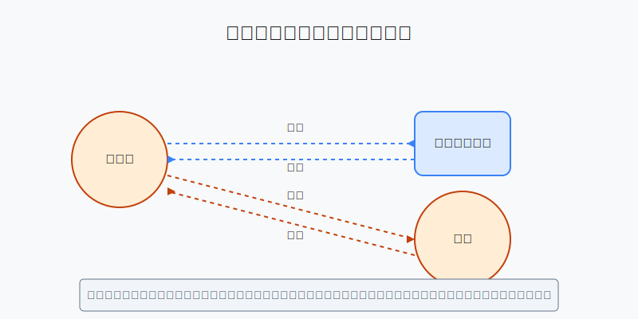
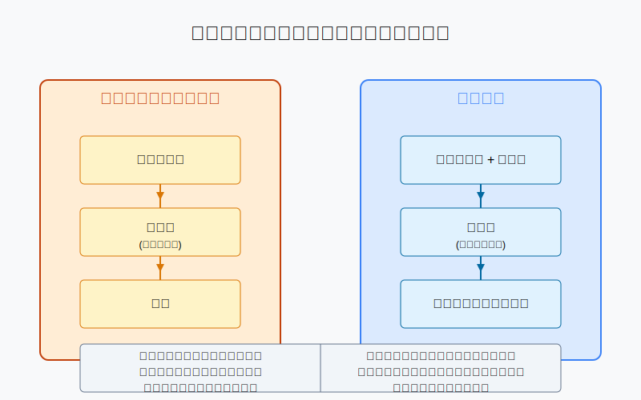
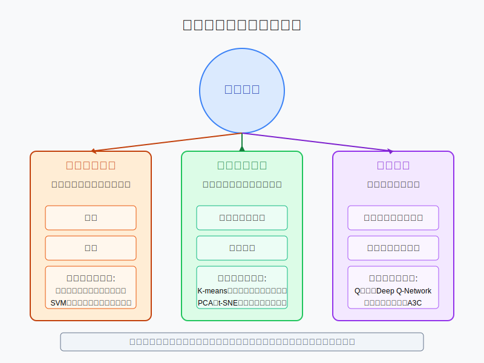
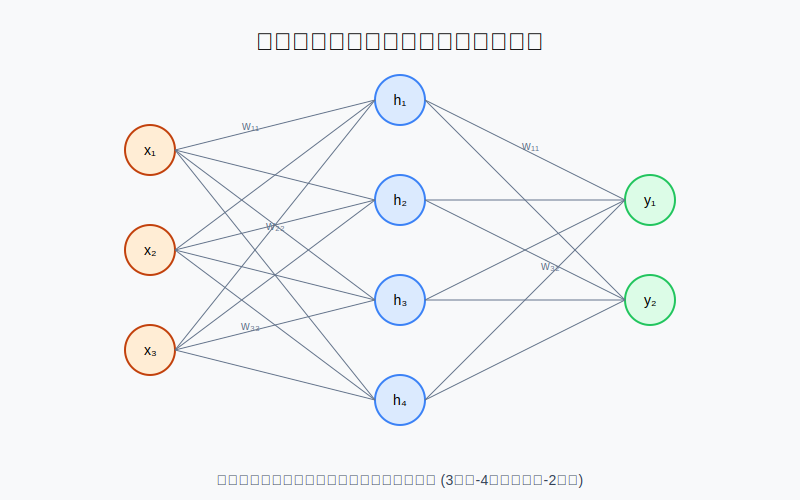
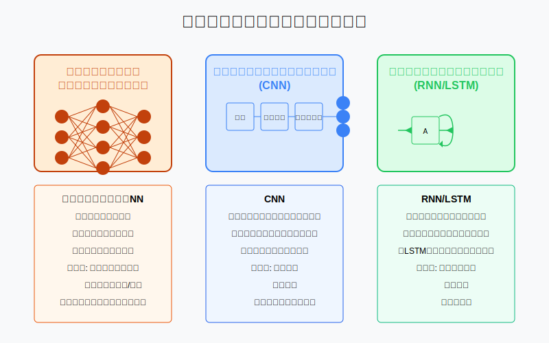
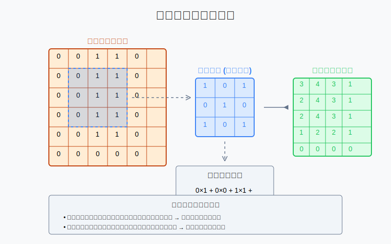
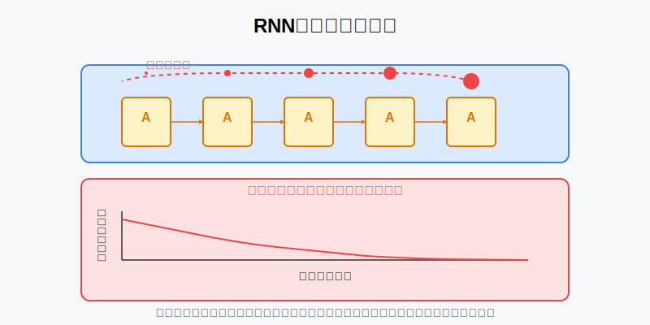
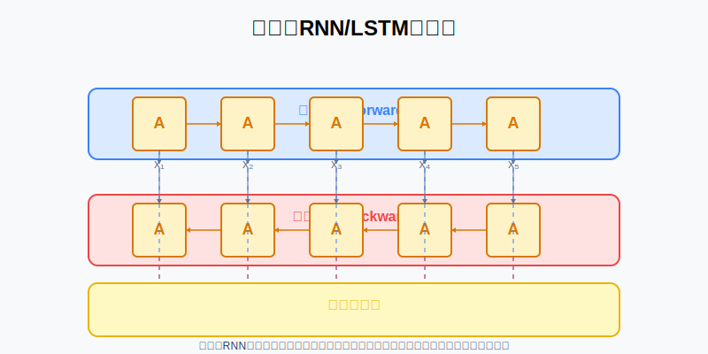

# 1. はじめに

## 人工知能とは何か？ Web 開発者が知っておくべき理由

人工知能（AI）とは、人間の知能を模倣し、学習、推論、自己修正などの知的な振る舞いを示すコンピュータシステムを指します。現代の AI は単なる技術トレンドではなく、Web 開発を含むソフトウェア開発の全領域に変革をもたらしつつあります。

Web 開発者が AI について理解すべき主な理由は以下の通りです：

1. **開発プロセスの効率化**: コード生成、デバッグ支援、テスト自動化などに AI を活用することで、開発効率が飛躍的に向上します。

2. **新しいユーザー体験の創出**: パーソナライゼーション、自然言語インターフェース、インテリジェントな検索など、AI を活用した革新的な UI/UX を実現できます。

3. **競争力の維持**: AI 技術を理解し活用できることは、今後の Web 開発市場での重要な差別化要因となります。

4. **新たなビジネスモデルの創出**: AI を組み込んだ Web サービスは、これまでにない価値提供が可能になり、新たなビジネス機会を生み出します。

## 本記事の対象読者と目的

本記事は以下のような方々を対象としています：

- Web 開発に携わるフロントエンド/バックエンドエンジニア
- AI の概念を理解し自分の開発プロジェクトに活用したいと考えている技術者
- 機械学習の基礎知識はあるが、実践的な応用方法を模索している方

この記事の主な目的は：

1. AI 技術の歴史的発展を体系的に理解する
2. 各時代の主要な技術と概念を実務的な視点から把握する
3. Web 開発との具体的な融合ポイントを明確にする
4. 今後のキャリアやプロジェクトに AI を取り入れるための実践的な視点を養う

技術的な詳細よりも概念理解に重点を置き、図解を多用して視覚的に理解しやすい内容を心がけます。コードサンプルは基本的に含まず、概念とアーキテクチャの説明に注力します。

## 技術発展の全体像：3 つの大きな時代区分

AI の技術発展は、大きく 3 つの時代に区分できます。それぞれの時代は異なるアプローチと技術的ブレークスルーによって特徴づけられています。


### 1. ルールベース AI の時代（1950-1990 年代）

この時代の AI は、人間の専門家が明示的に定義したルールやロジックに基づいて動作していました。チューリングテストの提案からエキスパートシステムの発展まで、人間の思考プロセスを論理的にモデル化することが中心でした。

**主な特徴**:

- 人間が作成した明示的なルールとロジック
- 「if-then」形式の条件分岐
- 特定の専門分野（医療診断、設備故障診断など）に特化
- 専門家の知識を形式化したナレッジベース

**限界**:

- ルールの作成と維持に多大な労力が必要
- 例外処理の複雑化
- 新しい状況への適応が困難

### 2. 機械学習の時代（1990-2016 年）

この時代には、コンピュータがデータから自動的にパターンを学習する能力が飛躍的に向上しました。特に深層学習の台頭により、画像認識や音声認識などの分野で人間に匹敵する性能を達成しました。

**主な特徴**:

- データからパターンを自動的に学習
- 特徴量の自動抽出
- 多層ニューラルネットワーク
- 画像認識のための CNN（畳み込みニューラルネットワーク）
- 時系列データ処理のための RNN/LSTM

**限界**:

- 大量の訓練データが必要
- ドメイン特化型のモデルが中心
- 説明可能性の低さ

### 3. 生成 AI の時代（2017 年-現在）

現在の生成 AI 時代は、Transformer アーキテクチャの登場から始まりました。大規模言語モデル（LLM）の発展により、テキスト生成、画像生成、対話システムなどで革命的な進化が起きています。

**主な特徴**:

- 自己注意機構（Self-Attention）による Transformer モデル
- 事前学習と微調整（Pre-training and Fine-tuning）
- 膨大なパラメータを持つ大規模モデル
- 複数のモダリティ（テキスト、画像、音声など）を横断
- API として提供される高度な AI 機能

**最新の発展**:

- マルチモーダルモデル（GPT-4V, Gemini, Claude）
- テキストから画像生成（DALL-E, Midjourney, Stable Diffusion）
- 音声合成と認識の高度化（Whisper, Suno）
- アプリケーション開発支援（GitHub Copilot, Claude）

この 3 つの時代を通じて、AI は「プログラムされた知能」から「学習する知能」、そして現在の「創造する知能」へと進化してきました。Web 開発者にとって、これらの技術の理解と活用は、次世代の Web アプリケーション開発において不可欠となっています。

次のセクションでは、第一の時代である「ルールベース AI の時代」について詳しく見ていきましょう。

# 2. ルールベース AI の時代（1950-1990 年代）

## 2-1. AI の概念誕生：チューリングテストと「考える機械」

人工知能の概念は、コンピュータの黎明期に遡ります。1950 年、イギリスの数学者アラン・チューリングは「Computing Machinery and Intelligence」という論文で、「機械は思考できるか？」という問いを提起しました。

### チューリングテスト

チューリングは、機械の知能を評価するための実験的方法として「模倣ゲーム」（後に「チューリングテスト」として知られるようになった）を提案しました。



チューリングテストの基本的な考え方は以下の通りです：

1. **テストの設定**: 質問者（人間）は、2 つの対話相手（1 人の人間ともう 1 つはコンピュータ）とテキストを通じてコミュニケーションをとります。
2. **テストの目的**: 質問者は、どちらが人間でどちらがコンピュータかを見分けようとします。
3. **知能の基準**: もし質問者が一定時間内に正確に区別できなければ、そのコンピュータは「知的」であるとみなされます。

チューリングテストは、機械が実際に「思考」しているかどうかではなく、人間と区別できない振る舞いができるかどうかに焦点を当てた実用的なアプローチでした。この視点は現在でも、AI 技術の評価や目標設定において重要な役割を果たしています。

### 初期の AI の進展

チューリングの概念提起を皮切りに、1950 年代から 1960 年代にかけて、初期の AI 研究が進展しました：

- **1956 年ダートマス会議**: 「人工知能（Artificial Intelligence）」という用語が正式に提案され、AI が学術分野として確立されました。
- **Logic Theorist（1956 年）**: アレン・ニューウェルとハーバート・サイモンによる、数学的定理を証明できる最初の AI プログラム。
- **ELIZA（1966 年）**: ジョセフ・ワイゼンバウムが開発した、セラピストのような対話ができる初期のチャットボット。

これらの初期の AI システムは、主に論理的推論や決定木に基づくルールベースのアプローチを採用していました。

## 2-2. エキスパートシステムの仕組みと限界

### エキスパートシステムとは

1970 年代から 1980 年代にかけて、ルールベース AI の代表的な応用として「エキスパートシステム」が登場しました。エキスパートシステムは、特定分野の専門家の知識を「if-then」ルールの形で形式化し、コンピュータが専門家のような意思決定や診断を行えるようにしたシステムです。


### エキスパートシステムの主要コンポーネント

1. **ナレッジベース（知識ベース）**:

   - 特定分野の専門家の知識を「if-then」ルールの形で格納
   - 例：「もし患者が発熱かつ咳をしている場合、風邪の可能性が高い」

2. **推論エンジン**:

   - ナレッジベースのルールを適用して推論を行う
   - 前向き推論（与えられた事実から結論を導き出す）
   - 後ろ向き推論（目標から始めて、それを満たす条件を確認していく）

3. **ユーザーインターフェース**:

   - システムとユーザー間の対話を管理
   - 問題の状況や症状についての質問
   - 結果や推奨事項の提示

4. **説明機構**:
   - システムがどのように結論に至ったかを説明
   - ユーザーの信頼獲得と検証のために重要

### 主な成功事例

1. **MYCIN（1970 年代）**: スタンフォード大学で開発された、血液感染症の診断と抗生物質の推奨を行うシステム。約 450 のルールを持ち、専門医と同等の診断精度を示した。

2. **DENDRAL（1960 年代後半）**: 質量分析データから分子構造を推定するシステム。化学分野で初めての成功した AI アプリケーション。

3. **XCON/R1（1980 年代）**: デジタル・イクイップメント・コーポレーション（DEC）で開発された、コンピュータシステムの構成を支援するシステム。年間数千万ドルのコスト削減を実現。

4. **PROSPECTOR**: 地質学的データに基づいて鉱床の位置を予測するシステム。実際に新たな鉱床発見に貢献。

### エキスパートシステムの限界

1950 年代から 1980 年代まで、AI の主流はルールベースシステムでしたが、1990 年代に入ると様々な限界が明らかになってきました。


#### 1. 知識獲得のボトルネック

専門家の暗黙知を明示的なルールとして抽出し、形式化する作業は、膨大な時間と労力を要しました。また、専門家自身も自分の知識や判断プロセスを明確に言語化できない場合が多く、これが「知識獲得のボトルネック」と呼ばれる問題を引き起こしました。

#### 2. 柔軟性の欠如

エキスパートシステムは、ナレッジベースに明示的に定義されていないルールや例外的なケースに適応することが困難でした。新しい状況や境界条件では、システムの性能が急激に低下する「脆さ」が問題となりました。

#### 3. スケーラビリティの問題

ルール数が増えるにつれて、ルール間の相互作用が複雑化し、システム全体の一貫性を維持することが困難になりました。また、計算量も増大し、性能が低下する問題がありました。

```
例：ルール数の増加と複雑性
10個のルール → 最大45種類の相互作用
100個のルール → 最大4,950種類の相互作用
1000個のルール → 最大499,500種類の相互作用
```

#### 4. 不確実性への対応

実世界の問題は、しばしば不完全な情報や不確実性を伴います。二値的な「if-then」ルールでは、確率的な推論や曖昧さを適切に扱うことが困難でした。例えば、医療診断では症状と疾患の関係が確率的であることが多いですが、初期のエキスパートシステムではこうした不確実性の取り扱いに限界がありました。

#### 5. AI の冬の時代

1980 年代後半から 1990 年代にかけて、これらの限界が明らかになるにつれ、エキスパートシステムへの過度な期待と現実のギャップが生じました。その結果、AI の研究資金が減少する「AI の冬」と呼ばれる停滞期に入りました。

### ルールベース AI からの転換

エキスパートシステムの限界を克服するため、1990 年代には新たなアプローチが模索されるようになりました：

1. **確率的アプローチ**: ベイジアンネットワークなど、不確実性を明示的に扱える確率モデルの導入
2. **データ駆動アプローチ**: 大量のデータから自動的にパターンを学習する機械学習への移行
3. **ハイブリッドアプローチ**: ルールベースと確率モデルや機械学習を組み合わせたシステム

これらの新しいアプローチの中でも、特に注目を集めたのが「機械学習」でした。機械学習は、プログラマーが明示的にルールを記述する代わりに、データから自動的にパターンを学習してモデルを構築するアプローチであり、次の「機械学習の時代」への扉を開くことになりました。

ルールベース AI の限界を乗り越え、より柔軟で適応力の高いシステムへの移行は、AI 研究の大きな転換点となりました。次のセクションでは、この新しい時代について詳しく見ていきます。

# 3. 機械学習の時代（1990-2016 年）

## 3-1. 機械学習の基本概念：データからパターンを学ぶ

1990 年代以降、AI 研究の中心はルールベースアプローチから機械学習へと移行しました。この転換は、計算能力の向上とデータ量の増加に支えられていました。

### 機械学習とは

機械学習は、コンピュータがデータから自動的にパターンを識別し、そこから学習することで性能を向上させるアプローチです。従来のプログラミングとは異なり、開発者が明示的なルールを記述する代わりに、システムがデータから自律的に学習します。



### 機械学習のパラダイムシフト

機械学習は、AI アプローチにおける根本的なパラダイムシフトを表しています：

#### 1. 従来のプログラミング：

- **入力**: データ
- **人間の役割**: ルールを明示的に設計
- **出力**: 結果

#### 2. 機械学習：

- **入力**: データ + 期待される出力（ラベル）
- **コンピュータの役割**: データから最適なルール（モデル）を自動的に学習
- **出力**: 新しいデータに対する予測

このシフトにより、人間がルールを明示的に定義することが難しい複雑な問題（例：画像認識、音声認識、自然言語処理など）において大きなブレークスルーがもたらされました。

### 機械学習の主要なタイプ

機械学習には、学習方法に基づいていくつかの主要なタイプがあります：



#### 1. 教師あり学習 (Supervised Learning)

教師あり学習は、入力データと対応する正解（ラベル）のペアを使って学習するアプローチです。

**主な特徴:**

- **データ**: ラベル付きデータセット（例：画像とその内容を示すラベル）
- **目的**: 入力から出力へのマッピングを学習する
- **評価**: 予測と実際のラベルとの差（誤差）を最小化する

**代表的なタスク:**

- **分類 (Classification)**: 入力データを事前定義されたカテゴリに分類する
  - 例: スパムメール検出、画像分類、感情分析
- **回帰 (Regression)**: 連続的な数値を予測する
  - 例: 住宅価格予測、株価予測、気温予測

**主要アルゴリズム:**

- 線形回帰/ロジスティック回帰
- 決定木/ランダムフォレスト
- サポートベクターマシン (SVM)
- K 近傍法 (KNN)
- ニューラルネットワーク

#### 2. 教師なし学習 (Unsupervised Learning)

教師なし学習は、ラベルなしデータから構造やパターンを発見するアプローチです。

**主な特徴:**

- **データ**: ラベルのないデータセット
- **目的**: データの内部構造を発見する
- **評価**: 明確な評価基準がない場合が多く、タスク依存

**代表的なタスク:**

- **クラスタリング (Clustering)**: 似たデータポイントをグループ化する
  - 例: 顧客セグメンテーション、文書グループ化
- **次元削減 (Dimensionality Reduction)**: データの重要な特徴を抽出し、次元を削減する

  - 例: データの可視化、特徴圧縮

- **異常検知 (Anomaly Detection)**: 通常パターンから外れるデータを検出する
  - 例: 不正検出、設備故障検知

**主要アルゴリズム:**

- K-means
- 階層的クラスタリング
- 主成分分析 (PCA)
- t-SNE (t-distributed Stochastic Neighbor Embedding)
- オートエンコーダ

#### 3. 強化学習 (Reinforcement Learning)

強化学習は、環境との相互作用を通じて、報酬を最大化する行動方針を学習するアプローチです。

**主な特徴:**

- **データ**: 環境からのフィードバック（報酬または罰）
- **目的**: 長期的な報酬を最大化する方針を学習する
- **学習方法**: 試行錯誤と環境からのフィードバック

**応用例:**

- ゲーム AI（囲碁、チェス、ビデオゲーム）
- ロボット制御
- 自動運転車
- 推薦システム

**主要アルゴリズム:**

- Q 学習
- Deep Q-Network (DQN)
- ポリシー勾配法
- アクター・クリティック法

### 機械学習の基本プロセス

機械学習モデルの開発と運用は、一般的に以下のステップで行われます：


#### 1. データ収集

機械学習の質はデータの質に大きく依存します。適切な量、多様性、品質を持つデータの収集が重要です。

#### 2. データ前処理

生データをモデルが扱いやすい形に変換します：

- 欠損値の処理
- 外れ値の検出と処理
- データの正規化・標準化
- カテゴリカルデータのエンコーディング（one-hot encoding など）

#### 3. 特徴量選択/抽出

モデルの性能は使用する特徴（変数）に大きく依存します：

- 特徴量選択: 最も関連性の高い特徴を選ぶ
- 特徴量抽出: 元の特徴から新しい特徴を生成する
- 特徴量エンジニアリング: ドメイン知識を活用した特徴量の作成

#### 4. モデル選択

問題の性質や利用可能なデータに基づいて適切なアルゴリズムを選択します：

- 線形モデル vs 非線形モデル
- パラメトリックモデル vs ノンパラメトリックモデル
- シンプルモデル vs 複雑モデル（オッカムの剃刀原理）

#### 5. モデル学習（トレーニング）

選択したアルゴリズムをトレーニングデータに適用し、パラメータを最適化します：

- コスト関数の最小化
- 勾配降下法などの最適化アルゴリズムの使用
- バッチ処理 vs オンライン学習

#### 6. モデル評価

モデルの性能を適切な評価指標で測定します：

- 分類問題: 精度、適合率、再現率、F1 スコア、ROC 曲線
- 回帰問題: 平均二乗誤差(MSE)、平均絶対誤差(MAE)
- トレーニングデータとテストデータでの性能比較（過学習の検出）

#### 7. ハイパーパラメータ調整

モデルの構造やトレーニングプロセスを制御するパラメータを最適化します：

- グリッドサーチ、ランダムサーチ
- ベイズ最適化
- 交差検証による評価

#### 8. モデルデプロイ

開発したモデルを実際の環境で利用できるようにします：

- API としての提供
- バッチ処理システムへの組み込み
- モバイルデバイスへの最適化

#### 9. モニタリングとメンテナンス

デプロイされたモデルのパフォーマンスを継続的に監視します：

- データドリフト（入力データの分布変化）の検出
- モデル性能の低下検知
- 異常検知

#### 10. 再学習とアップデート

新しいデータや変化した環境に適応するようモデルを更新します：

- 定期的な再学習
- オンライン学習
- モデルのバージョン管理

### 機械学習における重要な概念

#### バイアスとバリアンス（トレードオフ）

機械学習モデルの誤差は主に 2 つのソースから発生します：


1. **バイアス (Bias)**

   - モデルが真の関係を捉える能力の欠如（単純化による誤差）
   - 高バイアス = モデルが単純すぎて、データの複雑なパターンを捉えられない（過小適合）
   - 例: 複雑な非線形関係を線形モデルで表現しようとする場合

2. **バリアンス (Variance)**

   - トレーニングデータの小さな変動に対するモデルの敏感さ
   - 高バリアンス = モデルが複雑すぎて、ノイズまで学習してしまう（過剰適合）
   - 例: 高次多項式で少数のデータポイントを完全に通過する曲線を描く場合

3. **トレードオフ関係**
   - モデルの複雑さを上げると、バイアスは減少するがバリアンスは増加
   - モデルの複雑さを下げると、バイアンスは増加するがバリアンスは減少
   - 最適なモデルは、バイアスとバリアンスの合計を最小化するポイント

#### 過学習と過少学習


1. **過少学習 (Underfitting)**

   - モデルが単純すぎて、データの基本的なパターンすら捉えられない状態
   - 高いバイアス、低いバリアンス
   - 特徴：トレーニングデータでも性能が悪い
   - 対策：より複雑なモデルを選択、特徴量の追加、モデルの制約を緩める

2. **過学習 (Overfitting)**

   - モデルが複雑すぎて、トレーニングデータの偶然のノイズまで学習してしまう状態
   - 低いバイアス、高いバリアンス
   - 特徴：トレーニングデータでは性能が良いが、新しいデータ（テストデータ）では性能が低下
   - 対策：
     - 正則化 (Regularization): モデルの複雑さにペナルティを課す（L1/L2 正則化）
     - ドロップアウト (Dropout): ニューラルネットワークの一部のノードを無効化
     - 早期停止 (Early Stopping): 検証誤差が増加し始めたら学習を停止
     - データ拡張 (Data Augmentation): 人工的にトレーニングデータを増やす
     - アンサンブル学習: 複数のモデルの予測を組み合わせる

3. **適切な学習**
   - バイアスとバリアンスのバランスが良い状態
   - データの本質的なパターンを捉えつつ、ノイズには反応しない
   - 特徴：トレーニングデータとテストデータで同様の性能を示す
   - 目標：未知のデータに対する汎化性能の最大化

#### 学習曲線と検証曲線

学習曲線は、モデルのトレーニング過程や問題を視覚的に診断するための重要なツールです：


1. **過少学習（高バイアス）の特徴**

   - トレーニング誤差が高いレベルで収束
   - 検証誤差もトレーニング誤差に近い高いレベルで収束
   - 両方の曲線が早期に収束し、データ量を増やしても改善が見られない
   - **対策**: より複雑なモデルを使用、特徴量を追加

2. **適切な学習の特徴**

   - トレーニング誤差と検証誤差の間に適度なギャップ
   - 両方の誤差が低いレベルで収束
   - データ量の増加とともに両方の誤差が減少
   - **結果**: 良好な汎化性能を持つモデル

3. **過学習（高バリアンス）の特徴**
   - トレーニング誤差が非常に低いレベルで収束
   - 検証誤差はそれよりもかなり高いレベル
   - 両曲線の間に大きなギャップが存在
   - **対策**: モデルを単純化、正則化、データ量を増やす

### 機械学習の実世界における課題

1. **データ品質と量**

   - 多くの機械学習アルゴリズムは大量の高品質データを必要とする
   - 現実世界のデータは往々にして不完全、ノイズが多い、偏りがある

2. **特徴量エンジニアリングの複雑さ**

   - 適切な特徴量の設計は機械学習の成功に不可欠
   - ドメイン知識と技術的スキルの両方が必要

3. **解釈可能性とブラックボックス問題**

   - 複雑なモデル（特に深層学習）は結果の解釈が困難
   - 多くの実用的な状況では、予測理由の説明が必要

4. **データバイアスと倫理的問題**

   - トレーニングデータの偏りがモデルの意思決定に反映される
   - 公平性、透明性、説明責任の確保が重要

5. **計算資源とエネルギー消費**
   - 大規模モデルのトレーニングには膨大な計算資源が必要
   - 環境負荷と持続可能性の問題

### ディープラーニングへの橋渡し

機械学習の発展の中で、特に注目されたのが「ディープラーニング（深層学習）」です。これは多層のニューラルネットワークを用いた機械学習の一種で、2010 年代に入って大きなブレークスルーをもたらしました。

ディープラーニングが従来の機械学習と異なる主な点は：

1. **自動的な特徴抽出**

   - 従来の機械学習: 人間が特徴量を設計
   - ディープラーニング: 生データから自動的に関連特徴を学習

# 3-2. ニューラルネットワークの仕組み（図解付き簡易説明）

ニューラルネットワークは、人間の脳の神経細胞（ニューロン）の仕組みに着想を得た機械学習モデルです。基本的な構造から始めて、その動作原理を段階的に解説します。

## ニューラルネットワークの基本構造



ニューラルネットワークは通常、以下の 3 種類の層から構成されています：

1. **入力層 (Input Layer)**

   - ネットワークへのデータ入力点
   - ノード数は入力特徴量の数と一致
   - 例：画像認識では各ピクセルの値、テキスト分析では単語のベクトル表現など

2. **隠れ層 (Hidden Layer)**

   - 入力と出力の間に位置し、複雑なパターンを捉える
   - 層の数とノード数はモデル設計者が決定（ハイパーパラメータ）
   - 層が多いほど複雑なパターンを学習可能（ディープラーニング）

3. **出力層 (Output Layer)**
   - ネットワークの最終的な予測を生成
   - ノード数はタスクに依存（分類問題ではクラス数、回帰問題では予測値の数）
   - 活性化関数はタスクに応じて選択（分類ではソフトマックス、回帰では線形など）

層と層の間はすべて **重み (Weights)** と呼ばれるパラメータで接続されており、学習過程でこれらの重みが調整されます。

## ニューロンの仕組み


ニューラルネットワークの基本単位である「ニューロン」の動作プロセスは以下の通りです：

1. **入力の受け取り**

   - 複数の入力値（x₁, x₂, x₃, ...）を受け取る

2. **重み付け**

   - 各入力に対応する重み（w₁, w₂, w₃, ...）を掛け合わせる
   - 重みは学習によって調整されるパラメータ

3. **加重和の計算**

   - 重み付けされた入力の合計を計算
   - バイアス（b）を加算: z = w₁x₁ + w₂x₂ + w₃x₃ + ... + b
   - バイアスは入力に依存せず、ニューロンの活性化しやすさを調整

4. **活性化関数の適用**
   - 加重和に非線形の活性化関数を適用: y = f(z)
   - これにより、ネットワーク全体が非線形の関係性を学習できる

### 主な活性化関数


ニューラルネットワークの性能は活性化関数の選択に大きく影響されます。代表的な活性化関数には以下のものがあります：

1. **シグモイド関数 (Sigmoid)**

   - 出力範囲: 0 ～ 1
   - 特徴: 伝統的な活性化関数、二値分類の出力層で使用
   - 問題点: 勾配消失問題（深いネットワークで学習が困難）

2. **ReLU (Rectified Linear Unit)**

   - 出力範囲: 0 ～ ∞
   - 特徴: 計算効率が良く、深いネットワークでも学習しやすい
   - 現代の多くのネットワークで標準的に使用
   - 問題点: "dying ReLU"問題（負の入力に対して勾配がゼロ）

3. **tanh（ハイパボリックタンジェント）**

   - 出力範囲: -1 ～ 1
   - 特徴: シグモイドよりも勾配消失問題が軽減、中心が 0
   - 問題点: 依然として勾配消失問題が存在

4. **その他の変種**
   - Leaky ReLU: 負の入力に対して小さな勾配を持つ
   - ELU: 負の値に対してもなめらかな曲線
   - Swish: Google Brain によって提案された新しい関数

## ニューラルネットワークの学習プロセス

ニューラルネットワークの学習は、以下の循環的なプロセスで行われます：

1. **順伝播（Forward Propagation）**

   - 入力データがネットワークを通過し、各層で重み付け計算と活性化関数の適用が行われる
   - 最終的に出力層から予測結果が生成される

2. **誤差計算（Loss Calculation）**

   - 予測値と実際の正解値（教師データ）の差を計算
   - 一般的な損失関数：
     - 回帰問題：平均二乗誤差（MSE）
     - 分類問題：交差エントロピー損失

3. **逆伝播（Backpropagation）**

   - 計算された誤差を出力層から入力層に向かって逆方向に伝播
   - 各重みがどれだけ誤差に寄与したかを計算（勾配計算）
   - 微分の連鎖律を利用して効率的に計算

4. **重み更新（Weight Update）**

   - 計算された勾配を使って重みを更新
   - 基本公式: W_new = W_old - learning_rate \* gradient
   - 学習率（learning rate）：重みの更新量を調整するハイパーパラメータ

5. **最適化アルゴリズム（Optimization Algorithm）**

   - 単純な勾配降下法の改良版アルゴリズム：
     - SGD（確率的勾配降下法）：データをミニバッチに分割して処理
     - Adam：適応的学習率と慣性を組み合わせた手法
     - RMSprop：勾配の指数移動平均を使用

6. **モデル評価（Evaluation）**
   - 検証データを使ってモデルの性能をチェック
   - 過学習の監視と早期停止（early stopping）の判断

この学習プロセスをエポック（全データの 1 周）単位で繰り返し、モデルの重みを徐々に最適化していきます。

## ニューラルネットワークのハイパーパラメータ

ニューラルネットワークの設計と学習には、開発者が事前に決定する必要のある複数のハイパーパラメータがあります：

1. **アーキテクチャ関連**

   - 隠れ層の数
   - 各層のニューロン数
   - 活性化関数の種類

2. **学習プロセス関連**

   - 学習率（learning rate）
   - バッチサイズ（batch size）
   - エポック数（epochs）
   - 重みの初期化方法
   - 正則化パラメータ（L1/L2 正則化）

3. **最適化アルゴリズム関連**
   - 最適化手法（SGD, Adam, RMSProp 等）
   - モーメンタム係数
   - 学習率減衰（learning rate decay）

これらのハイパーパラメータの適切な選択は、モデルの性能に大きな影響を与えます。多くの場合、グリッドサーチやランダムサーチなどの手法で最適な組み合わせを探索します。

## ニューラルネットワークの基本的な発展形



ニューラルネットワークには様々な種類がありますが、特に重要な 3 つの基本的な発展形を見ていきましょう：

### 1. フィードフォワードニューラルネットワーク (FFNN)

最も基本的なニューラルネットワーク構造で、情報が入力層から出力層に一方向に流れます。

**特徴:**

- 層と層の間は完全結合（全てのニューロン同士が接続）
- 各層のニューロンは同じ層の他のニューロンとは接続しない
- 循環的な接続がない

**用途:**

- 構造化データ（表形式データ）の分析
- 分類問題や回帰問題の解決
- 比較的シンプルなパターン認識

**限界:**

- 空間的な相関関係（画像内の隣接ピクセル関係など）を効率的に捉えられない
- 時系列データ内の順序関係を考慮できない

### 2. 畳み込みニューラルネットワーク (CNN: Convolutional Neural Network)

画像処理に特化したネットワーク構造で、局所的な特徴を効率的に抽出できます。

**主要コンポーネント:**

- **畳み込み層 (Convolutional Layer)**: 特徴マップを生成するフィルタを適用
- **プーリング層 (Pooling Layer)**: 情報を圧縮し、位置の不変性を獲得
- **全結合層 (Fully Connected Layer)**: 最終的な分類を行う

**特徴:**

- パラメータ共有（同じフィルタを画像全体に適用）
- 局所的受容野（各ニューロンは入力の一部のみを見る）
- 階層的な特徴抽出（低レベル特徴から高レベル特徴へ）

**用途:**

- 画像分類
- 物体検出・セグメンテーション
- 顔認識
- 医療画像分析

### 3. 再帰型ニューラルネットワーク (RNN: Recurrent Neural Network)

時系列データや順序のあるデータを処理するためのネットワーク構造です。

**特徴:**

- 内部状態（メモリ）を持ち、過去の情報を保持
- 同じパラメータを時間的に共有
- 可変長の入力を処理可能

**発展形:**

- **LSTM (Long Short-Term Memory)**: 長期依存関係を捉えるための特殊な RNN ユニット
- **GRU (Gated Recurrent Unit)**: LSTM を簡略化した構造

**用途:**

- 自然言語処理（文章生成、翻訳、感情分析）
- 音声認識
- 時系列予測（株価予測、気象予測）
- 動画解析

## ディープラーニングの主な課題と対策

### 1. 勾配消失・爆発問題

**問題**: 深いネットワークでは、逆伝播時に勾配が層を通過するにつれて非常に小さく（消失）または非常に大きく（爆発）なることがある

**対策**:

- 適切な活性化関数の使用（ReLU など）
- バッチ正規化（Batch Normalization）
- 残差接続（ResNet など）
- 勾配クリッピング

### 2. 過学習

**問題**:モデルがトレーニングデータに過度に適合し、新しいデータに対する汎化性能が低下する

**対策**:

- ドロップアウト（Dropout）：訓練時にランダムにニューロンを無効化
- L1/L2 正則化：重みの大きさにペナルティを課す
- データ拡張（Data Augmentation）：人工的にトレーニングデータを増やす
- 早期停止（Early Stopping）：検証誤差が悪化し始めたら学習を停止

### 3. 計算コスト

**問題**:深いネットワークや大規模データセットは、トレーニングに膨大な計算リソースが必要

**対策**:

- GPU や TPU などの専用ハードウェアの利用
- 分散学習（複数のマシンでの並列処理）
- モデル圧縮・量子化（Quantization）
- 知識蒸留（Knowledge Distillation）：大きなモデルから小さなモデルへの知識転移

### 4. 解釈可能性の欠如

**問題**:複雑なネットワークは「ブラックボックス」として機能し、決定理由の説明が困難

**対策**:

- 注意機構（Attention Mechanism）の可視化
- 特徴の重要度分析
- 局所的解釈可能性手法（LIME, SHAP など）
- モデルの単純化

## ニューラルネットワークの実際の応用例

1. **画像認識・分類**

   - 医療画像診断：X 線、CT、MRI 画像から疾患を検出
   - 顔認識：セキュリティシステム、スマートフォンのロック解除
   - 自動運転車：交通標識や歩行者の認識

2. **自然言語処理**

   - 機械翻訳：Google 翻訳、DeepL など
   - 感情分析：ソーシャルメディアの投稿から感情を検出
   - 質問応答システム：仮想アシスタント（Siri, Alexa など）

3. **音声処理**

   - 音声認識：音声コマンド、議事録作成
   - 話者識別：セキュリティシステム、カスタマーサービス
   - 音声合成：テキスト読み上げ、仮想アシスタントの音声

4. **推薦システム**
   - E コマース：「あなたにおすすめの商品」
   - 動画/音楽ストリーミング：Netflix, Spotify 等の推薦アルゴリズム
   - ニュースフィード：パーソナライズされたコンテンツ

## まとめ：ニューラルネットワークの仕組み

ニューラルネットワークは、生物学的ニューロンの仕組みに着想を得た機械学習モデルで、以下の重要な特徴を持っています：

1. **層状構造**：入力層、隠れ層、出力層からなる階層構造

2. **ニューロン**：入力の加重和を計算し、活性化関数を適用して出力を生成する基本単位

3. **学習プロセス**：順伝播、誤差計算、逆伝播、重み更新のサイクルで最適化

4. **多様なアーキテクチャ**：

   - フィードフォワードネットワーク：基本的な多層構造
   - CNN：画像処理に特化した構造
   - RNN/LSTM：時系列データに特化した構造

5. **発展的技術**：
   - 深層学習：多層のネットワークによる複雑なパターン認識
   - 転移学習：事前学習済みモデルを別のタスクに適用
   - マルチモーダル学習：複数の入力タイプ（画像+テキストなど）の統合

ニューラルネットワークの仕組みを理解することは、現代 AI の多くの応用技術の基盤となります。次のセクションでは、画像認識の革命をもたらした CNN について、より詳しく見ていきましょう。

# 3-3. 画像認識革命：CNN とその応用

画像認識の分野は、畳み込みニューラルネットワーク（CNN: Convolutional Neural Network）の登場によって革命的な進化を遂げました。2012 年の ImageNet コンペティションでの AlexNet の成功を皮切りに、CNN は画像認識の標準的アプローチとなり、多様な応用へと発展しています。

## CNN の基本構造と動作原理


### CNN の主要構成要素

CNN は、画像のような格子状データから特徴を効率的に抽出するために設計された特殊なニューラルネットワークです。その主要な構成要素は以下の通りです：

#### 1. 畳み込み層（Convolutional Layer）

畳み込み層は、CNN の中核となる層で、入力画像にフィルタ（カーネル）を適用して特徴マップを生成します。

**主な特徴：**

- **局所的受容野（Local Receptive Field）**: 各ニューロンは入力の一部だけを見る
- **パラメータ共有**: 同じフィルタが画像全体に適用される（位置不変性）
- **階層的特徴抽出**: 層が深くなるにつれ、低レベル特徴（エッジ、色など）から高レベル特徴（物体の部分、パターンなど）へと抽象化

#### 2. 活性化関数層

畳み込み層の出力に非線形性を導入します。CNN では通常、ReLU（Rectified Linear Unit）が使用されます：

- f(x) = max(0, x)
- 計算効率が良く、勾配消失問題を軽減

#### 3. プーリング層（Pooling Layer）

プーリング層は、特徴マップの空間的次元を縮小し、計算効率と位置不変性を向上させます。

**代表的なプーリング操作：**

- **Max Pooling**: ウィンドウ内の最大値を選択
- **Average Pooling**: ウィンドウ内の平均値を計算
- 一般的に 2×2 のウィンドウとストライド 2 が使用される（サイズを半分に）

#### 4. 全結合層（Fully Connected Layer）

CNN の最後の層で、抽出された特徴を分類に結び付けます。

**役割：**

- 畳み込み層とプーリング層で抽出された特徴を「平坦化（Flatten）」
- 通常のニューラルネットワークと同様に、すべてのニューロン間を完全結合
- 最終的な分類結果を生成（通常は Softmax 関数を使用）

#### 5. ドロップアウト層（Dropout Layer）

過学習を防ぐために使用される正則化テクニック：

- トレーニング中にランダムにニューロンを「ドロップアウト」（無効化）
- テスト時にはすべてのニューロンを使用

## 畳み込み演算の詳細



### 畳み込み演算の仕組み

畳み込み演算は、CNN の核となる処理で、以下のステップで行われます：

1. **フィルタ（カーネル）の適用**：

   - 通常 3×3 や 5×5 などの小さな行列（フィルタ）を使用
   - 入力画像上をスライドさせながら、重なった部分ごとに計算

2. **要素ごとの積和演算**：

   - フィルタと重なった入力画像の各要素を掛け合わせる
   - その結果を全て足し合わせて、出力特徴マップの対応する位置の値とする

3. **バイアスの加算と活性化関数の適用**：
   - 計算結果にバイアスを加算
   - 非線形活性化関数（多くの場合 ReLU）を適用

### CNN における重要なパラメータ

1. **フィルタサイズ**：一般的に 3×3、5×5 などの小さなサイズが使用されます

2. **ストライド（Stride）**：フィルタを適用する際の移動幅

   - ストライド 1：1 ピクセルずつ移動（出力サイズは入力とほぼ同じ）
   - ストライド 2：2 ピクセルずつ移動（出力サイズは約半分に）

3. **パディング（Padding）**：入力画像の周囲に追加するピクセル

   - 「valid」パディング：パディングなし（出力サイズは入力より小さくなる）
   - 「same」パディング：出力サイズを入力と同じに保つためのパディング

4. **フィルタ数**：各層で使用するフィルタの数（＝出力特徴マップのチャネル数）
   - 一般的に層が深くなるほど増加（例：64→128→256...）

## CNN の発展と代表的なアーキテクチャ

！[cnn-architectures.svg](./cnn-architectures.svg)

### CNN の歴史的発展と主要アーキテクチャ

CNN の発展は、画像認識の精度向上と並行して進んできました。以下に代表的なアーキテクチャを時系列で紹介します：

#### 1. AlexNet (2012 年)

**技術的進歩**:

- ImageNet コンペティションで初めてディープラーニングの優位性を証明
- GPU を用いた並列計算で大規模ネットワークの学習を実現
- ReLU 活性化関数、ドロップアウト正則化の導入

**特徴**:

- 8 層（5 畳み込み層、3 全結合層）
- 約 6,000 万パラメータ
- トップ 5 エラー率が従来手法の約 26%から約 15%に改善

#### 2. VGGNet (2014 年)

**技術的進歩**:

- シンプルで一貫した設計思想（3×3 の小さな畳み込みの積み重ね）
- より深いネットワーク（16 ～ 19 層）の有効性を実証

**特徴**:

- 小さな畳み込みフィルタを連続的に使用し、受容野を拡大
- シンプルな構造で理解しやすく、転移学習にも適している
- 約 1 億 3,800 万パラメータと計算コストの大きさが課題

#### 3. GoogLeNet/Inception (2014 年)

**技術的進歩**:

- 「Inception モジュール」の導入：異なるサイズのフィルタを並列に使用
- 計算効率を考慮した「1×1 畳み込み」によるチャネル次元の削減

**特徴**:

- 22 層の深さにもかかわらず、パラメータ数は約 500 万と少ない
- マルチスケールの特徴抽出が可能
- 複雑な並列構造による実装の難しさ

#### 4. ResNet (2015 年)

**技術的進歩**:

- 「残差接続（Residual Connection）」による超深層ネットワークの学習を実現
- 勾配消失問題の画期的な解決策

**特徴**:

- 152 層まで拡張可能な設計
- スキップ接続により、浅いネットワークの性能を損なわずに深層化
- 現代のディープラーニングアーキテクチャの基盤となる技術

#### 5. DenseNet (2017 年)

**技術的進歩**:

- 各層を後続のすべての層に密に接続する「密結合（Dense Connection）」
- 特徴の再利用による効率化

**特徴**:

- 勾配の流れが改善され、より効率的な学習
- 少ないパラメータで高い性能
- 特徴マップの再利用によるメモリ効率の課題

#### 6. EfficientNet (2019 年)

**技術的進歩**:

- ネットワークの幅、深さ、解像度を同時に最適化する「複合スケーリング法」
- 計算効率とモデル性能のバランスを重視

**特徴**:

- 少ない計算リソースで最先端の精度を達成
- モバイルデバイスなど、制約のある環境でも効率的に動作
- B0 ～ B7 までのさまざまなサイズのモデルバリエーション

#### 最新の動向: ViT (Vision Transformer) など

- CNN と Transformer の融合
- 自己注意機構（Self-Attention）を活用した視覚表現の学習
- 大規模データセットでの事前学習とファインチューニング

## CNN の応用分野


CNN は画像処理のさまざまな分野で革命的な進歩をもたらしました。以下に主要な応用分野を紹介します：

### 1. 画像分類（Image Classification）

**概要**：

- 入力画像に対して単一のラベル（または確率分布）を出力
- ImageNet などの大規模データセットで評価

**実用例**：

- Google フォトやアップル写真アプリの自動タグ付け
- 画像検索エンジン
- ソーシャルメディアの内容フィルタリング

**代表的技術**：

- ResNet, EfficientNet, Vision Transformer (ViT)

### 2. 物体検出（Object Detection）

**概要**：

- 画像内の複数の物体を検出し、各物体のカテゴリとバウンディングボックス（位置情報）を予測
- mAP（mean Average Precision）で評価

**実用例**：

- 自動運転車の周囲環境認識
- 監視カメラのリアルタイム人物・物体検出
- 小売業での在庫管理

**代表的技術**：

- R-CNN 系列（Fast R-CNN, Faster R-CNN）
- YOLO（You Only Look Once）系列
- SSD（Single Shot MultiBox Detector）

### 3. セマンティックセグメンテーション（Semantic Segmentation）

**概要**：

- 画像の各ピクセルに対してクラスラベルを予測
- 物体の詳細な形状を把握

**実用例**：

- 医療画像解析（腫瘍、臓器の分割）
- 衛星・航空写真からの地図作成
- 自動運転の詳細な道路環境理解

**代表的技術**：

- FCN（Fully Convolutional Network）
- U-Net（医療画像向け）
- DeepLab

### 4. インスタンスセグメンテーション（Instance Segmentation）

**概要**：

- セマンティックセグメンテーションに加え、同じクラスの異なる物体インスタンスを区別
- より詳細な場面理解が可能

**実用例**：

- ロボットによる物体操作
- AR（拡張現実）アプリケーション
- 精密な映像編集・合成

**代表的技術**：

- Mask R-CNN
- YOLACT（You Only Look At CoefficienTs）

### 5. 顔認識・顔検出

**概要**：

- 顔の検出、識別、感情分析など
- 精度と速度のバランスが重要

**実用例**：

- スマートフォンの顔認証
- セキュリティシステム
- 写真アプリの顔認識タグ付け

**代表的技術**：

- FaceNet
- ArcFace
- DeepFace

### 6. 画像生成・変換

**概要**：

- CNN をエンコーダやデコーダとして利用し、新しい画像を生成または変換
- 創造的なアプリケーションの基盤

**実用例**：

- 画像の超解像（低解像度から高解像度への変換）
- 画像のスタイル変換
- 画像のノイズ除去・修復

**代表的技術**：

- GANs（Generative Adversarial Networks）の画像生成部分
- 画像変換ネットワーク（Pix2Pix, CycleGAN）
- ディフュージョンモデルの U-Net 系アーキテクチャ

### 7. ポーズ推定（Pose Estimation）

**概要**：

- 人間や動物の体の姿勢、関節の位置を推定
- リアルタイム処理が求められることが多い

**実用例**：

- モーションキャプチャ
- フィットネスアプリのフォームチェック
- AR アプリケーション

**代表的技術**:

- OpenPose
- PoseNet
- DeepCut

### 8. 医療画像解析

**概要**:

- X 線、CT、MRI などの医療画像からの診断支援
- 高い精度と説明可能性が求められる

**実用例**:

- がん・腫瘍の検出
- 骨折・異常所見の自動スクリーニング
- 臓器のセグメンテーションと体積測定

**代表的技術**:

- U-Net（臓器セグメンテーション）
- CheXNet（胸部 X 線診断）
- 専門的な CNN アーキテクチャ（3D-CNN 等）

## CNN における重要な技術的進歩

### 1. 転移学習（Transfer Learning）

大規模データセット（ImageNet など）で事前学習された CNN モデルを、別のタスクに適用する手法です。

**メリット**:

- 少ないデータセットでも高性能なモデルを構築可能
- 学習時間の大幅な短縮
- 特に医療画像など、専門的な領域で有効

**一般的アプローチ**:

1. 事前学習済みモデル（ResNet, VGG など）をベースに使用
2. 最終層を新しいタスクに合わせて置き換え
3. 新しいデータでファインチューニング

### 2. 視覚的注意機構（Visual Attention）

CNN に人間の視覚的注意と類似したメカニズムを導入し、画像の重要な部分に集中できるようにする技術です。

**主な種類**:

- チャネル注意機構（Squeeze-and-Excitation Networks）
- 空間注意機構（Spatial Attention）
- 自己注意機構（Self-Attention、Vision Transformer で使用）

**利点**:

- モデルの解釈可能性の向上
- 重要な特徴に焦点を当て、認識精度を改善
- 計算資源の効率的な利用

### 3. 弱教師あり学習・自己教師あり学習

完全なアノテーションなしで CNN を効果的に学習させる方法が発展しています。

**アプローチ**:

- 弱教師あり学習: 一部のみラベル付きデータを使用
- 自己教師あり学習: ラベルなしデータから自動的に「疑似タスク」を生成
- コントラスト学習: 類似画像間の特徴表現が近くなるように学習

**実例**:

- SimCLR, MoCo, BYOL（自己教師あり学習）
- CAM（Class Activation Mapping）を用いた弱教師ありセグメンテーション

## CNN の課題と今後の展望

### 現在の課題

1. **説明可能性（Explainability）の欠如**:

   - 深層 CNN はブラックボックス的な性質を持ち、決定理由の説明が困難
   - 特に医療や自動運転など高リスク領域では重大な問題

2. **データ効率の問題**:

   - 多くの CNN は大量の学習データを必要とする
   - 希少事例やニッチな領域での学習が困難

3. **計算リソース要求**:

   - 最先端モデルはトレーニングに膨大な計算資源が必要
   - エッジデバイスでの効率的な実行が課題

4. **敵対的サンプルへの脆弱性**:
   - 人間には知覚できない微小な摂動で誤認識を引き起こす可能性
   - セキュリティ上の懸念

### 今後の展望

1. **視覚トランスフォーマー（Vision Transformers）の発展**:

   - 自然言語処理で成功した Transformer アーキテクチャの視覚への応用
   - CNN と Transformer の融合モデル

2. **マルチモーダル学習**:

   - 画像と他のモダリティ（テキスト、音声など）を組み合わせた学習
   - より豊かな表現学習の実現

3. **効率的なアーキテクチャ**:

   - モバイルやエッジデバイス向けの軽量モデル
   - ニューラルアーキテクチャサーチ（NAS）による自動設計

4. **自己教師あり学習の進化**:

   - ラベルなしデータを活用した効率的な学習方法
   - 人間の視覚システムに近い学習アプローチ

5. **3D ビジョンへの拡張**:
   - 2D 画像から 3D 理解へ
   - 点群データやボリューメトリックデータ処理の進化

## まとめ：CNN と画像認識革命

CNN は画像認識の分野に革命をもたらし、技術の進展とともに応用範囲も急速に拡大しています。初期の AlexNet から EfficientNet や Vision Transformer まで、アーキテクチャは進化を続け、性能向上とともに効率性も重視されるようになってきました。

特に重要なのは、CNN の発展が単なる学術的進歩ではなく、実社会における様々なアプリケーション（自動運転、医療診断、セキュリティシステムなど）の基盤となっている点です。一方で、解釈可能性や効率性、セキュリティといった課題も存在し、これらを解決するための研究も活発に行われています。

CNN を中心とした画像認識技術は、今後も AI の重要な分野であり続け、既存の課題を解決しながら新たな応用を生み出していくでしょう。次のセクションでは、もう一つの重要なディープラーニング技術である、時系列データ処理のための RNN/LSTM について詳しく見ていきます。

# 3-4. 時系列データ処理：RNN/LSTM の基本

時系列データの処理は、テキスト、音声、センサーデータなど多くの実世界データを扱う上で重要な課題です。従来のフィードフォワードニューラルネットワークや CNN は、入力の時間的な依存関係を効果的に捉えることができませんでした。この問題を解決するために開発されたのが、リカレントニューラルネットワーク（RNN）とその発展形である LSTM（Long Short-Term Memory）です。

## RNN の基本構造


リカレントニューラルネットワーク（RNN）は、時系列データを処理するために設計された特殊なニューラルネットワークです。標準的なフィードフォワードネットワークと異なり、RNN には「メモリ」があります。つまり、過去の入力情報を記憶し、それを現在の予測に活用することができます。

### RNN の主な特徴

1. **内部状態（隠れ状態）**：

   - 過去の情報を要約した「隠れ状態（hidden state）」を保持
   - この隠れ状態が次の時間ステップに渡される「メモリ」として機能

2. **パラメータ共有**：

   - 同じパラメータが全ての時間ステップで共有される
   - これにより、シーケンスの長さに関わらず、学習すべきパラメータ数が一定に保たれる

3. **可変長入力の処理**：
   - 任意の長さの時系列データを処理可能
   - テキスト、音声など長さが固定されていないデータに適している

### RNN の数学的定式化

RNN の基本的な計算は以下のように表現できます：

1. **隠れ状態の更新**：

   ```
   h_t = tanh(W_hh * h_{t-1} + W_xh * x_t + b_h)
   ```

   ここで、

   - h_t：時間 t での隠れ状態
   - h\_{t-1}：前の時間ステップでの隠れ状態
   - x_t：時間 t での入力
   - W_hh：隠れ状態から隠れ状態への重み
   - W_xh：入力から隠れ状態への重み
   - b_h：バイアス項
   - tanh：活性化関数（双曲線正接）

2. **出力の計算**：

   ```
   y_t = W_hy * h_t + b_y
   ```

   ここで、

   - y_t：時間 t での出力
   - W_hy：隠れ状態から出力への重み
   - b_y：出力バイアス

### RNN の応用例

1. **言語モデル**：次の単語を予測
2. **機械翻訳**：ある言語から別の言語へのテキスト変換
3. **音声認識**：音声信号からテキストへの変換
4. **時系列予測**：株価や気象データの予測
5. **テキスト生成**：文章や詩、音楽の自動生成

## 単純 RNN の限界：勾配消失/爆発問題



単純な RNN は理論的には任意の長さの時系列データを処理できますが、実際には「長期依存性（long-term dependencies）」を学習することが難しいという重大な問題があります。

### 勾配消失問題

RNN は逆伝播時に「時間的逆伝播（Backpropagation Through Time, BPTT）」と呼ばれる手法を使用します。この過程で以下の問題が発生します：

1. **勾配の連鎖的乗算**:

   - 勾配は時間方向に逆伝播する際、同じ重み行列が繰り返し乗算される
   - この重み行列の最大固有値が 1 より小さい場合、勾配は指数関数的に小さくなる

2. **長期依存性の学習困難**:

   - 古い情報ほど勾配が小さくなり、重みの更新に与える影響が減少
   - 結果として、遠い過去の情報を現在の予測に活用することが難しくなる

3. **実際的な影響**:
   - 文章内の長距離の文法関係を捉えられない
   - 長い時系列パターンを認識できない

### 勾配爆発問題

逆に、重み行列の最大固有値が 1 より大きい場合は、勾配が指数関数的に大きくなる「勾配爆発」が発生することもあります。これにより、学習が不安定になり、発散する可能性があります。

勾配爆発に対しては「勾配クリッピング」（一定のしきい値を超える勾配を制限する方法）が有効ですが、勾配消失問題には根本的な解決策が必要です。その解決策として登場したのが LSTM（Long Short-Term Memory）です。

## LSTM の構造と動作原理


2. **入力ゲート段階**（続き）:

   - 入力ゲートが情報の「重要度」を決定（0〜1 の値）
   - 候補セル状態が新しい情報の内容を生成（-1〜1 の値）
   - これらを掛け合わせて、セル状態に追加する情報量を決定

3. **セル状態更新段階**:

   - 忘却ゲートを通じて古い情報の一部を削除
   - 入力ゲートを通じて新しい情報を追加
   - この更新方法により、勾配が長期間にわたって流れることが可能に

4. **出力ゲート段階**:
   - 更新されたセル状態のどの部分を出力するかを決定
   - セル状態を tanh 関数に通してから出力ゲートと掛け合わせる
   - 結果が新しい隠れ状態となり、次の時間ステップや上位層に渡される

### LSTM と単純 RNN の比較


LSTM の最大の利点は、長期的な依存関係を効果的に学習できる点です。ここでは単純 RNN と LSTM の主な違いを比較します：

1. **アーキテクチャの複雑さ**:

   - **RNN**: 単一の活性化関数を持つシンプルな構造
   - **LSTM**: 複数のゲートとセル状態を持つ複雑な構造

2. **パラメータ数**:

   - **RNN**: 比較的少ないパラメータ数
   - **LSTM**: RNN の約 4 倍のパラメータ数（4 つの異なる重み行列）

3. **勾配問題への対処**:

   - **RNN**: 勾配消失/爆発問題が発生しやすい
   - **LSTM**: セル状態を通じた勾配のスムーズな流れにより問題を軽減

4. **記憶能力**:

   - **RNN**: 短期的な依存関係のみを捉えられる
   - **LSTM**: 長期的な依存関係を効果的に記憶・活用できる

5. **計算コスト**:
   - **RNN**: 計算効率が良い
   - **LSTM**: より多くの演算が必要で計算コストが高い

## GRU（Gated Recurrent Unit）

LSTM 以外にも RNN の変種として、2014 年に Cho らによって提案された GRU（Gated Recurrent Unit）があります。GRU は LSTM を簡略化したバージョンで、性能を維持しながらパラメータ数を削減しています。


### GRU の主な特徴

1. **2 つのゲート**:

   - **更新ゲート（Update Gate）**: LSTM の忘却ゲートと入力ゲートを組み合わせたような役割
   - **リセットゲート（Reset Gate）**: 過去の情報をどれだけ無視するかを制御

2. **セル状態の統合**:

   - LSTM の隠れ状態とセル状態の区別がなく、単一の隠れ状態のみを使用

3. **計算効率**:
   - LSTM より少ないパラメータ数（約 3/4）
   - より少ない演算で同等の性能

### GRU の数学的定式化

GRU の計算は以下のように表現できます：

1. **更新ゲート**:

   ```
   z_t = σ(W_z · [h_{t-1}, x_t] + b_z)
   ```

2. **リセットゲート**:

   ```
   r_t = σ(W_r · [h_{t-1}, x_t] + b_r)
   ```

3. **候補隠れ状態**:

   ```
   h̃_t = tanh(W · [r_t * h_{t-1}, x_t] + b)
   ```

4. **隠れ状態の更新**:
   ```
   h_t = (1 - z_t) * h_{t-1} + z_t * h̃_t
   ```

ここで、

- z_t は更新ゲート（どの程度古い情報を保持するか）
- r_t はリセットゲート（どの程度古い情報を無視するか）
- h̃_t は候補隠れ状態
- h_t は新しい隠れ状態

## RNN/LSTM の主要応用分野

RNN や LSTM は時系列データを扱うさまざまな分野で応用されています：

### 1. 自然言語処理（NLP）

**主な応用**:

- **言語モデリング**: 次の単語を予測
- **機械翻訳**: Seq2Seq モデルの基盤
- **感情分析**: テキストの感情を分類
- **テキスト要約**: 長文を短く要約
- **質問応答**: 質問に対する回答を生成

**例**: Google 翻訳の初期バージョン、機械翻訳システムなど

### 2. 音声処理

**主な応用**:

- **音声認識**: 音声をテキストに変換
- **話者識別**: 話者を識別
- **音声合成**: テキストから音声を生成

**例**: 音声アシスタント（初期の Siri, Alexa）、音声文字起こしシステムなど

### 3. 時系列予測

**主な応用**:

- **株価予測**: 市場動向の分析と予測
- **気象予測**: 天気パターンの予測
- **エネルギー需要予測**: 電力使用量など

**例**: 金融予測ツール、気象予報システムなど

### 4. 異常検出

**主な応用**:

- **不正検知**: 不自然な取引パターンの検出
- **システム障害検出**: 機器の異常動作の予測
- **ネットワーク侵入検知**: 不正アクセスパターンの検出

**例**: クレジットカード不正検知システム、産業設備の予知保全など

## 双方向 RNN



双方向 RNN（Bidirectional RNN）は、通常の RNN を拡張したモデルで、入力シーケンスを前方向と後ろ方向の両方から処理します。これにより、各時間ステップの出力は過去だけでなく未来の情報も考慮できるようになります。

### 双方向 RNN の特徴

1. **双方向の情報処理**:

   - 前向き層: 時系列データを先頭から末尾へと処理
   - 後向き層: 時系列データを末尾から先頭へと処理
   - 各時間ステップの出力は、両方向からの情報を結合

2. **応用例**:

   - 単語の品詞タグ付け: 単語の前後の文脈を考慮
   - 手書き文字認識: 文字の前後の筆跡情報を活用
   - 音声認識: 音声の前後の音素を考慮

3. **利点**:

   - より豊かな文脈情報を捉えられる
   - 特に自然言語処理タスクで性能向上
   - 単一方向の RNN では捉えられない依存関係を検出可能

4. **制約**:
   - リアルタイム処理には不向き（シーケンス全体を見る必要がある）
   - 計算コストが通常の RNN の約 2 倍

## 深層 RNN と残差接続

実際の応用では、単一層の RNN/LSTM ではなく、複数層を積み重ねた「深層 RNN/LSTM」が使われることが多いです。

### 深層 RNN の構造

1. **複数層の積み重ね**:

   - 第 1 層: 入力シーケンスから特徴を抽出
   - 第 2 層以降: 前の層の出力をさらに抽象化
   - 一般的には 2〜3 層が多い（深すぎると勾配問題が再発）

2. **層間のドロップアウト**:

   - 過学習を防ぐためのテクニック
   - 通常、隠れ状態の一部をランダムに無効化

3. **残差接続（Residual Connection）**:
   - 深層 RNN でも勾配の流れを確保するためのショートカット接続
   - h_t^{l+1} = RNN(h_t^l) + h_t^l

## RNN/LSTM の最新動向と限界

近年、RNN/LSTM は特に自然言語処理の分野で Transformer アーキテクチャに席を譲りつつあります。しかし、特定の時系列データ処理タスクでは依然として重要な役割を果たしています。

### RNN/LSTM の限界

1. **並列計算の困難さ**:

   - 逐次的な計算構造により、GPU などでの並列処理が困難
   - 長いシーケンスの処理に時間がかかる

2. **限定的な長期依存性**:

   - LSTM でも非常に長い依存関係（数百〜数千ステップ）の捕捉は困難
   - 文脈窓の実質的な制限

3. **Transformer の台頭**:
   - 自己注意機構（Self-Attention）によるグローバルな依存関係の捕捉
   - 並列計算の効率性
   - より長いシーケンスの処理能力

### 今後の展望

1. **特定分野での継続的利用**:

   - 計算リソースが制限された環境（モバイルデバイスなど）
   - リアルタイム処理が必要なアプリケーション
   - 比較的短い時系列データの処理

2. **ハイブリッドアーキテクチャ**:

   - Transformer と RNN/LSTM を組み合わせたモデル
   - それぞれの長所を活かした設計

3. **効率的な RNN/LSTM 変種**:
   - 並列計算を可能にする新しい設計
   - スパース・低ランク近似を活用した軽量化

## まとめ：時系列データ処理と RNN/LSTM

RNN とその発展形である LSTM/GRU は、時間的依存関係を持つデータを処理するための強力なツールです。特に以下の点が重要です：

1. **時系列データの記憶**: 内部状態を通じて過去の情報を記憶し、現在の予測に活用できる

2. **長期依存性の学習**: LSTM のゲート機構により、長期的な依存関係を効果的に学習可能

3. **多様な応用**: 自然言語処理、音声認識、時系列予測など幅広い分野で活用

4. **アーキテクチャの多様性**: 基本的な RNN から LSTM、GRU、さらには双方向 RNN まで、タスクに応じて選択可能

5. **現代的な制約**: Transformer などの新しいアーキテクチャの台頭により、一部のタスクでは置き換えられつつある

時系列データ処理においては、タスクの性質、データ量、計算リソース、必要な精度などを考慮して、適切なアーキテクチャを選択することが重要です。また、RNN/LSTM の基本原理を理解することは、より新しいアーキテクチャを理解する基盤にもなります。

次のセクションでは、これらの機械学習技術がどのように「生成 AI」という新しい時代に進化したかを探ります。
