# 1. はじめに

## 人工知能とは何か？ Web 開発者が知っておくべき理由

人工知能（AI）とは、人間の知能を模倣し、学習、推論、自己修正などの知的な振る舞いを示すコンピュータシステムを指します。現代の AI は単なる技術トレンドではなく、Web 開発を含むソフトウェア開発の全領域に変革をもたらしつつあります。

Web 開発者が AI について理解すべき主な理由は以下の通りです：

1. **開発プロセスの効率化**: コード生成、デバッグ支援、テスト自動化などに AI を活用することで、開発効率が飛躍的に向上します。

2. **新しいユーザー体験の創出**: パーソナライゼーション、自然言語インターフェース、インテリジェントな検索など、AI を活用した革新的な UI/UX を実現できます。

3. **競争力の維持**: AI 技術を理解し活用できることは、今後の Web 開発市場での重要な差別化要因となります。

4. **新たなビジネスモデルの創出**: AI を組み込んだ Web サービスは、これまでにない価値提供が可能になり、新たなビジネス機会を生み出します。

## 本記事の対象読者と目的

本記事は以下のような方々を対象としています：

- Web 開発に携わるフロントエンド/バックエンドエンジニア
- AI の概念を理解し自分の開発プロジェクトに活用したいと考えている技術者
- 機械学習の基礎知識はあるが、実践的な応用方法を模索している方

この記事の主な目的は：

1. AI 技術の歴史的発展を体系的に理解する
2. 各時代の主要な技術と概念を実務的な視点から把握する
3. Web 開発との具体的な融合ポイントを明確にする
4. 今後のキャリアやプロジェクトに AI を取り入れるための実践的な視点を養う

技術的な詳細よりも概念理解に重点を置き、図解を多用して視覚的に理解しやすい内容を心がけます。コードサンプルは基本的に含まず、概念とアーキテクチャの説明に注力します。

## 技術発展の全体像：3 つの大きな時代区分

AI の技術発展は、大きく 3 つの時代に区分できます。それぞれの時代は異なるアプローチと技術的ブレークスルーによって特徴づけられています。

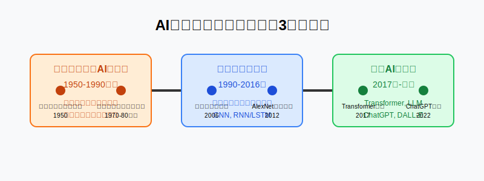

### 1. ルールベース AI の時代（1950-1990 年代）

この時代の AI は、人間の専門家が明示的に定義したルールやロジックに基づいて動作していました。チューリングテストの提案からエキスパートシステムの発展まで、人間の思考プロセスを論理的にモデル化することが中心でした。

**主な特徴**:

- 人間が作成した明示的なルールとロジック
- 「if-then」形式の条件分岐
- 特定の専門分野（医療診断、設備故障診断など）に特化
- 専門家の知識を形式化したナレッジベース

**限界**:

- ルールの作成と維持に多大な労力が必要
- 例外処理の複雑化
- 新しい状況への適応が困難

### 2. 機械学習の時代（1990-2016 年）

この時代には、コンピュータがデータから自動的にパターンを学習する能力が飛躍的に向上しました。特に深層学習の台頭により、画像認識や音声認識などの分野で人間に匹敵する性能を達成しました。

**主な特徴**:

- データからパターンを自動的に学習
- 特徴量の自動抽出
- 多層ニューラルネットワーク
- 画像認識のための CNN（畳み込みニューラルネットワーク）
- 時系列データ処理のための RNN/LSTM

**限界**:

- 大量の訓練データが必要
- ドメイン特化型のモデルが中心
- 説明可能性の低さ

### 3. 生成 AI の時代（2017 年-現在）

現在の生成 AI 時代は、Transformer アーキテクチャの登場から始まりました。大規模言語モデル（LLM）の発展により、テキスト生成、画像生成、対話システムなどで革命的な進化が起きています。

**主な特徴**:

- 自己注意機構（Self-Attention）による Transformer モデル
- 事前学習と微調整（Pre-training and Fine-tuning）
- 膨大なパラメータを持つ大規模モデル
- 複数のモダリティ（テキスト、画像、音声など）を横断
- API として提供される高度な AI 機能

**最新の発展**:

- マルチモーダルモデル（GPT-4V, Gemini, Claude）
- テキストから画像生成（DALL-E, Midjourney, Stable Diffusion）
- 音声合成と認識の高度化（Whisper, Suno）
- アプリケーション開発支援（GitHub Copilot, Claude）

この 3 つの時代を通じて、AI は「プログラムされた知能」から「学習する知能」、そして現在の「創造する知能」へと進化してきました。Web 開発者にとって、これらの技術の理解と活用は、次世代の Web アプリケーション開発において不可欠となっています。

次のセクションでは、第一の時代である「ルールベース AI の時代」について詳しく見ていきましょう。

# 2. ルールベース AI の時代（1950-1990 年代）

## 2-1. AI の概念誕生：チューリングテストと「考える機械」

人工知能の概念は、コンピュータの黎明期に遡ります。1950 年、イギリスの数学者アラン・チューリングは「Computing Machinery and Intelligence」という論文で、「機械は思考できるか？」という問いを提起しました。

### チューリングテスト

チューリングは、機械の知能を評価するための実験的方法として「模倣ゲーム」（後に「チューリングテスト」として知られるようになった）を提案しました。


チューリングテストの基本的な考え方は以下の通りです：

1. **テストの設定**: 質問者（人間）は、2 つの対話相手（1 人の人間ともう 1 つはコンピュータ）とテキストを通じてコミュニケーションをとります。
2. **テストの目的**: 質問者は、どちらが人間でどちらがコンピュータかを見分けようとします。
3. **知能の基準**: もし質問者が一定時間内に正確に区別できなければ、そのコンピュータは「知的」であるとみなされます。

チューリングテストは、機械が実際に「思考」しているかどうかではなく、人間と区別できない振る舞いができるかどうかに焦点を当てた実用的なアプローチでした。この視点は現在でも、AI 技術の評価や目標設定において重要な役割を果たしています。

### 初期の AI の進展

チューリングの概念提起を皮切りに、1950 年代から 1960 年代にかけて、初期の AI 研究が進展しました：

- **1956 年ダートマス会議**: 「人工知能（Artificial Intelligence）」という用語が正式に提案され、AI が学術分野として確立されました。
- **Logic Theorist（1956 年）**: アレン・ニューウェルとハーバート・サイモンによる、数学的定理を証明できる最初の AI プログラム。
- **ELIZA（1966 年）**: ジョセフ・ワイゼンバウムが開発した、セラピストのような対話ができる初期のチャットボット。

これらの初期の AI システムは、主に論理的推論や決定木に基づくルールベースのアプローチを採用していました。

## 2-2. エキスパートシステムの仕組みと限界

### エキスパートシステムとは

1970 年代から 1980 年代にかけて、ルールベース AI の代表的な応用として「エキスパートシステム」が登場しました。エキスパートシステムは、特定分野の専門家の知識を「if-then」ルールの形で形式化し、コンピュータが専門家のような意思決定や診断を行えるようにしたシステムです。

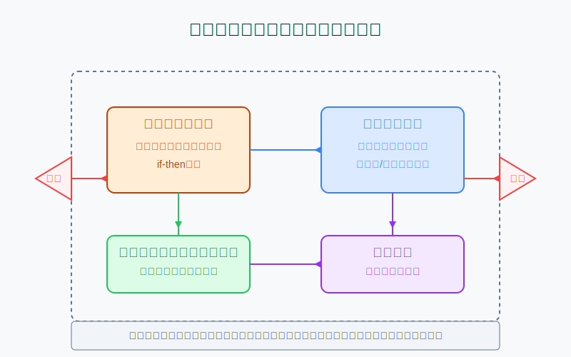

### エキスパートシステムの主要コンポーネント

1. **ナレッジベース（知識ベース）**:

   - 特定分野の専門家の知識を「if-then」ルールの形で格納
   - 例：「もし患者が発熱かつ咳をしている場合、風邪の可能性が高い」

2. **推論エンジン**:

   - ナレッジベースのルールを適用して推論を行う
   - 前向き推論（与えられた事実から結論を導き出す）
   - 後ろ向き推論（目標から始めて、それを満たす条件を確認していく）

3. **ユーザーインターフェース**:

   - システムとユーザー間の対話を管理
   - 問題の状況や症状についての質問
   - 結果や推奨事項の提示

4. **説明機構**:
   - システムがどのように結論に至ったかを説明
   - ユーザーの信頼獲得と検証のために重要

### 主な成功事例

1. **MYCIN（1970 年代）**: スタンフォード大学で開発された、血液感染症の診断と抗生物質の推奨を行うシステム。約 450 のルールを持ち、専門医と同等の診断精度を示した。

2. **DENDRAL（1960 年代後半）**: 質量分析データから分子構造を推定するシステム。化学分野で初めての成功した AI アプリケーション。

3. **XCON/R1（1980 年代）**: デジタル・イクイップメント・コーポレーション（DEC）で開発された、コンピュータシステムの構成を支援するシステム。年間数千万ドルのコスト削減を実現。

4. **PROSPECTOR**: 地質学的データに基づいて鉱床の位置を予測するシステム。実際に新たな鉱床発見に貢献。

### エキスパートシステムの限界

1950 年代から 1980 年代まで、AI の主流はルールベースシステムでしたが、1990 年代に入ると様々な限界が明らかになってきました。

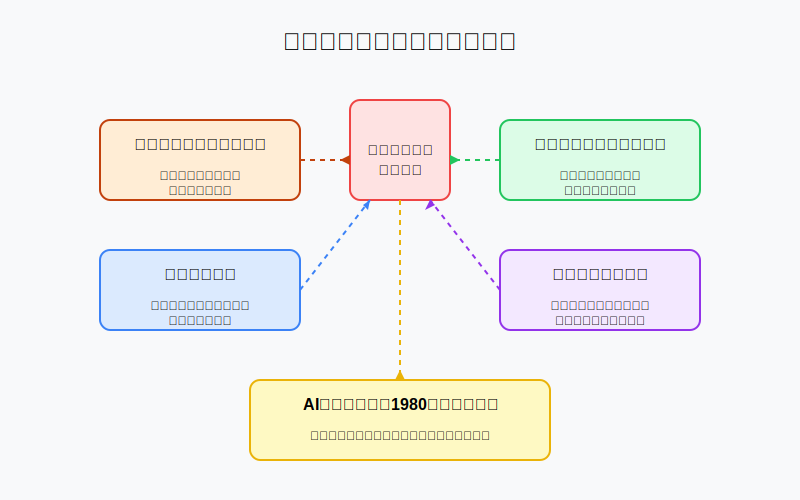

#### 1. 知識獲得のボトルネック

専門家の暗黙知を明示的なルールとして抽出し、形式化する作業は、膨大な時間と労力を要しました。また、専門家自身も自分の知識や判断プロセスを明確に言語化できない場合が多く、これが「知識獲得のボトルネック」と呼ばれる問題を引き起こしました。

#### 2. 柔軟性の欠如

エキスパートシステムは、ナレッジベースに明示的に定義されていないルールや例外的なケースに適応することが困難でした。新しい状況や境界条件では、システムの性能が急激に低下する「脆さ」が問題となりました。

#### 3. スケーラビリティの問題

ルール数が増えるにつれて、ルール間の相互作用が複雑化し、システム全体の一貫性を維持することが困難になりました。また、計算量も増大し、性能が低下する問題がありました。

```
例：ルール数の増加と複雑性
10個のルール → 最大45種類の相互作用
100個のルール → 最大4,950種類の相互作用
1000個のルール → 最大499,500種類の相互作用
```

#### 4. 不確実性への対応

実世界の問題は、しばしば不完全な情報や不確実性を伴います。二値的な「if-then」ルールでは、確率的な推論や曖昧さを適切に扱うことが困難でした。例えば、医療診断では症状と疾患の関係が確率的であることが多いですが、初期のエキスパートシステムではこうした不確実性の取り扱いに限界がありました。

#### 5. AI の冬の時代

1980 年代後半から 1990 年代にかけて、これらの限界が明らかになるにつれ、エキスパートシステムへの過度な期待と現実のギャップが生じました。その結果、AI の研究資金が減少する「AI の冬」と呼ばれる停滞期に入りました。

### ルールベース AI からの転換

エキスパートシステムの限界を克服するため、1990 年代には新たなアプローチが模索されるようになりました：

1. **確率的アプローチ**: ベイジアンネットワークなど、不確実性を明示的に扱える確率モデルの導入
2. **データ駆動アプローチ**: 大量のデータから自動的にパターンを学習する機械学習への移行
3. **ハイブリッドアプローチ**: ルールベースと確率モデルや機械学習を組み合わせたシステム

これらの新しいアプローチの中でも、特に注目を集めたのが「機械学習」でした。機械学習は、プログラマーが明示的にルールを記述する代わりに、データから自動的にパターンを学習してモデルを構築するアプローチであり、次の「機械学習の時代」への扉を開くことになりました。

ルールベース AI の限界を乗り越え、より柔軟で適応力の高いシステムへの移行は、AI 研究の大きな転換点となりました。次のセクションでは、この新しい時代について詳しく見ていきます。

# 3. 機械学習の時代（1990-2016 年）

## 3-1. 機械学習の基本概念：データからパターンを学ぶ

1990 年代以降、AI 研究の中心はルールベースアプローチから機械学習へと移行しました。この転換は、計算能力の向上とデータ量の増加に支えられていました。

### 機械学習とは

機械学習は、コンピュータがデータから自動的にパターンを識別し、そこから学習することで性能を向上させるアプローチです。従来のプログラミングとは異なり、開発者が明示的なルールを記述する代わりに、システムがデータから自律的に学習します。


### 機械学習のパラダイムシフト

機械学習は、AI アプローチにおける根本的なパラダイムシフトを表しています：

#### 1. 従来のプログラミング：

- **入力**: データ
- **人間の役割**: ルールを明示的に設計
- **出力**: 結果

#### 2. 機械学習：

- **入力**: データ + 期待される出力（ラベル）
- **コンピュータの役割**: データから最適なルール（モデル）を自動的に学習
- **出力**: 新しいデータに対する予測

このシフトにより、人間がルールを明示的に定義することが難しい複雑な問題（例：画像認識、音声認識、自然言語処理など）において大きなブレークスルーがもたらされました。

### 機械学習の主要なタイプ

機械学習には、学習方法に基づいていくつかの主要なタイプがあります：


#### 1. 教師あり学習 (Supervised Learning)

教師あり学習は、入力データと対応する正解（ラベル）のペアを使って学習するアプローチです。

**主な特徴:**

- **データ**: ラベル付きデータセット（例：画像とその内容を示すラベル）
- **目的**: 入力から出力へのマッピングを学習する
- **評価**: 予測と実際のラベルとの差（誤差）を最小化する

**代表的なタスク:**

- **分類 (Classification)**: 入力データを事前定義されたカテゴリに分類する
  - 例: スパムメール検出、画像分類、感情分析
- **回帰 (Regression)**: 連続的な数値を予測する
  - 例: 住宅価格予測、株価予測、気温予測

**主要アルゴリズム:**

- 線形回帰/ロジスティック回帰
- 決定木/ランダムフォレスト
- サポートベクターマシン (SVM)
- K 近傍法 (KNN)
- ニューラルネットワーク

#### 2. 教師なし学習 (Unsupervised Learning)

教師なし学習は、ラベルなしデータから構造やパターンを発見するアプローチです。

**主な特徴:**

- **データ**: ラベルのないデータセット
- **目的**: データの内部構造を発見する
- **評価**: 明確な評価基準がない場合が多く、タスク依存

**代表的なタスク:**

- **クラスタリング (Clustering)**: 似たデータポイントをグループ化する
  - 例: 顧客セグメンテーション、文書グループ化
- **次元削減 (Dimensionality Reduction)**: データの重要な特徴を抽出し、次元を削減する

  - 例: データの可視化、特徴圧縮

- **異常検知 (Anomaly Detection)**: 通常パターンから外れるデータを検出する
  - 例: 不正検出、設備故障検知

**主要アルゴリズム:**

- K-means
- 階層的クラスタリング
- 主成分分析 (PCA)
- t-SNE (t-distributed Stochastic Neighbor Embedding)
- オートエンコーダ

#### 3. 強化学習 (Reinforcement Learning)

強化学習は、環境との相互作用を通じて、報酬を最大化する行動方針を学習するアプローチです。

**主な特徴:**

- **データ**: 環境からのフィードバック（報酬または罰）
- **目的**: 長期的な報酬を最大化する方針を学習する
- **学習方法**: 試行錯誤と環境からのフィードバック

**応用例:**

- ゲーム AI（囲碁、チェス、ビデオゲーム）
- ロボット制御
- 自動運転車
- 推薦システム

**主要アルゴリズム:**

- Q 学習
- Deep Q-Network (DQN)
- ポリシー勾配法
- アクター・クリティック法

### 機械学習の基本プロセス

機械学習モデルの開発と運用は、一般的に以下のステップで行われます：

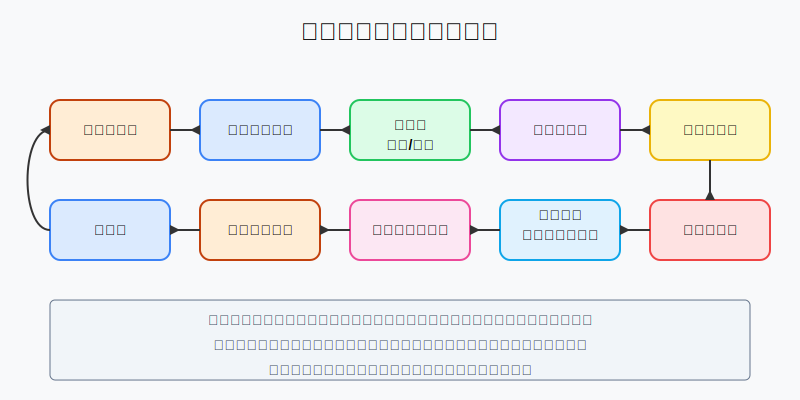

#### 1. データ収集

機械学習の質はデータの質に大きく依存します。適切な量、多様性、品質を持つデータの収集が重要です。

#### 2. データ前処理

生データをモデルが扱いやすい形に変換します：

- 欠損値の処理
- 外れ値の検出と処理
- データの正規化・標準化
- カテゴリカルデータのエンコーディング（one-hot encoding など）

#### 3. 特徴量選択/抽出

モデルの性能は使用する特徴（変数）に大きく依存します：

- 特徴量選択: 最も関連性の高い特徴を選ぶ
- 特徴量抽出: 元の特徴から新しい特徴を生成する
- 特徴量エンジニアリング: ドメイン知識を活用した特徴量の作成

#### 4. モデル選択

問題の性質や利用可能なデータに基づいて適切なアルゴリズムを選択します：

- 線形モデル vs 非線形モデル
- パラメトリックモデル vs ノンパラメトリックモデル
- シンプルモデル vs 複雑モデル（オッカムの剃刀原理）

#### 5. モデル学習（トレーニング）

選択したアルゴリズムをトレーニングデータに適用し、パラメータを最適化します：

- コスト関数の最小化
- 勾配降下法などの最適化アルゴリズムの使用
- バッチ処理 vs オンライン学習

#### 6. モデル評価

モデルの性能を適切な評価指標で測定します：

- 分類問題: 精度、適合率、再現率、F1 スコア、ROC 曲線
- 回帰問題: 平均二乗誤差(MSE)、平均絶対誤差(MAE)
- トレーニングデータとテストデータでの性能比較（過学習の検出）

#### 7. ハイパーパラメータ調整

モデルの構造やトレーニングプロセスを制御するパラメータを最適化します：

- グリッドサーチ、ランダムサーチ
- ベイズ最適化
- 交差検証による評価

#### 8. モデルデプロイ

開発したモデルを実際の環境で利用できるようにします：

- API としての提供
- バッチ処理システムへの組み込み
- モバイルデバイスへの最適化

#### 9. モニタリングとメンテナンス

デプロイされたモデルのパフォーマンスを継続的に監視します：

- データドリフト（入力データの分布変化）の検出
- モデル性能の低下検知
- 異常検知

#### 10. 再学習とアップデート

新しいデータや変化した環境に適応するようモデルを更新します：

- 定期的な再学習
- オンライン学習
- モデルのバージョン管理

### 機械学習における重要な概念

#### バイアスとバリアンス（トレードオフ）

機械学習モデルの誤差は主に 2 つのソースから発生します：

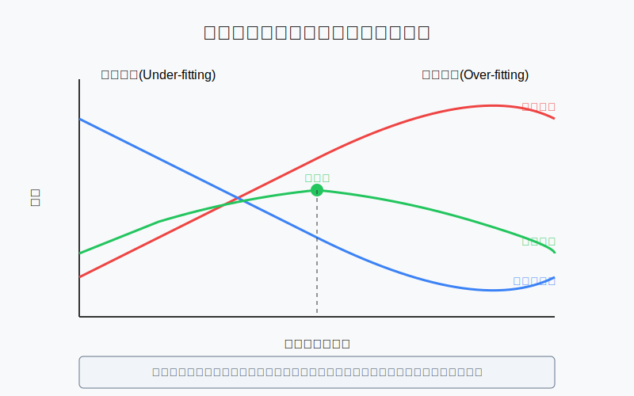

1. **バイアス (Bias)**

   - モデルが真の関係を捉える能力の欠如（単純化による誤差）
   - 高バイアス = モデルが単純すぎて、データの複雑なパターンを捉えられない（過小適合）
   - 例: 複雑な非線形関係を線形モデルで表現しようとする場合

2. **バリアンス (Variance)**

   - トレーニングデータの小さな変動に対するモデルの敏感さ
   - 高バリアンス = モデルが複雑すぎて、ノイズまで学習してしまう（過剰適合）
   - 例: 高次多項式で少数のデータポイントを完全に通過する曲線を描く場合

3. **トレードオフ関係**
   - モデルの複雑さを上げると、バイアスは減少するがバリアンスは増加
   - モデルの複雑さを下げると、バイアンスは増加するがバリアンスは減少
   - 最適なモデルは、バイアスとバリアンスの合計を最小化するポイント

#### 過学習と過少学習


1. **過少学習 (Underfitting)**

   - モデルが単純すぎて、データの基本的なパターンすら捉えられない状態
   - 高いバイアス、低いバリアンス
   - 特徴：トレーニングデータでも性能が悪い
   - 対策：より複雑なモデルを選択、特徴量の追加、モデルの制約を緩める

2. **過学習 (Overfitting)**

   - モデルが複雑すぎて、トレーニングデータの偶然のノイズまで学習してしまう状態
   - 低いバイアス、高いバリアンス
   - 特徴：トレーニングデータでは性能が良いが、新しいデータ（テストデータ）では性能が低下
   - 対策：
     - 正則化 (Regularization): モデルの複雑さにペナルティを課す（L1/L2 正則化）
     - ドロップアウト (Dropout): ニューラルネットワークの一部のノードを無効化
     - 早期停止 (Early Stopping): 検証誤差が増加し始めたら学習を停止
     - データ拡張 (Data Augmentation): 人工的にトレーニングデータを増やす
     - アンサンブル学習: 複数のモデルの予測を組み合わせる

3. **適切な学習**
   - バイアスとバリアンスのバランスが良い状態
   - データの本質的なパターンを捉えつつ、ノイズには反応しない
   - 特徴：トレーニングデータとテストデータで同様の性能を示す
   - 目標：未知のデータに対する汎化性能の最大化

#### 学習曲線と検証曲線

学習曲線は、モデルのトレーニング過程や問題を視覚的に診断するための重要なツールです：


1. **過少学習（高バイアス）の特徴**

   - トレーニング誤差が高いレベルで収束
   - 検証誤差もトレーニング誤差に近い高いレベルで収束
   - 両方の曲線が早期に収束し、データ量を増やしても改善が見られない
   - **対策**: より複雑なモデルを使用、特徴量を追加

2. **適切な学習の特徴**

   - トレーニング誤差と検証誤差の間に適度なギャップ
   - 両方の誤差が低いレベルで収束
   - データ量の増加とともに両方の誤差が減少
   - **結果**: 良好な汎化性能を持つモデル

3. **過学習（高バリアンス）の特徴**
   - トレーニング誤差が非常に低いレベルで収束
   - 検証誤差はそれよりもかなり高いレベル
   - 両曲線の間に大きなギャップが存在
   - **対策**: モデルを単純化、正則化、データ量を増やす

### 機械学習の実世界における課題

1. **データ品質と量**

   - 多くの機械学習アルゴリズムは大量の高品質データを必要とする
   - 現実世界のデータは往々にして不完全、ノイズが多い、偏りがある

2. **特徴量エンジニアリングの複雑さ**

   - 適切な特徴量の設計は機械学習の成功に不可欠
   - ドメイン知識と技術的スキルの両方が必要

3. **解釈可能性とブラックボックス問題**

   - 複雑なモデル（特に深層学習）は結果の解釈が困難
   - 多くの実用的な状況では、予測理由の説明が必要

4. **データバイアスと倫理的問題**

   - トレーニングデータの偏りがモデルの意思決定に反映される
   - 公平性、透明性、説明責任の確保が重要

5. **計算資源とエネルギー消費**
   - 大規模モデルのトレーニングには膨大な計算資源が必要
   - 環境負荷と持続可能性の問題

### ディープラーニングへの橋渡し

機械学習の発展の中で、特に注目されたのが「ディープラーニング（深層学習）」です。これは多層のニューラルネットワークを用いた機械学習の一種で、2010 年代に入って大きなブレークスルーをもたらしました。

ディープラーニングが従来の機械学習と異なる主な点は：

1. **自動的な特徴抽出**

   - 従来の機械学習: 人間が特徴量を設計
   - ディープラーニング: 生データから自動的に関連特徴を学習

# 3-2. ニューラルネットワークの仕組み（図解付き簡易説明）

ニューラルネットワークは、人間の脳の神経細胞（ニューロン）の仕組みに着想を得た機械学習モデルです。基本的な構造から始めて、その動作原理を段階的に解説します。

## ニューラルネットワークの基本構造


ニューラルネットワークは通常、以下の 3 種類の層から構成されています：

1. **入力層 (Input Layer)**

   - ネットワークへのデータ入力点
   - ノード数は入力特徴量の数と一致
   - 例：画像認識では各ピクセルの値、テキスト分析では単語のベクトル表現など

2. **隠れ層 (Hidden Layer)**

   - 入力と出力の間に位置し、複雑なパターンを捉える
   - 層の数とノード数はモデル設計者が決定（ハイパーパラメータ）
   - 層が多いほど複雑なパターンを学習可能（ディープラーニング）

3. **出力層 (Output Layer)**
   - ネットワークの最終的な予測を生成
   - ノード数はタスクに依存（分類問題ではクラス数、回帰問題では予測値の数）
   - 活性化関数はタスクに応じて選択（分類ではソフトマックス、回帰では線形など）

層と層の間はすべて **重み (Weights)** と呼ばれるパラメータで接続されており、学習過程でこれらの重みが調整されます。

## ニューロンの仕組み

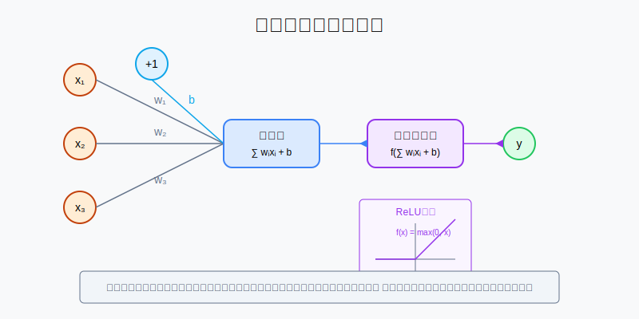

ニューラルネットワークの基本単位である「ニューロン」の動作プロセスは以下の通りです：

1. **入力の受け取り**

   - 複数の入力値（x₁, x₂, x₃, ...）を受け取る

2. **重み付け**

   - 各入力に対応する重み（w₁, w₂, w₃, ...）を掛け合わせる
   - 重みは学習によって調整されるパラメータ

3. **加重和の計算**

   - 重み付けされた入力の合計を計算
   - バイアス（b）を加算: z = w₁x₁ + w₂x₂ + w₃x₃ + ... + b
   - バイアスは入力に依存せず、ニューロンの活性化しやすさを調整

4. **活性化関数の適用**
   - 加重和に非線形の活性化関数を適用: y = f(z)
   - これにより、ネットワーク全体が非線形の関係性を学習できる

### 主な活性化関数


ニューラルネットワークの性能は活性化関数の選択に大きく影響されます。代表的な活性化関数には以下のものがあります：

1. **シグモイド関数 (Sigmoid)**

   - 出力範囲: 0 ～ 1
   - 特徴: 伝統的な活性化関数、二値分類の出力層で使用
   - 問題点: 勾配消失問題（深いネットワークで学習が困難）

2. **ReLU (Rectified Linear Unit)**

   - 出力範囲: 0 ～ ∞
   - 特徴: 計算効率が良く、深いネットワークでも学習しやすい
   - 現代の多くのネットワークで標準的に使用
   - 問題点: "dying ReLU"問題（負の入力に対して勾配がゼロ）

3. **tanh（ハイパボリックタンジェント）**

   - 出力範囲: -1 ～ 1
   - 特徴: シグモイドよりも勾配消失問題が軽減、中心が 0
   - 問題点: 依然として勾配消失問題が存在

4. **その他の変種**
   - Leaky ReLU: 負の入力に対して小さな勾配を持つ
   - ELU: 負の値に対してもなめらかな曲線
   - Swish: Google Brain によって提案された新しい関数

## ニューラルネットワークの学習プロセス

ニューラルネットワークの学習は、以下の循環的なプロセスで行われます：

1. **順伝播（Forward Propagation）**

   - 入力データがネットワークを通過し、各層で重み付け計算と活性化関数の適用が行われる
   - 最終的に出力層から予測結果が生成される

2. **誤差計算（Loss Calculation）**

   - 予測値と実際の正解値（教師データ）の差を計算
   - 一般的な損失関数：
     - 回帰問題：平均二乗誤差（MSE）
     - 分類問題：交差エントロピー損失

3. **逆伝播（Backpropagation）**

   - 計算された誤差を出力層から入力層に向かって逆方向に伝播
   - 各重みがどれだけ誤差に寄与したかを計算（勾配計算）
   - 微分の連鎖律を利用して効率的に計算

4. **重み更新（Weight Update）**

   - 計算された勾配を使って重みを更新
   - 基本公式: W_new = W_old - learning_rate \* gradient
   - 学習率（learning rate）：重みの更新量を調整するハイパーパラメータ

5. **最適化アルゴリズム（Optimization Algorithm）**

   - 単純な勾配降下法の改良版アルゴリズム：
     - SGD（確率的勾配降下法）：データをミニバッチに分割して処理
     - Adam：適応的学習率と慣性を組み合わせた手法
     - RMSprop：勾配の指数移動平均を使用

6. **モデル評価（Evaluation）**
   - 検証データを使ってモデルの性能をチェック
   - 過学習の監視と早期停止（early stopping）の判断

この学習プロセスをエポック（全データの 1 周）単位で繰り返し、モデルの重みを徐々に最適化していきます。

## ニューラルネットワークのハイパーパラメータ

ニューラルネットワークの設計と学習には、開発者が事前に決定する必要のある複数のハイパーパラメータがあります：

1. **アーキテクチャ関連**

   - 隠れ層の数
   - 各層のニューロン数
   - 活性化関数の種類

2. **学習プロセス関連**

   - 学習率（learning rate）
   - バッチサイズ（batch size）
   - エポック数（epochs）
   - 重みの初期化方法
   - 正則化パラメータ（L1/L2 正則化）

3. **最適化アルゴリズム関連**
   - 最適化手法（SGD, Adam, RMSProp 等）
   - モーメンタム係数
   - 学習率減衰（learning rate decay）

これらのハイパーパラメータの適切な選択は、モデルの性能に大きな影響を与えます。多くの場合、グリッドサーチやランダムサーチなどの手法で最適な組み合わせを探索します。

## ニューラルネットワークの基本的な発展形


ニューラルネットワークには様々な種類がありますが、特に重要な 3 つの基本的な発展形を見ていきましょう：

### 1. フィードフォワードニューラルネットワーク (FFNN)

最も基本的なニューラルネットワーク構造で、情報が入力層から出力層に一方向に流れます。

**特徴:**

- 層と層の間は完全結合（全てのニューロン同士が接続）
- 各層のニューロンは同じ層の他のニューロンとは接続しない
- 循環的な接続がない

**用途:**

- 構造化データ（表形式データ）の分析
- 分類問題や回帰問題の解決
- 比較的シンプルなパターン認識

**限界:**

- 空間的な相関関係（画像内の隣接ピクセル関係など）を効率的に捉えられない
- 時系列データ内の順序関係を考慮できない

### 2. 畳み込みニューラルネットワーク (CNN: Convolutional Neural Network)

画像処理に特化したネットワーク構造で、局所的な特徴を効率的に抽出できます。

**主要コンポーネント:**

- **畳み込み層 (Convolutional Layer)**: 特徴マップを生成するフィルタを適用
- **プーリング層 (Pooling Layer)**: 情報を圧縮し、位置の不変性を獲得
- **全結合層 (Fully Connected Layer)**: 最終的な分類を行う

**特徴:**

- パラメータ共有（同じフィルタを画像全体に適用）
- 局所的受容野（各ニューロンは入力の一部のみを見る）
- 階層的な特徴抽出（低レベル特徴から高レベル特徴へ）

**用途:**

- 画像分類
- 物体検出・セグメンテーション
- 顔認識
- 医療画像分析

### 3. 再帰型ニューラルネットワーク (RNN: Recurrent Neural Network)

時系列データや順序のあるデータを処理するためのネットワーク構造です。

**特徴:**

- 内部状態（メモリ）を持ち、過去の情報を保持
- 同じパラメータを時間的に共有
- 可変長の入力を処理可能

**発展形:**

- **LSTM (Long Short-Term Memory)**: 長期依存関係を捉えるための特殊な RNN ユニット
- **GRU (Gated Recurrent Unit)**: LSTM を簡略化した構造

**用途:**

- 自然言語処理（文章生成、翻訳、感情分析）
- 音声認識
- 時系列予測（株価予測、気象予測）
- 動画解析

## ディープラーニングの主な課題と対策

### 1. 勾配消失・爆発問題

**問題**: 深いネットワークでは、逆伝播時に勾配が層を通過するにつれて非常に小さく（消失）または非常に大きく（爆発）なることがある

**対策**:

- 適切な活性化関数の使用（ReLU など）
- バッチ正規化（Batch Normalization）
- 残差接続（ResNet など）
- 勾配クリッピング

### 2. 過学習

**問題**:モデルがトレーニングデータに過度に適合し、新しいデータに対する汎化性能が低下する

**対策**:

- ドロップアウト（Dropout）：訓練時にランダムにニューロンを無効化
- L1/L2 正則化：重みの大きさにペナルティを課す
- データ拡張（Data Augmentation）：人工的にトレーニングデータを増やす
- 早期停止（Early Stopping）：検証誤差が悪化し始めたら学習を停止

### 3. 計算コスト

**問題**:深いネットワークや大規模データセットは、トレーニングに膨大な計算リソースが必要

**対策**:

- GPU や TPU などの専用ハードウェアの利用
- 分散学習（複数のマシンでの並列処理）
- モデル圧縮・量子化（Quantization）
- 知識蒸留（Knowledge Distillation）：大きなモデルから小さなモデルへの知識転移

### 4. 解釈可能性の欠如

**問題**:複雑なネットワークは「ブラックボックス」として機能し、決定理由の説明が困難

**対策**:

- 注意機構（Attention Mechanism）の可視化
- 特徴の重要度分析
- 局所的解釈可能性手法（LIME, SHAP など）
- モデルの単純化

## ニューラルネットワークの実際の応用例

1. **画像認識・分類**

   - 医療画像診断：X 線、CT、MRI 画像から疾患を検出
   - 顔認識：セキュリティシステム、スマートフォンのロック解除
   - 自動運転車：交通標識や歩行者の認識

2. **自然言語処理**

   - 機械翻訳：Google 翻訳、DeepL など
   - 感情分析：ソーシャルメディアの投稿から感情を検出
   - 質問応答システム：仮想アシスタント（Siri, Alexa など）

3. **音声処理**

   - 音声認識：音声コマンド、議事録作成
   - 話者識別：セキュリティシステム、カスタマーサービス
   - 音声合成：テキスト読み上げ、仮想アシスタントの音声

4. **推薦システム**
   - E コマース：「あなたにおすすめの商品」
   - 動画/音楽ストリーミング：Netflix, Spotify 等の推薦アルゴリズム
   - ニュースフィード：パーソナライズされたコンテンツ

## まとめ：ニューラルネットワークの仕組み

ニューラルネットワークは、生物学的ニューロンの仕組みに着想を得た機械学習モデルで、以下の重要な特徴を持っています：

1. **層状構造**：入力層、隠れ層、出力層からなる階層構造

2. **ニューロン**：入力の加重和を計算し、活性化関数を適用して出力を生成する基本単位

3. **学習プロセス**：順伝播、誤差計算、逆伝播、重み更新のサイクルで最適化

4. **多様なアーキテクチャ**：

   - フィードフォワードネットワーク：基本的な多層構造
   - CNN：画像処理に特化した構造
   - RNN/LSTM：時系列データに特化した構造

5. **発展的技術**：
   - 深層学習：多層のネットワークによる複雑なパターン認識
   - 転移学習：事前学習済みモデルを別のタスクに適用
   - マルチモーダル学習：複数の入力タイプ（画像+テキストなど）の統合

ニューラルネットワークの仕組みを理解することは、現代 AI の多くの応用技術の基盤となります。次のセクションでは、画像認識の革命をもたらした CNN について、より詳しく見ていきましょう。

# 3-3. 画像認識革命：CNN とその応用

画像認識の分野は、畳み込みニューラルネットワーク（CNN: Convolutional Neural Network）の登場によって革命的な進化を遂げました。2012 年の ImageNet コンペティションでの AlexNet の成功を皮切りに、CNN は画像認識の標準的アプローチとなり、多様な応用へと発展しています。

## CNN の基本構造と動作原理

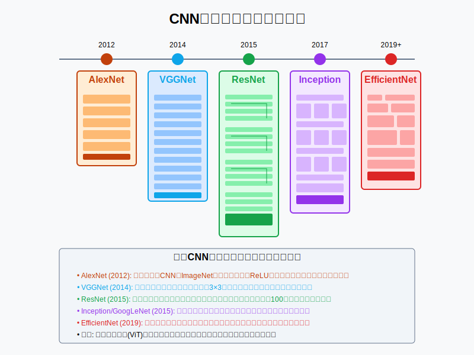

### CNN の主要構成要素

CNN は、画像のような格子状データから特徴を効率的に抽出するために設計された特殊なニューラルネットワークです。その主要な構成要素は以下の通りです：

#### 1. 畳み込み層（Convolutional Layer）

畳み込み層は、CNN の中核となる層で、入力画像にフィルタ（カーネル）を適用して特徴マップを生成します。

**主な特徴：**

- **局所的受容野（Local Receptive Field）**: 各ニューロンは入力の一部だけを見る
- **パラメータ共有**: 同じフィルタが画像全体に適用される（位置不変性）
- **階層的特徴抽出**: 層が深くなるにつれ、低レベル特徴（エッジ、色など）から高レベル特徴（物体の部分、パターンなど）へと抽象化

#### 2. 活性化関数層

畳み込み層の出力に非線形性を導入します。CNN では通常、ReLU（Rectified Linear Unit）が使用されます：

- f(x) = max(0, x)
- 計算効率が良く、勾配消失問題を軽減

#### 3. プーリング層（Pooling Layer）

プーリング層は、特徴マップの空間的次元を縮小し、計算効率と位置不変性を向上させます。

**代表的なプーリング操作：**

- **Max Pooling**: ウィンドウ内の最大値を選択
- **Average Pooling**: ウィンドウ内の平均値を計算
- 一般的に 2×2 のウィンドウとストライド 2 が使用される（サイズを半分に）

#### 4. 全結合層（Fully Connected Layer）

CNN の最後の層で、抽出された特徴を分類に結び付けます。

**役割：**

- 畳み込み層とプーリング層で抽出された特徴を「平坦化（Flatten）」
- 通常のニューラルネットワークと同様に、すべてのニューロン間を完全結合
- 最終的な分類結果を生成（通常は Softmax 関数を使用）

#### 5. ドロップアウト層（Dropout Layer）

過学習を防ぐために使用される正則化テクニック：

- トレーニング中にランダムにニューロンを「ドロップアウト」（無効化）
- テスト時にはすべてのニューロンを使用

## 畳み込み演算の詳細


### 畳み込み演算の仕組み

畳み込み演算は、CNN の核となる処理で、以下のステップで行われます：

1. **フィルタ（カーネル）の適用**：

   - 通常 3×3 や 5×5 などの小さな行列（フィルタ）を使用
   - 入力画像上をスライドさせながら、重なった部分ごとに計算

2. **要素ごとの積和演算**：

   - フィルタと重なった入力画像の各要素を掛け合わせる
   - その結果を全て足し合わせて、出力特徴マップの対応する位置の値とする

3. **バイアスの加算と活性化関数の適用**：
   - 計算結果にバイアスを加算
   - 非線形活性化関数（多くの場合 ReLU）を適用

### CNN における重要なパラメータ

1. **フィルタサイズ**：一般的に 3×3、5×5 などの小さなサイズが使用されます

2. **ストライド（Stride）**：フィルタを適用する際の移動幅

   - ストライド 1：1 ピクセルずつ移動（出力サイズは入力とほぼ同じ）
   - ストライド 2：2 ピクセルずつ移動（出力サイズは約半分に）

3. **パディング（Padding）**：入力画像の周囲に追加するピクセル

   - 「valid」パディング：パディングなし（出力サイズは入力より小さくなる）
   - 「same」パディング：出力サイズを入力と同じに保つためのパディング

4. **フィルタ数**：各層で使用するフィルタの数（＝出力特徴マップのチャネル数）
   - 一般的に層が深くなるほど増加（例：64→128→256...）

## CNN の発展と代表的なアーキテクチャ

！[cnn-architectures.svg](./cnn-architectures.svg)

### CNN の歴史的発展と主要アーキテクチャ

CNN の発展は、画像認識の精度向上と並行して進んできました。以下に代表的なアーキテクチャを時系列で紹介します：

#### 1. AlexNet (2012 年)

**技術的進歩**:

- ImageNet コンペティションで初めてディープラーニングの優位性を証明
- GPU を用いた並列計算で大規模ネットワークの学習を実現
- ReLU 活性化関数、ドロップアウト正則化の導入

**特徴**:

- 8 層（5 畳み込み層、3 全結合層）
- 約 6,000 万パラメータ
- トップ 5 エラー率が従来手法の約 26%から約 15%に改善

#### 2. VGGNet (2014 年)

**技術的進歩**:

- シンプルで一貫した設計思想（3×3 の小さな畳み込みの積み重ね）
- より深いネットワーク（16 ～ 19 層）の有効性を実証

**特徴**:

- 小さな畳み込みフィルタを連続的に使用し、受容野を拡大
- シンプルな構造で理解しやすく、転移学習にも適している
- 約 1 億 3,800 万パラメータと計算コストの大きさが課題

#### 3. GoogLeNet/Inception (2014 年)

**技術的進歩**:

- 「Inception モジュール」の導入：異なるサイズのフィルタを並列に使用
- 計算効率を考慮した「1×1 畳み込み」によるチャネル次元の削減

**特徴**:

- 22 層の深さにもかかわらず、パラメータ数は約 500 万と少ない
- マルチスケールの特徴抽出が可能
- 複雑な並列構造による実装の難しさ

#### 4. ResNet (2015 年)

**技術的進歩**:

- 「残差接続（Residual Connection）」による超深層ネットワークの学習を実現
- 勾配消失問題の画期的な解決策

**特徴**:

- 152 層まで拡張可能な設計
- スキップ接続により、浅いネットワークの性能を損なわずに深層化
- 現代のディープラーニングアーキテクチャの基盤となる技術

#### 5. DenseNet (2017 年)

**技術的進歩**:

- 各層を後続のすべての層に密に接続する「密結合（Dense Connection）」
- 特徴の再利用による効率化

**特徴**:

- 勾配の流れが改善され、より効率的な学習
- 少ないパラメータで高い性能
- 特徴マップの再利用によるメモリ効率の課題

#### 6. EfficientNet (2019 年)

**技術的進歩**:

- ネットワークの幅、深さ、解像度を同時に最適化する「複合スケーリング法」
- 計算効率とモデル性能のバランスを重視

**特徴**:

- 少ない計算リソースで最先端の精度を達成
- モバイルデバイスなど、制約のある環境でも効率的に動作
- B0 ～ B7 までのさまざまなサイズのモデルバリエーション

#### 最新の動向: ViT (Vision Transformer) など

- CNN と Transformer の融合
- 自己注意機構（Self-Attention）を活用した視覚表現の学習
- 大規模データセットでの事前学習とファインチューニング

## CNN の応用分野

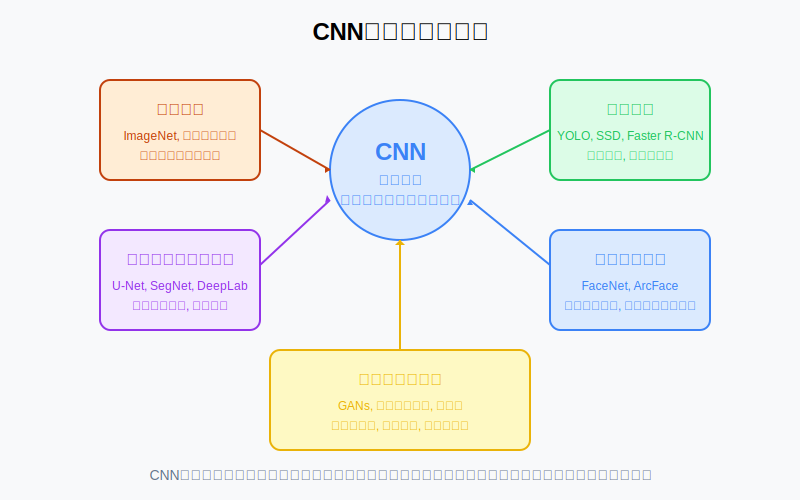

CNN は画像処理のさまざまな分野で革命的な進歩をもたらしました。以下に主要な応用分野を紹介します：

### 1. 画像分類（Image Classification）

**概要**：

- 入力画像に対して単一のラベル（または確率分布）を出力
- ImageNet などの大規模データセットで評価

**実用例**：

- Google フォトやアップル写真アプリの自動タグ付け
- 画像検索エンジン
- ソーシャルメディアの内容フィルタリング

**代表的技術**：

- ResNet, EfficientNet, Vision Transformer (ViT)

### 2. 物体検出（Object Detection）

**概要**：

- 画像内の複数の物体を検出し、各物体のカテゴリとバウンディングボックス（位置情報）を予測
- mAP（mean Average Precision）で評価

**実用例**：

- 自動運転車の周囲環境認識
- 監視カメラのリアルタイム人物・物体検出
- 小売業での在庫管理

**代表的技術**：

- R-CNN 系列（Fast R-CNN, Faster R-CNN）
- YOLO（You Only Look Once）系列
- SSD（Single Shot MultiBox Detector）

### 3. セマンティックセグメンテーション（Semantic Segmentation）

**概要**：

- 画像の各ピクセルに対してクラスラベルを予測
- 物体の詳細な形状を把握

**実用例**：

- 医療画像解析（腫瘍、臓器の分割）
- 衛星・航空写真からの地図作成
- 自動運転の詳細な道路環境理解

**代表的技術**：

- FCN（Fully Convolutional Network）
- U-Net（医療画像向け）
- DeepLab

### 4. インスタンスセグメンテーション（Instance Segmentation）

**概要**：

- セマンティックセグメンテーションに加え、同じクラスの異なる物体インスタンスを区別
- より詳細な場面理解が可能

**実用例**：

- ロボットによる物体操作
- AR（拡張現実）アプリケーション
- 精密な映像編集・合成

**代表的技術**：

- Mask R-CNN
- YOLACT（You Only Look At CoefficienTs）

### 5. 顔認識・顔検出

**概要**：

- 顔の検出、識別、感情分析など
- 精度と速度のバランスが重要

**実用例**：

- スマートフォンの顔認証
- セキュリティシステム
- 写真アプリの顔認識タグ付け

**代表的技術**：

- FaceNet
- ArcFace
- DeepFace

### 6. 画像生成・変換

**概要**：

- CNN をエンコーダやデコーダとして利用し、新しい画像を生成または変換
- 創造的なアプリケーションの基盤

**実用例**：

- 画像の超解像（低解像度から高解像度への変換）
- 画像のスタイル変換
- 画像のノイズ除去・修復

**代表的技術**：

- GANs（Generative Adversarial Networks）の画像生成部分
- 画像変換ネットワーク（Pix2Pix, CycleGAN）
- ディフュージョンモデルの U-Net 系アーキテクチャ

### 7. ポーズ推定（Pose Estimation）

**概要**：

- 人間や動物の体の姿勢、関節の位置を推定
- リアルタイム処理が求められることが多い

**実用例**：

- モーションキャプチャ
- フィットネスアプリのフォームチェック
- AR アプリケーション

**代表的技術**:

- OpenPose
- PoseNet
- DeepCut

### 8. 医療画像解析

**概要**:

- X 線、CT、MRI などの医療画像からの診断支援
- 高い精度と説明可能性が求められる

**実用例**:

- がん・腫瘍の検出
- 骨折・異常所見の自動スクリーニング
- 臓器のセグメンテーションと体積測定

**代表的技術**:

- U-Net（臓器セグメンテーション）
- CheXNet（胸部 X 線診断）
- 専門的な CNN アーキテクチャ（3D-CNN 等）

## CNN における重要な技術的進歩

### 1. 転移学習（Transfer Learning）

大規模データセット（ImageNet など）で事前学習された CNN モデルを、別のタスクに適用する手法です。

**メリット**:

- 少ないデータセットでも高性能なモデルを構築可能
- 学習時間の大幅な短縮
- 特に医療画像など、専門的な領域で有効

**一般的アプローチ**:

1. 事前学習済みモデル（ResNet, VGG など）をベースに使用
2. 最終層を新しいタスクに合わせて置き換え
3. 新しいデータでファインチューニング

### 2. 視覚的注意機構（Visual Attention）

CNN に人間の視覚的注意と類似したメカニズムを導入し、画像の重要な部分に集中できるようにする技術です。

**主な種類**:

- チャネル注意機構（Squeeze-and-Excitation Networks）
- 空間注意機構（Spatial Attention）
- 自己注意機構（Self-Attention、Vision Transformer で使用）

**利点**:

- モデルの解釈可能性の向上
- 重要な特徴に焦点を当て、認識精度を改善
- 計算資源の効率的な利用

### 3. 弱教師あり学習・自己教師あり学習

完全なアノテーションなしで CNN を効果的に学習させる方法が発展しています。

**アプローチ**:

- 弱教師あり学習: 一部のみラベル付きデータを使用
- 自己教師あり学習: ラベルなしデータから自動的に「疑似タスク」を生成
- コントラスト学習: 類似画像間の特徴表現が近くなるように学習

**実例**:

- SimCLR, MoCo, BYOL（自己教師あり学習）
- CAM（Class Activation Mapping）を用いた弱教師ありセグメンテーション

## CNN の課題と今後の展望

### 現在の課題

1. **説明可能性（Explainability）の欠如**:

   - 深層 CNN はブラックボックス的な性質を持ち、決定理由の説明が困難
   - 特に医療や自動運転など高リスク領域では重大な問題

2. **データ効率の問題**:

   - 多くの CNN は大量の学習データを必要とする
   - 希少事例やニッチな領域での学習が困難

3. **計算リソース要求**:

   - 最先端モデルはトレーニングに膨大な計算資源が必要
   - エッジデバイスでの効率的な実行が課題

4. **敵対的サンプルへの脆弱性**:
   - 人間には知覚できない微小な摂動で誤認識を引き起こす可能性
   - セキュリティ上の懸念

### 今後の展望

1. **視覚トランスフォーマー（Vision Transformers）の発展**:

   - 自然言語処理で成功した Transformer アーキテクチャの視覚への応用
   - CNN と Transformer の融合モデル

2. **マルチモーダル学習**:

   - 画像と他のモダリティ（テキスト、音声など）を組み合わせた学習
   - より豊かな表現学習の実現

3. **効率的なアーキテクチャ**:

   - モバイルやエッジデバイス向けの軽量モデル
   - ニューラルアーキテクチャサーチ（NAS）による自動設計

4. **自己教師あり学習の進化**:

   - ラベルなしデータを活用した効率的な学習方法
   - 人間の視覚システムに近い学習アプローチ

5. **3D ビジョンへの拡張**:
   - 2D 画像から 3D 理解へ
   - 点群データやボリューメトリックデータ処理の進化

## まとめ：CNN と画像認識革命

CNN は画像認識の分野に革命をもたらし、技術の進展とともに応用範囲も急速に拡大しています。初期の AlexNet から EfficientNet や Vision Transformer まで、アーキテクチャは進化を続け、性能向上とともに効率性も重視されるようになってきました。

特に重要なのは、CNN の発展が単なる学術的進歩ではなく、実社会における様々なアプリケーション（自動運転、医療診断、セキュリティシステムなど）の基盤となっている点です。一方で、解釈可能性や効率性、セキュリティといった課題も存在し、これらを解決するための研究も活発に行われています。

CNN を中心とした画像認識技術は、今後も AI の重要な分野であり続け、既存の課題を解決しながら新たな応用を生み出していくでしょう。次のセクションでは、もう一つの重要なディープラーニング技術である、時系列データ処理のための RNN/LSTM について詳しく見ていきます。

# 3-4. 時系列データ処理：RNN/LSTM の基本

時系列データの処理は、テキスト、音声、センサーデータなど多くの実世界データを扱う上で重要な課題です。従来のフィードフォワードニューラルネットワークや CNN は、入力の時間的な依存関係を効果的に捉えることができませんでした。この問題を解決するために開発されたのが、リカレントニューラルネットワーク（RNN）とその発展形である LSTM（Long Short-Term Memory）です。

## RNN の基本構造

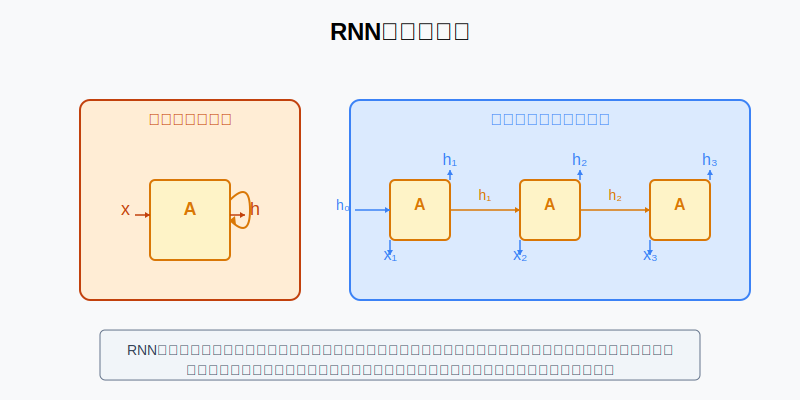

リカレントニューラルネットワーク（RNN）は、時系列データを処理するために設計された特殊なニューラルネットワークです。標準的なフィードフォワードネットワークと異なり、RNN には「メモリ」があります。つまり、過去の入力情報を記憶し、それを現在の予測に活用することができます。

### RNN の主な特徴

1. **内部状態（隠れ状態）**：

   - 過去の情報を要約した「隠れ状態（hidden state）」を保持
   - この隠れ状態が次の時間ステップに渡される「メモリ」として機能

2. **パラメータ共有**：

   - 同じパラメータが全ての時間ステップで共有される
   - これにより、シーケンスの長さに関わらず、学習すべきパラメータ数が一定に保たれる

3. **可変長入力の処理**：
   - 任意の長さの時系列データを処理可能
   - テキスト、音声など長さが固定されていないデータに適している

### RNN の数学的定式化

RNN の基本的な計算は以下のように表現できます：

1. **隠れ状態の更新**：

   ```
   h_t = tanh(W_hh * h_{t-1} + W_xh * x_t + b_h)
   ```

   ここで、

   - h_t：時間 t での隠れ状態
   - h\_{t-1}：前の時間ステップでの隠れ状態
   - x_t：時間 t での入力
   - W_hh：隠れ状態から隠れ状態への重み
   - W_xh：入力から隠れ状態への重み
   - b_h：バイアス項
   - tanh：活性化関数（双曲線正接）

2. **出力の計算**：

   ```
   y_t = W_hy * h_t + b_y
   ```

   ここで、

   - y_t：時間 t での出力
   - W_hy：隠れ状態から出力への重み
   - b_y：出力バイアス

### RNN の応用例

1. **言語モデル**：次の単語を予測
2. **機械翻訳**：ある言語から別の言語へのテキスト変換
3. **音声認識**：音声信号からテキストへの変換
4. **時系列予測**：株価や気象データの予測
5. **テキスト生成**：文章や詩、音楽の自動生成

## 単純 RNN の限界：勾配消失/爆発問題


単純な RNN は理論的には任意の長さの時系列データを処理できますが、実際には「長期依存性（long-term dependencies）」を学習することが難しいという重大な問題があります。

### 勾配消失問題

RNN は逆伝播時に「時間的逆伝播（Backpropagation Through Time, BPTT）」と呼ばれる手法を使用します。この過程で以下の問題が発生します：

1. **勾配の連鎖的乗算**:

   - 勾配は時間方向に逆伝播する際、同じ重み行列が繰り返し乗算される
   - この重み行列の最大固有値が 1 より小さい場合、勾配は指数関数的に小さくなる

2. **長期依存性の学習困難**:

   - 古い情報ほど勾配が小さくなり、重みの更新に与える影響が減少
   - 結果として、遠い過去の情報を現在の予測に活用することが難しくなる

3. **実際的な影響**:
   - 文章内の長距離の文法関係を捉えられない
   - 長い時系列パターンを認識できない

### 勾配爆発問題

逆に、重み行列の最大固有値が 1 より大きい場合は、勾配が指数関数的に大きくなる「勾配爆発」が発生することもあります。これにより、学習が不安定になり、発散する可能性があります。

勾配爆発に対しては「勾配クリッピング」（一定のしきい値を超える勾配を制限する方法）が有効ですが、勾配消失問題には根本的な解決策が必要です。その解決策として登場したのが LSTM（Long Short-Term Memory）です。

## LSTM の構造と動作原理


2. **入力ゲート段階**（続き）:

   - 入力ゲートが情報の「重要度」を決定（0〜1 の値）
   - 候補セル状態が新しい情報の内容を生成（-1〜1 の値）
   - これらを掛け合わせて、セル状態に追加する情報量を決定

3. **セル状態更新段階**:

   - 忘却ゲートを通じて古い情報の一部を削除
   - 入力ゲートを通じて新しい情報を追加
   - この更新方法により、勾配が長期間にわたって流れることが可能に

4. **出力ゲート段階**:
   - 更新されたセル状態のどの部分を出力するかを決定
   - セル状態を tanh 関数に通してから出力ゲートと掛け合わせる
   - 結果が新しい隠れ状態となり、次の時間ステップや上位層に渡される

### LSTM と単純 RNN の比較

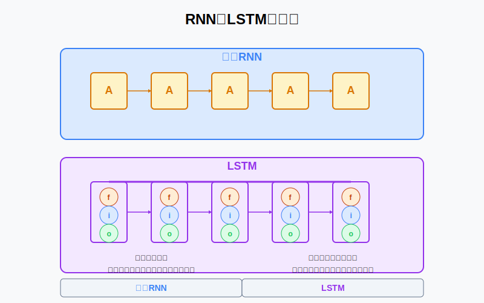

LSTM の最大の利点は、長期的な依存関係を効果的に学習できる点です。ここでは単純 RNN と LSTM の主な違いを比較します：

1. **アーキテクチャの複雑さ**:

   - **RNN**: 単一の活性化関数を持つシンプルな構造
   - **LSTM**: 複数のゲートとセル状態を持つ複雑な構造

2. **パラメータ数**:

   - **RNN**: 比較的少ないパラメータ数
   - **LSTM**: RNN の約 4 倍のパラメータ数（4 つの異なる重み行列）

3. **勾配問題への対処**:

   - **RNN**: 勾配消失/爆発問題が発生しやすい
   - **LSTM**: セル状態を通じた勾配のスムーズな流れにより問題を軽減

4. **記憶能力**:

   - **RNN**: 短期的な依存関係のみを捉えられる
   - **LSTM**: 長期的な依存関係を効果的に記憶・活用できる

5. **計算コスト**:
   - **RNN**: 計算効率が良い
   - **LSTM**: より多くの演算が必要で計算コストが高い

## GRU（Gated Recurrent Unit）

LSTM 以外にも RNN の変種として、2014 年に Cho らによって提案された GRU（Gated Recurrent Unit）があります。GRU は LSTM を簡略化したバージョンで、性能を維持しながらパラメータ数を削減しています。


### GRU の主な特徴

1. **2 つのゲート**:

   - **更新ゲート（Update Gate）**: LSTM の忘却ゲートと入力ゲートを組み合わせたような役割
   - **リセットゲート（Reset Gate）**: 過去の情報をどれだけ無視するかを制御

2. **セル状態の統合**:

   - LSTM の隠れ状態とセル状態の区別がなく、単一の隠れ状態のみを使用

3. **計算効率**:
   - LSTM より少ないパラメータ数（約 3/4）
   - より少ない演算で同等の性能

### GRU の数学的定式化

GRU の計算は以下のように表現できます：

1. **更新ゲート**:

   ```
   z_t = σ(W_z · [h_{t-1}, x_t] + b_z)
   ```

2. **リセットゲート**:

   ```
   r_t = σ(W_r · [h_{t-1}, x_t] + b_r)
   ```

3. **候補隠れ状態**:

   ```
   h̃_t = tanh(W · [r_t * h_{t-1}, x_t] + b)
   ```

4. **隠れ状態の更新**:
   ```
   h_t = (1 - z_t) * h_{t-1} + z_t * h̃_t
   ```

ここで、

- z_t は更新ゲート（どの程度古い情報を保持するか）
- r_t はリセットゲート（どの程度古い情報を無視するか）
- h̃_t は候補隠れ状態
- h_t は新しい隠れ状態

## RNN/LSTM の主要応用分野

RNN や LSTM は時系列データを扱うさまざまな分野で応用されています：

### 1. 自然言語処理（NLP）

**主な応用**:

- **言語モデリング**: 次の単語を予測
- **機械翻訳**: Seq2Seq モデルの基盤
- **感情分析**: テキストの感情を分類
- **テキスト要約**: 長文を短く要約
- **質問応答**: 質問に対する回答を生成

**例**: Google 翻訳の初期バージョン、機械翻訳システムなど

### 2. 音声処理

**主な応用**:

- **音声認識**: 音声をテキストに変換
- **話者識別**: 話者を識別
- **音声合成**: テキストから音声を生成

**例**: 音声アシスタント（初期の Siri, Alexa）、音声文字起こしシステムなど

### 3. 時系列予測

**主な応用**:

- **株価予測**: 市場動向の分析と予測
- **気象予測**: 天気パターンの予測
- **エネルギー需要予測**: 電力使用量など

**例**: 金融予測ツール、気象予報システムなど

### 4. 異常検出

**主な応用**:

- **不正検知**: 不自然な取引パターンの検出
- **システム障害検出**: 機器の異常動作の予測
- **ネットワーク侵入検知**: 不正アクセスパターンの検出

**例**: クレジットカード不正検知システム、産業設備の予知保全など

## 双方向 RNN


双方向 RNN（Bidirectional RNN）は、通常の RNN を拡張したモデルで、入力シーケンスを前方向と後ろ方向の両方から処理します。これにより、各時間ステップの出力は過去だけでなく未来の情報も考慮できるようになります。

### 双方向 RNN の特徴

1. **双方向の情報処理**:

   - 前向き層: 時系列データを先頭から末尾へと処理
   - 後向き層: 時系列データを末尾から先頭へと処理
   - 各時間ステップの出力は、両方向からの情報を結合

2. **応用例**:

   - 単語の品詞タグ付け: 単語の前後の文脈を考慮
   - 手書き文字認識: 文字の前後の筆跡情報を活用
   - 音声認識: 音声の前後の音素を考慮

3. **利点**:

   - より豊かな文脈情報を捉えられる
   - 特に自然言語処理タスクで性能向上
   - 単一方向の RNN では捉えられない依存関係を検出可能

4. **制約**:
   - リアルタイム処理には不向き（シーケンス全体を見る必要がある）
   - 計算コストが通常の RNN の約 2 倍

## 深層 RNN と残差接続

実際の応用では、単一層の RNN/LSTM ではなく、複数層を積み重ねた「深層 RNN/LSTM」が使われることが多いです。

### 深層 RNN の構造

1. **複数層の積み重ね**:

   - 第 1 層: 入力シーケンスから特徴を抽出
   - 第 2 層以降: 前の層の出力をさらに抽象化
   - 一般的には 2〜3 層が多い（深すぎると勾配問題が再発）

2. **層間のドロップアウト**:

   - 過学習を防ぐためのテクニック
   - 通常、隠れ状態の一部をランダムに無効化

3. **残差接続（Residual Connection）**:
   - 深層 RNN でも勾配の流れを確保するためのショートカット接続
   - h_t^{l+1} = RNN(h_t^l) + h_t^l

## RNN/LSTM の最新動向と限界

近年、RNN/LSTM は特に自然言語処理の分野で Transformer アーキテクチャに席を譲りつつあります。しかし、特定の時系列データ処理タスクでは依然として重要な役割を果たしています。

### RNN/LSTM の限界

1. **並列計算の困難さ**:

   - 逐次的な計算構造により、GPU などでの並列処理が困難
   - 長いシーケンスの処理に時間がかかる

2. **限定的な長期依存性**:

   - LSTM でも非常に長い依存関係（数百〜数千ステップ）の捕捉は困難
   - 文脈窓の実質的な制限

3. **Transformer の台頭**:
   - 自己注意機構（Self-Attention）によるグローバルな依存関係の捕捉
   - 並列計算の効率性
   - より長いシーケンスの処理能力

### 今後の展望

1. **特定分野での継続的利用**:

   - 計算リソースが制限された環境（モバイルデバイスなど）
   - リアルタイム処理が必要なアプリケーション
   - 比較的短い時系列データの処理

2. **ハイブリッドアーキテクチャ**:

   - Transformer と RNN/LSTM を組み合わせたモデル
   - それぞれの長所を活かした設計

3. **効率的な RNN/LSTM 変種**:
   - 並列計算を可能にする新しい設計
   - スパース・低ランク近似を活用した軽量化

## まとめ：時系列データ処理と RNN/LSTM

RNN とその発展形である LSTM/GRU は、時間的依存関係を持つデータを処理するための強力なツールです。特に以下の点が重要です：

1. **時系列データの記憶**: 内部状態を通じて過去の情報を記憶し、現在の予測に活用できる

2. **長期依存性の学習**: LSTM のゲート機構により、長期的な依存関係を効果的に学習可能

3. **多様な応用**: 自然言語処理、音声認識、時系列予測など幅広い分野で活用

4. **アーキテクチャの多様性**: 基本的な RNN から LSTM、GRU、さらには双方向 RNN まで、タスクに応じて選択可能

5. **現代的な制約**: Transformer などの新しいアーキテクチャの台頭により、一部のタスクでは置き換えられつつある

時系列データ処理においては、タスクの性質、データ量、計算リソース、必要な精度などを考慮して、適切なアーキテクチャを選択することが重要です。また、RNN/LSTM の基本原理を理解することは、より新しいアーキテクチャを理解する基盤にもなります。

# 3-5. 機械学習の活用例（Transformer 以前）

Transformer アーキテクチャが登場する以前から、機械学習技術は様々な分野で実用化されていました。ここでは、Transformer 以前の代表的な機械学習技術の活用例を紹介します。

## 画像認識分野での活用

CNN の登場により、画像認識技術は大きく発展しました。以下はその代表的な活用例です。


### 1. 医療画像診断支援

CNN を用いた X 線画像や MRI 画像の分析により、腫瘍の検出や病変の早期発見を支援するシステムが開発されました。特に放射線科医の診断精度向上と業務効率化に貢献しています。

### 2. 自動運転技術

車載カメラからの映像をリアルタイムで解析し、歩行者や他の車両、交通標識などを認識する技術として活用されています。特に NVIDIA の Drive PX などのプラットフォームにより実用化が進みました。

### 3. 顔認証システム

セキュリティ分野での応用として、空港や国境での入国管理、スマートフォンのロック解除など、生体認証の一部として広く活用されるようになりました。

## 自然言語処理分野での活用

RNN や LSTM を活用した自然言語処理技術も、様々な分野で実用化されていました。

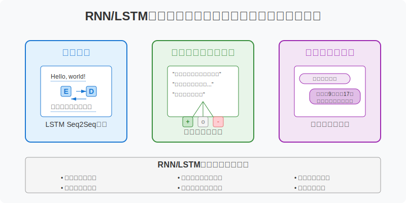

### 1. 機械翻訳

Google 翻訳に代表される機械翻訳サービスは、2016 年頃までは主に LSTM ベースの Sequence-to-Sequence モデルが使用されていました。これにより、従来の統計的機械翻訳から大きく精度が向上しました。

### 2. 感情分析・評判分析

ソーシャルメディアの投稿や商品レビューなどから、ポジティブ/ネガティブといった感情を自動的に分析する技術として活用されていました。特にマーケティングや顧客満足度調査に広く利用されています。

### 3. チャットボット（初期）

RNN/LSTM を用いた初期のチャットボットは、カスタマーサポートや情報提供などの限定的な用途で実用化されていました。現在のような高度な対話能力はなかったものの、定型的な質問応答システムとして活用されていました。

## 予測分析・推薦システム


機械学習の強みを活かした予測分析や推薦システムも多くの産業で実用化されていました。

### 1. レコメンデーションエンジン

Netflix や amazon などのオンラインサービスでは、ユーザーの過去の行動データから好みを学習し、次に興味を持ちそうな商品やコンテンツを推薦するシステムが開発されていました。主に協調フィルタリングや行列分解などの手法が用いられていました。

### 2. 金融リスク分析

銀行や保険会社では、顧客データから融資の返済可能性やクレジットカードの不正利用検知などを予測するシステムが実用化されていました。特にランダムフォレストや XGBoost などのアンサンブル学習手法が高い精度を示していました。

### 3. 製造業での予知保全

工場の設備から収集されるセンサーデータを分析し、故障を事前に予測することで、計画的なメンテナンスを可能にするシステムが導入されていました。主に時系列分析技術が用いられていました。

## 自然言語処理と音声技術の融合

機械学習技術の進歩により、自然言語処理と音声技術の組み合わせも実用化されていました。


### 1. 音声アシスタント

Apple の Siri、Amazon の Alexa、Google アシスタントなどのスマートスピーカーやスマートフォンに搭載された音声アシスタントは、音声認識、自然言語理解、音声合成の技術を組み合わせたものです。これらは、天気予報、時間管理、音楽再生、情報検索などの基本的なタスクに対応していました。

### 2. 音声翻訳システム

旅行者や国際ビジネスのための音声翻訳アプリも開発されていました。話された言葉を認識し、別の言語に翻訳して音声出力するシステムで、リアルタイムコミュニケーションの障壁を低減することに貢献していました。

### 3. 議事録自動作成システム

会議の音声を自動的にテキスト化し、重要なポイントを抽出する議事録自動作成システムも登場していました。特にビジネスシーンでの生産性向上に貢献しました。

## Transformer 以前の技術の限界

これらの技術は実用的な価値を持っていたものの、以下のような限界も抱えていました。

### 1. 文脈理解の限界

特に RNN/LSTM ベースの言語モデルは、長い文脈を理解する能力に制限がありました。過去の情報（特に長い文章の場合）を十分に考慮できないため、文脈に依存する質問応答や対話システムの性能に限界がありました。

### 2. マルチモーダル処理の困難さ

テキスト、画像、音声などの異なる種類のデータを統合的に処理することが難しく、単一のモダリティに特化したモデルが主流でした。

### 3. 事前学習とドメイン適応の課題

特定のタスクやドメインに特化した学習が必要で、一般的な知識を活用して新しいタスクに素早く適応するという能力は限られていました。この課題は、後の Transformer アーキテクチャと事前学習モデルの登場によって大きく改善されることになります。

### 4. 計算リソースとデータ要件

高品質なモデルを学習させるためには、大量の計算リソースと高品質なラベル付きデータが必要でした。特に教師あり学習を中心としていたため、新しいアプリケーションを開発するコストが高くなる傾向がありました。

これらの限界は、2017 年以降に登場する Transformer アーキテクチャと大規模言語モデルによって徐々に克服されていくことになります。次のセクション（4-1）では、Transformer アーキテクチャがもたらした革命的な変化について詳しく見ていきます。

# 4. 生成 AI の時代（2017 年-現在）

## 4-1. Transformer アーキテクチャの革命的意義

2017 年に Google の研究チームによって発表された論文「Attention Is All You Need」は、AI 研究の歴史において極めて重要な転換点となりました。この論文で提案された「Transformer」アーキテクチャは、それまでの自然言語処理（NLP）で主流だった RNN（Recurrent Neural Network）や LSTM（Long Short-Term Memory）に取って代わり、現代の生成 AI の基盤となっています。

### Transformer の登場背景

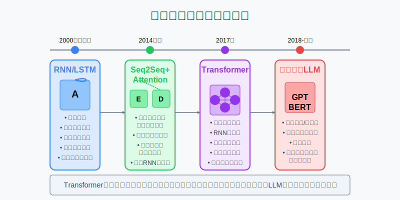

Transformer アーキテクチャが登場する以前、自然言語処理の主流アプローチは RNN とその変種である LSTM や GRU でした。これらのモデルには以下のような課題がありました：

1. **逐次処理の制約**：

   - RNN は時系列データを順番に処理する必要があり、並列計算が困難
   - 長いシーケンスの処理に時間がかかる

2. **長期依存関係の問題**：

   - LSTM でも非常に長い依存関係の捕捉は依然として難しい
   - 文書全体のような長いコンテキストの理解に制約

3. **勾配の問題**：
   - 長いシーケンスでの勾配消失/爆発問題
   - 深層化の困難さ

2014 年頃に注意機構（Attention Mechanism）が Seq2Seq モデルに導入され、モデルが入力シーケンスの関連部分に「注意を向ける」ことが可能になりましたが、基本的な構造はまだ RNN に依存していました。

### Transformer の革新的なアーキテクチャ


Transformer の最も革新的な点は、RNN や CNN を一切使用せず、「自己注意機構（Self-Attention Mechanism）」のみに依存するアーキテクチャを採用したことです。その主要な構成要素と革新点は以下の通りです：

### 1. 自己注意機構（Self-Attention Mechanism）

自己注意機構は、Transformer の中核となる革新的な技術です。

**基本概念**:

- 入力シーケンスの各要素（トークン）間の関連性を計算
- 各トークンが他のすべてのトークンとどれだけ関連しているかを数値化
- これにより、シーケンス内の任意の位置間の依存関係を直接モデル化

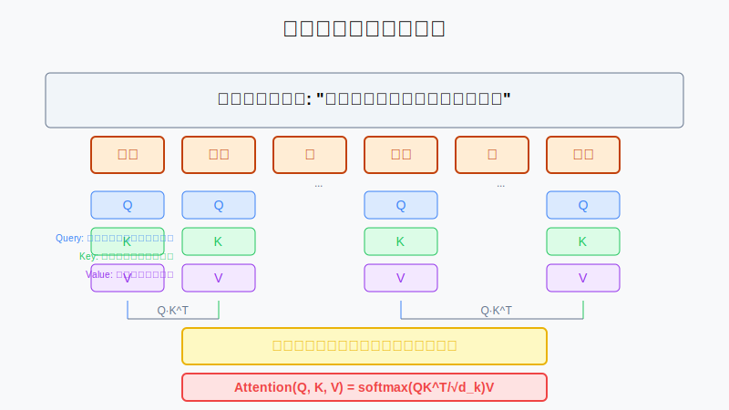

**自己注意機構の計算プロセス**:

1. **クエリ(Q)、キー(K)、バリュー(V)の生成**:

   - 各入力トークンから 3 種類の表現ベクトルを生成
   - クエリ(Q): 「この位置から何を知りたいか」
   - キー(K): 「この位置が提供できる情報の種類」
   - バリュー(V): 「この位置が実際に提供する情報」

2. **注意スコアの計算**:

   - 各位置のクエリと全位置のキーの内積を計算
   - スケーリング（√d_k で割る）とソフトマックス適用で確率分布に変換

3. **コンテキスト化された表現の生成**:

   - 注意スコアに基づいてバリュー(V)の加重和を計算
   - 各トークンは全シーケンスの情報を文脈に応じて利用可能に

4. **マルチヘッド機構**:
   - 複数の「注意ヘッド」を並列に計算
   - 異なる種類の関係パターンを同時に捉える
   - 例：単語の文法的関係と意味的関係を別々のヘッドで捉える

### 2. 位置エンコーディング（Positional Encoding）

RNN と異なり、Transformer は単語の順序情報を自然に捉えることができません。この問題を解決するために、位置情報を明示的に埋め込む「位置エンコーディング」が導入されました。

**特徴**:

- 各位置に固有の信号を追加
- 異なる周波数のサイン・コサイン関数を使用
- 相対的な位置関係が学習可能

### 3. エンコーダ・デコーダ構造

Transformer は、機械翻訳タスクを念頭に置いた「エンコーダ・デコーダ」アーキテクチャを採用しています：

**エンコーダ**:

- 入力シーケンス全体を処理
- 双方向の自己注意機構を使用（各位置が全位置を参照可能）
- 入力の深い表現を生成

**デコーダ**:

- 出力シーケンスを自己回帰的に生成
- マスク付き自己注意機構（未来の位置を見ないようマスク）
- エンコーダ・デコーダ間の注意機構で入力情報を参照

### 4. その他の革新的要素

**残差接続と層正規化**:

- 各サブレイヤー後に残差接続（Skip Connection）
- 層正規化による学習の安定化
- 非常に深いネットワークの学習を可能に

**フィードフォワードネットワーク**:

- 各注意層の後に適用
- ポジションごとに独立した変換を適用
- 通常、内部でより大きな次元を持つ 2 層のネットワーク

### Transformer の革命的意義


Transformer アーキテクチャがもたらした革命的意義は、技術的な優位性と実応用の両面で評価できます：

### 技術的革新としての意義

1. **並列計算の実現**

   - RNN が持つ逐次計算の制約を解消
   - GPU による大規模な並列処理が可能に
   - トレーニング時間の大幅な短縮（数週間 → 数日）

2. **グローバルな依存関係のモデル化**

   - シーケンス内の任意の位置間の依存関係を直接モデル化
   - 長距離依存関係の捕捉能力が大幅に向上
   - 複雑な文法構造や文脈依存関係の理解が向上

3. **スケーラビリティの向上**

   - モデルサイズ（パラメータ数）と性能の相関がより明確に
   - 計算リソースが許す限り拡大可能なアーキテクチャ
   - 「スケーリング則」の発見（より大きなモデル = より良い性能）

4. **関連性の明示的な計算**
   - 注意機構による明示的な関連性計算
   - モデルの解釈可能性の向上（注意マップの可視化）
   - 複雑な推論能力の獲得

### 実応用への影響

1. **大規模言語モデル（LLM）の基盤**

   - GPT 系列、BERT、T5、PaLM など全ての大規模言語モデルの基礎
   - 事前学習・微調整パラダイムの確立
   - 様々な NLP タスクでの性能向上

2. **生成 AI の飛躍的発展**

   - テキスト生成の高度化（GPT-3/4、Claude 等）
   - 画像生成モデル（DALL-E、Stable Diffusion）
   - マルチモーダルモデル（GPT-4V、Gemini 等）

3. **産業応用の加速**

   - 翻訳サービスの品質向上
   - コンテンツ生成・要約ツール
   - コード生成（GitHub Copilot 等）
   - 会話型 AI アシスタント（ChatGPT 等）

4. **研究パラダイムのシフト**
   - 多くの AI 研究が Transformer ベースに
   - アーキテクチャ改良の継続的な研究（Performer などの Attention 改良等）
   - 計算効率の改善に関する研究の活発化

### パラダイムシフトとしての意義

Transformer は単なる技術改良ではなく、AI におけるパラダイムシフトをもたらしました：

1. **「注意」の重要性の再認識**

   - 注意機構が神経科学的にも妥当なメカニズムであることが判明
   - 人間の認知プロセスとの類似点

2. **スケール効果の発見**

   - データ量、モデルサイズ、計算量の増加が性能向上に直結
   - 「スケーリング則」による予測可能な進化の道筋

3. **「創発的能力」の発見**

   - ある規模を超えたモデルに、設計時に意図していなかった能力が創発
   - 例：基本的な算数、推論、コーディング能力など

4. **生成 AI の時代の本格的な幕開け**
   - テキスト、画像、音声など多様なデータ種類に対応
   - 人間のクリエイティブ作業を支援・一部代替する可能性

### 今日の生成 AI への直接的影響

Transformer の登場が今日の生成 AI ブームに直結した理由は以下の通りです：

1. **計算効率とスケーラビリティ**

   - GPU の能力を最大限に活用できる並列アーキテクチャ
   - より多くのデータ、より大きなモデルへのスケーリングが容易

2. **転移学習の実現**

   - 大規模な事前学習と特定タスクへの微調整
   - 「基盤モデル」という概念の誕生

3. **性能向上の明確な道筋**

   - より大きなデータセットとモデルサイズが性能向上に直結
   - 産業界の大規模投資の根拠に

4. **アーキテクチャの柔軟性と応用可能性**
   - 多様なタスクとデータモダリティに適用可能
   - ドメイン特化型の変種が次々と開発される基盤に

Transformer の登場は、AI 研究と応用の歴史における最も重要な転換点の一つと言えるでしょう。このアーキテクチャが特に重要なのは、単一のアイデアが理論から実用まで急速に進展し、産業界と学術界の両方に深遠な影響を与えた点です。その上に構築された技術が、今日の生成 AI ブームの中核となっています。

人間がプログラミングしたアルゴリズムからデータから学習するモデルへの転換が第一の革命だとすれば、Transformer によって実現された超大規模なデータからの学習と文脈理解能力は、AI 発展における第二の革命と位置付けることができるでしょう。

# 4-2. 大規模言語モデル（LLM）のパワーと限界

Transformer アーキテクチャの登場を契機に、自然言語処理は大規模言語モデル（LLM: Large Language Model）の時代に入りました。これらのモデルは、膨大なテキストデータから学習し、驚くべき言語能力を示す一方で、固有の限界も持っています。

## 大規模言語モデルの進化


大規模言語モデルは、Transformer アーキテクチャの登場後、急速に進化してきました。その進化の道筋は主に「より大きく、より強力に」というトレンドに沿っており、パラメータ数（モデルの大きさを示す指標）は爆発的に増加してきました。

### LLM の主要発展段階

1. **GPT-1 (2018)**:

   - 1 億 1700 万パラメータ
   - 初の大規模 Transformer ベースの言語モデル
   - 事前学習と微調整のパラダイムを確立

2. **BERT (2018)**:

   - 双方向エンコーダ表現
   - 次の単語を予測するのではなく、文中のマスクされた単語を予測する手法
   - 自然言語理解タスクで大幅な性能向上

3. **GPT-2 (2019)**:

   - 15 億パラメータ
   - テキスト生成能力の向上
   - リリース時は「危険すぎる」と懸念された

4. **GPT-3 (2020)**:

   - 1750 億パラメータ
   - 「創発的能力」の出現（設計時に意図していなかった能力の発現）
   - 少ショット学習能力（例を少し示すだけで新しいタスクを学習）

5. **ChatGPT/GPT-3.5 (2022)**:

   - 人間のフィードバックによる強化学習（RLHF）
   - 対話に特化したチューニング
   - AI 技術の大衆普及の転換点

6. **GPT-4 (2023)とその進化**:

   - マルチモーダル能力（テキストだけでなく画像も理解）
   - 複雑な推論能力の向上
   - より高度な安全性メカニズム

7. **競合モデルの台頭 (2023-2024)**:
   - Claude (Anthropic)
   - Gemini (Google)
   - Llama (Meta)
   - Mistral など

## LLM の驚異的な能力

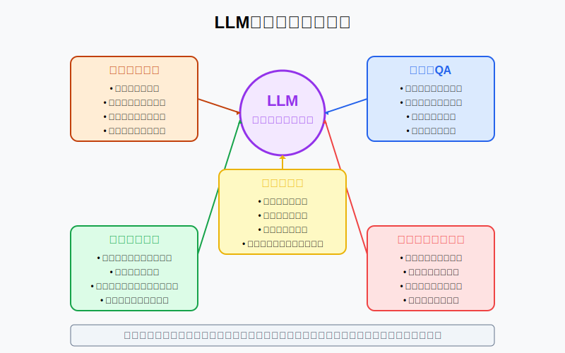

大規模言語モデルは、その規模と学習データの広さから、多くの驚くべき能力を獲得しています。これらの能力の多くは設計者が意図的に組み込んだものではなく、モデルサイズとデータ量の増加に伴って「創発的」に現れたものです。

### LLM の主要能力

1. **高度な言語理解と生成**

   - 複雑な文の構文・意味理解
   - 自然で流暢な文章生成
   - 多言語対応（数十〜数百の言語）
   - 文体や調子の調整能力

2. **文脈理解と一貫性**

   - 長い文脈の追跡と保持
   - 会話の流れに沿った応答
   - 文書全体の一貫性維持
   - 指示に沿った出力調整

3. **知識の獲得と適用**

   - 学習データから広範な知識を抽出
   - 事実情報と一般知識の提供
   - 専門分野の理解と説明
   - 質問に対する情報提供

4. **推論能力**

   - 論理的推論と問題解決
   - 暗黙の情報からの推論
   - 因果関係の理解
   - 複数のステップを要する思考

5. **クリエイティブな生成**

   - 物語やポエムの作成
   - アイデア発想と展開
   - 創造的な問題解決
   - 芸術的表現の理解

6. **対話とコミュニケーション**

   - 自然な会話の維持
   - ユーザーの意図理解
   - 質問の明確化と対話の方向付け
   - 社会的・感情的文脈の把握

7. **コード生成と理解**

   - プログラミング言語の記述・理解
   - コードの説明・デバッグ
   - アルゴリズムの実装
   - ソフトウェア開発支援

8. **マルチモーダル理解**（最新モデル）
   - テキストと画像の統合理解
   - 視覚的内容の説明と分析
   - 画像に基づく推論と応答

### 実応用例

現在、LLM は多くの分野で実用化されています：

- **ビジネス**: レポート作成、データ分析、メール対応
- **教育**: 学習支援、問題解説、教材作成
- **開発**: コーディング支援、デバッグ、ドキュメンテーション
- **創作**: コンテンツ作成、アイデア発想、編集支援
- **カスタマーサポート**: 自動応答、問い合わせ対応
- **研究**: 文献要約、仮説生成、実験計画

## LLM の根本的な限界


大規模言語モデルが持つ驚くべき能力の一方で、いくつかの根本的な限界も存在します。これらの限界を理解することは、LLM を適切に活用するために不可欠です。

### 1. 幻覚（Hallucination）と事実の誤り

LLM の最も顕著な問題の一つが「幻覚」と呼ばれる現象です。

**主な特徴**:

- 存在しない情報や事実を自信を持って提示
- 誤った引用、参考文献、統計データの生成
- 実在しない人物、出来事、研究結果の創作

**原因**:

- 学習データに含まれる不正確な情報
- 学習段階での過度な一般化
- 確率的な次の単語予測という基本動作

**影響**:

- 重要な意思決定への信頼性低下
- 誤情報の拡散リスク
- 特に事実確認が必要な領域での問題（医療、法律、科学など）

### 2. 知識の限界と鮮度

LLM の知識は、訓練データに強く依存しています。

**主な制約**:

- 学習データのカットオフ日以降の情報を持たない
- 特定のドメインや言語での知識格差
- 学習データに存在しない情報やニッチな領域の理解の限界

**例**:

- 最新の世界情勢や技術動向の把握不足
- 地域限定の知識や文化的ニュアンスの欠如
- マイナー言語や専門分野での知識不足

### 3. 推論能力の限界

LLM は単純な推論はできますが、複雑な思考には限界があります。

**主な課題**:

- 複雑な数学問題での計算ミス
- 多段階推論での誤りの蓄積
- 論理的一貫性の維持困難

**原因**:

- 正解を明示的に学習するのではなく、パターンを学習
- 外部計算ツールやメモリの欠如
- 思考の各ステップを検証する能力の限界

### 4. 文脈理解の制約

LLM の「記憶」と文脈理解には技術的な制約があります。

**主な制限**:

- コンテキストウィンドウのサイズ制限（入力可能なテキスト量）
- 長い文脈での情報の忘却や混合
- 複雑な指示の誤解や曖昧さの解決困難

**影響**:

- 長い文書の包括的分析の困難さ
- 会話の長期的な一貫性維持の課題
- 複雑なプロジェクトや多段階タスクでの使用制限

### 5. バイアスと倫理的問題

LLM は学習データや設計に含まれるバイアスを反映します。

**主な問題**:

- トレーニングデータに含まれる社会的・文化的バイアスの継承
- 特定の視点や意見の過度な代表
- 有害コンテンツの生成可能性

**対応策**:

- 人間によるレビューと監視
- バイアス検出と緩和技術
- 安全性フィルターの実装

### 6. 技術的・計算的限界

LLM は技術的にも大きな課題を抱えています。

**主な制約**:

- 膨大な計算資源とエネルギー消費
- 実際の「理解」ではなく統計的パターンマッチング
- 自己認識や真の意識の欠如

**影響**:

- 環境面での持続可能性への懸念
- アクセシビリティと普及の制限
- 人間の思考との根本的な差異

## LLM の進化と今後の展望

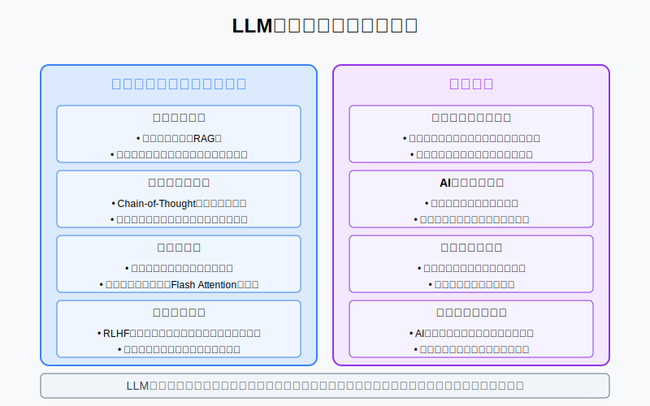

LLM の持つ限界を理解しつつも、これらを克服するための技術的進歩は急速に進んでいます。多くの課題への対策が開発され、次世代 LLM の可能性を広げつつあります。

### 限界克服への技術的アプローチ

1. **幻覚への対策**

   - **検索拡張生成（RAG: Retrieval-Augmented Generation）**:

     - 外部のデータソースから関連情報を検索
     - 事実に基づく回答の生成をサポート
     - Google Bard、Bing や Perplexity のような検索連携モデル

   - **知識グラフの統合**:

     - 構造化された知識で事実整合性を確保
     - エンティティ間の関係を明示的にモデル化

   - **自己検証メカニズム**:
     - モデル自身による回答の検証
     - 確信度の評価と表示

2. **推論能力の強化**

   - **Chain-of-Thought（思考の連鎖）**:

     - 段階的な思考プロセスを明示化
     - 複雑な問題を分解して解決
     - 中間ステップの検証可能性

   - **ツール利用とエンハンスメント**:
     - 計算機や検索エンジンなどの外部ツール連携
     - コード実行環境によるプログラムの検証
     - 専門システムとの統合

3. **長文脈処理の改善**

   - **コンテキストウィンドウの拡大**:

     - GPT-4 の 32k トークン、Claude 3 の 200k トークンなど
     - より長い会話や文書の処理が可能に

   - **効率的な注意機構**:

     - Flash Attention、Sparse Attention などの計算効率の改善
     - メモリとグラデーション効率の向上

   - **情報の要約と検索**:
     - 長い文脈の重要情報を自動要約
     - 関連情報の効率的な検索と参照

4. **安全性と倫理面の強化**

   - **RLHF（人間フィードバックからの強化学習）**:

     - 人間の価値観に沿った応答生成
     - 安全性と有用性のバランス調整

   - **バイアス検出と低減**:
     - より多様なデータセットでの訓練
     - バイアス検出ツールの開発と統合

### LLM の将来展望

1. **マルチモーダル能力の拡張**

   - テキスト、画像、音声、動画を統合的に処理
   - 複数のモダリティ間での推論と生成
   - 実世界の理解とインタラクションの向上
   - 例：GPT-4V、Gemini、Claude 3 のマルチモーダル拡張

2. **AI エージェントとしての進化**

   - 自律的なタスク計画と実行能力
   - 環境とのインタラクティブな相互作用
   - 長期的な目標追跡とタスク管理
   - 特定のドメインに特化したエージェント
   - 例：AutoGPT、BabyAGI などの自律エージェント実験

3. **継続的学習と知識更新**

   - 最新情報への自動アップデートメカニズム
   - ユーザーフィードバックからの継続的学習
   - ドメイン固有知識の専門的な獲得
   - 学習データと現実のギャップの縮小

4. **効率性と環境負荷の改善**

   - より小型で効率的なモデルアーキテクチャ
   - 蒸留技術による軽量化
   - エッジデバイスでの実行可能性
   - 例：Llama 3、Mistral、Phi-3 などの軽量高性能モデル

5. **社会的統合と規制**
   - AI ガバナンスフレームワークの発展
   - 透明性と説明可能性の向上
   - 産業特化型のコンプライアンス対応
   - 責任ある AI 開発と展開のグローバル基準

## LLM の適切な活用とバランス

大規模言語モデルを効果的に活用するためには、そのパワーと限界の両方を理解し、適切な使用方法を採用することが重要です：

### 適切な活用のための原則

1. **目的に応じた使い分け**

   - 創造的タスク：LLM の強み（アイデア発想、文章作成など）
   - 事実確認が必要なタスク：検証メカニズムを併用

2. **人間との協働モデル**

   - LLM をツールとして位置づけ
   - 最終判断と責任は人間が持つ
   - 相互補完的な関係の構築

3. **継続的な検証と評価**

   - LLM の出力を盲信しない
   - 重要な情報は複数ソースで確認
   - 結果の品質と正確性の定期的評価

4. **領域特化型の拡張**
   - 特定ドメイン向けの追加訓練
   - 専門知識データベースとの連携
   - ドメイン固有の評価指標の開発

### 現実的な期待値の設定

LLM は驚異的な能力を持つ一方で、全ての問題を解決する「魔法の杖」ではありません。特に以下の点を認識することが重要です：

- LLM は「知性のシミュレーション」であり、真の理解や意識は持たない
- 数学的厳密性や完全な事実正確性が必要な領域では補助ツールとして使用
- 社会的影響力のある決定においては、慎重な検証と人間の判断が不可欠

## まとめ：LLM のパワーと限界

大規模言語モデルは、AI の歴史における画期的なブレークスルーであり、その能力は従来の技術的限界を大きく超えています。テキスト生成から複雑な推論、創造的作業まで、幅広いタスクを驚くべき水準で実行できます。

一方で、事実の誤り（幻覚）、知識の制限、複雑な推論の限界、バイアスなどの根本的な課題も抱えています。これらの限界を認識し、適切な用途と使用方法を選択することが、LLM の真の価値を引き出す鍵となります。

技術の急速な進歩により、現在の限界の多くは徐々に克服されつつあります。RAG や外部ツール連携、マルチモーダル機能の統合などにより、LLM の能力と信頼性は継続的に向上しています。

LLM は単なる技術的進歩を超え、人間とコンピュータの関係、情報へのアクセス方法、創造的作業の支援など、社会全体に変革をもたらす可能性を秘めています。その可能性を最大化しながらリスクを最小化するためには、技術開発者、利用者、政策立案者など多くのステークホルダーの協力が必要となるでしょう。

次のセクションでは、ChatGPT、DALL-E、Midjourney など、現実世界で広く利用されている生成 AI の具体的な応用例について詳しく見ていきます。

# 4-3. ChatGPT、DALL-E、Midjourney など：生成 AI の実用例

生成 AI の理論的発展が実際のアプリケーションとして結実し、一般ユーザーにも広く普及したのは 2022 年以降のことです。特に、テキスト生成 AI と画像生成 AI の分野で革命的なブレークスルーが起こり、AI 技術が実用段階に入ったことを象徴するような製品が次々と登場しました。本セクションでは、代表的な生成 AI の実用例を紹介し、その技術的特徴と影響について解説します。

## テキスト生成 AI


### 1. ChatGPT

ChatGPT は、OpenAI によって開発されたテキスト生成 AI で、2022 年 11 月のリリース以降、AI 技術の大衆普及に大きな影響を与えました。

**技術的特徴**:

- GPT（Generative Pre-trained Transformer）アーキテクチャを基盤
- 膨大なテキストデータで事前学習
- 人間のフィードバックによる強化学習（RLHF）で調整
- 対話形式に特化したインターフェース

**主な用途と実用例**:

- **ビジネスコミュニケーション**: メール作成、議事録要約、提案書ドラフト
- **教育支援**: 学習内容の説明、問題解決のガイド、学習計画の立案
- **創作活動**: 文章作成、アイデア発想、ストーリー展開
- **プログラミング支援**: コード生成、デバッグ、アルゴリズム解説
- **情報アクセス**: 知識の質問応答、情報整理、調査支援

**進化と拡張**:

- GPT-3.5 から、より高度な GPT-4 へのアップグレード
- プラグインシステム導入による外部ツール連携
- 画像理解能力の追加（GPT-4V）
- API を通じた外部アプリケーションへの統合

### 2. Claude (Anthropic)

Claude は、Anthropic 社が開発した安全性と有用性を重視した対話型 AI 助手です。

**技術的特徴**:

- 「憲法的 AI」アプローチ（特定の価値観や原則に基づく設計）
- 長文脈処理に強み（Claude 3.5 Sonnet は約 20 万トークンの処理が可能）
- 透明性と有害回避に注力
- マルチモーダル能力（画像理解）を搭載

**差別化ポイント**:

- 長い文書や会話の一貫した理解と処理
- 企業向けセキュリティとコンプライアンス機能の強化
- より詳細かつ丁寧な説明スタイル

### 3. Google Gemini（旧 Bard）

Google の AI 技術を結集して開発されたテキスト生成 AI です。

**技術的特徴**:

- Google の検索技術と組み合わせた情報アクセス
- Google のサービスエコシステムとの統合
- マルチモーダル能力（テキスト、画像の理解）
- 異なるサイズのモデル（Ultra, Pro, Nano）を用途に応じて提供

**主な用途**:

- リアルタイムの情報検索と統合
- Google ドキュメント、スプレッドシートなどとの連携
- Gmail、カレンダーなどの生産性向上支援
- モバイルデバイスへの統合（Android）

### 4. オープンソースモデル（LLaMA, Mistral, Llama 等）

商用モデルとは別に、オープンソースの大規模言語モデルも急速に発展しています。

**代表的なモデル**:

- **LLaMA/Llama** (Meta): オープンウェイトで研究目的に公開
- **Mistral AI**: 効率的で小型ながら高性能なオープンモデル
- **Phi-2/3** (Microsoft): 小規模ながら競争力のある教育向けモデル
- **Falcon** (Technology Innovation Institute): オープンウェイトの大規模モデル

**オープンソースモデルの意義**:

- 透明性と検証可能性の向上
- コミュニティによる改良と特化型モデルの開発
- プライバシーに配慮したローカル実行
- 大企業以外の開発者にもアクセス可能な技術

## 画像生成 AI

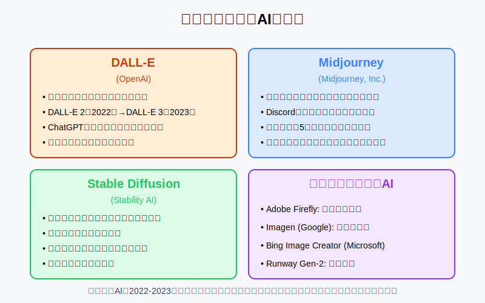

画像生成 AI の分野も、テキスト生成 AI と同様に急速な進化を遂げ、アート、デザイン、コンテンツ制作の世界に革命をもたらしています。

### 1. DALL-E (OpenAI)

OpenAI が開発したテキストから画像を生成する AI システムです。

**技術的特徴**:

- 拡散モデル（Diffusion Model）を基盤とした画像生成
- GPT 言語モデルとの連携によるテキスト理解
- DALL-E 3 では、ChatGPT と統合されたプロンプト改善機能
- 安全フィルターによる不適切コンテンツの制限

**進化の過程**:

- **DALL-E** (2021): 最初のバージョン、低解像度で制限付き
- **DALL-E 2** (2022): 大幅な品質向上と一般アクセス開放
- **DALL-E 3** (2023): テキスト処理能力の向上、詳細な指示に対応

**主な用途**:

- **デザイン**: 製品コンセプト、ロゴ、UI コンポーネント
- **コンテンツ制作**: ブログ画像、ソーシャルメディア投稿
- **アイデア視覚化**: コンセプトアートや発想の可視化
- **マーケティング**: 広告素材や販促物の制作支援

### 2. Midjourney

Discord 上で提供されている、特に芸術性の高い画像生成 AI です。

**技術的特徴**:

- 美的に洗練された画像生成に特化
- 独自のスタイリッシュな表現と芸術性
- バージョン 4 から 5 への移行で写実性が大幅向上
- 詳細なパラメータ制御による出力調整機能

**操作方法の特徴**:

- Discord プラットフォーム上での bot 操作
- `/imagine`コマンドでの画像生成
- 生成結果のバリエーション作成やアップスケール
- スタイル設定とパラメータ指定による細かな制御

**注目のユースケース**:

- アート作品の創作とインスピレーション
- コンセプトアートとビジュアル開発
- 建築やインテリアデザインのビジュアライゼーション
- ファッションデザインや商品コンセプト開発

### 3. Stable Diffusion

Stability AI が開発したオープンソースの画像生成モデルです。

**技術的特徴**:

- 潜在拡散モデル（Latent Diffusion Model）アーキテクチャ
- オープンソースで公開されたコードとウェイト
- 個人のハードウェアで実行可能な軽量設計
- 豊富なコミュニティ拡張と改良モデル

**主な利点**:

- 無料でローカル実行が可能（プライバシー確保）
- カスタマイズや微調整の自由度が高い
- WebUI や ComfyUI など多様なインターフェース
- LoRA、Textual Inversion など特化型学習の容易さ

**代表的な拡張機能**:

- **ControlNet**: 既存画像の構造や輪郭に基づく生成
- **Img2Img**: 既存画像からの変換や修正
- **Inpainting/Outpainting**: 部分的な修正や拡張
- **Upscaling**: 低解像度画像の高品質拡大

### 4. その他の主要な画像生成 AI

#### Adobe Firefly

- Adobe 製品との統合を重視
- 商用利用に焦点（ライセンスクリアなデータで学習）
- クリエイティブワークフローとの統合
- 倫理的なコンテンツ方針

#### Google Imagen

- Google AI 研究の成果
- 高品質なフォトリアリスティック画像生成
- Google Workspace などのサービスとの連携
- 安全性とバイアス軽減に注力

#### Runway Gen-2

- 静止画だけでなく動画生成にも対応
- ビジュアルエフェクトや映像制作向け
- 専門的な映像編集ワークフローとの統合
- テキストや画像からの動画生成

## 音声・音楽生成 AI

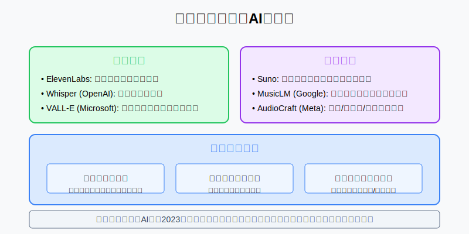

テキストと画像に加えて、音声・音楽の生成 AI も急速に発展しています。これらは、テキストや音声サンプルから高品質な音声や音楽を生成することができます。

### 1. 音声合成 AI

#### ElevenLabs

高品質で自然な音声合成を実現する AI サービスです。

**技術的特徴**:

- 驚異的に自然な音声合成
- 多言語対応と感情表現が可能
- 少量のサンプルからボイスクローン作成
- API を通じたアプリケーション統合

**主な用途**:

- ナレーション・ボイスオーバー
- オーディオブック制作
- キャラクターボイス生成
- コンテンツのローカライズ（多言語展開）

#### VALL-E (Microsoft)

数秒のサンプルから話者の声を模倣して、様々なコンテンツを生成できる AI モデルです。

**技術的特徴**:

#### VALL-E (Microsoft)（続き）

数秒のサンプルから話者の声を模倣して、様々なコンテンツを生成できる AI モデルです。

**技術的特徴**:

- 3 秒程度の音声サンプルから話者の特徴を学習
- 音声のトーンや感情表現を維持したまま任意のテキストを発話
- GPT ライクなトークン化アプローチを音声に適用
- 言語の音響特性のゼロショット学習

**注目すべき点**:

- 高いリアリズムによる倫理的問題への懸念
- なりすましや偽情報への悪用防止策の重要性
- 研究段階からの慎重な公開アプローチ

#### Whisper (OpenAI)

厳密には音声生成ではなく音声認識 AI ですが、音声テクノロジーの重要な要素として含めています。

**技術的特徴**:

- 多言語の音声認識と翻訳機能
- 様々な話し言葉や方言に対応
- オープンソースで公開（広範な応用を促進）
- ノイズの多い環境でも高い精度を実現

**応用例**:

- 自動字幕生成と翻訳
- 会議・インタビューの文字起こし
- 音声コンテンツのインデックス化と検索
- バリアフリー・アクセシビリティ向上

### 2. 音楽生成 AI

#### Suno

テキスト指示から完全な歌（ボーカル、楽器、歌詞を含む）を生成できる AI サービスです。

**技術的特徴**:

- 高品質な楽器演奏と歌声の合成
- テキスト指示からの完全な楽曲生成
- ジャンル、スタイル、雰囲気の指定に対応
- 数十秒で完成度の高い楽曲を作成

**インパクト**:

- アマチュアでも高品質な音楽制作が可能に
- 様々なスタイルの音楽を迅速に試作
- BGM・効果音などの素材作成の効率化
- 音楽制作の民主化と創作バリアの低下

#### MusicLM (Google)

テキスト記述から高品質な音楽を生成する Google 開発の AI システムです。

**技術的特徴**:

- 詳細なテキスト記述からの楽曲生成
- 長時間の一貫性を持った楽曲構成
- 特定の楽器やジャンルの指定に対応
- 時間経過に伴う楽曲の展開制御

**応用可能性**:

- 映像制作向けのカスタム音楽生成
- ゲーム開発における動的音楽生成
- アーティストのインスピレーション源
- 教育用音楽素材の作成

#### AudioCraft (Meta)

音楽、効果音、環境音などの生成に特化した Meta のオープンソース AI フレームワークです。

**技術的特徴**:

- MusicGen: テキストから音楽生成
- AudioGen: 環境音・効果音の生成
- オープンソースで研究者・開発者が利用可能
- 時間的一貫性のある高品質オーディオ生成

## 生成 AI の実用的応用例

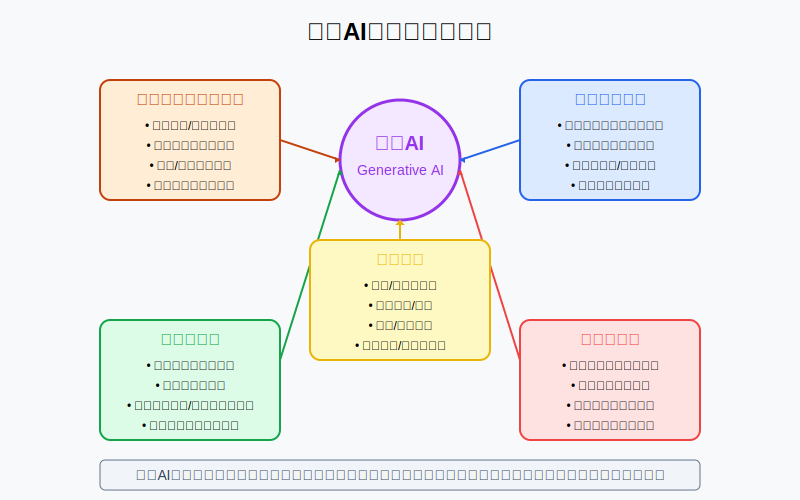

生成 AI は、様々な分野で具体的な実用例を生み出しています。以下に主要な応用分野と具体的なユースケースを紹介します。

### 1. クリエイティブ制作・デザイン

**具体的応用例**:

- **商品コンセプトの視覚化**: 新製品のコンセプトアートを Midjourney で生成
- **グラフィックデザイン支援**: ロゴ、ブランドアイデンティティ素材の初期案作成
- **ウェブデザイン**: モックアップやプロトタイプの迅速な生成
- **編集・出版**: 本や記事の挿絵の作成
- **動画制作**: ストーリーボード、アニメーション要素、VFX 素材の生成

**実際の活用例**:

- マッキンゼーのコンサルタントがクライアントプレゼン用ビジュアルに活用
- ゲーム開発会社による初期コンセプトアートの迅速な創出
- 小規模事業者がプロ級のマーケティング素材を格安で作成

### 2. ビジネス・コーポレート応用

**具体的応用例**:

- **カスタマーサポート**: 24 時間対応の AI チャットボット
- **文書作成**: レポート、提案書、プレゼン資料の素案作成
- **データ分析**: 複雑なデータの解釈と説明の自動生成
- **会議支援**: 議事録作成、要約、フォローアップタスク管理
- **マーケティング**: カスタマイズされた広告コピー、ソーシャルメディア投稿の大量生成

**活用企業例**:

- Microsoft の Copilot for Microsoft 365 がビジネス文書作成を効率化
- JP モルガンが ContractIntelligence でドキュメント解析を自動化
- HubSpot がマーケティングコンテンツ生成に AI を導入

### 3. 開発・技術分野

**具体的応用例**:

- **コード生成**: GitHub Copilot によるプログラミング支援
- **デバッグ支援**: コードの問題点特定と修正案提示
- **ドキュメンテーション**: API ドキュメントや使用説明書の自動生成
- **テスト自動化**: テストケースの生成とユニットテスト作成
- **プロトタイピング**: 概念実証（PoC）の迅速な開発

**実際の成果**:

- Amazon 社内でのコード補完による開発者生産性 40%向上の報告
- GitHub の調査では開発者の 60%以上が AI コード支援を使用
- Stack Overflow のデベロッパー調査で 44%が AI ツール使用を報告

### 4. 教育と学習

**具体的応用例**:

- **パーソナライズド学習**: 学習者のレベルに合わせたコンテンツ生成
- **教材作成**: 様々なレベルの練習問題や教材の自動生成
- **言語学習**: 会話練習パートナー、文法添削、翻訳支援
- **説明生成**: 複雑な概念のわかりやすい説明や比喩の提供
- **フィードバック**: 学生の作業に対する詳細なフィードバック生成

**教育機関での活用**:

- カーネギーメロン大学の AI Writing Assistant 導入
- 複数の大学での AI 倫理とスキル教育カリキュラム開発
- 初等・中等教育向けの AI 補助教材開発プロジェクト

### 5. 個人生産性と日常利用

**具体的応用例**:

- **文章作成**: メール、レター、申請書の下書き作成
- **情報整理**: 長文の要約、重要ポイントの抽出
- **学習支援**: 新しいトピックの説明、学習計画作成
- **創作活動**: 小説、詩、脚本の執筆補助
- **意思決定**: 選択肢の分析と比較のための情報整理

**利用の広がり**:

- ChatGPT の月間アクティブユーザー数 1 億人超え（2023 年）
- スマートフォンの AI 機能統合（Apple の「Apple Intelligence」など）
- 一般消費者向けクリエイティブツールでの採用拡大

## 生成 AI の社会的影響と課題

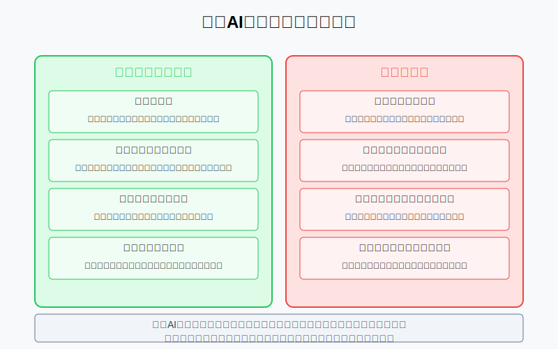

生成 AI の広範な普及に伴い、その社会的影響と様々な課題も顕在化してきています。技術の進歩とその活用方法を考える上で、これらのポジティブな影響と懸念点の両方を理解することが重要です。

### ポジティブな社会的影響

1. **クリエイティブ表現の民主化**

   - 専門的な技術を持たない人々にもアート、デザイン、音楽などの創作活動への参加機会
   - より多様な声や視点の表現が可能に
   - 創作のハードルを下げることによるイノベーションの促進

2. **生産性と効率の飛躍的向上**

   - ルーティンタスクの自動化による時間節約
   - 創造的作業の初期段階（アイデア出し、ドラフト作成など）の加速
   - コンテンツ制作コストの大幅削減

3. **アクセシビリティとインクルージョンの向上**

   - 言語障壁の低減（翻訳、多言語コンテンツ生成）
   - 視覚・聴覚障がい者向けコンテンツの自動生成（音声変換、画像説明など）
   - 教育リソースのパーソナライズと拡充

4. **新しい産業とビジネスモデルの創出**
   - AI 生成コンテンツを活用した新サービス
   - 小規模事業者の競争力強化
   - 既存産業の効率化と新たな価値提供

### 主要な課題と懸念点

1. **著作権と知的財産の問題**

   - 学習データとしての著作物使用に関する法的問題
   - AI 生成コンテンツの著作権帰属の不明確さ
   - クリエイターへの公正な報酬と権利保護

   **最近の動向**: Getty Images vs. Stability AI 訴訟、『ニューヨーク・タイムズ』vs. OpenAI 訴訟など、生成 AI の学習データ使用に関する法的争いが活発化

2. **偽情報と悪用リスク**

   - ディープフェイク映像や偽の音声による誤情報拡散
   - なりすましやフィッシング詐欺への応用
   - 特に選挙や政治プロセスへの影響懸念

   **対策の動き**: EU AI 法、米国の AI 安全法案など規制フレームワークの整備が進行中

3. **労働市場と雇用への影響**

   - デザイナー、ライター、アーティストなど一部職種への影響
   - 必要とされるスキルセットの変化
   - 労働の価値と報酬体系の再考

   **統計**: McKinsey Global Institute の調査では、2030 年までに全世界で約 3 億 7,500 万人が職業転換を迫られる可能性

4. **バイアスと倫理的問題**

   - 学習データに含まれる社会的バイアスの増幅
   - 特定集団の過少表現や固定観念の強化
   - 文化的多様性の尊重と反映の課題

5. **デジタルディバイドの拡大**
   - 高性能 AI へのアクセスと利用スキルの格差
   - 技術リソースの偏在による不平等の拡大
   - 国家間、地域間の技術格差の拡大

## 生成 AI の将来展望

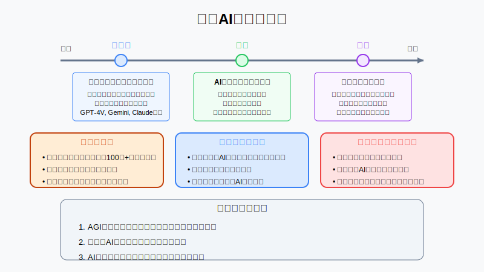

生成 AI はまだ黎明期にあり、今後数年から 10 年の間に大きく進化すると予想されています。以下に、近い将来から長期的な展望までを段階的に見ていきます。

### 近未来（1-2 年）の展望

1. **マルチモーダル技術の成熟**

   - テキスト・画像・音声・動画の統合的処理の向上
   - 単一の AI システムによる多様なメディア形式の理解と生成
   - より自然な人間と AI のインタラクションの実現

2. **フィードバックループの最適化**

   - 人間のフィードバックを効率的に取り入れる仕組みの発展
   - 利用者の好みや要求への適応力の向上
   - より微細な制御と調整が可能なインターフェース

3. **実用ツールとしての定着**
   - ビジネスワークフローへの深い統合
   - 産業別の特化型モデルの普及
   - 日常のデジタルツールとしての位置づけ確立

### 中期（3-5 年）の展望

1. **AI エージェントの進化**

   - 自律的なタスク実行能力
   - 長期的な目標追跡と計画立案
   - 複数のツールや API を適切に組み合わせる能力

2. **情報の信頼性向上**

   - ファクトチェックと情報検証の自動化
   - 幻覚（ハルシネーション）問題の大幅改善
   - ソース引用と検証可能性の標準装備

3. **パーソナライズと記憶の深化**
   - 個人の嗜好や過去の相互作用の長期記憶
   - ユーザー固有の文脈理解の向上
   - 個々のニーズに合わせた適応型レスポンス

### 長期（5-10 年）の展望

1. **実世界との相互作用**

   - ロボティクスとの統合による物理的タスク実行
   - AR/VR を通じた視覚的・空間的インタラクション
   - IoT デバイスとの連携による環境認識と制御

2. **集合知とマルチエージェントシステム**

   - 異なる専門性を持つ AI エージェント間の協調
   - 複雑な問題を分解して解決する能力
   - 人間チームと AI の協働フレームワークの確立

3. **AGI（汎用人工知能）への接近**
   - より広範な領域での人間レベルの能力
   - 創造性と推論能力の更なる向上
   - 自己改善と自律的学習能力の発展

### 技術的進化のカギとなる要素

1. **コンテキスト長の拡大**

   - 数千万トークンを処理できるモデルの出現
   - 本の全体や複数文書の一括処理が標準に
   - 長期的文脈理解能力の大幅向上

2. **計算効率の向上**

   - より少ないリソースで高性能を発揮するモデル
   - オンデバイス処理の普及と高度化
   - エネルギー効率の大幅改善

3. **学習パラダイムの進化**
   - 自己監督学習の新手法開発
   - より少ないデータからの効率的学習
   - 継続的学習と適応能力の向上

### 社会的・制度的発展

1. **規制とガバナンスの枠組み確立**

   - 国際的な AI 規制の標準化
   - 透明性と説明可能性の要件強化
   - 安全性評価の標準プロトコル確立

2. **知的財産と著作権の再定義**

   - AI の学習と生成に関する新たな法的枠組み
   - クリエイターへの公正な報酬メカニズム
   - デジタルコンテンツの出所と真正性の証明技術

3. **人間と AI の新たな関係性**
   - AI リテラシー教育の普及
   - 人間の創造性と AI 能力の相補的活用
   - 労働市場と職業訓練の再構築

## まとめ：生成 AI の実用例と将来性

生成 AI は、テキスト、画像、音声、音楽など多様なメディア形式において革命的な進化を遂げ、多くの実用的なアプリケーションを生み出しています。ChatGPT、DALL-E、Midjourney、Stable Diffusion などの代表的サービスは、クリエイティブワークの効率化から日常のコミュニケーション支援まで、幅広い用途で活用されています。

これらのツールは、人間の創造性を拡張し、アイデアの具現化や情報アクセスの新しい方法を提供することで、個人から企業まで様々なレベルでの生産性向上に貢献しています。同時に、著作権問題、情報の信頼性、倫理的課題など、社会的・法的な懸念も生じており、技術の進化と並行して適切な規制やガイドラインの整備が進められています。

将来的には、より高度なマルチモーダル統合、自律的な AI エージェント、実世界との相互作用など、さらなる進化が期待されています。この発展は、単なる技術的な進歩にとどまらず、人間の創造的プロセスや知識労働の在り方、社会全体の情報流通の構造にまで影響を及ぼす可能性があります。

生成 AI の時代は始まったばかりであり、その可能性と課題を理解しながら、人間と AI の共生関係を築いていくことが、今後の Web 開発者を含むすべての技術者にとって重要な課題となるでしょう。

# 4-5. AI 機能を API として利用する：主要プロバイダーと選択ポイント

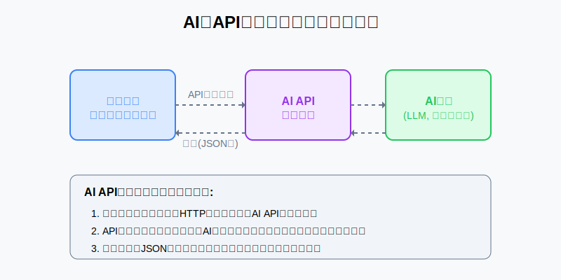

生成 AI の技術は、独自のアプリケーションやサービスに組み込むことで、その真価を発揮します。多くの企業や Web 開発者は、自社開発ではなく、既存の AI プロバイダーが提供する API を利用することで、高度な AI 機能を効率的に実装しています。本セクションでは、主要な AI API プロバイダーとその選択基準について解説します。

## AI API 利用の基本概念

AI API は、AI の能力をクラウドサービスとして提供し、開発者が自分のアプリケーションから利用できるようにしたインターフェースです。これを利用することで、自ら AI モデルを構築・運用する複雑さやコストを避けながら、高度な AI 機能を実装できます。

### AI API の基本的な仕組み

1. **API 呼び出し**：

   - アプリケーションから HTTP 経由で API エンドポイントにリクエストを送信
   - API キーなどで認証を行い、処理内容をリクエストボディに含める

2. **AI 処理**：

   - クラウド上の AI モデル（LLM、画像生成モデルなど）がリクエストを処理
   - 大規模な計算リソースを使って処理を実行

3. **結果返却**：
   - 処理結果を JSON 形式などでアプリケーションに返却
   - アプリケーション側でレスポンスを解釈して表示・処理

### 主な AI API の種類

1. **テキスト生成 API**：文章生成、対話、要約、翻訳など
2. **画像生成 API**：テキスト指示からの画像生成、画像編集
3. **音声処理 API**：音声認識、音声合成、音声変換
4. **マルチモーダル API**：テキストと画像を組み合わせた処理

## 主要な AI API プロバイダー


### 1. OpenAI API

現在最も広く利用されている AI API プロバイダーの一つで、GPT シリーズや DALL-E などの強力なモデルを提供しています。

**主要モデルとサービス**:

- **GPT-3.5/GPT-4**: 高性能テキスト生成・対話モデル
- **DALL-E**: テキストから画像を生成
- **Whisper**: 音声認識と文字起こし
- **Embedding API**: テキストのベクトル化（検索や類似度計算用）

**料金体系**:

- トークン単位の従量課金（入力/出力別の料金設定）
- モデルの世代やサイズによって料金差
- 例: GPT-3.5 Turbo は入力 1000 トークンあたり$0.0005、出力 1000 トークンあたり$0.0015

**利用シナリオ**:

- カスタムチャットボット
- コンテンツ自動生成
- テキスト分析・要約
- プログラミング支援ツール

**制限事項**:

- リクエスト上限（RPM/TPM 制限）
- 地域によるサービス利用制限
- アカウント審査プロセス
- コンテキスト長の制限（モデルによる）

### 2. Google AI (Vertex AI)

Google のクラウドプラットフォーム上で提供される AI サービス群です。

**主要モデルとサービス**:

- **Gemini**: マルチモーダル対応の大規模言語モデル
- **PaLM 2**: テキスト生成と理解に特化
- **Imagen**: テキストから画像生成
- **全 Google Cloud AI サービス**: 音声、翻訳、画像認識など

**料金体系**:

- API 呼び出し数に基づく階層型料金体系
- 一部サービスに無料利用枠あり
- Google Cloud 全体のプロジェクト管理と連携

**利用シナリオ**:

- Google サービスとの統合
- エンタープライズ向け AI ソリューション
- データ分析との連携（BigQuery など）
- 音声・翻訳サービス

**制限事項**:

- Google アカウント必須
- 一部モデルは承認制
- 複雑な設定が必要な場合あり

### 3. Anthropic Claude API

安全性と長い文脈の処理能力に特化した AI API です。

**主要モデルとサービス**:

- **Claude (Opus/Sonnet/Haiku)**: 様々なサイズと特徴を持つモデル群

**料金体系**:

- 入力/出力別のトークン単価
- モデルサイズによる料金差
- 企業向け契約オプション

**利用シナリオ**:

- 長文脈を要する文書処理（最大 20 万トークン）
- 安全性が重視される業界向けソリューション
- 詳細な説明や教育コンテンツ生成

**制限事項**:

- OpenAI と比較するとエコシステムが小さい
- 画像生成などのモダリティが限定的

### 4. Microsoft Azure OpenAI Service

エンタープライズ向けのセキュリティとコンプライアンスを強化した OpenAI モデルの提供サービスです。

**主要モデルとサービス**:

- **Azure OpenAI**: OpenAI のモデル（GPT-4 など）を Azure プラットフォーム上で提供
- **Enterprise 機能**: コンプライアンス、監視、ガバナンス機能を強化

**料金体系**:

- Azure 利用料金との統合
- SLA（サービスレベル契約）保証
- エンタープライズ向け契約オプション

**利用シナリオ**:

- 企業の既存 Azure インフラとの統合
- コンプライアンス要件の厳しい業界での利用
- スケーラブルな企業向け AI ソリューション

**制限事項**:

- 利用承認プロセスが必要
- Azure プラットフォームの知識が前提
- 比較的高い初期設定コスト

### 5. オープンソース/代替オプション

商用 API だけでなく、オープンソースや代替手段も存在します。

**主な選択肢**:

- **Hugging Face**: 多様なオープンソースモデルを提供するプラットフォーム
- **Replicate**: 研究モデルを簡単に API として利用できるサービス
- **自己ホスティング**: Llama や Mistral などのモデルを自社インフラで実行

**料金/コスト**:

- 多くは従量課金制（Hugging Face, Replicate）
- 自己ホスティングは初期投資が必要だが長期的にコスト効率が良い場合も

**利用シナリオ**:

- コスト効率重視のプロジェクト
- プライバシー要件の厳しいケース
- 特殊なモデルニーズがある場合

## AI API の選択基準


AI API を選択する際には、複数の要素を総合的に検討する必要があります。以下に主要な選択基準を詳しく解説します。

### 1. 機能と性能

**モデルの能力と品質**:

- **生成テキストの質**: 文法的正確さ、一貫性、創造性
- **理解力**: 複雑な指示や文脈の把握能力
- **特定タスクでの性能**: 要約、コード生成、翻訳などの特定領域での精度

**技術的制約**:

- **コンテキスト長**: 処理できる入力の最大長（トークン数）
- **レイテンシ**: 応答を返すまでの時間（リアルタイム用途では重要）
- **スループット**: 単位時間あたりの処理可能なリクエスト数
- **カスタマイズ性**: ファインチューニングや追加学習の可能性

**サポートされる機能**:

- **マルチモーダル対応**: テキスト以外の画像や音声の処理能力
- **特殊機能**: 関数呼び出し、ツール使用、JSON 構造化出力など
- **言語サポート**: 多言語対応の範囲と品質

### 2. コストと料金体系

**課金構造**:

- **従量課金**: トークン数やリクエスト数に基づく課金
- **階層型料金**: 使用量に応じた段階的な料金設定
- **サブスクリプション**: 固定月額料金と利用上限

**コスト影響要因**:

- **入力/出力トークンの差**: 多くのプロバイダーは出力トークンの方が高価
- **モデルサイズと性能**: 高性能モデルほど単価が高い傾向
- **利用量の変動**: 急激なスケールアップ時のコスト予測

**予算計画**:

- **無料枠**: 開発・テスト用の無料利用枠の有無と範囲
- **使用量制限**: 予算オーバーを防ぐための制限設定機能
- **長期的なコスト予測**: サービス成長に伴うコスト変動の見積もり

### 3. セキュリティとコンプライアンス

**データプライバシー**:

- **プライバシーポリシー**: プロバイダーのデータ取扱いポリシー
- **データの利用**: 送信データが学習に使用されるかどうか
- **データ保持期間**: 送受信データの保存期間と削除ポリシー

**コンプライアンス認証**:

- **業界標準認証**: SOC 2、ISO 27001、GDPR 準拠など
- **地域固有の規制**: EU の AI 法、CCSPA など地域ごとの法的要件
- **監査と証明**: 第三者による監査や認証の有無

**法的リスク**:

- **利用規約**: API の使用条件と制限事項
- **責任範囲**: 生成コンテンツに関する責任の所在
- **知的財産権**: 生成コンテンツの著作権や利用権の帰属

### 4. 技術要件と統合

**開発者体験**:

- **API 設計の質**: 直感的で使いやすい API インターフェース
- **ドキュメンテーション**: 包括的で明確な技術文書
- **開発者ツール**: SDK や統合ツールの充実度

**既存システムとの統合**:

- **対応プログラミング言語**: 公式サポートされている言語とライブラリ
- **認証メカニズム**: API キー、OAuth、その他の認証方式
- **デプロイ環境との互換性**: クラウド、オンプレミス、ハイブリッド環境

**カスタマイズと拡張性**:

- **モデルのカスタマイズ**: ファインチューニングやプロンプトエンジニアリングのサポート
- **フィードバックループ**: モデルの改善に対するフィードバック機能
- **スケーラビリティ**: 需要増加に対応する拡張性

### 5. 信頼性とサポート

**サービス品質**:

- **稼働率と可用性**: SLA（サービスレベル契約）で保証されたアップタイム
- **障害対応**: 障害発生時の対応プロセスと復旧時間
- **バックアップと冗長性**: 障害時のデータ保護機能

**サポート体制**:

- **サポートチャネル**: テクニカルサポートへのアクセス方法
- **応答時間**: サポートリクエストへの応答速度
- **コミュニティ**: ユーザーコミュニティとナレッジベースの充実度

**企業の安定性と将来性**:

- **企業の実績と信頼性**: プロバイダーの市場での地位と評判
- **アップデートの頻度**: 技術的改良やセキュリティアップデートの頻度
- **長期的なビジョン**: 技術ロードマップと将来計画の明確さ

## AI API の統合パターンと実装例


AI API を統合するパターンにはいくつかの典型的な方法があり、ユースケースや要件に応じて最適なアプローチを選択することが重要です。以下に主要な統合パターンと実装例を紹介します。

### 1. 直接統合パターン（フロントエンド統合）

**概要**:

- フロントエンドアプリケーションから直接 AI API を呼び出す最もシンプルなアプローチ
- バックエンドを介さず、クライアントサイドで API リクエストを実行

**適した用途**:

- プロトタイプやデモ開発
- 個人向けのシンプルなツール
- 社内限定の小規模アプリケーション

**実装例** (JavaScript/React):

```javascript
import { useState } from "react";

function AIChat() {
  const [input, setInput] = useState("");
  const [response, setResponse] = useState("");
  const [isLoading, setIsLoading] = useState(false);

  const handleSubmit = async (e) => {
    e.preventDefault();
    setIsLoading(true);

    try {
      // 注意: 本番環境ではAPIキーを直接フロントエンドに記載すべきではない
      const res = await fetch("https://api.openai.com/v1/chat/completions", {
        method: "POST",
        headers: {
          "Content-Type": "application/json",
          Authorization: `Bearer ${process.env.REACT_APP_OPENAI_KEY}`,
        },
        body: JSON.stringify({
          model: "gpt-3.5-turbo",
          messages: [{ role: "user", content: input }],
        }),
      });

      const data = await res.json();
      setResponse(data.choices[0].message.content);
    } catch (error) {
      console.error("Error:", error);
      setResponse("エラーが発生しました");
    } finally {
      setIsLoading(false);
    }
  };

  return (
    <div>
      <form onSubmit={handleSubmit}>
        <input
          value={input}
          onChange={(e) => setInput(e.target.value)}
          placeholder="メッセージを入力"
        />
        <button type="submit" disabled={isLoading}>
          送信
        </button>
      </form>
      {isLoading ? <p>読み込み中...</p> : <p>{response}</p>}
    </div>
  );
}
```

**注意点**:

- API キーがクライアント側に露出するセキュリティリスク
- リクエスト制限の管理が困難
- キャッシュやレート制限の実装が複雑

### 2. バックエンド統合パターン

**概要**:

- クライアントからのリクエストをバックエンドサーバーで受け、サーバーから AI API を呼び出す
- API キーやロジックをサーバーサイドで管理

**適した用途**:

- 本番環境の実装
- セキュリティ要件の高いアプリケーション
- ユーザー認証や課金機能が必要なケース

**実装例** (Node.js/Express):

```javascript
// サーバーサイド (server.js)
const express = require("express");
const axios = require("axios");
require("dotenv").config();

const app = express();
app.use(express.json());

app.post("/api/chat", async (req, res) => {
  try {
    const userMessage = req.body.message;

    // APIキーはサーバー側で安全に管理
    const response = await axios.post(
      "https://api.openai.com/v1/chat/completions",
      {
        model: "gpt-3.5-turbo",
        messages: [{ role: "user", content: userMessage }],
      },
      {
        headers: {
          "Content-Type": "application/json",
          Authorization: `Bearer ${process.env.OPENAI_API_KEY}`,
        },
      }
    );

    res.json({
      message: response.data.choices[0].message.content,
    });
  } catch (error) {
    console.error("Error:", error.response?.data || error.message);
    res.status(500).json({ error: "Something went wrong" });
  }
});

app.listen(3000, () => {
  console.log("Server running on port 3000");
});
```

**クライアント側実装例**:

```javascript
// クライアント側 (React)
async function sendMessage(message) {
  try {
    const response = await fetch("/api/chat", {
      method: "POST",
      headers: { "Content-Type": "application/json" },
      body: JSON.stringify({ message }),
    });

    const data = await response.json();
    return data.message;
  } catch (error) {
    console.error("Error:", error);
    return "エラーが発生しました";
  }
}
```

**利点**:

- API キーの安全な管理
- キャッシュや前処理の実装が容易
- リクエスト制限やレート制限の管理
- 認証・認可の統合

### 3. 拡張バックエンドパターン

**概要**:

- 複数の AI API を抽象化してバックエンドで統合
- 自社データや他の API との連携
- より高度なビジネスロジックの追加

**適した用途**:

- 複数の AI プロバイダーの組み合わせ
- ベンダーロックインの回避
- 独自の処理ロジックの追加

**実装例** (Python/FastAPI):

```python
from fastapi import FastAPI, HTTPException
from pydantic import BaseModel
import os
import openai
import anthropic
import requests

app = FastAPI()

class MessageRequest(BaseModel):
    message: str
    provider: str = "auto"  # auto, openai, anthropic

@app.post("/api/chat")
async def process_chat(request: MessageRequest):
    message = request.message
    provider = request.provider

    # プロバイダーの自動選択ロジック
    if provider == "auto":
        # 例: 短い質問はOpenAI、長い質問はAnthropic
        if len(message) > 200:
            provider = "anthropic"
        else:
            provider = "openai"

    try:
        if provider == "openai":
            return await call_openai(message)
        elif provider == "anthropic":
            return await call_anthropic(message)
        else:
            raise HTTPException(status_code=400, detail="Unknown provider")
    except Exception as e:
        raise HTTPException(status_code=500, detail=str(e))

async def call_openai(message):
    openai.api_key = os.getenv("OPENAI_API_KEY")
    response = openai.ChatCompletion.create(
        model="gpt-3.5-turbo",
        messages=[{"role": "user", "content": message}]
    )
    return {
        "message": response.choices[0].message.content,
        "provider": "openai"
    }

async def call_anthropic(message):
    client = anthropic.Client(api_key=os.getenv("ANTHROPIC_API_KEY"))
    response = client.messages.create(
        model="claude-3-sonnet-20240229",
        max_tokens=1000,
        messages=[{"role": "user", "content": message}]
    )
    return {
        "message": response.content[0].text,
        "provider": "anthropic"
    }
```

**利点**:

- プロバイダー間の切り替えやフォールバック
- 各プロバイダーの強みを活かした最適化
- 料金とパフォー
