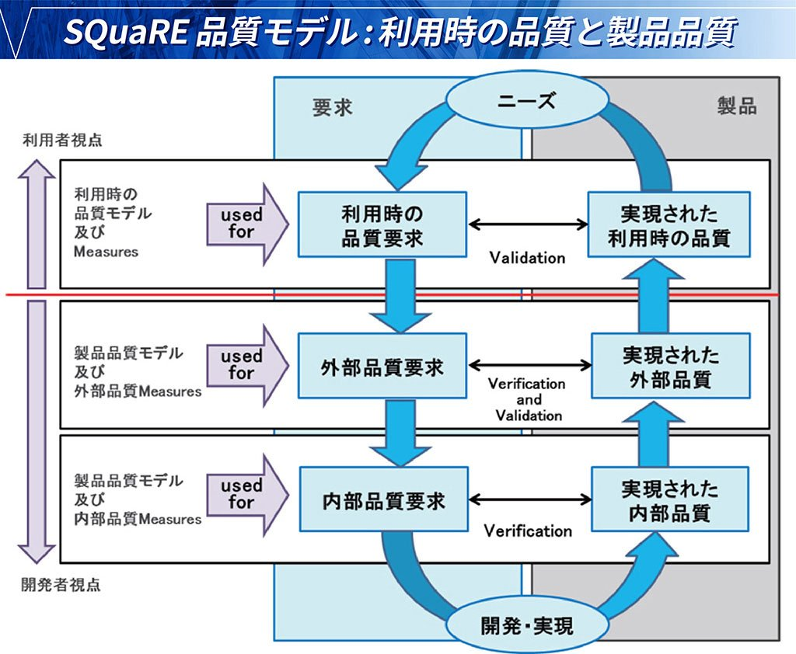
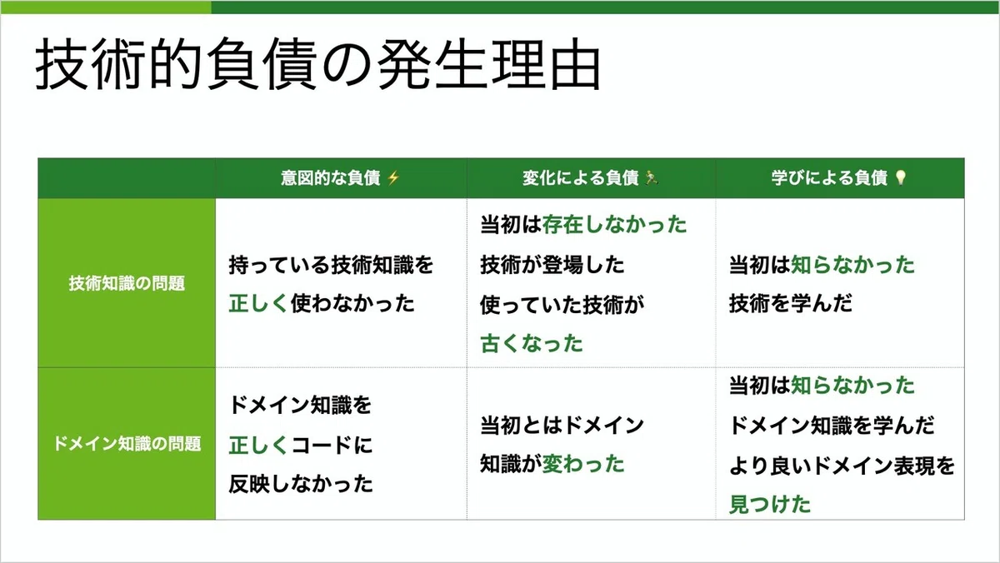

<!-- _class: lead -->

# ソフトウェアの質とデザインパターン入門

ソフトウェアの質とは何かを理解し、デザインパターンでよりよいコードを書く

---

## この講座の目的

- 前提として、ソフトウェアの質とは何かを理解する

  - 質とスピード
  - 外部品質と内部品質

- より良いコードを書くということの解像度を上げる

  - 凝集度と結合度
  - 原理と実践

- デザインパターンの基本的な概念を理解する
  - デザインパターンから実装背景がわかるようになる
  - デザインパターンを使ってよりよいコードを書くことができるようになる

---

## 目次 1 - ソフトウェアの質

1. ソフトウェアの質

   1. 質とスピード
   2. 外部品質と内部品質

1. より良いコードとは

   1. 凝集度と結合度
   1. 原理と実践

---

## 目次 2 - デザインパターン　 1

1. デザインパターンの基礎

   1. デザインパターンとは何か
   1. デザインパターンの利点と欠点
   1. GOF（Gang of Four）デザインパターンの紹介

1. 主要なデザインパターン

   1. 生成パターン
   1. 構造パターン
   1. 振る舞いパターン

---

## 目次 3 - デザインパターン　 2

3. デザインパターンの実践

   1. いつ適用するのか
   1. パターンの選択方法
   1. ハンズオン

4. モダンな開発環境におけるデザインパターン

   1. 関数型プログラミングにおけるデザインパターン
   1. アプリケーションアーキテクチャ/アーキテクチャパターン

---

## 1.1 ソフトウェアの質　 質とスピード

- QCDS のバランス

  - これらの要素はトレードオフの関係にある。本当か？

- 2 人で 10 ヶ月かかる仕事があります。10 人でやると何ヶ月で終わりますか？

  - 小学生の算数でよくありそうな問題。模範解答は`2ヶ月`
  - しかし、ソフトウェア開発ではこうはいかず、下手すれば期間はほとんど変わらない。
  - 人月の神話として知られる。[参考](https://qiita.com/hirokidaichi/items/7f7f7881acba9302301f)

- コストとスピード優先で！品質は後回しで！
  - この時失われる品質とは何？
  - 品質が失われるとどのような問題が発生するのか？

---

### 品質を表すものは多種多様

`Accessibility, Adaptability, Compatibility, Configurability, Exploitability, Extensibility, Flexibility, Functionality, Installability, Integrability, Internationalizability, Interoperability, Administrability, Analyzability, Learnability, Maintainability, Marketability, Maturity, Modifiability, Operability, Personalizability, Portability, Recoverability, Reliability, Auditability, Availability, Replaceability, Reusability, Scalability, Security, Sensitivity, Stability, Suitability, Supportability, Testability, Traceability, Calibrability, Changeability, Transactionality, Understandability, Upgradeability, Usability, ... and more`

---

- 「SQuaRE」モデルでは、品質は大きく「利用時の品質」と「製品品質」に分かれ、さらに製品品質は「内部品質」と「外部品質」に分かれる。



---

## 1.2 ソフトウェアの質　 外部品質と内部品質

- 外部品質

  - `正当性`, `有用性`, `効率性`など

- 内部品質

  - `保守性`, `柔軟性`, `可搬性`など

##### SQuaRE モデルにおいて、内部品質と外部品質は**原因と結果**の関係にある

```text
「ソフトウェアの品質を外部指標で特徴づける人は多い。正しいことをする、バグがない、速い、などだ。だが、それらはより深い原因の症状にすぎない。
本書で説明するソフトウェアの品質は内部品質である。内部品質を作り込んだ結果として、外部品質として定義される特性の実現に近づくことができる。内部品質は結果ではなく原因であり、良いソフトウェアが備えているべきものだ。」
『レガシーコードからの脱却』（David Scott Bernstein 著）
```

---

### 往々にしいて犠牲にされるのは内部品質

- なぜ内部品質が犠牲にされるのか？

  - 受益者は開発チーム自身であり、顧客・マネージャーに直接的な影響がない
  - スコープ・コスト・納期を動かさなくていい → 調整しなくて済むので短期的な速度が上がる

- 特に、内部品質の中でも`保守性`が犠牲にされるがち

  - モジュール性
  - 再利用性
  - 解析性 ≒ 理解容易性
  - 修正性 ≒ 変更容易性
  - 試験性 ≒ テスト容易性

- 保守性は次の開発コストに直結する

---

### 品質とスピードはトレードオフの関係ではない

- トレードオフではなく、（中長期では）正比例の関係にある

```
最高の開発者がいちばんきれい好きな開発者であることに気づいたとき、私はびっくりした。速いプログラマーは雑なプログラマーだと思っていたからだ。

だが、実際は正反対だった。私が会った中で最速のプログラマーは、コードを扱いやすいように保つことに特に注意を払っていた。

コードを書く速さとコードのきれいさに関連があると認識したあとでも、私はその2つの間の因果関係を見つけるのに時間を要した。

コードの品質を高く保っていた「にもかかわらず」速いのではない。コードの品質を高く保っていた「からこそ」速いのだ。

このことを理解したら、ソフトウェア開発に対する見方が変わった。

『レガシーコードからの脱却』（David Scott Bernstein 著）
```

---

### 保守性が悪いということ（技術的負債）

- 技術知識の問題
- ドメイン知識の問題



#### → 知識をつけることでしか保守性を上げられない

<!-- 発生する領域について、大きく２つに分けて技術知識の問題とドメイン知識の問題があります。技術知識の問題は使っている言語やフレームワーク、ライブラリ等で発生する問題です。もう一方のドメイン知識とは、プログラミングの対象の知識を指します。例えば、出前/宅配サービスを開発するためには、お店や配達員に関する知識が必要。また、ドメイン知識を正しく分析し、モデリングするスキルも必要。 -->

---

### 時間をかけるとよりよい品質が得られるのか？

> 品質は悪いと基本的に手戻りを生むので速度に跳ね返る。手戻っている時間は学びを生まない時間。品質を下げるという判断は学びの速度低下を許容するということ。
> 従来の鉄板（だと誤解されていた）だった「品質捨てて速度上げよう」は、品質は劣化すれば手戻りが発生するだけで、結局はリードタイムの増加に跳ね返るのでやめましょう。
> t-wada さんの知人

- ここでいう学びとは、仮説検証プロセスのこと
- 仮説検証プロセスを回さなければ、学びは生まれない
- どれだけ仮説検証プロセスを素早く円滑に回せるかどうかが競争力となる

---

### まとめ：　コストとスピード、 外部品質/内部品質

- 時間をかければ品質は上がるのか？

  - 品質とは？
    - 品質は外部品質と内部品質に分かれる
    - 内部品質は外部品質の原因である
    - 短期的な速度を上げるために犠牲にされるのは内部品質
  - スピードと品質はトレードオフではなく、正比例の関係にある
    - 内部品質を上げるには技術知識とドメイン知識が必要
    - 内部品質を上げるのは「知識」
    - 知識は仮説検証プロセスを円滑に回すことで得られる

---

## 2.1 より良いコードとは 凝集度と結合度

- より良いコード = （パフォーマンスがよく、）保守性が高いコード
  - モジュール性
  - 再利用性
  - 解析性 ≒ 理解容易性
  - 修正性 ≒ 変更容易性
  - 試験性 ≒ テスト容易性

これらの指標は関連しており、それぞれが他の指標に正の相関を持つ傾向にある
※ モジュール性: コードを独立した単位に分離できていること

---

## 凝集度と結合度　品質の指標

どのような状態であれば、保守性が高いと言えるのか？
モジュールの単位で考えた場合、凝集度と結合度という指標がある

- より良いモジュール： 凝集度が高い
- より良いモジュール間の関係: 結合度が低い
- より良いモジュール群: （クリーンアーキテクチャ、ドメイン駆動設計などのアプリケーションアーキテクチャに従う）

---

### 凝集度

全部で 7 つのレベル。下に行くほど凝集度が高いとされる。

- 偶発的凝集: **避けるべき**
- 論理的凝集: **できるだけ避けるべき**
- 時間的凝集: 小さく保つ
- 手続き的凝集: 小さく保つ
- 通信的凝集: 小さく保つ
- 逐次的凝集: 小さく保つ
- 機能的凝集: 理想

---

#### 偶発的凝集

- 何の関連もない要素が集められている
- 「なんかわからんがとりあえず動く」みたいな状態

```javascript
function process() {
  const data = fetchData();
  const temparature = getTemparature();
  sendPackage();
  buySumthing();
}
```

---

#### 論理的凝集

- 論理的凝集
  - 論理的に似て非なるものが集められている
  - DRY 原則を誤解してやりがち

```typescript
function process(flg: boolean) {
  const data = fetchData();
  preProcess(data);
  let result;
  if (flg) {
    result = processA(data);
  } else {
    result = processB(data);
  }
  if (result.length > 0) {
    // Bでしかそこらない
    postBProcess(data);
  }
  postProcess(data);
}
```

---

#### 時間的凝集

- 時間的に近く実行される処理が集められている
  - 実行順序は関係ない
  - 例えば、月次処理、年次処理など
  - 初期化処理、終了処理など

```typescript
function init() {
  // 初期化処理
  config();
  logger();
  connectDb();
}
```

---

#### 手続き的凝集

- 順番に実行される処理が集められている
  - 例えば、データの取得、データの加工、データの保存など

```typescript
function process(id: string) {
  getData(id);
  process(data);
  save(data);
}
```

---

#### 通信的凝集

- 同じデータを使っている処理が集められている

```typescript
function process(data: any) {
  processA(data);
  processB(data);
  processC(data);
}
```

---

#### 逐次的凝集

- ある部分の出力が別の部分の入力となるような処理が集められている

```typescript
function process(data: any) {
  const resultA = processA(data);
  const resultB = processB(resultA);
  const resultC = processC(resultB);
  return resultC;
}
```

---

#### 機能的凝集

- 単一の機能を実現する処理が集められている
- 例えば: 2 点間の距離を計算する

```typescript
function calculateDistance(pointA: Point, pointB: Point): number s {
  return Math.sqrt((pointA.x - pointB.x) ** 2 + (pointA.y - pointB.y) ** 2);
}
```

---

### クソデカ関数は凝集度が低い

- 一つの関数が複数の凝集度を持っている場合、一番低い凝集度として扱う
- 凝集度が低い関数の内容を小さく保つことが大切

---

### なんでも分ければいい、というわけではない

- 関数やクラスを分割することで、凝集度を高めることができる
- 一方で関数が複数に分割されることで`認知負荷`が増えることもある
- 必要に応じて分ければいい

---

### 結合度

---

## 2.2 より良いコードとは 原理と実践

- 原理(Principal)とは？
  - 原則は追い求めるべき理想
  - 例：投資における原則は：安く買って高く売る
  - 当然達成できないこともあるので、原則を目指して努力する
- 実践(Practice)とは？
  - 実際に行うことができること
  - プラクティスにより原則の達成に近づくことができる
  - 確立された方針や方法のこと
  - 例：投資における、ドルコスト平均法

<!-- ソフトウェア開発において知っている原則は？ -->

---

### ソフトウェア開発における原則

- **SOLID 原則**
  - 単一責務の原則(Single Responsibility Principle)
  - オープン・クローズドの原則(Open/Closed Principle)
  - リスコフの置換原則(Liskov Substitution Principle)
  - インターフェース分離の原則(Interface Segregation Principle)
  - 依存性逆転の原則(Dependency Inversion Principle)
- DRY 原則(Do not Repeat Yourself)
- KISS 原則(Keep It Simple, Stupid)
- YAGNI 原則(You Aren't Gonna Need It)
- etc

<!-- ソフトウェアにおけるプラクティスにはどのようなものがあるか？ -->

---

### ソフトウェア開発におけるプラクティス

- テスト駆動開発
- ペアプログラミング
- リファクタリング
- ドメイン駆動設計
- CI/CD
- デザインパターン
- クリーンアーキテクチャ

---

#### 単一責務の原則(Single Responsibility Principle)

---

#### オープン・クローズドの原則(Open/Closed Principle)

---

#### リスコフの置換原則(Liskov Substitution Principle)

---

#### インターフェース分離の原則(Interface Segregation Principle)

---

#### 依存性逆転の原則(Dependency Inversion Principle)

---

---
