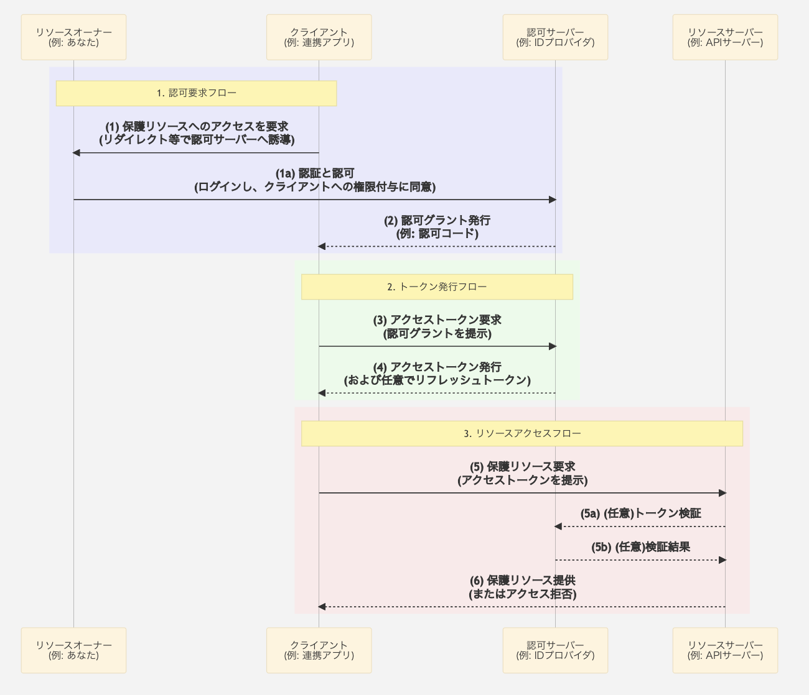

# 2. OAuth 2.0 基礎

## 2.1.　OAuth 2.0とは
この章では、OAuth 2.0 がどのような技術であり、なぜ現代のウェブサービスやアプリケーションにとって不可欠なのか、その基本的な概念と主要な用語について解説します。

## 2.1.1. OAuth 2.0 の登場背景と目的
OAuth 2.0 は、安全な「認証認可」を実現するためのオープンスタンダードなフレームワークです。

### 「認証認可」とは？

簡単に言うと、あなたが使っているあるサービス（例: 写真印刷サービスA）が、あなた(認証)の許可のもと(認可)で、あなたが利用している別のサービス（例: GoogleフォトやInstagram）に保存されているあなたのデータ（例: 写真）にアクセスする「権限」を、あなた自身のIDやパスワードをサービスAに直接教えることなく、安全に「委任」する仕組みです。

### なぜ OAuth 2.0 が必要なのか？ - 解決する課題

かつて、外部のアプリケーションがあなたのデータにアクセスするためには、あなたのIDとパスワードをそのアプリケーションに直接入力する必要がありました。
例えば、「カレンダーアプリX」に「Googleカレンダー」の予定を読み込ませたい場合、「カレンダーアプリX」にGoogleアカウントのIDとパスワードを預けるといった形です。

これには、以下のような深刻な問題点がありました。

1.パスワードの漏洩リスク
- 連携先のアプリケーションが悪意を持っていたり、セキュリティが脆弱だったりした場合、あなたのIDとパスワードが盗まれ、不正利用される危険性がありました。

2.過剰な権限付与
- IDとパスワードを渡してしまうと、アプリケーションはあなたが持つ全ての権限（例: メールの閲覧・送信、連絡先の編集、ファイルの削除など）を行使できてしまう可能性があります。連携に必要な最小限の権限だけを与えることが難しかったのです。

3.パスワード管理の煩雑さ
- もしメインサービスのパスワードを変更した場合、連携している全てのアプリケーションの設定を一つ一つ変更し直す必要があり、非常に手間がかかりました。
- 連携を解除したい場合も、アプリケーションがパスワードを保持し続けていないかという不安が残りました。

OAuth 2.0は、これらの問題を解決するために生まれました。ユーザーは、自分の認証情報（IDやパスワード）を信頼できないかもしれないサードパーティのアプリケーションに直接渡すことなく、特定のリソースへの限定的なアクセス権を安全に付与することができます。

### OAuth 2.0 の主なメリット

- セキュリティの向上: ユーザーのパスワードをクライアントアプリケーションに共有する必要がありません。
- 限定的なアクセス許可: クライアントアプリケーションに対し、本当に必要な権限（スコープ）だけを与えることができます（例: 「プロフィール情報の閲覧のみ許可し、投稿は許可しない」）。
- ユーザーエクスペリエンスの向上: ユーザーは一度認可すれば、サービスを利用するたびにIDとパスワードを入力する手間が省ける場合があります。
- 幅広い対応範囲: Webアプリケーションだけでなく、デスクトップアプリケーション、スマートフォンアプリ、さらにはIoTデバイスなど、様々な種類のクライアントに対応できるように設計されています。

## 2.1.2. OAuth 2.0 における主要な役割 (登場人物)
OAuth 2.0 の仕組みを理解するためには、まず以下の4つの主要な役割（登場人物）を知る必要があります。これらの役割が相互に連携することで、安全な委任認可が実現されます。

### リソースオーナー (Resource Owner)

保護されたリソース（情報や機能）の持ち主です。通常はエンドユーザー（あなた）を指します。
例: あなたの写真、あなたの連絡先リスト、あなたのメールデータなど。
クライアントに対して、自身のリソースへのアクセス権限を与えるかどうかを決定する人です。

### クライアント (Client)

- リソースオーナーの代わりに、保護されたリソースへアクセスしようとするアプリケーションです。
- 例: あなたのGoogleフォトの写真を使ってスライドショーを作成したい「スライドショー作成アプリ」、あなたのTwitterアカウント情報を使って連携したい「ゲームアプリ」など。

### 認可サーバー (Authorization Server)

- リソースオーナーを認証し、リソースオーナーからの同意（認可）を得た上で、クライアントに対してアクセストークン（リソースへアクセスするための鍵のようなもの）を発行するサーバーです。
- 多くの場合、リソースサーバーと同じ組織によって運営されたり、リソースサーバー自体がこの役割を兼ねたりします。

### リソースサーバー (Resource Server)

- 保護されたリソースを実際に保管・管理しているサーバーです。
- クライアントからアクセストークンを提示された際に、そのトークンを検証し、正当であればリソースへのアクセスを許可します。
- 例: Googleフォトのサーバー、Twitter APIサーバーなど。

これらの役割が、どのように連携して認可プロセスを進めていくのかが、OAuth 2.0 の核心となります。次のセクションで、これらの役割と具体的なフローについて詳しく見ていきましょう。

はい、承知いたしました。「2. 主要コンポーネントと役割」の講義資料を、発表構成案と資料構成案の双方を踏まえてMarkdown形式で作成します。

発表では図解を中心に簡潔に、資料では各役割をより詳細に説明することを意識します。

## 2.2.　主要コンポーネントと役割
OAuth 2.0 の世界では、いくつかの「登場人物」がそれぞれの役割を果たすことで、安全な連携が成り立っています。このセクションでは、その主要なコンポーネント（登場人物）とその役割、そしてそれらがどのように関わり合うのかを学びます。

## 2.2.1 全体像：コンポーネント間の関係
まず、OAuth 2.0 の主要な登場人物と、その基本的な関係性を見てみましょう。

## 2.2.2 各コンポーネントの詳細
それでは、各コンポーネントの役割を詳しく見ていきましょう。

1. リソースオーナー (Resource Owner)

一言で言うと: 保護された情報（リソース）の「持ち主」。
例えるなら: あなた自身（エンドユーザー）。

役割
- 自分自身のデータ（例: 写真、連絡先、カレンダーの予定など）を所有しています。
- クライアントアプリケーション（連携アプリ）に対して、自分のデータへのアクセス権限を「与える」か「与えない」かを決定する最終的な権限を持ちます。

具体例
- Googleアカウントの持ち主であるあなた。
- Facebookに写真をアップロードしているあなた。

2. クライアント (Client)

一言で言うと: リソースオーナーの代わりに、保護されたリソースへアクセスしようとする「アプリケーション」。
例えるなら: あなたが使う「連携アプリ」や「外部サービス」。

役割
- リソースオーナーの同意を得て、リソースサーバー上の情報にアクセスしようとします。
- 認可サーバーからアクセストークンを取得し、それを使ってリソースサーバーにリクエストを行います。

具体例
- あなたのGoogleカレンダーにアクセスして予定を読み書きする「〇〇カレンダーアプリ」。
- あなたのTwitterアカウント情報を使って新しい投稿をする「△△ゲームアプリ」。
- あなたのDropbox内のファイルにアクセスする「□□文書編集サービス」。

クライアントの種類 (Client Types) - (資料向け詳細情報、発表では軽く触れる程度)
OAuth 2.0 では、クライアントの特性に応じて主に2つのタイプが定義されます。これはセキュリティレベルに関わってきます。

コンフィデンシャルクライアント (Confidential Clients)
- クライアントシークレット（パスワードのようなもの）を安全に保持できるクライアント。
- 通常、サーバーサイドで動作するウェブアプリケーションなどが該当します。
- 例: PHPやJavaで構築されたバックエンドサーバーを持つウェブアプリ。

パブリッククライアント (Public Clients)
- クライアントシークレットを安全に保持できないクライアント。
- ブラウザ上で動作するJavaScriptアプリケーション（SPA）や、ネイティブモバイルアプリ、デスクトップアプリなどが該当します。
- 例: ReactやVue.jsで作成されたフロントエンドアプリ、iOS/Androidアプリ。
- パブリッククライアントの場合は、PKCE (Proof Key for Code Exchange) という仕組みを使ってセキュリティを高めることが推奨されます（詳細は後述のフローで）。

3. 認可サーバー (Authorization Server)
一言で言うと: リソースオーナーの「認証」と「同意の確認」を行い、クライアントに「アクセストークン」を発行するサーバー。
例えるなら: ユーザーの本人確認と権限付与を行う「関所」や「発行所」。

役割
- リソースオーナーの認証: リソースオーナーが本人であることを確認します（例: ID/パスワード入力、生体認証など）。
- リソースオーナーの同意取得: クライアントがどの情報にアクセスしようとしているか（スコープ）をリソースオーナーに提示し、許可を得ます。
- アクセストークンの発行: 認証と同意が成功したら、クライアントに対してアクセストークンを発行します。場合によってはリフレッシュトークンも発行します。

具体例
- Google Accounts (Googleのサービス連携時の認可サーバー)
- Facebook Login (Facebook連携時の認可サーバー)
- Auth0, Okta (IDaaSプロバイダーが提供する認可サーバー)
- 自社で構築した認可基盤

5. リソースサーバー (Resource Server)
一言で言うと: 保護された情報（リソース）を「実際に格納・提供」するサーバー。
例えるなら: あなたの貴重な情報が保管されている「金庫」や「データベース」。

役割
- アクセストークンの検証: クライアントからリクエストを受ける際に提示されたアクセストークンが正当なものか（有効期限内か、改ざんされていないか、必要な権限を持っているかなど）を検証します。
- リソースの提供: アクセストークンが有効であれば、クライアントに対して要求されたリソースへのアクセスを許可します。

具体例
- Google Calendar API (あなたのカレンダー情報を管理)
- Google Photos API (あなたの写真データを管理)
- Twitter API (あなたのツイートやユーザー情報を管理)
- 社内システムで保護されている顧客情報API

## 2.2.3 具体例で理解する：サービス連携の舞台裏
これらのコンポーネントが実際にどのように連携するのか、具体的な例で見てみましょう。

シナリオ: *「T写真加工アプリ」があなたの「Gドライブ」の写真を使ってコラージュを作成したい *

この場合、各コンポーネントは以下のようになります。

- リソースオーナー: あなた (Gドライブのアカウント所有者)
- クライアント: T写真加工アプリ (あなたのGドライブの写真にアクセスしたいアプリケーション)
- 認可サーバー: Gアカウントの認可サーバー (あなたが本人であること、そしてT写真加工アプリに写真へのアクセス権限を与えることを確認し、トークンを発行するサーバー)
- リソースサーバー: GドライブのAPIサーバー (あなたの写真データを実際に保持しており、T写真加工アプリからのリクエストに応じて写真データを提供するサーバー)

簡単な流れ（イメージ）
1. あなたは「T写真加工アプリ」上で「Gドライブと連携する」ボタンを押します。
2. 「T写真加工アプリ」（クライアント）は、あなたを「Gアカウントの認可サーバー」へ誘導します。
3. あなたは「Gアカウントの認可サーバー」でログイン（認証）し、「T写真加工アプリにGドライブの写真へのアクセスを許可しますか？」（同意）という画面で許可します。
4. 「Gアカウントの認可サーバー」は、「T写真加工アプリ」に対して「アクセストークン」（Gドライブの写真にアクセスするための鍵）を発行します。
5. 「T写真加工アプリ」は、その「アクセストークン」を使って「GドライブのAPIサーバー」（リソースサーバー）にあなたの写真を要求します。
6. 「GドライブのAPIサーバー」はアクセストークンを検証し、問題なければ写真を「T写真加工アプリ」に提供します。
7. 「T写真加工アプリ」は取得した写真を使ってコラージュを作成します。

まとめ
このセクションでは、OAuth 2.0 を構成する4つの主要なコンポーネント（リソースオーナー、クライアント、認可サーバー、リソースサーバー）と、それぞれの役割について学びました。これらの登場人物がどのように連携し、安全な委任認可を実現しているのかを理解することが、OAuth 2.0 の全体像を掴むための第一歩です。

次のセクションでは、これらのコンポーネントが具体的にどのような手順（フロー）でやり取りを行うのかを詳しく見ていきます。

