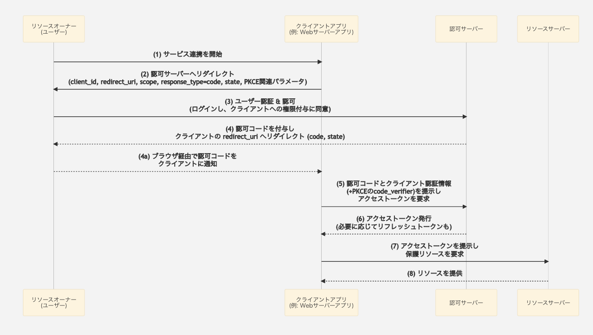
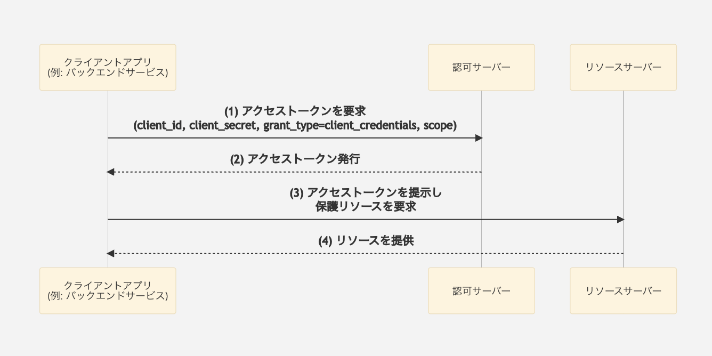

# 2. OAuth 2.0 基礎

## 2.1.　OAuth 2.0とは
この章では、OAuth 2.0 がどのような技術であり、なぜ現代のウェブサービスやアプリケーションにとって不可欠なのか、その基本的な概念と主要な用語について解説します。

## 2.1.1. OAuth 2.0 の登場背景と目的
OAuth 2.0 は、安全な「認証認可」を実現するためのオープンスタンダードなフレームワークです。

### 「認証認可」とは？

簡単に言うと、あなたが使っているあるサービス（例: 写真印刷サービスA）が、あなた(認証)の許可のもと(認可)で、あなたが利用している別のサービス（例: GoogleフォトやInstagram）に保存されているあなたのデータ（例: 写真）にアクセスする「権限」を、あなた自身のIDやパスワードをサービスAに直接教えることなく、安全に「委任」する仕組みです。

### なぜ OAuth 2.0 が必要なのか？ - 解決する課題

かつて、外部のアプリケーションがあなたのデータにアクセスするためには、あなたのIDとパスワードをそのアプリケーションに直接入力する必要がありました。
例えば、「カレンダーアプリX」に「Googleカレンダー」の予定を読み込ませたい場合、「カレンダーアプリX」にGoogleアカウントのIDとパスワードを預けるといった形です。

これには、以下のような深刻な問題点がありました。

1.パスワードの漏洩リスク
- 連携先のアプリケーションが悪意を持っていたり、セキュリティが脆弱だったりした場合、あなたのIDとパスワードが盗まれ、不正利用される危険性がありました。

2.過剰な権限付与
- IDとパスワードを渡してしまうと、アプリケーションはあなたが持つ全ての権限（例: メールの閲覧・送信、連絡先の編集、ファイルの削除など）を行使できてしまう可能性があります。連携に必要な最小限の権限だけを与えることが難しかったのです。

3.パスワード管理の煩雑さ
- もしメインサービスのパスワードを変更した場合、連携している全てのアプリケーションの設定を一つ一つ変更し直す必要があり、非常に手間がかかりました。
- 連携を解除したい場合も、アプリケーションがパスワードを保持し続けていないかという不安が残りました。

OAuth 2.0は、これらの問題を解決するために生まれました。ユーザーは、自分の認証情報（IDやパスワード）を信頼できないかもしれないサードパーティのアプリケーションに直接渡すことなく、特定のリソースへの限定的なアクセス権を安全に付与することができます。

### OAuth 2.0 の主なメリット

- セキュリティの向上: ユーザーのパスワードをクライアントアプリケーションに共有する必要がありません。
- 限定的なアクセス許可: クライアントアプリケーションに対し、本当に必要な権限（スコープ）だけを与えることができます（例: 「プロフィール情報の閲覧のみ許可し、投稿は許可しない」）。
- ユーザーエクスペリエンスの向上: ユーザーは一度認可すれば、サービスを利用するたびにIDとパスワードを入力する手間が省ける場合があります。
- 幅広い対応範囲: Webアプリケーションだけでなく、デスクトップアプリケーション、スマートフォンアプリ、さらにはIoTデバイスなど、様々な種類のクライアントに対応できるように設計されています。

## 2.1.2. OAuth 2.0 における主要な役割 (登場人物)
OAuth 2.0 の仕組みを理解するためには、まず以下の4つの主要な役割（登場人物）を知る必要があります。これらの役割が相互に連携することで、安全な委任認可が実現されます。

### リソースオーナー (Resource Owner)

保護されたリソース（情報や機能）の持ち主です。通常はエンドユーザー（あなた）を指します。
例: あなたの写真、あなたの連絡先リスト、あなたのメールデータなど。
クライアントに対して、自身のリソースへのアクセス権限を与えるかどうかを決定する人です。

### クライアント (Client)

- リソースオーナーの代わりに、保護されたリソースへアクセスしようとするアプリケーションです。
- 例: あなたのGoogleフォトの写真を使ってスライドショーを作成したい「スライドショー作成アプリ」、あなたのTwitterアカウント情報を使って連携したい「ゲームアプリ」など。

### 認可サーバー (Authorization Server)

- リソースオーナーを認証し、リソースオーナーからの同意（認可）を得た上で、クライアントに対してアクセストークン（リソースへアクセスするための鍵のようなもの）を発行するサーバーです。
- 多くの場合、リソースサーバーと同じ組織によって運営されたり、リソースサーバー自体がこの役割を兼ねたりします。

### リソースサーバー (Resource Server)

- 保護されたリソースを実際に保管・管理しているサーバーです。
- クライアントからアクセストークンを提示された際に、そのトークンを検証し、正当であればリソースへのアクセスを許可します。
- 例: Googleフォトのサーバー、Twitter APIサーバーなど。

これらの役割が、どのように連携して認可プロセスを進めていくのかが、OAuth 2.0 の核心となります。次のセクションで、これらの役割と具体的なフローについて詳しく見ていきましょう。

はい、承知いたしました。「2. 主要コンポーネントと役割」の講義資料を、発表構成案と資料構成案の双方を踏まえてMarkdown形式で作成します。

発表では図解を中心に簡潔に、資料では各役割をより詳細に説明することを意識します。

## 2.2.　主要コンポーネントと役割
OAuth 2.0 の世界では、いくつかの「登場人物」がそれぞれの役割を果たすことで、安全な連携が成り立っています。このセクションでは、その主要なコンポーネント（登場人物）とその役割、そしてそれらがどのように関わり合うのかを学びます。

## 2.2.1 全体像：コンポーネント間の関係
まず、OAuth 2.0 の主要な登場人物と、その基本的な関係性を見てみましょう。

## 2.2.2 各コンポーネントの詳細
それでは、各コンポーネントの役割を詳しく見ていきましょう。

### 1. リソースオーナー (Resource Owner)

一言で言うと: 保護された情報（リソース）の「持ち主」。
例えるなら: あなた自身（エンドユーザー）。

役割
- 自分自身のデータ（例: 写真、連絡先、カレンダーの予定など）を所有しています。
- クライアントアプリケーション（連携アプリ）に対して、自分のデータへのアクセス権限を「与える」か「与えない」かを決定する最終的な権限を持ちます。

具体例
- Googleアカウントの持ち主であるあなた。
- Facebookに写真をアップロードしているあなた。

### 2. クライアント (Client)

一言で言うと: リソースオーナーの代わりに、保護されたリソースへアクセスしようとする「アプリケーション」。
例えるなら: あなたが使う「連携アプリ」や「外部サービス」。

役割
- リソースオーナーの同意を得て、リソースサーバー上の情報にアクセスしようとします。
- 認可サーバーからアクセストークンを取得し、それを使ってリソースサーバーにリクエストを行います。

具体例
- あなたのGoogleカレンダーにアクセスして予定を読み書きする「〇〇カレンダーアプリ」。
- あなたのTwitterアカウント情報を使って新しい投稿をする「△△ゲームアプリ」。
- あなたのDropbox内のファイルにアクセスする「□□文書編集サービス」。

#### クライアントの種類 (Client Types)
OAuth 2.0 では、クライアントの特性に応じて主に2つのタイプが定義されます。これはセキュリティレベルに関わってきます。

コンフィデンシャルクライアント (Confidential Clients)
- クライアントシークレット（パスワードのようなもの）を安全に保持できるクライアント。
- 通常、サーバーサイドで動作するウェブアプリケーションなどが該当します。
- 例: PHPやJavaで構築されたバックエンドサーバーを持つウェブアプリ。

パブリッククライアント (Public Clients)
- クライアントシークレットを安全に保持できないクライアント。
- ブラウザ上で動作するJavaScriptアプリケーション（SPA）や、ネイティブモバイルアプリ、デスクトップアプリなどが該当します。
- 例: ReactやVue.jsで作成されたフロントエンドアプリ、iOS/Androidアプリ。
- パブリッククライアントの場合は、PKCE (Proof Key for Code Exchange) という仕組みを使ってセキュリティを高めることが推奨されます（詳細は後述のフローで）。

### 3. 認可サーバー (Authorization Server)
一言で言うと: リソースオーナーの「認証」と「同意の確認」を行い、クライアントに「アクセストークン」を発行するサーバー。
例えるなら: ユーザーの本人確認と権限付与を行う「関所」や「発行所」。

役割
- リソースオーナーの認証: リソースオーナーが本人であることを確認します（例: ID/パスワード入力、生体認証など）。
- リソースオーナーの同意取得: クライアントがどの情報にアクセスしようとしているか（スコープ）をリソースオーナーに提示し、許可を得ます。
- アクセストークンの発行: 認証と同意が成功したら、クライアントに対してアクセストークンを発行します。場合によってはリフレッシュトークンも発行します。

具体例
- Google Accounts (Googleのサービス連携時の認可サーバー)
- Facebook Login (Facebook連携時の認可サーバー)
- Auth0, Okta (IDaaSプロバイダーが提供する認可サーバー)
- 自社で構築した認可基盤

### 4. リソースサーバー (Resource Server)
一言で言うと: 保護された情報（リソース）を「実際に格納・提供」するサーバー。
例えるなら: あなたの貴重な情報が保管されている「金庫」や「データベース」。

役割
- アクセストークンの検証: クライアントからリクエストを受ける際に提示されたアクセストークンが正当なものか（有効期限内か、改ざんされていないか、必要な権限を持っているかなど）を検証します。
- リソースの提供: アクセストークンが有効であれば、クライアントに対して要求されたリソースへのアクセスを許可します。

具体例
- Google Calendar API (あなたのカレンダー情報を管理)
- Google Photos API (あなたの写真データを管理)
- Twitter API (あなたのツイートやユーザー情報を管理)
- 社内システムで保護されている顧客情報API

## 2.2.3 具体例で理解する：サービス連携の舞台裏
これらのコンポーネントが実際にどのように連携するのか、具体的な例で見てみましょう。

シナリオ: *「T写真加工アプリ」があなたの「Gドライブ」の写真を使ってコラージュを作成したい*

この場合、各コンポーネントは以下のようになります。

- リソースオーナー: あなた (Gドライブのアカウント所有者)
- クライアント: T写真加工アプリ (あなたのGドライブの写真にアクセスしたいアプリケーション)
- 認可サーバー: Gアカウントの認可サーバー (あなたが本人であること、そしてT写真加工アプリに写真へのアクセス権限を与えることを確認し、トークンを発行するサーバー)
- リソースサーバー: GドライブのAPIサーバー (あなたの写真データを実際に保持しており、T写真加工アプリからのリクエストに応じて写真データを提供するサーバー)

簡単な流れ（イメージ）
1. あなたは「T写真加工アプリ」上で「Gドライブと連携する」ボタンを押します。
2. 「T写真加工アプリ」（クライアント）は、あなたを「Gアカウントの認可サーバー」へ誘導します。
3. あなたは「Gアカウントの認可サーバー」でログイン（認証）し、「T写真加工アプリにGドライブの写真へのアクセスを許可しますか？」（同意）という画面で許可します。
4. 「Gアカウントの認可サーバー」は、「T写真加工アプリ」に対して「アクセストークン」（Gドライブの写真にアクセスするための鍵）を発行します。
5. 「T写真加工アプリ」は、その「アクセストークン」を使って「GドライブのAPIサーバー」（リソースサーバー）にあなたの写真を要求します。
6. 「GドライブのAPIサーバー」はアクセストークンを検証し、問題なければ写真を「T写真加工アプリ」に提供します。
7. 「T写真加工アプリ」は取得した写真を使ってコラージュを作成します。

まとめ
このセクションでは、OAuth 2.0 を構成する4つの主要なコンポーネント（リソースオーナー、クライアント、認可サーバー、リソースサーバー）と、それぞれの役割について学びました。これらの登場人物がどのように連携し、安全な委任認可を実現しているのかを理解することが、OAuth 2.0 の全体像を掴むための第一歩です。

次のセクションでは、これらのコンポーネントが具体的にどのような手順（フロー）でやり取りを行うのかを詳しく見ていきます。

## 2.3. 代表的な認可フロー
OAuth 2.0 は、クライアントの種類やユースケースに応じて、いくつかの「認可フロー」を定義しています。このセクションでは、特に重要で代表的なフローについて、その仕組みと使われる場面を学びます。

## 2.3.1. Authorization Code Flow (認可コードフロー)

### 概要
認可コードフローは、ユーザーが介在するウェブアプリケーション（特にサーバーサイドで処理を行うConfidential Client）において、最も一般的で安全性の高いフローとされています。ユーザーの認証情報をクライアントに直接渡すことなく、認可サーバーから「認可コード」という一時的なコードを取得し、それを使ってバックエンドで安全に「アクセストークン」を取得します。

### なぜこのフローが重要か？
- セキュリティ: ユーザーのパスワードがクライアントに渡らない。アクセストークンもブラウザの履歴に残りにくい。
- ユーザーの明確な同意: ユーザーが認可サーバー上で直接、どの権限を許可するかを操作できる。
- サーバーサイドアプリの標準: 多くのウェブサービス連携の基本形。

### シーケンス図

#### ステップ解説

1. サービス連携を開始:
ユーザーがクライアントアプリケーション（例: あるウェブサービス）上で、外部サービス（例: Google, Facebook）との連携を開始する操作を行います（例: 「Googleでログイン」ボタンをクリック）。

2. 認可サーバーへリダイレクト:
クライアントは、ユーザーのブラウザを認可サーバーへリダイレクトさせます。このとき、以下の情報をクエリパラメータとして渡します。

- response_type=code: 認可コードを要求することを示します。
- client_id: クライアントの識別子。
- redirect_uri: 認可コードを受け取るクライアント側のURI。事前に登録が必要です。
- scope: 要求する権限の範囲（例: profile email）。
- state: CSRF（クロスサイトリクエストフォージェリ）攻撃を防ぐためのランダムな文字列。クライアントが生成し、後に検証します。

3. ユーザー認証 & 認可
ユーザーは認可サーバーの画面で、自身の認証情報（例: ID/パスワード）を入力してログインします。その後、クライアントが要求している権限（スコープ）を確認し、アクセスを許可するかどうかを決定（同意）します。

4. 認可コードを付与しリダイレクト (4a含む):
認可サーバーは、ユーザーの同意が得られると、一時的な認可コードを生成します。そして、ユーザーのブラウザを、ステップ(2)で指定されたクライアントの redirect_uri へリダイレクトさせます。このとき、認可コードと state 値（クライアントが送ったものと同じ値）がクエリパラメータとして渡されます。

5. アクセストークンを要求
クライアント（のバックエンドサーバー）は、受け取った認可コード、redirect_uri、そして自身のクライアントIDとクライアントシークレット（Confidential Clientの場合）を使って、認可サーバーのトークンエンドポイントにアクセストークンを要求します。

- PKCE (Proof Key for Code Exchange) の利用: パブリッククライアント（モバイルアプリやSPAなど、クライアントシークレットを安全に保持できないクライアント）の場合、認可コードの横取り攻撃を防ぐためにPKCEの利用が強く推奨（OAuth 2.1では必須）されます。
- ステップ(2)で code_challenge（code_verifier から生成したチャレンジ文字列）を送信。
- ステップ(5)で code_verifier（クライアントが生成した秘密の文字列）を送信。
- 認可サーバーはこれらを検証し、正当なクライアントからのリクエストであることを確認します。

6. アクセストークン発行
認可サーバーは、認可コードやクライアント認証情報を検証し、問題がなければアクセストークン（および任意でリフレッシュトークン）を発行してクライアントに応答します。

7. 保護リソースを要求
クライアントは、取得したアクセストークンを使って、リソースサーバーに保護されたリソースを要求します。通常、HTTPリクエストの Authorization ヘッダーに Bearer <アクセストークン> の形式で含めます。

8. リソースを提供
リソースサーバーは、アクセストークンを検証し、有効であれば要求されたリソースをクライアントに返します。

#### ユースケース

- ユーザーがログインするWebアプリケーション（例: 「Googleでログイン」機能）。
- ユーザーの許可を得て、外部サービスのAPIを利用するWebアプリケーション（例: あなたのカレンダーに予定を書き込むアプリ）。

#### キーポイント
- ユーザーが直接関与し、同意を与える。
- 認可コードという中間ステップを挟むことで、アクセストークンがブラウザの履歴などに残るリスクを低減。
- Confidential Client (サーバーサイドアプリ) での利用が基本だが、PKCEの登場によりPublic Client (SPA、モバイルアプリ) でも安全に利用可能になった。

## 2.3.2. Client Credentials Flow (クライアントクレデンシャルグラント)

### 概要
クライアントクレデンシャルグラントフローは、クライアントアプリケーション自身がリソースオーナーである場合、つまりユーザーの介在なしに、クライアントが自身の管理下にあるリソースや、クライアント自身に許可されたサービスへアクセスする場合に使用されます。サーバー間通信 (M2M) に適しています。

### なぜこのフローが重要か？
- マシン対マシン (M2M) 通信の標準化: クライアントアプリケーション（例: バックエンドサーバー、バッチ処理システム）が、ユーザーの介在なしに、自身の権限でリソースサーバーへアクセスするための明確で安全な方法を提供します。これは、マイクロサービスアーキテクチャや自動化されたプロセスにおいて不可欠です。
- 自律的なクライアント操作: クライアントが「自分自身として」動作し、自身が管理するリソースにアクセスしたり、自身に許可された操作（例: APIへの定期的なデータ送信、サービス設定の更新など）を実行する場合に最適です。
- シンプルさと効率性: ユーザーの認証や同意のステップが存在しないため、フローが非常にシンプルです。プログラムによる自動化に適しており、効率的な連携を実現します。
- 責任範囲の明確化: このフローで発行されるアクセストークンは、特定のユーザーではなくクライアント自身に関連付けられるため、APIアクセスにおける責任の所在が明確になります。

### シーケンス図

### ステップ解説

1. アクセストークンを要求
クライアントは、自身のクライアントID、クライアントシークレット、および grant_type=client_credentials を認可サーバーのトークンエンドポイントに直接送信し、アクセストークンを要求します。必要に応じて scope も指定できます。このフローではユーザーは一切関与しません。

2. アクセストークン発行
認可サーバーは、クライアントの認証情報（クライアントIDとシークレット）を検証し、正当であればアクセストークンを発行します。このフローでは通常リフレッシュトークンは発行されません（アクセストークンが必要になる都度、このフローで再取得します）。

3. 保護リソースを要求
クライアントは、取得したアクセストークンを使って、リソースサーバーに保護されたリソースを要求します。

4. リソースを提供
リソースサーバーは、アクセストークンを検証し、有効であれば要求されたリソースをクライアントに返します。

### ユースケース

- マイクロサービスアーキテクチャにおける内部サービス間の認証・認可。
- バッチ処理やデーモンプロセスが、外部のAPI（例: 支払いAPI、分析API）にアクセスする場合。
- クライアントが自身で管理するデータ（例: アプリケーションの設定情報、統計データ）にAPI経由でアクセスする場合。

### キーポイント

- ユーザーは介在しない。
- クライアントが自身の認証情報（クライアントID/シークレット）を使って直接トークンを取得。
- 主にサーバー間の信頼された通信で使用される。

## 2.3.3. Device Authorization Flow (デバイス認可グラント)

### 概要
デバイス認可グラントフロー（またはデバイスフロー）は、キーボードやブラウザなどの入力機能が制限されているデバイス（例: スマートTV、ゲーム機、IoTデバイス）が、ユーザーの許可を得てリソースにアクセスするために設計されたフローです。ユーザーはスマートフォンやPCなど、より入力に適した別のデバイスを使って認可を行います。

### なぜこのフローが重要か？
- 入力が困難なデバイスの救世主: スマートTV、ゲーム機、IoTデバイス、CLI（コマンドラインインターフェース）ツールなど、キーボード入力が煩雑だったり、ブラウザを搭載していなかったりするデバイスでも、OAuth 2.0による安全な認可を実現できる点が最大の重要性です。これらのデバイスでユーザーのパスワードを直接入力させるのはセキュリティリスクが高く、ユーザー体験も損ないます。
- ユーザー体験の向上: ユーザーは、使い慣れたスマートフォンやPCといったセカンダリデバイスのブラウザを使って、簡単かつ安全に認証・認可操作を行えます。デバイス本体での面倒な操作が不要になります。
-  OAuth 2.0の適用範囲拡大: このフローの存在により、OAuth 2.0を利用できるアプリケーションやサービスの幅が大きく広がりました。多様なデバイスがセキュアに連携するための道筋を提供しています。
-  セキュリティの維持: ユーザーの認証情報を入力制限のあるデバイスに直接渡すことなく、アクセストークンを取得できるため、セキュリティレベルを維持したまま連携が可能です。

### ユースケース
- スマートTV、ストリーミングデバイス（Apple TV, Chromecastなど）
- ゲームコンソール
- プリンター、デジタルサイネージなどのIoTデバイス
- コマンドラインインターフェース (CLI) ツール

### キーポイント
- ブラウザや高度な入力機能を持たないデバイス向け。
- ユーザーはPCやスマートフォンなど、別のデバイスを使って認証・認可を行う。
- デバイスは認可サーバーに定期的にポーリングしてトークン発行を待つ。

## 2.3.4. フロー選択の判断基準
どの認可フローを選択するかは、アプリケーションの特性やセキュリティ要件によって異なります。
以下は、フロー選択の際の主な判断基準です。

### 選択のヒント

- ユーザーが操作するWebアプリケーション (サーバーあり): ➡️ Authorization Code Flow (クライアントはConfidential)
- ユーザーが操作するSPA (Single Page Application) やモバイルネイティブアプリ: ➡️ Authorization Code Flow + PKCE (クライアントはPublic)
- サーバー間 (M2M) 通信、バッチ処理など (ユーザー介在なし): ➡️ Client Credentials Flow
- スマートTV、ゲーム機、CLIツールなど、入力が困難なデバイス: ➡️ Device Authorization Flow

## 2.4. スコープとパーミッション
OAuth 2.0において、スコープ (Scope) は、クライアントアプリケーションがリソースサーバー上の保護されたリソースに対して要求するアクセス権限の範囲を定義する非常に重要な概念です。
これにより、リソースオーナー（ユーザー）は、クライアントにどのような操作を許可するかを細かく制御できます。

## 2.4.1. スコープとは？
簡単に言うと、スコープは「クライアントが何をどこまでやって良いか」を示す許可証の種類のようなものです。
クライアントは認可を要求する際に、必要とするスコープを具体的に指定します。

### 主な特徴
- 文字列で表現: 通常、スペースで区切られた文字列として表現されます (例: profile openid email calendar.readonly)。
- 認可サーバーが定義: 利用可能なスコープとその意味は、各認可サーバー（サービス提供者）によって定義されます。
- ユーザーの同意対象: リソースオーナーは、クライアントが要求しているスコープを確認し、それに対して同意または拒否をします。

### 具体例
クライアントが要求できる権限の範囲の例です。
- profile: ユーザーの基本的なプロフィール情報（名前、ニックネーム、プロフィール写真など）への読み取りアクセスを要求します。
- email: ユーザーのメールアドレスへの読み取りアクセスを要求します。
- openid: (OpenID Connectで使われるスコープ) ユーザー認証に関する情報を要求します。
- read_stream や user_posts: (例: SNSサービス) ユーザーの投稿フィードの読み取りを要求します。
- publish_stream や create_post: (例: SNSサービス) ユーザーに代わって投稿する権限を要求します。
- calendar.readonly: カレンダーの予定の読み取り専用アクセスを要求します。
- calendar.readwrite: カレンダーの予定の読み書きアクセスを要求します。
- files.read.all: 全てのファイルへの読み取りアクセスを要求します。
- files.read.specific_folder: 特定のフォルダ内のファイルのみ読み取りアクセスを要求します。
- send_email: ユーザーに代わってメールを送信する権限を要求します。
- クライアントは、これらのスコープを組み合わせて要求することができます。例えば、「プロフィール情報を読み取り、メールアドレスも取得したい」場合は profile email のように指定します。

## 2.4.2. 最小権限の原則 (Principle of Least Privilege) の重要性
OAuth 2.0のスコープを扱う上で、最小権限の原則を理解し適用することは極めて重要です。

### 最小権限の原則とは？

アプリケーションやプロセスには、そのタスクを実行するために必要最小限の権限のみを与えるべきであるというセキュリティの基本原則です。

### なぜスコープにおいて重要なのか？
- セキュリティリスクの低減: もしクライアントアプリケーションが必要以上の広範なスコープ（例えば、全データへのフルアクセス権限）を要求し、万が一そのクライアントのアクセストークンが漏洩した場合、被害が甚大になります。必要最小限のスコープ（例：「プロフィール読み取りのみ」）であれば、トークンが漏洩しても影響範囲を限定できます。
- ユーザーの信頼向上: ユーザーは、アプリケーションが自分のデータに対して何をしようとしているのかをスコープを通じて確認します。不必要に多くの権限を要求するアプリケーションは、ユーザーに警戒感を与え、同意を得られにくくなります。適切なスコープ設定は、ユーザーからの信頼を得るために不可欠です。
- 意図しない操作の防止: クライアントが持つ権限を最小限に絞ることで、バグや意図しない動作によってユーザーデータが誤って変更されたり削除されたりするリスクを減らします。

### クライアント開発者の責任
クライアントアプリケーションの開発者は、アプリケーションの機能を実現するために本当に必要な権限だけをスコープとして要求するように設計すべきです。
例えば、単にユーザーの名前を表示したいだけなのに、メール送信権限や全ファイルアクセス権限を要求するのは不適切です。

## 2.6. セキュリティ上の考慮事項
OAuth 2.0 はセキュアな委任認可を実現するためのフレームワークですが、その実装や運用においてセキュリティ上の注意点を理解し、正しく対策を講じることが不可欠です。ここでは特に重要なポイントを3点に絞って解説します。

## 2.6.1. リダイレクトURIの検証の重要性

### なぜ重要か？
認可サーバーは、認証・認可後、ユーザーをクライアントが指定したリダイレクトURIに送り返し、その際に認可コードや（Implicit Flowの場合）アクセストークンを渡します。
このリダイレクトURIの検証が不十分だと、攻撃者が不正なリダイレクトURIを指定することで、これらの重要な情報を盗み取ることが可能になってしまいます（Open Redirector攻撃の悪用）。

### 対策
- 事前登録と完全一致: クライアント登録時にリダイレクトURIを事前に登録させ、認可リクエスト時のリダイレクトURIが登録されたものと完全一致することを確認します。
- ワイルドカードの利用は慎重に: ドメインやパスのワイルドカード指定は、意図しないリダイレクト先を許可してしまうリスクがあるため、極力避け、使用する場合は範囲を厳格に制限します。

## 2.6.2. state パラメータによるCSRF対策
### CSRF (クロスサイトリクエストフォージェリ) とは？: 攻撃者が、ユーザーが意図しないリクエスト（この場合は認可リクエスト）を認可サーバーに送信させてしまう攻撃です。ユーザーが既に認可サーバーにログイン済みの場合、気づかないうちにクライアントに意図しない権限を与えてしまう可能性があります。
### state パラメータによる対策
- クライアントは認可リクエストを送信する際、推測困難なランダムな文字列（state 値）を生成し、リクエストに含めます。この値をセッションなどに一時保存しておきます。
- 認可サーバーは、リダイレクトURIにこの state 値をそのまま含めてクライアントに返します。
- クライアントは、返却された state 値と、事前に保存しておいた state 値を比較します。
- これらが一致すれば正当なリクエストと判断し、一致しなければCSRF攻撃の可能性があるとしてリクエストを拒否します。

## 2.6.3. アクセストークンの漏洩対策
アクセストークンはリソースへのアクセス権そのものであるため、これが漏洩すると深刻な被害につながります。
- HTTPS通信の徹底: クライアント、認可サーバー、リソースサーバー間の全ての通信（特にトークンの送受信）は必ずTLS (HTTPS) で暗号化します。これにより、通信経路上での盗聴を防ぎます。
- アクセストークンの有効期間を短く: アクセストークンの有効期間は必要最小限に短く設定します（例: 数分～1時間程度）。万が一漏洩しても、利用できる時間が限られるため被害を抑えられます。有効期間が短いトークンは、リフレッシュトークンを使って再発行します。
- Bearer Token の取り扱い注意: デフォルトで使われる Bearer Token は、そのトークンを持っているだけで誰でもリソースにアクセスできてしまうため、特に送信時や保存時の取り扱いに注意が必要です。
- ブラウザのストレージ（LocalStorageなど）への保存はXSS攻撃のリスクがあるため慎重に検討し、代替手段（メモリ上、HttpOnly Cookieなど）も考慮します。

## 2.7. まとめ

## 2.7.1. OAuth 2.0のメリット
OAuth 2.0の最大のメリットは、やはり以下のような**「セキュアな権限委譲」**を実現できる点です。
- ユーザーは自身のIDやパスワードをサードパーティアプリケーションに直接渡す必要がありません。
- アプリケーションが必要とする権限の範囲（スコープ）を細かく制御できます。
- これにより、利便性を損なわずに、ユーザーのデータとアカウントの安全性を高めることができます。

## 2.7.2. 今後の学習ポイント
OAuthの世界は進化を続けています。より深く理解するために、以下のトピックに注目すると良い!

### OpenID Connect (OIDC)
- OAuth 2.0の上に構築された認証プロトコルです。
- OAuth 2.0が「認可」（何ができるか）を扱うのに対し、OIDCは「認証」（誰であるか）を扱います。
- IDトークンという特別なトークンを使い、ユーザーの身元情報（例: 名前、メールアドレス）を安全にクライアントに連携します。「ソーシャルログイン」機能の多くはOIDCを利用しています。

### OAuth 2.1
OAuth 2.0 の発行から約10年が経過し、その間に多くのベストプラクティス (BCP) や拡張仕様 (RFC) が登場しました。OAuth 2.1 は、これらの知見を集約し、OAuth 2.0 をよりシンプルかつセキュアにするための次世代仕様です。
OAuth 2.1 は、既存のOAuth 2.0の複雑さを減らし、セキュリティをデフォルトで高めることを目的としており、今後の新規実装ではOAuth 2.1を意識することが推奨されます。

#### 主な変更点・目指す方向性
- 廃止される仕様: セキュリティ上の懸念がある古いフロー（Implicit Grant、Resource Owner Password Credentials Grant）は廃止されます。
- PKCEの必須化: Authorization Code Flow を利用する全てのクライアント（PublicだけでなくConfidentialも含む）でPKCE (Proof Key for Code Exchange) の利用が必須となります。これにより認可コード横取り攻撃への耐性が向上します。
- リダイレクトURIの厳格化: リダイレクトURIの完全一致がより強く推奨・要求されます。
- Bearer Tokenの取り扱いの明確化: Bearer Tokenの送信方法に関する規定がより明確になります。
- その他: 複数のRFCに分散していた推奨事項を統合し、開発者がより安全な実装を行いやすくすることを目指しています。
