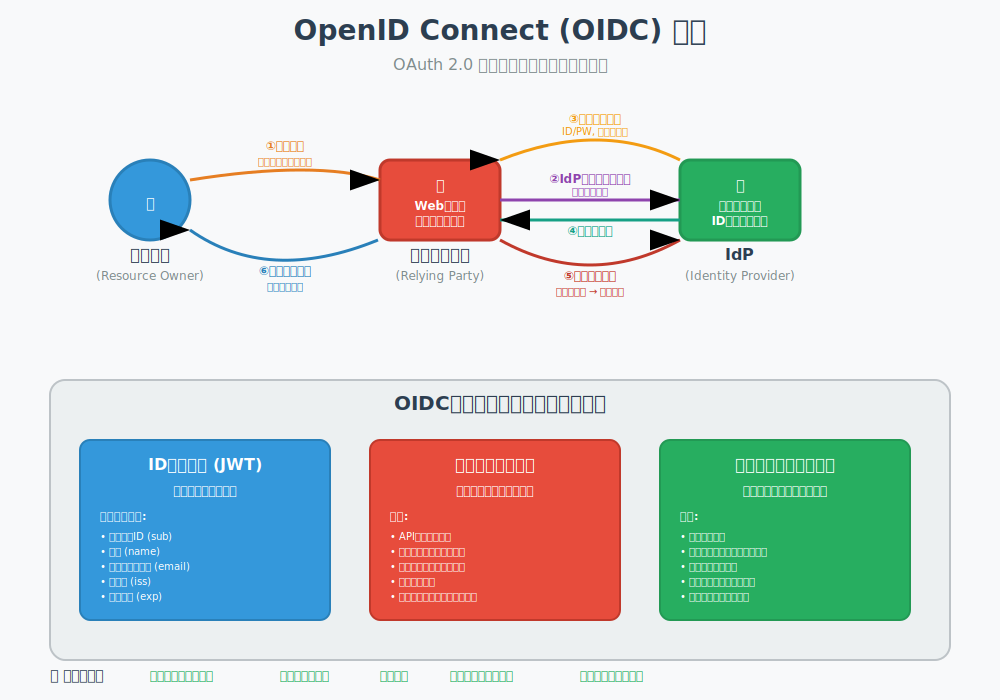
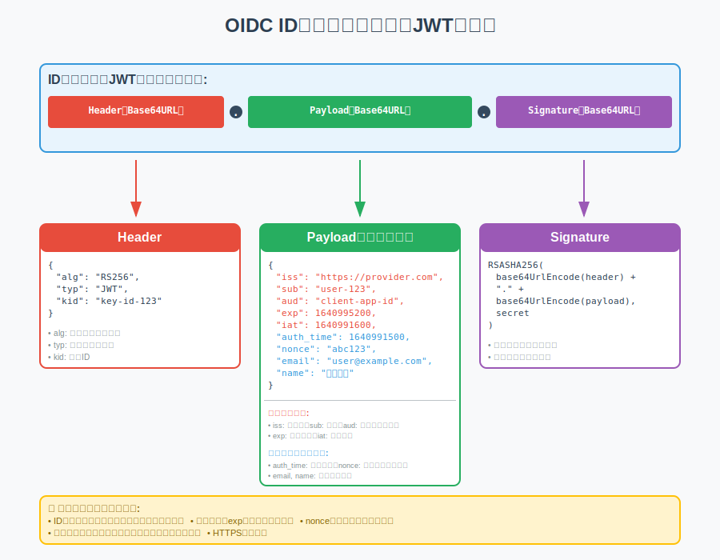
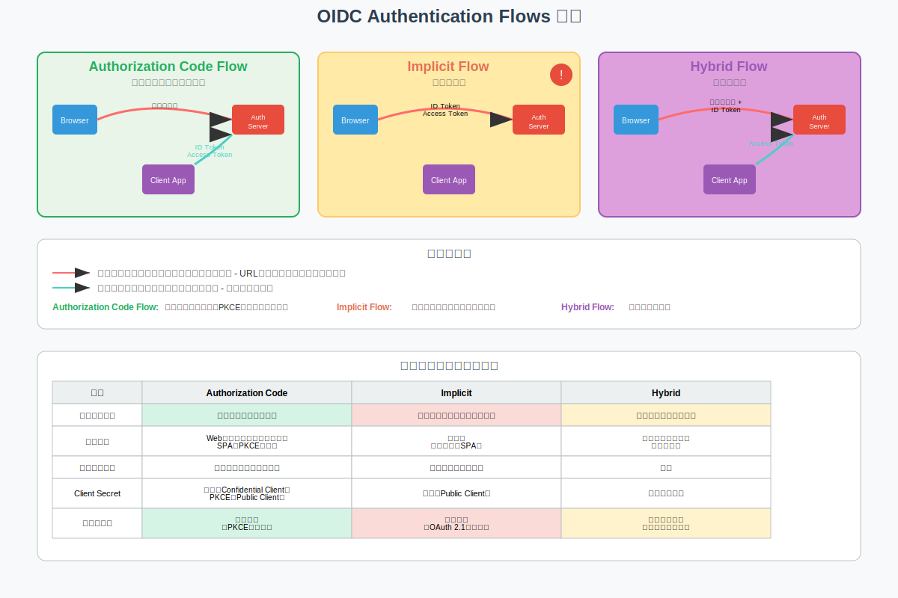
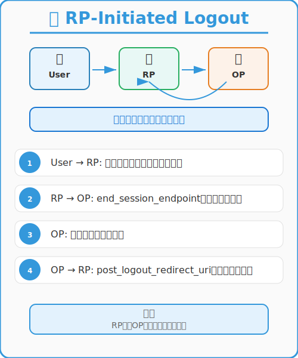
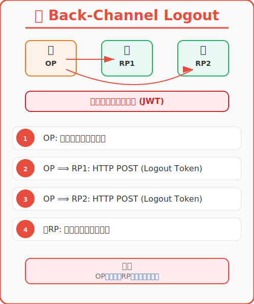

# はじめに

OpenID Connect (OIDC) は、OAuth 2.0 プロトコルを拡張し、認証機能を提供するアイデンティティレイヤーです。OAuth 2.0 が「認可」（何ができるか）を扱うのに対し、OIDC は「認証」（誰であるか）を扱います。これにより、クライアントアプリケーションは、ユーザーのアイデンティティ情報を安全かつ標準的な方法で取得できます。



# 3.1. IDトークンの構造と検証

## 3.1.1 IDトークンとは

IDトークンは、OIDCの中核となる概念で、ユーザーの認証情報をJSON Web Token (JWT) 形式で表現したものです。IDトークンは、OpenID Provider (OP) (=IdP=認可サーバー) によって発行され、クライアントアプリケーションがユーザーの身元を確認するために使用します。

## 3.1.2 IDトークンの構造

IDトークンは、以下の3つの部分から構成されます。

### ヘッダー (Header): トークンの種類 (typ) や署名アルゴリズム (alg) などのメタデータを含みます。

```
{
    "alg": "RS256",
    "kid": "xxxxxxxxxxxxxx"
}
```
   

### ペイロード (Payload): ユーザーに関する情報（クレーム）を含みます。

```
{
    "iss": "[https://auth.example.com](https://auth.example.com)",
    "sub": "xxxxxxxxxxxxxx",
    "aud": "xxxxxxxxxxxxxx",
    "exp": 1678886400,
    "iat": 1678882800,
    "auth_time": 1678882700,
    "nonce": "xxxxxxxxxxxxxx",
    "name": "山田 太郎",
    "email": "yamada.taro@example.com"
}
```



### 署名 (Signature): ヘッダーとペイロードを結合し、指定されたアルゴリズムと秘密鍵で署名したものです。これにより、トークンの改ざんを防ぎ、発行者の正当性を検証できます。

## 3.1.3 IDトークンの生成
IDトークンの生成から署名検証までの全体プロセスを詳しく解説します。

### Step 1: 認証とユーザー情報の取得
```
ユーザー認証成功
↓
ユーザー情報をデータベースから取得
- ユーザーID (sub)
- 名前、メールアドレスなど
- 権限情報
```

### Step 2: ヘッダーの作成
```
{
  "alg": "RS256",
  "typ": "JWT",
  "kid": "2024-key-001"
}
```

### Step 3: ペイロード（クレーム）の作成
```
{
  "iss": "https://auth.example.com",
  "sub": "user123456789",
  "aud": "client-app-001",
  "exp": 1678886400,  // 現在時刻 + 1時間
  "iat": 1678882800,  // 現在時刻
  "auth_time": 1678882700,
  "nonce": "abc123xyz",
  "name": "山田 太郎",
  "email": "yamada.taro@example.com"
}
```

### Step 4: Base64URLエンコード
```
encodedHeader = base64UrlEncode(JSON.stringify(header))
encodedPayload = base64UrlEncode(JSON.stringify(payload))

結果:
encodedHeader = "eyJhbGciOiJSUzI1NiIsInR5cCI6IkpXVCIsImtpZCI6IjIwMjQta2V5LTAwMSJ9"
encodedPayload = "eyJpc3MiOiJodHRwczovL2F1dGguZXhhbXBsZS5jb20iLCJzdWIiOiJ1c2VyMTIzNDU2Nzg5Ii..."
```

### Step 5: 署名の生成
```
// 署名対象データの準備
signingInput = encodedHeader + "." + encodedPayload

// RS256で署名
signature = RSA-SHA256-Sign(signingInput, privateKey)

// Base64URLエンコード
encodedSignature = base64UrlEncode(signature)
```

### Step 6: 最終IDトークンの組み立て
```
idToken = encodedHeader + "." + encodedPayload + "." + encodedSignature
```

## 3.1.4 IDトークンの検証

### Step 1: IDトークンの分解
```
受信したIDトークン:
"eyJhbGciOiJSUzI1NiI....eyJpc3MiOiJodHRwcz....JMoxz-ZzGHyJ4fPi..."

↓ ドット(.)で分割

parts = idToken.split(".")
header = parts[0]     // "eyJhbGciOiJSUzI1NiI..."
payload = parts[1]    // "eyJpc3MiOiJodHRwcz..."
signature = parts[2]  // "JMoxz-ZzGHyJ4fPi..."
```

### Step 2: ヘッダーのデコードと解析
```
decodedHeader = base64UrlDecode(header)
{
  "alg": "RS256",
  "typ": "JWT", 
  "kid": "2024-key-001"
}
```

### Step 3: 公開鍵の取得
```
// JWKSエンドポイントから公開鍵を取得
GET https://auth.example.com/.well-known/jwks.json

レスポンス:
{
  "keys": [
    {
      "kty": "RSA",
      "kid": "2024-key-001",
      "use": "sig",
      "alg": "RS256",
      "n": "xxxxxPublicKeyModulus_base64xxxxx",
      "e": "AQAB"
    }
  ]
}
```

### Step 4: 署名の検証
```
// 署名対象データの再構築
signingInput = header + "." + payload

// 公開鍵で署名を検証
isValid = RSA-SHA256-Verify(
  signingInput,
  base64UrlDecode(signature),
  publicKey
)
```

### Step 5: クレームの検証
```
// ペイロードをデコード
decodedPayload = base64UrlDecode(payload)

// 必須クレームの検証
✓ iss (発行者): "https://auth.example.com" == 期待する発行者
✓ aud (対象者): "client-app-001" == 自分のクライアントID  
✓ exp (有効期限): 1678886400 > 現在時刻
✓ iat (発行時刻): 1678882800 <= 現在時刻
✓ nonce: "abc123xyz" == 送信したnonce値
```

### Step 6. 検証結果の処理

#### 成功時
```
署名検証: ✓ PASS
クレーム検証: ✓ PASS
↓
ユーザー情報を信頼して利用
- sub: "user123456789" でユーザーを識別
- name: "山田 太郎" で表示
- email: "yamada.taro@example.com" で通知
```

#### 失敗時
```
署名検証: ✗ FAIL → トークン改ざんまたは不正発行者
クレーム検証: ✗ FAIL → 期限切れ、対象者不一致など
↓
- トークン拒否
- 再認証要求
- エラーログ記録
```

## 3.1.5 IDトークンのセキュリティのポイント

### OP側
- **秘密鍵の厳重管理**: HSMや専用のキー管理システムを使用
- **キーローテーション**: 定期的な鍵の更新
- **適切な有効期限設定**: 通常15分〜1時間

### RP側
- **公開鍵の信頼できる取得**: HTTPS必須、証明書検証
- **全クレームの厳密な検証**: 発行者、対象者、有効期限など
- **nonce検証**: リプレイ攻撃の防止

## 3.1.6 標準クレームまとめ
1. **署名の検証**: OPの公開鍵を使用して、IDトークンの署名を検証します。

2. **発行者 (iss) の検証**: IDトークンの `iss` クレームが、信頼するOPの識別子と一致することを確認します。

3. **オーディエンス (aud) の検証**: IDトークンの `aud` クレームに、自身のクライアントIDが含まれていることを確認します。

4. **有効期限 (exp) の検証**: IDトークンの `exp` クレームが、現在の時刻より未来であることを確認します。

5. **発行日時 (iat) の検証**: IDトークンの `iat` クレームが、過去の妥当な時刻であることを確認します。

6. **ナンス (nonce) の検証 (該当する場合)**: 認証リクエスト時に `nonce` パラメータを指定した場合、IDトークンの `nonce` クレームがその値と一致することを確認します。

7. **acr (Authentication Context Class Reference) や amr (Authentication Methods References) の検証 (該当する場合)**: 要求した認証の強度や方法が満たされているかを確認します。

8. **azp (Authorized party) の検証 (該当する場合)**: `aud` が複数の値を持つ場合、`azp` クレームが存在し、それが自身のクライアントIDと一致することを確認します。


# 3.2 標準クレームとスコープ

## 3.2.1 クレームとは

クレームは、ユーザーに関する属性情報です。例えば、ユーザーID、名前、メールアドレス、プロフィール画像URLなどがクレームとして表現されます。

## 3.2.2 標準クレーム

OIDC仕様では、よく使われるクレームが「標準クレーム」として定義されています。

主要な標準クレームの例：

- `sub`: サブジェクト識別子。ユーザーの一意なID。**必須**。

- `name`: ユーザーのフルネーム。

- `given_name`: ユーザーの名。

- `family_name`: ユーザーの姓。

- `email`: メールアドレス。

- `email_verified`: メールアドレスが検証済みかどうか (boolean)。

- `picture`: プロフィール画像のURL。


## 3.2.3 スコープ

OIDCにおけるスコープは、クライアントアプリケーションがユーザーのどの情報（クレーム）にアクセスしたいかを指定するために使用されます。

OIDCで定義されている主要なスコープ：

- `openid`: **必須**。OIDCリクエストであることを示します。IDトークンが発行されます。

- `profile`: プロフィール関連のクレームへのアクセスを要求します。

- `email`: `email`, `email_verified` クレームへのアクセスを要求します。

- `address`: `address` クレームへのアクセスを要求します。

- `phone`: `phone_number`, `phone_number_verified` クレームへのアクセスを要求します。

- `offline_access`: リフレッシュトークンを要求します。


# 3.3 OIDCフロー

OIDCは、OAuth 2.0の認可フローをベースに、IDトークンを取得するためのフローを定義しています。



## 3.3.1 Authorization Code Flow (認可コードフロー)

- **概要**: 最も推奨され、最も安全なフローです。クライアントはOPから認可コードを受け取り、その認可コードを使ってトークンエンドポイントからIDトークンとアクセストークンを取得します。

- **特徴**: IDトークン等がブラウザ経由で直接渡らないため安全。サーバーサイドクライアントに適しています。Public ClientではPKCE併用が強く推奨されます。

### シーケンス図

```mermaid
sequenceDiagram
    participant User as User
    participant UA as User-Agent/Browser
    participant RP as Relying Party(RP)
    participant OP as OpenID Provider(OP)
    participant RS as Resource Server

    Note over User, RS: 1. 認証リクエストの開始
    User->>UA: ログインボタンクリック
    UA->>RP: ログインリクエスト
    RP->>UA: 302 Redirect to OP<br/>(with Authorization Request parameters:<br/>・client_id<br/>・redirect_uri<br/>・scope<br/>・response_type=code)

    Note over User, RS: 2. 認証と認可
    UA->>OP: 認証リクエスト<br/>(GET /authorize?client_id=...&redirect_uri=...&scope=...&response_type=code)
    OP->>UA: ログイン画面表示
    UA->>User: ログイン画面表示
    User->>UA: 認証情報入力<br/>(ユーザー名・パスワード等)
    UA->>OP: 認証情報送信
    OP->>UA: 同意画面表示（必要に応じて）
    UA->>User: 同意画面表示
    User->>UA: 同意ボタンクリック
    UA->>OP: 同意送信

    Note over User, RS: 3. 認可コードの返却
    OP->>UA: 認可コード付きでRPにリダイレクト<br/>(302 Redirect: code)
    UA->>RP: 認可コード送信<br/>(GET /callback?code={authorization_code})

    Note over User, RS: 4. トークン取得
    RP->>OP: トークンリクエスト<br/>(grant_type=authorization_code, code, client_id, client_secret)
    OP->>OP: 認可コード検証<br/>クライアント認証
    OP->>RP: Access Token + ID Token<br/>(+ Refresh Token)

    Note over User, RS: 5. ID Token検証とユーザー情報取得
    RP->>RP: JWT構造検証 & JWTヘッダー検証【必須】
    RP->>OP: 公開鍵取得 (GET /.well-known/jwks.json)
    OP->>RP: JWKSレスポンス
    RP->>RP: ・JWT署名検証【必須】<br/>・標準クレーム検証【必須】<br/>・c_hash検証（認可コードハッシュ）【必須】<br/>・at_hash検証（Access Tokenハッシュ）【任意】
    
    alt すべての検証が成功
        RP->>RP:トークン検証完了<br/>認証成功として処理
    else いずれかの検証が失敗
        RP->>RP: 認証エラー<br/>不正なトークンとして拒否
        RP->>UA: エラーレスポンス
    end

    opt UserInfo Endpointからの追加情報取得
        RP->>RS: UserInfo リクエスト<br/>(Authorization: Bearer access_token)
        
        alt JWT形式のAccess Tokenの場合
            RS->>RS: JWT検証<br/>(署名、有効期限、発行者等をローカルで検証)
        else Opaque形式のAccess Tokenの場合
            RS->>OP: Token Introspection<br/>(/introspect endpoint)
            OP->>RS: トークン有効性レスポンス<br/>(active: true/false, scope, etc.)
        end
        
        RS->>RP: ユーザー情報レスポンス<br/>(JSON形式)
    end

    Note over User, RS: 6. ログイン完了
    RP->>UA: ログイン成功レスポンス
    UA->>User: アプリケーション画面表示
```

## 3.3.2 Implicit Flow (インプリシットフロー)

- **概要**: IDトークン等がOPから直接クライアント(ブラウザ)に渡されるフロー。
- **特徴**: **現在では非推奨**。Authorization Code Flow + PKCEの利用が推奨されます。
    - OAuth2.1にて`response_type=token`は削除予定
- 「implicit」は、トークン発行に至るまでのステップが少なく、認可コードのような中間的な認証情報を介さずに、認証・認可の成功をもって「暗黙的に」トークンが付与されるというニュアンスを表しています。

### シーケンス図

```mermaid
sequenceDiagram
    participant User as User
    participant UA as User-Agent/Browser
    participant RP as Relying Party(RP)
    participant OP as OpenID Provider(OP)
    participant RS as Resource Server

    Note over User, RS: 1. 認証リクエストの開始 <response_type=id_token token>
    
    Note over User, RS: 2. 認証と認可 <Authorization Code Flow と差分なし>

    Note over User, RS: 3. トークンの直接返却（フラグメント経由）
    OP->>UA: Access Token + ID Token付きでRPにリダイレクト<br/>(302 Redirect to: https://rp.example.com/callbackシャープaccess_token={}&id_token={}...&token_type=Bearer&expires_in=3600)
    
    Note over UA: URLフラグメント処理詳細
    UA->>UA: 1. ページロード時にlocation.hashを取得
    UA->>UA: 2. URLパラメータをパース<br/>(access_token, id_token等を抽出)
    UA->>UA: 3. セッションストレージまたは<br/>　 メモリに一時保存
    UA->>RP: 4. 抽出したトークンをサーバーに送信<br/>(POST /auth/callback with tokens)

    Note over User, RS: 4. ID Token詳細検証
    RP->>RP: JWT構造検証 & JWTヘッダー検証【必須】
    RP->>OP: 公開鍵取得<br/>(GET /.well-known/jwks.json)
    OP->>RP: JWKSレスポンス
    RP->>RP: ・JWT署名検証【必須】<br/>・標準クレーム検証【必須】<br/>・at_hash検証（Access Tokenハッシュ）【任意】
    
    alt すべての検証が成功
        RP->>RP: トークン検証完了<br/>認証成功として処理
    else いずれかの検証が失敗
        RP->>RP: 認証エラー<br/>不正なトークンとして拒否
        RP->>UA: エラーレスポンス
    end
    
    opt UserInfo Endpointからの追加情報取得 <Authorization Code Flow と差分なし>
        RP->>RS: UserInfo リクエスト<br/>(Authorization: Bearer access_token)
        RS->>RP: ユーザー情報レスポンス<br/>(JSON形式)
    end

    Note over User, RS: 6. ログイン完了
    RP->>UA: ログイン成功レスポンス
    UA->>User: アプリケーション画面表示
```

## 3.3.3 Hybrid Flow (ハイブリッドフロー)

- **概要**: Authorization Code FlowとImplicit Flowの特徴を組み合わせたフロー。
- **特徴**: フロントチャネルでIDトークンを、バックチャネルでアクセストークンを取得したい場合などに利用。Authorization Code Flow + PKCEがよりシンプルな代替となることが多いです。
    - OAuth2.1にて`code token`や`code id_token token`は非推奨(tokenを含むため)
    - `code id_token`は依然として利用可能

### シーケンス図

```mermaid
sequenceDiagram
    participant User as User
    participant UA as User-Agent/Browser
    participant RP as Relying Party(RP)
    participant OP as OpenID Provider(OP)
    participant RS as Resource Server

    Note over User, RS: 1. 認証リクエストの開始 <response_type=code id_token>

    Note over User, RS: 2. 認証と認可 <Authorization Code Flow と差分なし>

    Note over User, RS: 3. 認可コード + ID Token の返却（Hybridフローの特徴）
    OP->>OP: ID Token生成<br/>(c_hashクレーム含む)
    OP->>UA: 認可コード + ID Token付きでRPにリダイレクト<br/>(302 Redirect to: https://rp.example.com/callbackシャープcode={}&id_token={}...)
    
    Note over UA: URLフラグメント処理詳細
    UA->>UA: 1. ページロード時にlocation.hashを取得
    UA->>UA: 2. URLパラメータをパース<br/>(code, id_token等を抽出)
    UA->>UA: 3. セッションストレージまたは<br/>　 メモリに一時保存
    UA->>RP: 4. 抽出した認可コード + ID TokenをPOST<br/>(POST /auth/callback with code & id_token)

    Note over User, RS: 4. フロントチャンネルID Token検証
    RP->>RP: JWT構造検証 & JWTヘッダー検証【必須】
    RP->>OP: 公開鍵取得<br/>(GET /.well-known/jwks.json)
    OP->>RP: JWKSレスポンス
    RP->>RP: ・JWT署名検証【必須】<br/>・標準クレーム検証【必須】<br/>・nonceクレーム検証【必須】<br/>・c_hash検証（認可コードハッシュ）【必須】
    
    alt フロントチャンネルID Token検証成功
        RP->>RP: 初回検証完了<br/>続行してバックチャンネルへ
    else 検証失敗
        RP->>RP: 認証エラー<br/>不正なトークンとして拒否
        RP->>UA: エラーレスポンス
    end

    Note over User, RS: 5. バックチャンネルでのトークン取得
    RP->>OP: トークンリクエスト<br/>(grant_type=authorization_code, code, client_id, client_secret)
    OP->>OP: 認可コード検証<br/>クライアント認証
    OP->>RP: Access Token + ID Token<br/>(+ Refresh Token)

    Note over User, RS: 6. バックチャンネルID Token検証 & 整合性確認
    RP->>RP: JWT構造検証 & JWTヘッダー検証【必須】
    RP->>RP: ・JWT署名検証【必須】<br/>・標準クレーム検証【必須】<br/>・at_hash検証（Access Tokenハッシュ）【必須】
    RP->>RP: 【重要】フロントチャンネルとバックチャンネルの<br/>ID Token整合性確認：<br/>・sub（Subject）が同一【必須】<br/>・aud（Audience）が同一【必須】<br/>・iss（Issuer）が同一【必須】
    
    alt すべての検証と整合性確認が成功
        RP->>RP: 最終トークン検証完了<br/>認証成功として処理
    else いずれかの検証が失敗
        RP->>RP: 認証エラー<br/>整合性違反または不正なトークン
        RP->>UA: エラーレスポンス
    end

    opt UserInfo Endpointからの追加情報取得 <Authorization Code Flow と差分なし>
        RP->>RS: UserInfo リクエスト<br/>(Authorization: Bearer access_token)
        RS->>RP: ユーザー情報レスポンス<br/>(JSON形式)
    end

    Note over User, RS: 7. ログイン完了
    RP->>UA: ログイン成功レスポンス
    UA->>User: アプリケーション画面表示
```

## 3.3.4 UserInfo エンドポイントの詳細な活用方法

UserInfoエンドポイントは、OIDCプロバイダー (OP) がユーザーに関する追加のクレーム情報を提供するための保護されたリソースです。クライアント (RP) は、アクセストークンを使用してこのエンドポイントにアクセスします。

### 1. UserInfoエンドポイントの目的とIDトークンとの使い分け

- **IDトークン**:

    - ユーザー認証の事実とその結果 (いつ、誰が、どのように認証されたか) を示す最小限の情報を持ちます。

    - 一度発行されると内容は変更されません。

    - RPが直接検証し、ユーザーセッションを開始するために利用されます。

    - サイズを小さく保つことが推奨されます（特にURLフラグメントで渡される場合）。

- **UserInfoエンドポイント**:

    - IDトークンには含まれない、より詳細なユーザー属性情報 (例: 住所、電話番号、部署、役職など) を提供します。

    - 常に最新のユーザー情報を提供します。ユーザーがOP側でプロフィール情報を更新した場合、UserInfoエンドポイントからは更新後の情報が返されます。

    - IDトークンにすべてのクレームを含めるとトークンサイズが肥大化するため、基本的な認証情報のみをIDトークンに含め、追加情報はUserInfoエンドポイントから取得する設計が一般的です。


### 2. アクセス方法

RPは、トークンエンドポイントから取得したアクセストークンをHTTPリクエストの `Authorization` ヘッダーにBearerトークンとして含めて、UserInfoエンドポイントにアクセスします。

```
GET /userinfo HTTP/1.1
Host: op.example.com
Authorization: Bearer <アクセストークン>
```

### 3. レスポンス形式

UserInfoエンドポイントからのレスポンスは、通常JSON形式で返されます。レスポンスには、要求されたスコープに対応するクレームが含まれます。

```
HTTP/1.1 200 OK
Content-Type: application/json

{
  "sub": "xxxxxxxxxxxxxx",
  "name": "山田 太郎",
  "given_name": "太郎",
  "family_name": "山田",
  "email": "yamada.taro@example.com",
  "email_verified": true,
  "picture": "[https://example.com/yamada.jpg](https://example.com/yamada.jpg)",
  "address": {
    "country": "JP",
    "postal_code": "100-0001",
    "region": "東京都",
    "locality": "千代田区"
  }
}
```

レスポンスのContent-Typeは `application/json` が基本ですが、OPによってはJWT形式 (`application/jwt`) で署名・暗号化されたUserInfoレスポンスを返すこともあります (OIDC Core仕様で定義)。

### 4. 取得できるクレーム

UserInfoエンドポイントから取得できるクレームは、認証リクエスト時に指定した `scope` パラメータと、ユーザーの同意に基づきます。例えば、`profile` スコープを要求すればプロフィール関連のクレームが、`email` スコープを要求すればメール関連のクレームが返されます。

### 5. 注意点とベストプラクティス

- **アクセストークンの権限**: UserInfoエンドポイントへのアクセスに使用するアクセストークンは、`openid` スコープに関連付けられている必要があります。

- **エラーハンドリング**: アクセストークンが無効であるか、有効期限が切れている場合、UserInfoエンドポイントは適切なHTTPエラーコード (例: `401 Unauthorized`) を返します。RPはこれらのエラーを適切に処理する必要があります。

- **情報取得のタイミング**:

    - ユーザーログイン直後に一度だけ取得し、RP側のセッションに情報をキャッシュする。

    - 必要に応じて都度取得する（ただし、頻繁なアクセスはパフォーマンスに影響する可能性があるため注意）。

- **機密性の高い情報**: UserInfoエンドポイントで機密性の高い情報 (例: 個人識別番号など) を扱う場合は、OPとRP間の通信経路の暗号化 (TLS) はもちろんのこと、UserInfoレスポンス自体の暗号化も検討されることがあります。

- **`sub` クレームの一致**: UserInfoレスポンスに含まれる `sub` クレームは、対応するIDトークン内の `sub` クレームと必ず一致しなければなりません。RPはこれを確認する必要があります。


UserInfoエンドポイントを効果的に活用することで、IDトークンを軽量に保ちつつ、アプリケーションが必要とする豊富なユーザー情報を安全かつ最新の状態で取得できます。

# 3.4 Discovery, Dynamic Registration

## 3.4.1 Discovery (ディスカバリー)

OIDCプロバイダー (OP) は、自身の様々なエンドポイントのURLやサポートする機能に関する情報をメタデータとして公開します。このメタデータは、通常 `.well-known/openid-configuration` というパスでJSON形式で提供されます。

- **利点**: クライアントは設定情報を動的に取得でき、プロバイダーの変更に追従しやすくなります。

```
GET /.well-known/openid-configuration

{
  "issuer": "https://op.example.com", // OPの識別子 (URL形式)。IDトークンの `iss` クレームと一致する必要がある
  "authorization_endpoint": "https://op.example.com/authorize", // 認可エンドポイントのURL
  "token_endpoint": "https://op.example.com/token", // トークンエンドポイントのURL
  "userinfo_endpoint": "https://op.example.com/userinfo", // UserInfoエンドポイントのURL
  "jwks_uri": "https://op.example.com/.well-known/jwks.json", // OPの公開鍵セット (JWKS) が公開されているURL
  "registration_endpoint": "https://op.example.com/register", // 動的クライアント登録を行うためのエンドポイントURL
  "scopes_supported": [ // OPがサポートするスコープのリスト
    "openid",
    "profile",
    "email",
    "address",
    "phone",
    "offline_access"
  ],
  "response_types_supported": [ // OPがサポートするレスポンスタイプのリスト
    "code",
    "token",
    "id_token",
    "code token",
    "code id_token",
    "token id_token",
    "code token id_token",
    "none"
  ],
  "response_modes_supported": [ // OPがサポートするレスポンスモードのリスト
    "query",
    "fragment",
    "form_post"
  ],
  "grant_types_supported": [ // OPがサポートするグラントタイプのリスト
    "authorization_code",
    "implicit",
    "refresh_token",
    "client_credentials"
  ],
  "acr_values_supported": [ // OPがサポートする認証コンテキストクラス参照 (ACR) の値のリスト
    "urn:mace:incommon:iap:silver",
    "urn:mace:incommon:iap:bronze"
  ],
  "subject_types_supported": [ // OPがサポートする `sub` (サブジェクト識別子) のタイプのリスト
    "public",
    "pairwise"
  ],
  "id_token_signing_alg_values_supported": [ // IDトークンの署名に使用できるアルゴリズムのリスト
    "RS256",
    "ES256",
    "HS256"
  ],
  "id_token_encryption_alg_values_supported": [ // IDトークンの暗号化に使用できる鍵交換アルゴリズムのリスト
    "RSA-OAEP",
    "ECDH-ES+A128KW"
  ],
  "id_token_encryption_enc_values_supported": [ // IDトークンの暗号化に使用できるコンテンツ暗号化アルゴリズムのリスト
    "A128CBC-HS256",
    "A128GCM"
  ],
  "userinfo_signing_alg_values_supported": [ // UserInfoレスポンスの署名に使用できるアルゴリズムのリスト
    "RS256",
    "ES256",
    "HS256"
  ],
  "userinfo_encryption_alg_values_supported": [ // UserInfoレスポンスの暗号化に使用できる鍵交換アルゴリズムのリスト
    "RSA-OAEP",
    "ECDH-ES+A128KW"
  ],
  "userinfo_encryption_enc_values_supported": [ // UserInfoレスポンスの暗号化に使用できるコンテンツ暗号化アルゴリズムのリスト
    "A128CBC-HS256",
    "A128GCM"
  ],
  "request_object_signing_alg_values_supported": [ // リクエストオブジェクトの署名に使用できるアルゴリズムのリスト
    "RS256",
    "ES256",
    "HS256"
  ],
  "display_values_supported": [ // 認証UIの表示方法としてサポートされる値のリスト
    "page",
    "popup",
    "touch",
    "wap"
  ],
  "claim_types_supported": [ // サポートするクレームのタイプのリスト
    "normal",
    "aggregated",
    "distributed"
  ],
  "claims_supported": [ // OPが提供できるクレームのリスト
    "sub",
    "iss",
    "auth_time",
    "acr",
    "name",
    "given_name",
    "family_name",
    "nickname",
    "preferred_username",
    "profile",
    "picture",
    "website",
    "email",
    "email_verified",
    "gender",
    "birthdate",
    "zoneinfo",
    "locale",
    "phone_number",
    "phone_number_verified",
    "address",
    "updated_at"
  ],
  "service_documentation": "https://op.example.com/docs", // OPのサービスに関するドキュメントのURL
  "claims_locales_supported": [ // サポートするクレームの言語/地域のリスト
    "en-US",
    "ja-JP"
  ],
  "ui_locales_supported": [ // サポートするUIの言語/地域のリスト
    "en-US",
    "ja-JP"
  ],
  "claims_parameter_supported": true, // `claims` リクエストパラメータをサポートするか (boolean)
  "request_parameter_supported": true, // `request` リクエストパラメータをサポートするか (boolean)
  "request_uri_parameter_supported": true, // `request_uri` リクエストパラメータをサポートするか (boolean)
  "require_request_uri_registration": true, // `request_uri` の事前登録が必要か (boolean)
  "op_policy_uri": "https://op.example.com/policy", // OPのプライバシーポリシーのURL
  "op_tos_uri": "https://op.example.com/tos", // OPの利用規約のURL
  "code_challenge_methods_supported": [ // PKCEでサポートされる `code_challenge` の生成方式のリスト
    "S256",
    "plain"
  ],
  "token_endpoint_auth_methods_supported": [ // トークンエンドポイントでのクライアント認証方式のリスト
    "client_secret_post",
    "client_secret_basic",
    "client_secret_jwt",
    "private_key_jwt"
  ],
  "end_session_endpoint": "https://op.example.com/logout", // RP-Initiated Logoutで使用するエンドポイントのURL
  "backchannel_logout_supported": true, // バックチャネルログアウトをサポートしているか (boolean)
  "backchannel_logout_session_supported": true, // バックチャネルログアウトでセッションID (`sid`) をサポートするか (boolean)
  "frontchannel_logout_supported": true, // フロントチャネルログアウトをサポートしているか (boolean)
  "frontchannel_logout_session_supported": true // フロントチャネルログアウトでセッションID (`sid`) をサポートするか (boolean)
}
```

## 3.4.2 Dynamic Client Registration (動的クライアント登録)

クライアントアプリケーションがOPを利用する前に必要なクライアント登録プロセスを、API経由で動的に行えるようにする仕組みです。

- **利点**: 手動登録作業を自動化し、多数のクライアント管理やオンデマンドでのクライアント生成に有効です。

```
POST /register HTTP/1.1
Host: op.example.com
Content-Type: application/json
Authorization: Bearer <InitialAccessToken_if_required> // OPによっては初期アクセストークンが必要

{
  "redirect_uris": [ // クライアントのリダイレクトURI (複数指定可能)
    "https://rp.example.com/callback",
    "https://rp.example.com/callback2"
  ],
  "client_name": "My Awesome Application", // クライアントの名称
  "client_name#ja-JP": "マイ・オーサム・アプリケーション", // クライアントの名称 (日本語)
  "logo_uri": "https://rp.example.com/logo.png", // クライアントのロゴ画像のURI
  "scope": "openid profile email phone address offline_access", // クライアントが要求するデフォルトのスコープ
  "contacts": [ // クライアントの連絡先メールアドレス
    "support@rp.example.com"
  ],
  "token_endpoint_auth_method": "client_secret_basic", // トークンエンドポイントでのクライアント認証方式
  "jwks_uri": "https://rp.example.com/jwks.json", // クライアントの公開鍵セット (JWKS) のURI (例: private_key_jwt認証の場合)
  "policy_uri": "https://rp.example.com/policy.html", // クライアントのプライバシーポリシーのURI
  "tos_uri": "https://rp.example.com/tos.html", // クライアントの利用規約のURI
  "application_type": "web", // アプリケーションタイプ ("web", "native"など)
  "grant_types": [ // クライアントが利用するグラントタイプ
    "authorization_code",
    "refresh_token"
  ],
  "response_types": [ // クライアントが期待するレスポンスタイプ
    "code"
  ],
  "default_max_age": 3600, // ユーザーの再認証を要求するまでのデフォルトの最大経過時間 (秒)
  "require_auth_time": true, // IDトークンに `auth_time` クレームを要求するかどうか
  "initiate_login_uri": "https://rp.example.com/login" // OPからログインを開始するためのURI (IdP Initiated Loginなどで使用)
}
```

```
HTTP/1.1 201 Created
Content-Type: application/json

{
  "client_id": "s6BhdRkqt3", // OPによって発行されたクライアントID
  "client_secret": "ZJYCxV0Zg_0c2JqKPoD0d", // OPによって発行されたクライアントシークレット (Confidential Clientの場合)
  "client_id_issued_at": 1493826200, // クライアントIDの発行日時 (Unixタイムスタンプ)
  "client_secret_expires_at": 1709730200, // クライアントシークレットの有効期限 (Unixタイムスタンプ、0の場合は無期限)
  "redirect_uris": [ // 登録されたリダイレクトURI
    "https://rp.example.com/callback",
    "https://rp.example.com/callback2"
  ],
  "client_name": "My Awesome Application", // 登録されたクライアントの名称
  "client_name#ja-JP": "マイ・オーサム・アプリケーション", // 登録されたクライアントの名称 (日本語)
  "logo_uri": "https://rp.example.com/logo.png", // 登録されたクライアントのロゴ画像のURI
  "scope": "openid profile email phone address offline_access", // 登録されたデフォルトのスコープ
  "contacts": [ // 登録されたクライアントの連絡先メールアドレス
    "support@rp.example.com"
  ],
  "token_endpoint_auth_method": "client_secret_basic", // 登録されたトークンエンドポイントでのクライアント認証方式
  "jwks_uri": "https://rp.example.com/jwks.json", // 登録されたクライアントの公開鍵セット (JWKS) のURI
  "policy_uri": "https://rp.example.com/policy.html", // 登録されたクライアントのプライバシーポリシーのURI
  "tos_uri": "https://rp.example.com/tos.html", // 登録されたクライアントの利用規約のURI
  "application_type": "web", // 登録されたアプリケーションタイプ
  "grant_types": [ // 登録されたグラントタイプ
    "authorization_code",
    "refresh_token"
  ],
  "response_types": [ // 登録されたレスポンスタイプ
    "code"
  ],
  "default_max_age": 3600, // 登録されたデフォルトの最大経過時間
  "require_auth_time": true, // 登録された `auth_time` 要求設定
  "initiate_login_uri": "https://rp.example.com/login", // 登録されたOPからのログイン開始URI
  "registration_access_token": "RegAccessTokenxxxxxxxx", // このクライアント登録情報を更新/参照するためのアクセストークン
  "registration_client_uri": "https://op.example.com/register/s6BhdRkqt3" // このクライアント登録情報を参照するためのURI
}
```

### Dynamic Client Registration: クライアント属性における注意点
Dynamic Client Registration (DCR) を利用してクライアントを登録する際には、クライアントのタイプ (主に Public Client か Confidential Client か) を正しく理解し、適切なメタデータを設定することが非常に重要です。これにより、セキュリティレベルや利用できる認証方式が大きく変わってきます。

| 属性/考慮事項                      | Public Client (公開クライアント)                                                                 | Confidential Client (機密クライアント)                                                         | 備考・解説                                                                                                                               |
| :------------------------------- | :--------------------------------------------------------------------------------------------- |:---------------------------------------------------------------------------------------| :------------------------------------------------------------------------------------------------------------------------------------- |
| **代表的な例** | SPA (シングルページアプリケーション)、ネイティブモバイルアプリ、デスクトップアプリ                                       | Webアプリケーション (バックエンドサーバーを持つ)、M2M (Machine-to-Machine) クライアント                            | クライアントがクライアントシークレットを安全に保持できるかどうかが主な判断基準です。                                                                                 |
| **クライアントシークレットの扱い** | 安全に保持できないため、原則として発行されないか、発行されても利用すべきではない。                                         | 安全に保持できる環境 (例: サーバーサイド) で管理され、OPとの認証に使用される。                                            | Public Client にシークレットを埋め込んでも容易に抽出されるリスクがあります。                                                                                   |
| **`token_endpoint_auth_method`** | `none` (PKCE併用が必須)                                                                          | `client_secret_basic`, `client_secret_post`, `client_secret_jwt`, `private_key_jwt` など | トークンエンドポイントでクライアント自身を認証する方法を指定します。Public Client はクライアント認証を行わない (PKCEで認可コードの安全性を担保) のが基本です。 |
| **DCRレスポンスの`client_secret`** | 通常、含まれないか、含まれていても利用しない。                                                                 | 通常、発行されレスポンスに含まれる。                                                                     | OPの実装によりますが、Confidential Client にはシークレットが発行されます。                                                                              |
| **PKCE (Proof Key for Code Exchange) の利用** | **強く推奨 (ほぼ必須)** 認可コード横取り攻撃を防ぐために利用。                                                    | 利用可能だが、Public Client ほど必須ではない (クライアント認証で保護されるため)。ただし、セキュリティ層を追加する意味で利用することは有効。         | PKCEは、クライアントシークレットを持たないPublic Client のセキュリティを強化します。                                                                          |
| **リフレッシュトークンの発行** | OPのポリシーによるが、セキュリティリスクを考慮し、発行されないか、有効期間が短い場合がある。慎重な扱いが必要。                               | OPのポリシーにより発行されることが多い。                                                                  | Public Client はリフレッシュトークンの安全な保管が難しいため、注意が必要です。                                                                                |
| **セキュリティリスク** | クライアントシークレットの漏洩リスクは低い (持たないため)。認可コードの横取り、トークンの不正利用などに注意が必要。                         | クライアントシークレットの漏洩が最大のリスク。シークレットの安全な管理が最重要。                                               | それぞれのクライアントタイプに応じたセキュリティ対策が必要です。                                                                                             |
| **DCRリクエスト時の考慮点** | `application_type` を `native` など適切に設定。`token_endpoint_auth_method` を `none` にする。                 | `application_type` を `web` など適切に設定。適切な `token_endpoint_auth_method` を選択する。             | OPはこれらの情報に基づいてクライアントの特性を判断します。                                                                                             |
| **推奨される認可フロー** | Authorization Code Flow + PKCE                                                                 | Authorization Code Flow, Client Credentials Flow (M2Mの場合) など                           | Implicit Flow は現在非推奨です。                                                                                                                   |

# 3.5 RPとOPでのログインセッション管理とログアウト

OIDCは、ユーザーのログインセッションを管理し、安全にログアウトするための仕組みを提供します。これらは、RPとOP間でのセッションの一貫性を保つために重要です。

## 3.5.1 セッション管理 (Session Management)

OIDC Session Management仕様は、RPがOP上のユーザーのログイン状態を監視し、変更があった場合にRP側のセッションも適切に処理できるようにするための方法を定義します。

- **目的**:

    - ユーザーがOPでログアウトした場合、RPも追随してログアウト処理を行う。

    - 複数のRPを利用している場合に、あるRPでのログアウトが他のRPにも（間接的にOPを通じて）影響するようにする。

- **主要な仕組み**:

    1. **`session_state` パラメータ**: 認証レスポンス (認可コードフローの場合、認可レスポンスのクエリパラメータやIDトークン内) に含まれる値。OP上のユーザーセッションの状態を表します。RPはこの値を保存します。

    2. **`check_session_iframe`**: OPが提供するiframeのURL。RPはこのiframeを自身のページに埋め込み、`postMessage` APIを利用して定期的にOPにセッション状態の変更がないか問い合わせます。

        - RPは、保存しておいた `session_state` と、OPから返される現在のセッション状態を比較します。

        - 変更が検知された場合（例: ユーザーがOPでログアウトした）、RPは自身のセッションを終了するなどの対応を行います。

    3. **ポーリング**: RPは `check_session_iframe` を通じて定期的にOPに問い合わせる（ポーリングする）ことで、セッション状態の変更を検知します。

- **考慮事項**:

    - `check_session_iframe` はサードパーティCookieに依存する場合があり、ブラウザのプライバシー設定強化（サードパーティCookieのブロックなど）の影響を受ける可能性があります。

    - リアルタイム性は限定的で、ポーリング間隔に依存します。

```mermaid
sequenceDiagram
    participant User as User
    participant UA as User-Agent/Browser
    participant RP as Relying Party(RP)
    participant OP as OpenID Provider(OP)
    participant RS as Resource Server

    Note over User, RS: 1. 初期認証フロー
    RP->>OP: 認証リクエスト（/authorize）
    OP->>UA: ログイン画面表示
    UA->>User: ログイン画面提示
    User->>UA: 認証情報入力
    UA->>OP: ユーザー認証
    OP->>UA: リダイレクト応答<br/>code + session_state パラメータ
    UA->>RP: コールバック処理<br/>（認可コード + session_state）
    RP->>OP: トークン取得（/token）
    OP->>RP: IDトークン + アクセストークン
    
    Note over User, RS: 2. セッション監視セットアップ
    RP->>UA: check_session_iframe を読み込み<br/>(例: https://idp.example.com/check_session)
    UA->>OP: iframe リクエスト
    OP->>UA: check_session_iframe レスポンス<br/>(JavaScript含む)
    
    Note over User, RS: 3. 定期的なセッション状態チェック
    loop 定期的に実行（例：5秒間隔）
        RP->>UA: postMessage でセッション状態確認<br/>client_id + " " + session_state
        UA->>OP: iframe内でセッション状態検証
        OP->>UA: "unchanged" または "changed"
        UA->>RP: 結果を返す
        
        alt セッション状態が "changed" の場合
            RP->>OP: prompt=none で認証状態確認<br/>(Silent Authentication)
            OP->>RP: 新しいセッション状態<br/>または認証エラー
            
            alt 認証が有効な場合
                Note over RP: 新しい session_state で<br/>監視を継続
            else 認証が無効な場合
                RP->>User: ユーザーに再ログイン<br/>を促す
            end
        end
    end
    
    Note over User, RS: 4. セッション終了検知
    User->>OP: ユーザーがOPでログアウト
    RP->>UA: 次回のセッションチェック
    UA->>OP: iframe内でセッション状態検証
    OP->>UA: "changed"
    UA->>RP: セッション変更を通知
    RP->>RP: ローカルセッション終了処理
```

## 3.5.2 ログアウト (Logout)

OIDCは、ユーザーがRPやOPからログアウトする際の挙動を定義し、シングルログアウト (SLO: Single Log-Out) の実現を支援します。

### 1. RP-Initiated Logout (RP主導ログアウト)

- **概要**: ユーザーがRPのアプリケーションからログアウト操作を行った際に、RPがOPに対してログアウトを要求する仕組みです。

- **フロー**:

    1. ユーザーがRPのログアウトボタンをクリックします。

    2. RPは、OPの `end_session_endpoint` (Discoveryドキュメントで公開) にユーザーをリダイレクトさせます。

    3. リクエストには以下のパラメータを含めることができます。

        - `id_token_hint`: ログアウト対象のセッションを特定するために、以前取得したIDトークンを渡します。OPはこれにより、どのユーザーのどのセッションを終了すべきか判断しやすくなります。

        - `post_logout_redirect_uri`: OPでのログアウト処理完了後、ユーザーをリダイレクトさせるRP側のURI。このURIは事前にOPに登録されている必要があります。

        - `state`: CSRF対策として、リクエストとコールバックの対応を確認するために使用できます。

    4. OPはユーザーのセッションを終了させ、(指定されていれば) `post_logout_redirect_uri` にユーザーをリダイレクトします。

```mermaid
sequenceDiagram
    participant User as User
    participant UA as User-Agent/Browser
    participant RP as Relying Party(RP)
    participant OP as OpenID Provider(OP)
    participant RS as Resource Server

    Note over User, RS: RP主導ログアウトフロー

    User->>UA: ログアウトボタンをクリック
    UA->>RP: ログアウトリクエスト
    
    Note over RP: ログアウト処理の準備<br/>- 現在のセッション情報確認<br/>- IDトークンの取得
    
    RP->>UA: OPのend_session_endpointにリダイレクト<br/>パラメータ:<br/>- id_token_hint: [IDトークン]<br/>- post_logout_redirect_uri: [RP側URI]<br/>- state: [CSRF対策用ランダム値]
    
    UA->>OP: end_session_endpointへリクエスト<br/>GET /logout?id_token_hint=xxx&post_logout_redirect_uri=yyy&state=zzz
    
    Note over OP: セッション終了処理<br/>- IDトークンからセッション特定<br/>- ユーザーセッションの無効化<br/>- post_logout_redirect_uriの検証
    
    opt ユーザー確認が必要な場合
        OP->>UA: ログアウト確認画面表示
        UA->>User: ログアウト確認画面表示
        User->>UA: ログアウト確認
        UA->>OP: ログアウト確認送信
    end
    
    Note over OP: セッション完全終了<br/>- OPでのセッションクリア<br/>- 関連するセッション情報削除
    
    OP->>UA: post_logout_redirect_uriにリダイレクト<br/>パラメータ: state=[元のstate値]
    
    UA->>RP: ログアウト完了コールバック<br/>GET /logout/callback?state=zzz
    
    Note over RP: ログアウト完了処理<br/>- stateパラメータ検証<br/>- RP側セッションクリア<br/>- クッキー削除
    
    RP->>UA: ログアウト完了画面 or ホーム画面
    UA->>User: ログアウト完了表示
    
    Note over User, RS: ログアウト完了<br/>ユーザーは認証されていない状態
```

- **メリット**: RPが起点となるため、RPのUXに合わせたログアウト処理を実装しやすいです。

- **デメリット**: OPのセッションのみが終了し、同じOPを利用する他のRPのセッションは直接的には終了しません（Session Managementと組み合わせることで間接的に対応可能）。



### 2. Back-Channel Logout (バックチャネルログアウト)

- **概要**: OIDC Back-Channel Logout仕様で定義されています。OPが、ユーザーセッションに関連付けられている複数のRPに対して、サーバー間の直接通信 (バックチャネル) を用いてログアウト通知を送信する仕組みです。

- **フロー**:

    1. ユーザーがOPで直接ログアウトするか、あるRPからのRP-Initiated LogoutによりOPセッションが終了します。

    2. OPは、そのユーザーセッションに関連付けられている（事前に登録されたバックチャネルログアウトURIを持つ）各RPに対して、HTTP POSTリクエストでログアウト通知 (Logout Tokenを含む) を送信します。

    3. 各RPは、Logout Tokenを検証し、対応するユーザーセッションを終了させます。

```mermaid
sequenceDiagram
    participant User as User
    participant UA as User-Agent/Browser
    participant RP1 as Relying Party 1 (RP1)
    participant RP2 as Relying Party 2 (RP2)
    participant OP as OpenID Provider (OP)
    participant RS as Resource Server

    Note over User, RS: Back-Channel Logoutフロー

    %% シナリオ1: OPで直接ログアウト
    rect rgb(240, 248, 255)
        Note over User, OP: パターン1: OPで直接ログアウト
        User->>UA: OPのログアウトボタンをクリック
        UA->>OP: 直接ログアウトリクエスト
        OP->>UA: ログアウト完了
        UA->>User: ログアウト完了表示
    end

    %% または、シナリオ2: RP-Initiated Logoutによる場合
    rect rgb(255, 248, 240)
        Note over User, OP: パターン2: RP-Initiated Logoutによる場合
        Note over RP1, OP: (前のシーケンス図のRP-Initiated Logoutフロー)<br/>RPからのログアウト要求でOPセッション終了
    end

    Note over OP: セッション終了検知<br/>- ユーザーセッションの特定<br/>- 関連RPの確認<br/>- Logout Token生成準備

    %% Back-Channel Logout通知開始
    rect rgb(240, 255, 240)
        Note over OP, RP2: Back-Channel Logout通知フェーズ
        
        Note over OP: 各RPのback_channel_logout_uri確認<br/>- 事前登録されたエンドポイント取得<br/>- Logout Token生成（各RP用）
        
        %% RP1への通知
        OP->>RP1: HTTP POST: back_channel_logout_uri<br/>Content-Type: application/x-www-form-urlencoded<br/>Body: logout_token=[JWTトークン]
        
        Note over RP1: Logout Token検証<br/>- JWT署名検証<br/>- iss, aud クレーム確認<br/>- sub または sid でセッション特定
        
        RP1->>OP: HTTP 200 OK<br/>（ログアウト処理成功）
        
        Note over RP1: RP1でのセッション終了<br/>- 該当ユーザーセッション無効化<br/>- セッションクッキー削除<br/>- アクセストークン無効化
        
        %% RP2への通知（並行処理）
        OP->>RP2: HTTP POST: back_channel_logout_uri<br/>Content-Type: application/x-www-form-urlencoded<br/>Body: logout_token=[JWTトークン]
        
        Note over RP2: Logout Token検証<br/>- JWT署名検証<br/>- iss, aud クレーム確認<br/>- sub または sid でセッション特定
        
        RP2->>OP: HTTP 200 OK<br/>（ログアウト処理成功）
        
        Note over RP2: RP2でのセッション終了<br/>- 該当ユーザーセッション無効化<br/>- セッションクッキー削除<br/>- アクセストークン無効化
    end

    Note over OP: 全RP通知完了確認<br/>- 成功/失敗ログ記録<br/>- エラーがあれば管理者通知

    %% ユーザーが他のRPにアクセスしようとした場合
    rect rgb(255, 240, 240)
        Note over User, RP1: ユーザーが後でRP1にアクセスしようとした場合
        User->>UA: RP1のサービスにアクセス
        UA->>RP1: 認証が必要なページにアクセス
        
        Note over RP1: セッション確認<br/>→ セッション無効（Back-Channel Logoutで削除済み）
        
        RP1->>UA: 認証が必要（OPにリダイレクト）
        UA->>User: ログインページ表示
    end

    Note over User, RS: Back-Channel Logout完了<br/>全てのRPでユーザーセッションが終了
```

- **Logout Token**:

    - ログアウトイベントに関する情報を含むJWT形式のトークンです。

    - `iss` (発行者)、`sub` (ユーザー識別子)、`aud` (対象RPのクライアントID)、`iat` (発行日時)、`jti` (一意なトークンID)、`sid` (セッションID、ユーザーセッションを特定するため) などのクレームを含みます。

    - `events` クレームに `http://schemas.openid.net/event/backchannel-logout` という値が含まれることで、バックチャネルログアウトイベントであることを示します。

- **メリット**: ユーザーのブラウザを介さずにサーバー間で通知が行われるため、より確実なログアウトが期待できます。フロントチャネルログアウトのようなブラウザの制約を受けにくいです。

- **デメリット**: RP側でバックチャネルログアウト通知を受け付けるエンドポイントを実装し、Logout Tokenを適切に検証・処理する必要があります。OPが各RPのオンライン状態を把握できない場合、通知が届かない可能性も考慮が必要です。



### 3. Front-Channel Logout (フロントチャネルログアウト)

- **概要**: OIDC Front-Channel Logout仕様で定義されています。OPが、ユーザーのブラウザを介して (例: iframeを動的に生成して)、各RPのログアウト用URIを順番に呼び出すことで、ログアウトを伝播させる仕組みです。

- **フロー**:

    1. ユーザーがOPで直接ログアウトするか、あるRPからのRP-Initiated LogoutによりOPセッションが終了します。

    2. OPは、ログアウトページを表示し、そのページ内に、そのユーザーセッションに関連付けられている各RPのフロントチャネルログアウトURIを `src` に持つiframeを埋め込みます。

    3. ブラウザがこれらのiframeをロードすることで、各RPのログアウトエンドポイントが呼び出され、RPは自身のセッションを終了します。

```mermaid
sequenceDiagram
    participant User as User
    participant UA as User-Agent/Browser
    participant RP1 as Relying Party 1 (RP1)
    participant RP2 as Relying Party 2 (RP2)
    participant OP as OpenID Provider (OP)

    Note over User, OP: Front-Channel Logoutフロー

    %% ログアウト開始
    User->>UA: OPのログアウトボタンをクリック
    UA->>OP: 直接ログアウトリクエスト

    Note over OP: セッション終了処理開始<br/>関連RPの確認<br/>Front-Channel Logoutページ生成

    OP->>UA: ログアウトページ（iframe埋め込み）<br/>iframe src="RP1/frontchannel-logout"<br/>iframe src="RP2/frontchannel-logout"

    UA->>User: ログアウトページ表示<br/>「ログアウト中...」メッセージ

    %% 並行してiframe処理
    par RP1へのiframe通信
        UA->>RP1: GET /frontchannel-logout<br/>?iss=OP&sid=session_id
        Note over RP1: セッション終了処理<br/>issパラメータでOP確認<br/>該当セッションの無効化
        RP1->>UA: HTTP 200 OK<br/>空白ページまたはメッセージ
    and RP2へのiframe通信
        UA->>RP2: GET /frontchannel-logout<br/>?iss=OP&sid=session_id
        Note over RP2: セッション終了処理<br/>issパラメータでOP確認<br/>該当セッションの無効化
        RP2->>UA: HTTP 200 OK<br/>空白ページまたはメッセージ
    end

    Note over UA: 全iframe処理完了<br/>タイムアウト待機（5-10秒）

    alt post_logout_redirect_uriが指定されている場合
        OP->>UA: post_logout_redirect_uriにリダイレクト
        UA->>RP1: ログアウト完了コールバック
        RP1->>UA: ログアウト完了画面
        UA->>User: ログアウト完了表示
    else post_logout_redirect_uriが未指定
        UA->>User: OPのログアウト完了画面表示
    end

    %% 後でRPにアクセスしようとした場合
    Note over User, RP2: ユーザーが後でRP2にアクセス
    User->>UA: RP2のサービスにアクセス
    UA->>RP2: 認証が必要なページにアクセス
    
    Note over RP2: セッション確認<br/>セッション無効（削除済み）
    
    RP2->>UA: 認証が必要（OPにリダイレクト）
    UA->>User: ログインページ表示

    Note over User, OP: Front-Channel Logout完了<br/>全てのRPでセッション終了
```

- **メリット**: RP側の実装が比較的容易な場合があります（特定のURLにアクセスされるとセッションを破棄するなど）。

- **デメリット**:

    - ユーザーのブラウザが各RPのログアウトURIを順番に呼び出すため、時間がかかる場合があります。

    - いずれかのRPのログアウト処理でエラーが発生したり、タイムアウトしたりすると、後続のRPのログアウトが実行されない可能性があります。

    - サードパーティCookieのブロックなど、ブラウザのプライバシー設定の影響を強く受けます。

    - ユーザーが途中でブラウザを閉じてしまうと、全てのRPでログアウトが完了しない可能性があります。


**セッション管理とログアウトの使い分け**:

- **基本的なRP**: RP-Initiated Logoutを実装し、ユーザーがRPから能動的にログアウトできるようにします。

- **シングルログアウトの強化**:

    - Session Managementを併用し、OPでのセッション変更を検知してRPセッションを終了させます。

    - より確実なSLOを目指す場合は、OPとRPが対応していればBack-Channel Logoutの採用を検討します。

    - Front-Channel Logoutは、実装の容易さから選択されることもありますが、信頼性やプライバシーの観点からBack-Channel Logoutが推奨される傾向にあります。

- **OPの選定**: 利用するOPがどのログアウト方式をサポートしているかを確認することが重要です。

### OIDCログアウト方式の比較

#### 基本的な違い
| 方式 | 開始者 | 目的 | 通信経路 |
|------|--------|------|----------|
| **RP-Initiated Logout** | RP | RPからOPへのログアウト要求 | ユーザーのブラウザ経由 |
| **Back-Channel Logout** | OP | OPから関連RPへのログアウト通知 | サーバー間直接通信 |
| **Front-Channel Logout** | OP | OPから関連RPへのログアウト通知 | ユーザーのブラウザ経由（iframe） |


#### 機能比較表

| 項目 | RP-Initiated | Back-Channel | Front-Channel |
|------|-------------|--------------|---------------|
| **開始タイミング** | ユーザーがRPでログアウト | OPでセッション終了時 | OPでセッション終了時 |
| **通信方式** | HTTPリダイレクト | HTTP POST (JWT) | HTTP GET (iframe) |
| **信頼性** | 高い | 非常に高い | 中程度 |
| **実装複雑度** | 簡単 | やや複雑 | 簡単 |
| **セキュリティ** | 中程度 | 高い（JWT署名） | 低い（ブラウザ制約） |
| **ブラウザ依存** | あり | なし | 強くあり |
| **デバッグ容易性** | 容易 | やや困難 | 容易 |
| **ネットワーク負荷** | 低い | 低い | 中程度 |

#### メリット・デメリット比較

- RP-Initiated Logout

| ✅ メリット | ❌ デメリット |
|------------|--------------|
| 実装が簡単 | 他のRPには直接影響しない |
| 標準的なWebフロー | ユーザーアクションが必要 |
| デバッグしやすい | RPごとに個別実装が必要 |

- Back-Channel Logout

| ✅ メリット | ❌ デメリット |
|------------|--------------|
| 非常に信頼性が高い | 実装がやや複雑 |
| ブラウザ制約に影響されない | JWT処理が必要 |
| セキュアな通信 | サーバーログでのデバッグが必要 |
| ユーザー体験に影響しない | ネットワーク障害の影響 |

- Front-Channel Logout

| ✅ メリット | ❌ デメリット |
|------------|--------------|
| 実装が簡単 | ブラウザ制約の影響大 |
| 標準的なWebフロー | CORS、クッキー制限 |
| デバッグしやすい | タイムアウト処理が必要 |
| 並行処理が可能 | iframe がブロックされる可能性 |

#### 組み合わせパターン

実際のシステムでは、これらの方式を組み合わせて使用することが多いです：

- パターン1：基本構成`RP-Initiated Logout + Back-Channel Logout`
    - RPからのログアウト要求（RP-Initiated）
    - OPから他RPへの確実な通知（Back-Channel）

- パターン2：互換性重視`RP-Initiated Logout + Front-Channel Logout`
    - 古いブラウザでも動作
    - 実装が比較的簡単

- パターン3：完全構成`RP-Initiated Logout + Back-Channel Logout + Front-Channel Logout`
    - 最大限の互換性と信頼性
    - Back-Channelが失敗してもFront-Channelで補完

#### 選択指針

- Back-Channel Logoutを選ぶべき場合
    - 金融サービスなど高いセキュリティが必要
    - 確実なログアウト通知が必須
    - サーバー間通信が可能な環境
- Front-Channel Logoutを選ぶべき場合
    - 実装の簡単さを重視
    - 既存システムへの影響を最小化したい
    - Back-Channelの実装が困難
- 両方実装すべき場合
    - 最高レベルの信頼性が必要
    - 様々なクライアント環境に対応
    - 冗長性を確保したい

# 3.6 OIDCの具体的なユースケース

OIDCは、その汎用性と標準化された仕様により、様々な認証シーンで活用されています。

### 1. ソーシャルログイン (Social Login)

- **概要**: Google, Facebook, X (旧Twitter), LINEなどの既存のソーシャルメディアアカウントを利用して、新しいウェブサービスやアプリケーション (RP) にログインする機能です。

- **OIDCの役割**:

    - ユーザーはRPに対して新しいIDとパスワードを作成・記憶する必要がなくなります。

    - RPは、ユーザー認証の大部分を信頼できるソーシャルメディアプロバイダー (OP) に委任できます。

    - OPは認証後、IDトークンを通じてユーザーの基本的なプロフィール情報 (名前、メールアドレスなど、ユーザーが同意した範囲で) をRPに提供します。

- **例**: 多くのECサイトや情報サイトが、新規登録の手間を省くためにソーシャルログインを導入しています。


### 2. 企業・組織内SSO (シングルサインオン) 基盤

- **概要**: 一度の認証で、複数の業務アプリケーションやクラウドサービスにアクセスできるようにする仕組みです。

- **OIDCの役割**:

    - 企業内のアイデンティティプロバイダー (IdP、この場合はOPとして機能) がOIDCをサポートすることで、OIDCに対応したSaaSアプリケーションや社内システムへのSSOを実現します。

    - 従業員は、IdPに一度ログインすれば、連携する各サービス利用時に再度認証情報を入力する必要がなくなります。

    - 管理者は、IdPでユーザーアカウントとアクセス権限を一元管理できます。

- **SAMLとの連携/代替**: 従来、企業内SSOではSAML (Security Assertion Markup Language) が広く使われてきましたが、モバイルアプリやSPA (Single Page Application) との親和性が高いOIDCが新たな選択肢として、あるいはSAMLと併用されるケースが増えています。


### 3. モバイルアプリケーションの認証

- **概要**: スマートフォンやタブレットのネイティブアプリケーションにおけるユーザー認証です。

- **OIDCの役割**:

    - Authorization Code Flow + PKCE を利用することで、モバイルアプリでも安全に認証を行い、IDトークンやアクセストークンを取得できます。

    - アプリ内にユーザーの認証情報を直接保存するリスクを避け、OPに認証処理を委任します。

    - APIアクセスのためのアクセストークンと、ユーザー認証のためのIDトークンを標準的な方法で取得・管理できます。


### 4. APIエコノミーにおける認証連携

- **概要**: 異なるサービス間でAPIを通じて機能やデータを連携させる際に、ユーザーの認証情報を安全に受け渡す仕組みです。

- **OIDCの役割**:

    - あるサービス (RP) が、ユーザーの許可を得て別のサービス (リソースサーバー) のAPIを利用する際に、OIDCで認証されたユーザーのアイデンティティ情報をIDトークンで連携できます。

    - OAuth 2.0によるAPI認可と組み合わせることで、どのユーザーがどのAPIにアクセスしようとしているのかを明確にし、適切なアクセス制御を行う基盤となります。


### 5. 金融サービス (FAPI準拠)*

- **概要**: オンラインバンキングや決済サービスなど、高いセキュリティが求められる金融API連携における認証・認可です。

- **OIDCの役割**:

    - FAPI (Financial-grade API) プロファイルはOIDCをベースとしており、より強固な署名検証やクライアント認証などを要求します。

    - これにより、不正アクセスやデータ漏洩のリスクを低減し、安全な金融取引を実現します。


これらのユースケースは一部であり、OIDCは標準プロトコルであるため、アイデア次第で様々な認証連携に応用可能です。

# 3.7 OIDCのその他拡張仕様

OIDC Core仕様の他にも、特定のユースケースに対応するために様々な拡張仕様が策定されています。これらはOIDCの機能を補完し、より柔軟で安全な認証・認可基盤の構築を可能にします。

### OIDC Federation (OpenID Connect Federation)

- 複数のOPやRPが信頼関係を動的に構築し、大規模なフェデレーション環境を実現するための仕様です。
- 信頼関係のメタデータを集約・署名し、安全に交換する仕組みを提供します。
- 例: 教育機関間の連携 (学認など) や、大規模なeコマースプラットフォームなど。

### FAPI (Financial-grade API)

- 金融サービスなど、より高いセキュリティレベルが求められるAPIアクセスのためのプロファイルです。
- OAuth 2.0とOIDCをベースに、署名付きリクエストオブジェクト、mTLS (Mutual TLS) の利用、特定の暗号スイートの要求など、セキュリティを強化する要件を定義しています。
- FAPI 1.0 (Baseline / Advanced), FAPI 2.0 (Message Signing / Security Profile) などがあります。

### CIBA (Client Initiated Backchannel Authentication)

「スマホに通知が来て、そこでOKしたらパソコンのサービスにログインできる」ような仕組みです。

* **別名**:
    * ヘッドレス認証 (Headless Authentication): ユーザーが操作するデバイス (例: PC) に直接認証画面 (ヘッド) が表示されないことから。
    * デカップルド認証 (Decoupled Authentication): 認証を開始するデバイスと、実際に認証を行うデバイスが分離 (デカップル) されていることから。
* **何がうれしいの？**
    * ユーザー体験の向上: ユーザーは、認証を開始したデバイスから目を離すことなく、手元のスマートフォンなどで簡単に認証を完了できます。
    * 多様なデバイスへの対応: スマートスピーカー、POS端末、IoTデバイスなど、ブラウザを持たないデバイスや入力インターフェースが限られるデバイスでの認証に適しています。
        * 例: スマートスピーカーに話しかけて認証を開始し、スマホで承認する。
    * セキュリティ: ユーザーが直接操作している信頼できるデバイス (スマートフォンなど) で認証を行うため、フィッシングなどのリスクを低減できる可能性があります。
* **どんな仕組み？ (ざっくり)**
    1.  認証開始 (Consumption Device → RP): ユーザーがサービスを利用したいデバイス (例: PC) 上のクライアント (RP) が認証を開始します。
    2.  認証要求 (RP → OP): RPは、ユーザー識別子などをOPのCIBA用エンドポイントにバックチャネル (サーバー間通信) で送信します。
    3.  認証依頼 (OP → Authentication Device): OPは、ユーザーが事前登録した認証用デバイス (例: スマホ) にプッシュ通知などで認証を依頼します。
    4.  ユーザー認証 (Authentication Device): ユーザーはスマホで通知を受け、生体認証などで本人確認と承認を行います。
    5.  認証結果通知 (Authentication Device → OP): スマホは認証結果をOPに送信します。
    6.  トークン発行準備 (OP): OPは認証結果を処理します。
    7.  トークン取得 (RP → OP): RPは、OPのトークンエンドポイントをポーリング (定期問い合わせ) するか、OPからの通知 (Ping/Pushモード) を受けて、IDトークンやアクセストークンを取得します。
    8.  サービス利用開始 (Consumption Device): RPは取得したトークンでサービス利用を開始します。

```mermaid
sequenceDiagram
    participant User as ユーザー
    participant CD as Consumption Device<br/>(利用デバイス: PC等)
    participant RP as Relying Party (RP)
    participant OP as OpenID Provider (OP)
    participant AD as Authentication Device<br/>(認証デバイス: スマホ等)

    Note over User, AD: 1. 認証開始
    User->>CD: サービス利用開始
    CD->>RP: 認証要求

    Note over User, AD: 2. 認証要求（バックチャネル）
    RP->>OP: CIBA認証リクエスト<br/>POST /bc-authorize<br/>（user_hint, scope等）
    OP->>RP: auth_req_id 返却<br/>（認証リクエストID）

    Note over User, AD: 3. 認証依頼
    OP->>AD: プッシュ通知<br/>（認証要求）

    Note over User, AD: 4. ユーザー認証
    AD->>User: 認証要求を表示<br/>「PCでのログインを承認しますか？」
    User->>AD: 本人認証実行<br/>（生体認証/PIN等）

    Note over User, AD: 5. 認証結果通知
    AD->>OP: 認証結果送信<br/>（認証成功/失敗）

    Note over User, AD: 6. トークン発行準備
    OP->>OP: 認証結果処理<br/>トークン生成準備

    Note over User, AD: 7. トークン取得
    alt ポーリングモード
        loop 定期的なポーリング
            RP->>OP: トークンリクエスト<br/>POST /token<br/>（auth_req_id使用）
            OP->>RP: 認証状況レスポンス<br/>（pending / complete）
        end
    else Ping/Pushモード
        OP->>RP: 認証完了通知<br/>（Pingモード）
        RP->>OP: トークンリクエスト<br/>POST /token
    end
    
    OP->>RP: アクセストークン &<br/>IDトークン返却

    Note over User, AD: 8. サービス利用開始
    RP->>CD: 認証完了
    CD->>User: サービス利用可能
```

* **ポイント**:
    * 認証を開始するデバイスと、実際に認証を行うデバイスが分かれています。
    * RPとOP間の通信は主にバックチャネル (サーバー間) です。
    * ユーザーへの認証依頼にはプッシュ通知などが活用されます。

### SIOP (Self-Issued OpenID Provider)

「自分のスマホ自体がIDプロバイダーになって、いろんなサービスにログインできる」仕組みです。


* **従来のOIDCとの違い**:
    * 従来のOIDC: Googleのような中央集権的なOPが情報を管理・認証します。
    * SIOP: ユーザー自身のデバイス (スマホなど) がOPとして機能し、ユーザーが情報を自己管理・発行します。
* **何がうれしいの？**
    * ユーザー中心のアイデンティティ管理 (Self-Sovereign Identity: SSI): 特定企業に情報を預けず、ユーザー自身が情報をコントロールできます。
    * プライバシー向上: 中央集権OPへの情報集約を避け、大規模情報漏洩リスクを低減できる可能性があります。
    * 相互運用性: 標準化プロトコルなので、様々なサービスで利用できる可能性があります。
* **どんな仕組み？ (ざっくり)**
    1.  認証要求 (RP → User's Device): RPがSIOP対応の認証リクエスト (QRコードやディープリンクなど) を提示します。
    2.  リクエスト受信 (User's Device): ユーザーは自身のスマホ (Self-Issued OP) でリクエストを読み取ります。
    3.  ユーザー認証と同意 (User's Device): スマホ上で本人認証を行い、RPに提供する情報を選択・同意します。
    4.  IDトークン生成・提示 (User's Device → RP): スマホはIDトークンを生成し、RPに提示します (スマホ自身が署名)。
    5.  IDトークン検証 (RP): RPは、スマホの公開鍵 (DIDと連携することが多い) を使ってIDトークンを検証します。
    6.  ログイン完了 (RP): 検証成功後、ログインが完了します。

```mermaid
sequenceDiagram
    participant User as ユーザー
    participant RP as Relying Party (RP)
    participant Device as User's Device<br/>(Self-Issued OP)<br/>スマホ・ウォレットアプリ
    participant DID as DID Registry<br/>(分散型ID基盤)<br/>※オプション

    Note over User, DID: 1. 認証要求提示
    User->>RP: サービス利用開始<br/>ログインボタンクリック
    RP->>RP: SIOP認証リクエスト生成<br/>（response_type=id_token, scope=openid等）
    RP->>User: 認証リクエスト提示<br/>QRコード or ディープリンク表示

    Note over User, DID: 2. リクエスト受信
    User->>Device: QRコードスキャン or<br/>ディープリンクタップ
    Device->>Device: 認証リクエスト解析<br/>（requested_claims, nonce等）

    Note over User, DID: 3. ユーザー認証と同意
    Device->>User: 本人認証要求<br/>（生体認証/PIN等）
    User->>Device: 本人認証実行
    Device->>User: 情報提供同意画面表示<br/>「以下の情報を提供しますか？<br/>- 氏名 - メールアドレス等」
    User->>Device: 同意 & 提供情報選択

    Note over User, DID: 4. IDトークン生成・提示
    Device->>Device: IDトークン生成<br/>（ユーザー選択情報 + sub等）
    Device->>Device: 秘密鍵でIDトークンに自己署名<br/>（Device内のキーペア使用）
    
    alt ディープリンク経由
        Device->>RP: IDトークン送信<br/>（redirect_uri経由）
    else QRコード経由
        Device->>User: レスポンスQRコード表示
        User->>RP: QRコードスキャン
        RP->>RP: IDトークン取得
    end

    Note over User, DID: 5. IDトークン検証
    RP->>Device: 公開鍵情報要求<br/>（jwks_uri or DID解決）
    
    alt DID利用の場合
        Device->>DID: 公開鍵情報取得<br/>（DID Document）
        DID->>Device: DID Document返却
        Device->>RP: 公開鍵情報返却
    else 直接交換の場合
        Device->>RP: 公開鍵情報返却<br/>（JWK Set）
    end
    
    RP->>RP: IDトークン署名検証<br/>（デバイスの公開鍵使用）
    RP->>RP: トークン内容検証<br/>（nonce, aud, exp等）

    Note over User, DID: 6. ログイン完了
    RP->>User: ログイン成功<br/>サービス利用開始
```

* **ポイント**:
    * ユーザーのデバイスがOPの役割を担います。
    * DID (Decentralized Identifiers: 分散型識別子) と連携し、ユーザーが管理する公開鍵で署名検証を行うことが多いです。
    * ウォレットアプリがSIOPの実装基盤となることが想定されます。


### OpenID Connect for Verifiable Credentials (OIDC4VC)

「デジタルの運転免許証や卒業証明書を、OIDCの仕組みを使って安全にオンラインサービスに見せる」ための仕組みです。

* **背景**:
    * Verifiable Credentials (VC: 検証可能な資格情報): デジタル化された証明書 (運転免許証、卒業証明書など) で、発行者のデジタル署名により正当性を検証できます。
* **何がうれしいの？**
    * 資格情報のデジタル化とオンライン提示: 物理カードなしにスマホから安全に資格を提示できます。
    * プライバシー保護 (Selective Disclosure): 必要な情報だけを選択して開示できます (例: 年齢確認のため生年月日のみ提示)。
    * 高い信頼性: 発行者の署名により改ざん検知や発行者の正当性を検証できます。
    * 相互運用性: 標準化された方法でVCをやり取りできます。
* **どんな仕組み？ (ざっくり - VC提示フロー)**
    1.  VC提示要求 (RP → User's Wallet): RPが特定の資格情報 (例: 「20歳以上証明」) をOIDC認証リクエストに似た形で要求します。
    2.  ユーザーの同意とVC選択 (User's Wallet): ユーザーは自身のデジタルウォレットアプリで要求を受け、提示するVCを選択し同意します。
    3.  VC提示 (User's Wallet → RP): ウォレットは選択されたVCを含むVerifiable Presentation (VP) をIDトークンに似た形式でRPに提示します (VPにもユーザー署名が付与されることがある)。
    4.  VP/VC検証 (RP): RPはVPとVCを検証します (発行者署名、失効状態、ユーザー署名など)。
    5.  サービス提供 (RP): 検証成功後、ユーザーが資格を持つと判断しサービスを提供します。

```mermaid
sequenceDiagram
    participant User as ユーザー
    participant RP as Relying Party (RP)
    participant Wallet as User's Wallet<br/>(デジタルウォレット)
    participant Issuer as VC Issuer<br/>(証明書発行者)
    participant Registry as VC Registry<br/>(信頼レジストリ)

    Note over User, Registry: 事前準備: VC発行 (例: 運転免許証、学位証明書等)
    rect rgb(240, 248, 255)
        Issuer->>Wallet: Verifiable Credential発行<br/>(デジタル署名付き証明書)
        Wallet->>Wallet: VC保存・管理
    end

    Note over User, Registry: 1. VC提示要求
    User->>RP: サービス利用開始<br/>(年齢制限サービス等)
    RP->>RP: 必要な資格情報決定<br/>(例: 「20歳以上証明」)
    RP->>User: OIDC4VC認証リクエスト表示<br/>QRコード or ディープリンク<br/>(presentation_definition含む)

    Note over User, Registry: 2. ユーザーの同意とVC選択
    User->>Wallet: QRコードスキャン or<br/>ディープリンクタップ
    Wallet->>Wallet: 提示要求解析<br/>(presentation_definition)
    Wallet->>Wallet: 該当するVC検索<br/>(運転免許証、パスポート等)
    Wallet->>User: 提示可能なVC一覧表示<br/>「以下の証明書で年齢を証明できます」
    User->>Wallet: 提示するVC選択 +<br/>開示情報選択<br/>(Selective Disclosure)
    Wallet->>User: 本人認証要求<br/>(生体認証/PIN等)
    User->>Wallet: 本人認証実行

    Note over User, Registry: 3. VC提示 (Verifiable Presentation作成)
    Wallet->>Wallet: Verifiable Presentation (VP) 生成<br/>- 選択されたVC包含<br/>- 選択的開示適用<br/>- ユーザー署名付与
    
    alt ディープリンク経由
        Wallet->>RP: VP提示<br/>(redirect_uri経由)
    else QRコード経由
        Wallet->>User: レスポンスQRコード表示
        User->>RP: QRコードスキャン
        RP->>RP: VP取得
    end

    Note over User, Registry: 4. VP/VC検証
    RP->>RP: VP署名検証<br/>(ユーザー署名確認)
    RP->>RP: VC内容抽出<br/>(VP内の各VC)
    
    loop 各VCについて
        RP->>Issuer: 発行者公開鍵取得<br/>(DID解決 or JWK取得)
        Issuer->>RP: 公開鍵情報返却
        RP->>RP: VC署名検証<br/>(発行者署名確認)
        RP->>Registry: VC失効状態確認<br/>(Revocation List確認)
        Registry->>RP: 失効状態返却<br/>(有効/無効)
        RP->>Registry: 発行者信頼性確認<br/>(Trust Registry照会)
        Registry->>RP: 信頼レベル返却
    end
    
    RP->>RP: 資格要件充足判定<br/>(例: 年齢20歳以上確認)

    Note over User, Registry: 5. サービス提供
    alt 検証成功
        RP->>User: 認証成功<br/>サービス利用開始
    else 検証失敗
        RP->>User: 認証失敗<br/>適切な資格情報不足
    end
```

* **ポイント**:
    * 既存のOIDCフローを拡張してVCのやり取りを実現します。
    * ユーザーはウォレットアプリでVCを管理し、提示情報をコントロールします。
    * RPはVCの正当性を暗号学的に検証します。
    * SIOPと組み合わせることで、ユーザーが自己発行OPとしてVCを提示するシナリオも可能です。

---

これらの拡張仕様は、OIDCの適用範囲を広げ、より多様なニーズに応えるためのものです。すべてを理解する必要はありませんが、関連する領域の技術動向として知っておくと役立ちます。

# 3.8 よくある質問と回答 (FAQ)

### Q1: IDトークンとアクセストークンの違いは何ですか？

- **A1:**
    - **IDトークン**: ユーザーの「認証」に関する情報を持ちます。「誰がログインしたか」「いつログインしたか」といった情報が含まれ、JWT形式でクライアント(RP)がユーザーの身元を確認するために使用します。RPが直接内容を読み取って検証します。
    - **アクセストークン**: ユーザーの「認可」に関する情報を持ちます。「何に対するアクセス権を持つか」を示し、RPがリソースサーバー上の保護されたリソースにアクセスする際に使用します。アクセストークンの形式はOIDCでは規定されておらず、RPは内容を解釈すべきではありません (リソースサーバーが解釈します)。


### Q2: リフレッシュトークンとは何ですか？IDトークン取得にも使えますか？

- **A2:**
    - リフレッシュトークンは、アクセストークンの有効期限が切れた後、ユーザーに再認証を求めることなく新しいアクセストークンを取得するために使用されるトークンです。
    - 通常、リフレッシュトークンを使って新しいIDトークンを再取得することは**できません**。IDトークンはユーザー認証の事実を表すものであり、その時点での認証結果です。新しいIDトークンが必要な場合は、再度認証フローを経るのが一般的です（ただし、OPの実装や設定によっては、リフレッシュトークンでアクセストークンと共に新しいIDトークンが発行される場合も稀にあります）。`openid` スコープをリフレッシュトークンのリクエストに含めることでIDトークンが返される仕様 (OIDC Core Section 12.2) もありますが、OPの対応が必要です。


### Q3: UserInfoエンドポイントは必ず使わないといけないのですか？

- **A3:** 必ずしも使う必要はありません。
    - IDトークンに必要なクレームがすべて含まれていれば、UserInfoエンドポイントを呼び出す必要はありません。
    - IDトークンを小さく保ちたい場合や、最新のユーザー情報を取得したい場合にUserInfoエンドポイントを利用します。例えば、メールアドレスが変更された場合、発行済みのIDトークンの `email` クレームは古いままですが、UserInfoエンドポイントからは最新のメールアドレスが取得できます。

### Q4: 一般的にOIDC/OAuthの認証サーバーと認可サーバーって一緒のアプリケーションですよね？これはなぜ一緒になっているのでしょうか？また分離させるべき場合はあるのでしょうか？

- **A4:**
  - はい、**多くの場合、OIDCの認証サーバー機能とOAuth 2.0の認可サーバー機能は、同じアプリケーションまたはサービスとして実装・提供されています。**
  - **一緒になっている主な理由:**
      - OIDCとOAuth 2.0の密接な関係: OIDCはOAuth 2.0を拡張して認証機能を提供します。IDトークン（認証の証明）は、アクセストークン（認可の証明）と同時に発行されることが多いため、処理をまとめる方が効率的です。
      - ユーザーコンテキストの共有: 認証によって「誰が」アクセスしようとしているのかが確定し、その情報に基づいて「何へのアクセスを許可するか」という認可の判断が行われます。このユーザー情報を一元的に扱う方がシンプルです。
      - 実装と運用の簡便さ: 単一のシステムの方が、複数の分離したシステムを構築・運用するよりも一般的に容易です。
      - IDプロバイダー製品の統合: 多くの商用・OSSのIDプロバイダー製品は、認証と認可の両機能を統合して提供しています。
  - **分離させるべき場合 (または分離している構成例):**
      - 大規模・複雑なシステム: 非常に大規模な組織やシステムでは、全社共通の認証基盤と、部門やサービス群ごとに特化した複数の認可サーバーを分離して構築することがあります。
      - 専門性の高い認証要件: 例えば、非常に高度なセキュリティが求められる認証（多要素認証専用サーバーなど）と、アプリケーションごとの柔軟なアクセス制御を行う認可サーバーを分ける場合。
      - マイクロサービスアーキテクチャ: 各マイクロサービスが自身のAPIリソースに対する認可サーバーとして機能しつつ、ユーザー認証は中央の認証サービスに委任する構成。
      - 既存システムとの連携: 古い認証システムを維持しつつ、新しいAPIについてはOAuth 2.0ベースの認可サーバーを別途構築する場合。
      - **APIゲートウェイの利用**: APIゲートウェイがAPIアクセスの認可判断（アクセストークンの検証とスコープチェックなど）を行いつつ、実際のユーザー認証は上流のIDプロバイダーに委任する構成。これは、ゲートウェイが限定的な認可サーバーとして機能し、認証は外部という分離の形と見なせます。
  - 基本的には、多くのユースケースで認証と認可が統合されたIDプロバイダーで十分ですが、アーキテクチャの要求に応じて分離することも可能です。

### Q5: アプリケーション (クライアント) が、認可サーバーでまだ定義されていない新しい情報 (例えば、アプリ専用のユーザー情報) にアクセスしたい場合、認可サーバーに「こういう情報にアクセスできるスコープを新しく作ってください！」とお願いする標準的な仕組みはありますか？

- **A5:**
  - **直接的な標準化された「スコープ追加依頼」のAPIフローはありません。**
    - OIDCやOAuth 2.0の仕様では、クライアントが認可サーバーに対して動的に「新しいスコープを定義・登録してください」とAPI経由で要求するような標準化されたプロトコルは、現時点では一般的に定義されていません。
  - 一般的な対応方法:
    - **手動での協議と登録**: 通常、新しいスコープ（特にカスタムスコープやプライベートスコープ）の追加は、**クライアント開発者と認可サーバーの管理者間での事前の協議**に基づいて行われます。
       1. クライアント開発者は、必要な情報の種類やアクセス権限の範囲を定義し、認可サーバー管理者に新しいスコープの作成を依頼します。
       2. 認可サーバー管理者は、そのスコープが適切かどうか（セキュリティ、プライバシー、既存システムへの影響など）を検討し、問題がなければ認可サーバーに新しいスコープを定義・登録します。
       3. 登録後、クライアントはその新しいスコープを利用できるようになります。
    - **認可サーバーの管理インターフェース:** 多くの認可サーバー製品やサービスでは、管理者がスコープを定義・管理するためのウェブベースの管理コンソールやAPIを提供しています。クライアント開発者が直接操作できる場合もあれば、管理者経由でのみ操作可能な場合もあります。
    - **Dynamic Client Registration (DCR) との関係:**
      - DCRは、クライアントが自身の情報を認可サーバーに動的に登録するための仕組みですが、これは主にクライアント自身のメタデータ（リダイレクトURI、クライアント名、利用したい既存のスコープなど）を登録するものです。
      - DCRのプロセス中に、クライアントが「まだ存在しない新しいスコープを定義してほしい」と要求する標準的な方法は含まれていません。ただし、DCRリクエストの scope パラメータに希望するスコープを記述し、それが未定義の場合はエラーになるか、あるいはOPによっては特別な処理（例えば、管理者に通知が行くなど）が行われる可能性はありますが、これはOPの実装依存となります。
  - **なぜ標準化されていないのか（推測）:**
    - **セキュリティとガバナンス**: スコープはユーザーのデータアクセス権限に直結するため、誰でも自由に新しいスコープを定義できてしまうと、セキュリティリスクや管理の煩雑化を招く可能性があります。認可サーバー側で慎重な検討と承認プロセスを経ることが重要です。
    - **意味論の統一**: スコープの意味（そのスコープが何を許可するのか）は、認可サーバーとリソースサーバー、そしてクライアント間で明確に合意されている必要があります。これを動的に、かつ自動的に行うのは複雑です。
  - 結論として:
  新しいスコープの追加は、技術的なプロトコルよりも、**運用上のプロセスや当事者間のコミュニケーション**を通じて解決されるのが一般的です。もしクライアント側で新しいスコープが必要になった場合は、まず認可サーバーの管理者に相談し、必要な手続きを確認するようにしてください。

### Q6: OAuth 2.0で使われる「認可フロー」と、OIDCで使われる「認可フロー」って、名前は似ているけど何が違うの？

* **A.**
    * **基本的な関係:** OIDCの認可フローは、OAuth 2.0の認可フローを**土台 (ベース) として、その上に認証機能を追加したもの**です。つまり、OIDCはOAuth 2.0を拡張しています。
    * **目的の主な違い:**
        * **OAuth 2.0の認可フロー:** 主な目的は「**認可**」、つまり特定のリソース（例: 写真、連絡先リストなど）へのアクセス権をクライアントアプリケーションに与えることです。主な成果物は「**アクセストークン**」です。
        * **OIDCの認可フロー:** 主な目的は「**認証**」、つまりユーザーが誰であるかを確認することです。OAuth 2.0の認可機能も利用しつつ、ユーザーの身元情報を取得します。主な成果物は「**IDトークン**」と「アクセストークン」です。
    * **OIDCの認可フローで追加される主な要素:**
        * **`openid` スコープ:** OIDCのリクエストでは、`scope` パラメータに `openid` を含めることが必須です。これにより、認可サーバーはOIDCの認証リクエストであることを認識します。
        * **IDトークン (ID Token):** ユーザーの認証情報（誰が、いつ、どのように認証されたかなど）を含むJWT形式のトークンです。これがOIDCの最も重要な成果物です。
        * **UserInfoエンドポイント:** IDトークンに含まれない追加のユーザー情報を取得するためのAPIエンドポイントです。
        * **`nonce` パラメータ (任意だが推奨):** IDトークンのリプレイアタックを防ぐために、認証リクエスト時にクライアントが生成して送信する値です。IDトークン内に同じ値が含まれて返却されることを確認します。
    * **具体的なフローにおける違いの例:**
        * **認可コードフロー (Authorization Code Flow):**
            * OAuth 2.0: トークンエンドポイントからアクセストークン（と場合によってはリフレッシュトークン）が返されます。
            * OIDC: トークンエンドポイントからアクセストークンに加えて、**IDトークン**も返されます。
        * **インプリシットフロー (Implicit Flow) (現在は非推奨):**
            * OAuth 2.0: 認可エンドポイントから直接アクセストークンが返されていました。
            * OIDC: 認可エンドポイントから直接アクセストークンや**IDトークン**が返されるように拡張されていました。
        * **クライアントクレデンシャル フロー (Client Credentials Flow):**
            * OAuth 2.0: クライアント自身がリソースオーナーとして振る舞い、自身のクレデンシャル (例: client_id と client_secret) を使って認可サーバーのトークンエンドポイントに直接アクセストークンを要求します。ユーザーの介在は前提としていません。主にサーバー間のM2M (Machine-to-Machine) 通信で利用されます。
            * OIDC: OIDCはユーザー認証を目的とするため、ユーザーが介在しないClient Credentials Flowで**IDトークンが発行されることは通常ありません**。このフローで `openid` スコープを要求しても、IDトークンは返されないか、あるいはエラーとなるのが一般的です。OIDCの文脈では、このフローは主にクライアント自身が保護されたリソース (例: クライアント自身の管理APIなど) にアクセスするためのアクセストークンを取得する際に、OAuth 2.0の機能として利用される形になります。
        * **ハイブリッドフロー (Hybrid Flow):**
            * これはOIDCで定義されたフローで、認可エンドポイントから認可コードとIDトークン（またはアクセストークン）の一部を直接受け取り、残りをトークンエンドポイントで取得する、といった組み合わせが可能です。
    * **まとめると:**
      OIDCの「認可フロー」は、OAuth 2.0の「認可フロー」の仕組みを利用しつつ、ユーザー認証を実現するために必要な情報（IDトークンなど）を取得できるように拡張されたものです。クライアントが「ユーザーが誰か」を知りたい場合はOIDCのフローを、「特定のリソースにアクセスしたいだけ」の場合はOAuth 2.0のフローを利用する、という使い分けになりますが、OIDCはOAuth 2.0を内包しているため、OIDCを使えば認証と認可の両方に対応できます。ただし、Client Credentials Flowのようにユーザー認証を伴わないフローでは、OIDCの主要な成果物であるIDトークンは基本的に扱われません。
# 3.9 復習問題・応用問題と模範解答

## 復習問題

### 1. IDトークンのペイロードに含まれる必須のクレームは何ですか？また、そのクレームは何を表していますか？

### 2. OIDCのスコープ `openid` の役割は何ですか？ これを指定しない場合、何が起こりますか？

### 3. Authorization Code Flowにおいて、IDトークンとアクセストークンはどのエンドポイントから、何と交換で取得されますか？

### 4. Discoveryエンドポイント (`.well-known/openid-configuration`) を利用する主な利点は何ですか？

### 5. RP-Initiated Logoutを行う際に、OPの `end_session_endpoint` に渡すことが推奨されるパラメータとその役割を2つ挙げてください。

---

- 1. IDトークンのペイロードに含まれる必須のクレームは何ですか？また、そのクレームは何を表していますか？
    - **解答例:**
        - 必須のクレームは `iss`, `sub`, `aud`, `exp`, `iat` です。
        - `iss` (Issuer): IDトークンの発行者 (OPの識別子)。
        - `sub` (Subject): ユーザーの識別子 (発行者内で一意)。
        - `aud` (Audience): IDトークンの対象者 (RPのクライアントID)。
        - `exp` (Expiration Time): IDトークンの有効期限 (Unixタイムスタンプ)。
        - `iat` (Issued At): IDトークンの発行日時 (Unixタイムスタンプ)。
- 2. OIDCのスコープ `openid` の役割は何ですか？ これを指定しない場合、何が起こりますか？
    - **解答例:**
        - 役割: OIDCリクエストであることを示し、OPに対してIDトークンの発行を要求します。
        - 指定しない場合: OIDCリクエストとして扱われず、IDトークンは発行されません。OAuth 2.0の認可リクエストとして処理される可能性があります (OPの実装による)。
- 3. Authorization Code Flowにおいて、IDトークンとアクセストークンはどのエンドポイントから、何と交換で取得されますか？
    - **解答例:**
        - エンドポイント: トークンエンドポイント (Token Endpoint)。
        - 交換対象: 認可コード (Authorization Code)。 (加えて、クライアント認証情報やリダイレクトURIなども必要に応じて送信されます)
- 4. Discoveryエンドポイント (`.well-known/openid-configuration`) を利用する主な利点は何ですか？
    - **解答例:**
        - OPの各種エンドポイントURL (認可、トークン、UserInfo、JWKSなど) や、サポートするスコープ、クレーム、署名アルゴリズムなどの設定情報を手動でRPに設定する代わりに、動的に取得できる点です。これにより、設定ミスが減り、OPの設定変更にも追従しやすくなります。
- 5. RP-Initiated Logoutを行う際に、OPの `end_session_endpoint` に渡すことが推奨されるパラメータとその役割を2つ挙げてください。
    - **解答例:**
        1. `id_token_hint`: 以前取得したIDトークンを渡します。OPがどのユーザーのどのセッションを終了すべきかを特定するのに役立ちます。
        2. `post_logout_redirect_uri`: OPでのログアウト処理完了後にユーザーをリダイレクトさせるRP側のURI。ユーザーを安全な場所に誘導し、ログアウトが完了したことを明確に示します。このURIは事前にOPに登録されている必要があります。

## 応用問題

#### 1. あるWebアプリケーション (RP) が、ユーザーのプロフィール情報 (名前、メールアドレス、プロフィール画像) を表示し、さらにユーザーのカレンダー情報 (リソースサーバー上にある) にアクセスして予定を表示する機能を持ちます。このRPがOIDCプロバイダー (OP) を利用して認証・認可を行う場合、認証リクエストで指定すべきスコープの組み合わせの例を挙げ、その理由を説明してください。また、取得したIDトークンとアクセストークンがそれぞれどのように利用されるか説明してください。


#### 2. あなたが開発しているモバイルアプリケーション (Public Client) で、OIDCのAuthorization Code Flowを利用してユーザー認証を実装することになりました。セキュリティを向上させるために導入すべき仕組みは何ですか？その仕組みがどのように攻撃を防ぐのか簡潔に説明してください。


#### 3. ユーザーが企業のポータルサイト (RP-A) にOIDCでログインした後、同じOIDCプロバイダー (OP) を利用する別の社内システム (RP-B) にアクセスした際に、再認証なしで利用できるようにしたいと考えています (シングルサインオン)。さらに、ユーザーがポータルサイト (RP-A) でログアウト操作を行った場合、OP上のセッションが切れ、可能であればRP-Bのセッションも自動的に終了させたいです。このような要件を実現するために、OIDCのどの仕組みや仕様をどのように組み合わせるのが効果的か、説明してください。

---

- **1. 解答例:**
    - **スコープの組み合わせ例:** `openid profile email https://www.googleapis.com/auth/calendar.readonly` (カレンダーAPIのスコープは例)
        - **理由:**
            - `openid`: OIDC認証を行い、IDトークンを取得するために必須。
            - `profile`: 名前のクレーム (`name`, `given_name`, `family_name`) やプロフィール画像のクレーム (`picture`) をIDトークンまたはUserInfoエンドポイント経由で取得するため。
            - `email`: メールアドレスのクレーム (`email`, `email_verified`) をIDトークンまたはUserInfoエンドポイント経由で取得するため。
            - `https://www.googleapis.com/auth/calendar.readonly` (例): ユーザーのカレンダー情報 (リソース) に読み取り専用でアクセスするための認可を要求するため。このスコープはリソースサーバー (カレンダーAPI) が定義するもの。
    - **IDトークンの利用:**
        - RPはIDトークンを検証し、ユーザーが誰であるか (`sub` クレームなど)、いつ認証されたか (`auth_time` クレームなど) を確認します。
        - 検証後、RPはユーザーのセッションを開始し、`profile` や `email` スコープで取得したクレーム (IDトークン内に含まれるか、UserInfoエンドポイントから取得) を利用して、ユーザーのプロフィール情報 (名前、メールアドレス、プロフィール画像) をアプリケーション内に表示します。
    - **アクセストークンの利用:**
        - RPは取得したアクセストークンを、カレンダーAPI (リソースサーバー) へのリクエスト時に `Authorization: Bearer <アクセストークン>` ヘッダーに含めて送信します。
        - カレンダーAPIはアクセストークンを検証し、正当であれば要求されたカレンダー情報をRPに返します。RPはこれを解析してユーザーの予定を表示します。

- **2. 解答例:**
    - **導入すべき仕組み:** PKCE (Proof Key for Code Exchange)。
    - **攻撃を防ぐ仕組み:**
        - PKCEは、認可コード横取り攻撃 (Authorization Code Interception Attack) を防ぎます。
        - **攻撃シナリオ:** 悪意のあるアプリがカスタムURLスキームなどを利用して、正当なアプリに渡されるはずの認可コードを横取りする。
        - **PKCEによる防御:**
            1. 正当なアプリは、認証リクエスト時に `code_verifier` (秘密の文字列) から生成した `code_challenge` (ハッシュ化された文字列) をOPに送信します。
            2. OPは `code_challenge` を認可コードに関連付けて保存します。
            3. アプリがトークンリクエストで認可コードを送信する際、元の `code_verifier` も一緒に送信します。
            4. OPは受け取った `code_verifier` から `code_challenge` を再計算し、手順2で保存したものと一致するか検証します。
            5. 一致しなければトークンを発行しません。攻撃者は `code_verifier` を知らないため、横取りした認可コードを使ってもトークンを取得できません。

- **3. 解答例:**
    - **シングルサインオン (SSO) の実現:**
        - OP側でユーザーのログインセッションが維持されていれば、RP-Aでログイン後、RP-Bにアクセスした際にOPへの認証リクエストが発生しても、OPは既存のセッションを認識し、ユーザーに再度の認証情報入力を求めることなく、RP-Bに対してIDトークン等を発行します。これによりSSOが実現されます。特にRP側で追加のOIDC仕様を実装する必要はありませんが、OPが適切にセッション管理を行っていることが前提です。
    - **RP-AからのログアウトとOPセッションの終了:**
        - RP-Aは **RP-Initiated Logout** を実装します。ユーザーがRP-Aでログアウト操作を行うと、RP-AはOPの `end_session_endpoint` にユーザーをリダイレクトさせ、`id_token_hint` を渡してOP上のセッションを終了させます。
    - **RP-Bセッションの自動終了 (シングルログアウト SLO の実現):**
        - **方法1: Session Management の利用**
            - RP-Bは **OIDC Session Management** 仕様を実装します。
            - RP-Bは、OPが提供する `check_session_iframe` を利用して、OP上のユーザーセッションの状態を定期的にポーリングします。
            - RP-AからのログアウトによりOPセッションが終了すると、RP-Bはこの変更を検知し、自身のセッションを終了させます。
        - **方法2: Back-Channel Logout の利用**
            - OPとRP-Bが **OIDC Back-Channel Logout** 仕様をサポートしている場合、これを利用します。
            - RP-AからのログアウトによりOPセッションが終了すると、OPはRP-BのバックチャネルログアウトURIに対してLogout Tokenを含むログアウト通知を直接送信します。
            - RP-Bはこの通知を受けて自身のセッションを終了します。こちらの方がSession Managementよりも確実性が高い場合があります。
        - **方法3: Front-Channel Logout の利用 (代替案)**
            - OPとRP-Bが **OIDC Front-Channel Logout** 仕様をサポートしている場合。OPがユーザーのブラウザを介してRP-BのログアウトURIを呼び出します。ただし、ブラウザの制約を受けやすいです。
    - **組み合わせ:**
        - SSOはOPの基本的なセッション管理で実現。
        - RP-AはRP-Initiated Logoutを実装。
        - SLOのためには、RP-B (および他の関連RP) がSession Management、Back-Channel Logout、またはFront-Channel Logoutのいずれかを実装し、OPもそれに対応している必要があります。Back-Channel Logoutが推奨されることが多いです。


# 3.10 まとめ

OpenID Connect (OIDC) は、OAuth 2.0を拡張し、安全かつ標準的な方法でユーザー認証を実現するためのプロトコルです。IDトークン、標準クレーム、多様なフロー、Discovery、セッション管理、ログアウトといった機能を通じて、現代のアプリケーションにおける認証の課題に対応します。具体的なユースケースも多岐にわたり、拡張仕様も活発に策定されており、より高度な認証基盤の構築が可能です。
