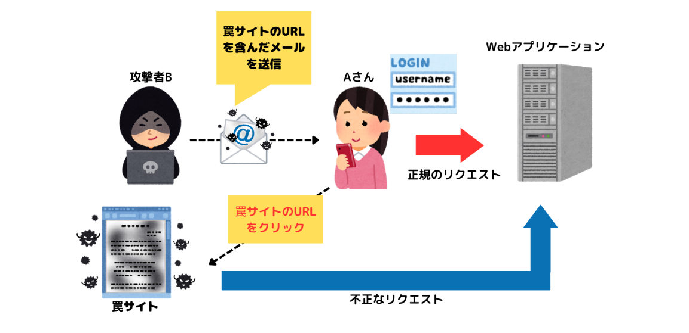
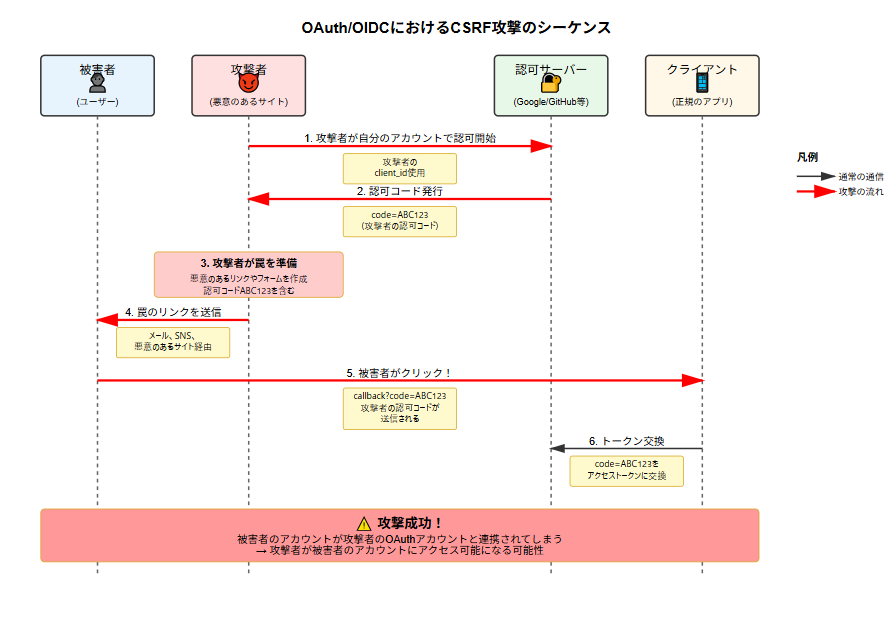
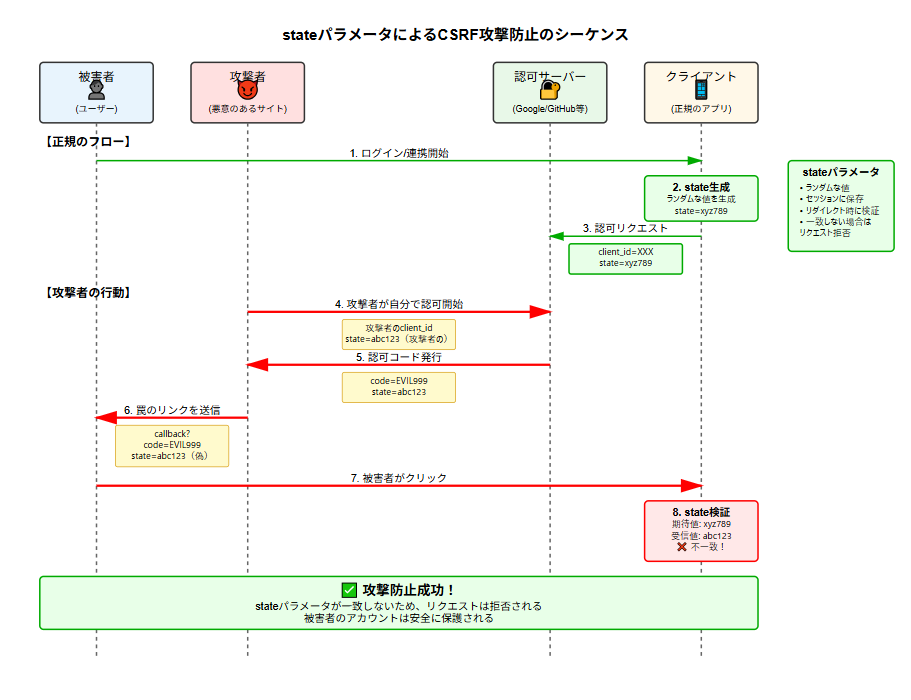
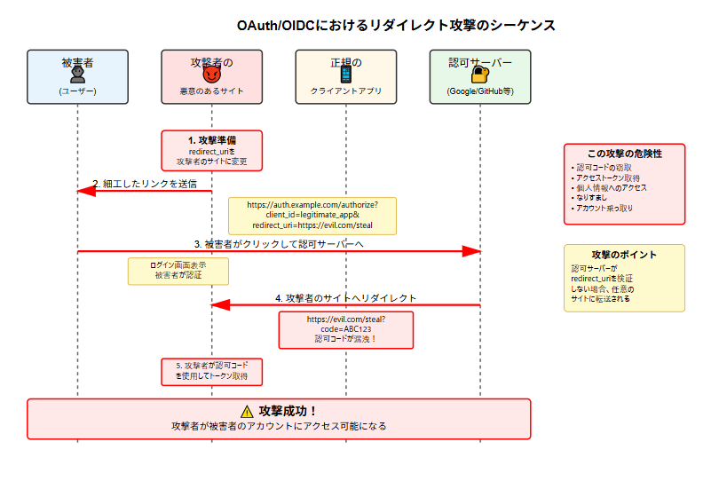
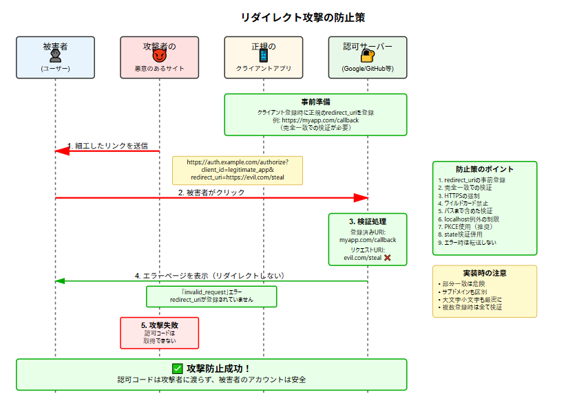
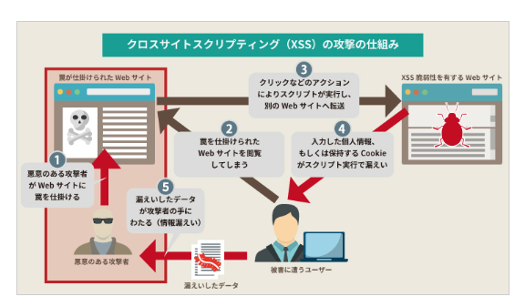
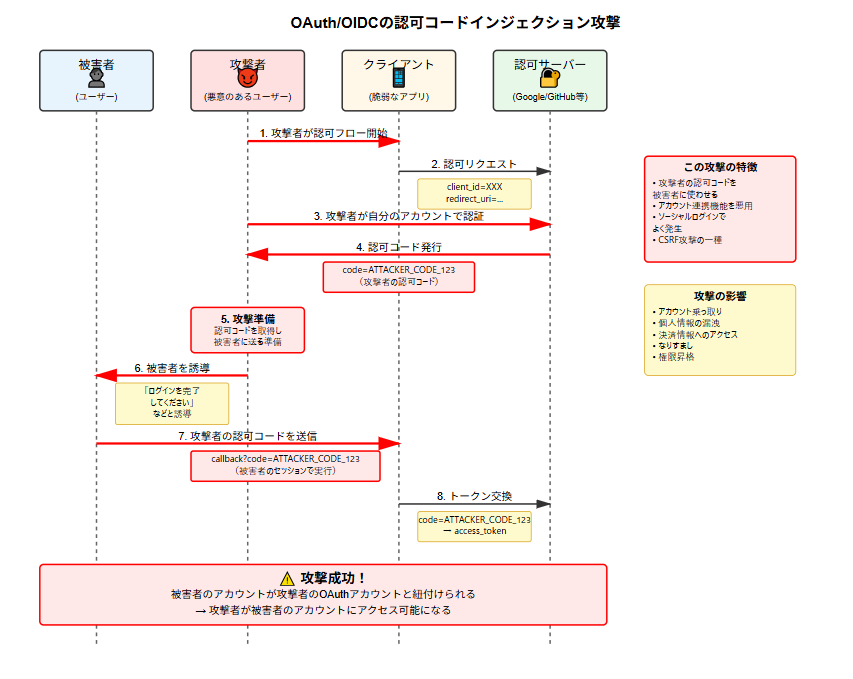
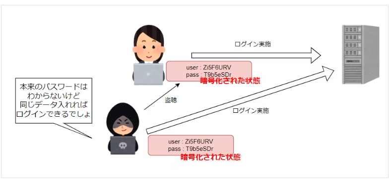
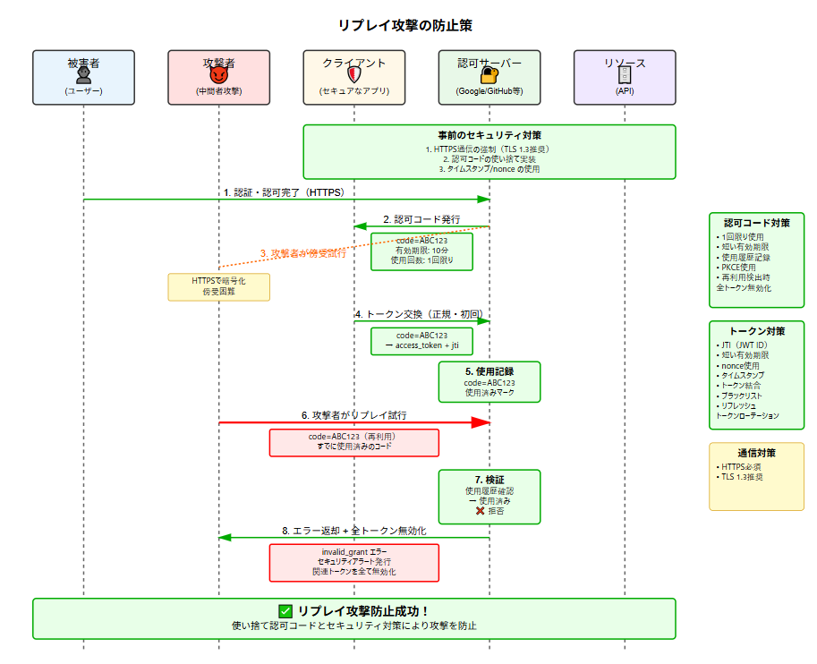

# 4. 具体的なセキュリティ脆弱性と対策

# はじめに

本章では OAuth（Open Authorization）および OIDC（OpenID Connect）における代表的な脆弱性と対策について解説します。

認証・認可プロトコルとして広く利用されているこれらの仕組みには、CSRF 攻撃、リダイレクト攻撃、クロスサイトスクリプティング、認可コードインジェクション等のセキュリティリスクが存在します。
これらの脆弱性を理解し、state パラメータや PKCE、nonce などの適切な対策を実装することで、より安全な認証・認可システムを構築することができます。

## 4.1.0 CSRF(Cross-Stie-Request-forgery)

CSRF 攻撃とは
すばり、悪意のある Web サイトが、ユーザーが知らないうちに別の Web サイトに対して不正なリクエストを送信させる攻撃手法です！

以下は典型的な攻撃の 1 例になります。



A さんは、自身の預金残高を確認しようと銀行の Web アプリへログインし、そのままログアウトをせずサイトを離れました。その後、攻撃者 B からメールで送られてきた「罠のサイト」の URL をクリックし、アクセスしてしまいます。

この罠サイトは、「攻撃対象の Web アプリケーション（今回は銀行サイト）に不正なリクエストを送信すること」を目的として、攻撃者 B が事前に作成したものです。

A さんが銀行の Web アプリにログインした状態でこの罠サイトにアクセスしたことで、銀行の Web アプリに不正なリクエストが自動送信され、A さんの口座から攻撃者 B の口座へ、意図せず 10 万円が振り込まれてしまいました。

このように CSRF 攻撃では、サービスにログイン中のユーザーに対し、攻撃者の意図にそったリクエストを実行させることができてしまいます。

そのほかの、よくある被害として、Ｘの利用者がツイートされた罠リンクを踏んでしまい、自分のアカウントで勝手にスパムのツイートがされるようになる、というものがあります。それ以外にも、自分のショッピングサイトのアカウントで勝手に物が購入されていたり、勝手にパスワードやメールアドレスが変更されていたりというような被害が起こる可能性があります。

## 4.1.1 OAuth2.0 の CSRF

続いて、OAuth2.0 での CSRF についてです。
OAuth2.0 における CSRF 攻撃とは、攻撃の標的となったユーザに攻撃者のリソースを処理させる権限を与えることです。



このシーケンス図では、OAuth/OIDC における CSRF 攻撃の流れを示しています。

**攻撃の仕組みを簡単に説明すると：**

1. **攻撃者が準備**：攻撃者は自分のアカウントで OAuth 認証を開始し、認可コードを取得します

2. **罠を仕掛ける**：攻撃者は取得した認可コードを含む悪意のあるリンクを作成します

3. **被害者を誘導**：メールや SNS、悪意のある Web サイトなどを通じて、被害者にリンクをクリックさせます

4. **認可コードの悪用**：被害者がリンクをクリックすると、攻撃者の認可コードがクライアントアプリケーションに送信されます

5. **アカウントの紐付け**：クライアントアプリは、被害者のセッションで攻撃者の認可コードを処理し、結果として被害者のアカウントが攻撃者の OAuth アカウントと紐付けられてしまいます

**なぜ危険なのか：**

- 被害者のアカウントに攻撃者がアクセスできるようになる可能性があります
- 被害者の個人情報が漏洩する恐れがあります
- 被害者になりすまして不正な操作を行われる可能性があります

この攻撃は、OAuth の認可フローにおいて「state」パラメータなどの検証が不十分な場合に成功します。

## 4.1.2 CSRF 攻撃の防止　'state'パラメータ

state パラメータにより、正当なフローで開始された OAuth 認証のみを受け入れることができ、CSRF 攻撃を防げます。
以下はそのシーケンスになります。



**重要なポイント：**

1. **state 生成**：クライアントアプリは認可リクエストを開始する際、ランダムな値（state）を生成し、セッションに保存します

2. **state の送信**：認可サーバーへのリクエストに state パラメータを含めます

3. **state の返却**：認可サーバーは、リダイレクト時に受け取った state をそのまま返します

4. **state 検証**：クライアントアプリは返ってきた state と、セッションに保存していた state を比較します

5. **攻撃の防止**：
   - 攻撃者は被害者のセッションに保存されている state の値を知ることができません
   - 攻撃者が送信する state は被害者のセッションの state と一致しないため、検証で弾かれます
   - これにより、CSRF 攻撃を防ぐことができます

**なぜ効果的なのか：**

- state は予測不可能なランダムな値
- セッションごとに異なる値が生成される
- 攻撃者は正しい state の値を推測できない
- 正規のフローでのみ、正しい state が維持される

## 4.2.0 リダイレクト攻撃

リダイレクト攻撃とは、ユーザーを意図しない悪意のあるウェブサイトに誘導するサイバー攻撃の一種です。

## 主な手法

**オープンリダイレクト攻撃**

- 正規のウェブサイトのリダイレクト機能を悪用
- URL パラメータを操作して、ユーザーを悪意のあるサイトへ転送
- 例：`https://example.com/redirect?url=http://malicious-site.com`

**リダイレクトチェーン攻撃**

- 複数のリダイレクトを連鎖させて最終的に悪意のあるサイトへ誘導
- 検出を困難にするため、複数の中間サイトを経由

## 攻撃の目的

攻撃者がリダイレクト攻撃を行う主な目的には以下があります：

- **フィッシング詐欺** - 偽のログインページに誘導し、認証情報を盗む
- **マルウェア配布** - 悪意のあるソフトウェアをダウンロードさせる
- **個人情報の窃取** - 偽のフォームで個人情報を入力させる
- **広告詐欺** - 不正な広告収入を得る

## 4.2.1 OAuth/OIDC のリダイレクト攻撃

攻撃者が redirect_uri パラメータを改ざんして、認可コードやアクセストークンを自分のサイトに誘導する攻撃です。



**リダイレクト攻撃の仕組み：**

- 攻撃者が正規の OAuth 認可 URL の`redirect_uri`パラメータを自分のサイトに改ざん
- 被害者がそのリンクをクリックして認証すると、認可コードが攻撃者のサイトに送信される
- 攻撃者はその認可コードを使って被害者のアカウントにアクセスできる



**防止策のポイント：**

1. **事前登録**：クライアント登録時に許可する redirect_uri を事前に登録
2. **厳密な検証**：認可サーバーは受信した redirect_uri が登録済みのものと完全一致するか検証
3. **エラー処理**：不正な redirect_uri の場合は、リダイレクトせずにエラーページを表示

この対策により、攻撃者が認可コードを窃取することを防ぎ、ユーザーのアカウントを保護できます。

## 4.3.0 クロスサイトスクリプティング攻撃

攻撃者が悪意のあるスクリプトを正規の Web サイトに注入し、他のユーザーのブラウザで実行させる攻撃です。



悪意のある攻撃者が Web サイトに罠を仕掛ける
罠を仕掛けられた Web サイトをユーザーが閲覧
ユーザーによるクリックなどのアクションによりスクリプトが実行し、別の Web サイトへ転送
入力した個人情報、もしくは保持する Cookie がスクリプト実行で漏えい
漏えいしたデータが攻撃者の手にわたる（情報漏えい）
図 1 のような順序を経て、ユーザーの個人情報が漏えい、あるいは Cookie が盗まれ、セッションの乗っ取りなどが可能となってしまいます。

## 4.3.1 OAuth/OIDC のクロスサイトスクリプティング

**アクセストークンの窃取**

- JavaScript からアクセス可能な場所（localStorage、sessionStorage など）にトークンが保存されている場合、XSS によって盗取される可能性

**認可コードの窃取**

- 認可フロー中に認可コードが URL に含まれる際、XSS によって傍受される危険性


OAuth/OIDC における XSS 攻撃のシーケンス図を作成します。次に、XSS 攻撃を防止するシーケンス図を作成します。OAuth/OIDC における XSS 攻撃のシーケンス図と防止策のシーケンス図を作成しました。

**XSS 攻撃の仕組み：**

- 攻撃者がクライアントアプリケーションの入力検証の不備を悪用
- 悪意のある JavaScript コードを注入（コメント欄、プロフィール、URL パラメータなど）
- 被害者がページを閲覧すると、スクリプトが実行される
- localStorage や Cookie からアクセストークンを盗み、攻撃者のサーバーに送信


**防止策のポイント：**

1. **入力検証とサニタイズ**

   - すべての入力値を検証
   - 危険な文字（`<`, `>`, `"`, `'`など）をエスケープ

2. **出力時のエスケープ**

   - HTML コンテキストでの適切なエスケープ
   - JavaScript コンテキストでの適切なエスケープ

3. **Content Security Policy (CSP)**

   - インラインスクリプトの実行を禁止
   - 外部サイトへの通信を制限

4. **トークンの安全な保存**
   - HttpOnly 属性付き Cookie を使用（JavaScript からアクセス不可）
   - Secure 属性で HTTPS 通信のみに制限
   - localStorage や sessionStorage は避ける

これらの対策を組み合わせることで、XSS 攻撃から OAuth/OIDC のトークンを保護し、ユーザーのアカウントを安全に守ることができます。

## 4.4.0 認可コードインジェクション攻撃と PKCE の重要性

**認可コードインジェクション攻撃とは：**

攻撃者が正規ユーザーの認可コードを横取りし、それを使って不正にアクセストークンを取得します

**攻撃の仕組み：**



- 攻撃者が自分のアカウントで認可フローを実行し、認可コードを取得
- その認可コードを被害者に使わせることで、被害者のアカウントを攻撃者の OAuth アカウントと紐付ける
- アカウント連携機能やソーシャルログイン機能を悪用する攻撃

**防止策の重要ポイント：**


1. **PKCE（Proof Key for Code Exchange）の使用**

   - `code_verifier`：クライアント側で生成するランダムな文字列
   - `code_challenge`：code_verifier の SHA256 ハッシュ値
   - 認可リクエスト時に challenge を送信し、トークン交換時に verifier で検証
   - 攻撃者は verifier を知らないため、盗んだ認可コードを使えない

2. **state パラメータの併用**

   - CSRF 対策として、ランダムな値をセッションに保存
   - リダイレクト時に検証することで、正規のフローを保証

3. **その他の対策**
   - 認可コードの単一使用（一度使われたら無効化）
   - 短い有効期限（通常 10 分以内）
   - クライアント認証の強化
   - ユーザー確認画面の表示

**なぜ PKCE が効果的なのか：**

- 認可コードと code_verifier が紐付いているため、正しい verifier なしではトークン交換できない
- 攻撃者は被害者のセッションの code_verifier を知ることができない
- OAuth 2.1 では全てのクライアントで PKCE が必須となる予定

これらの対策により、認可コードインジェクション攻撃を防ぎ、ユーザーのアカウントを安全に保護できます。

## 4.5.0 リプレイ攻撃

## 一般的なリプレイ攻撃

リプレイ攻撃は、正規の通信データを攻撃者が傍受・記録し、後でそのデータをそのまま再送信することで、正規ユーザーになりすます攻撃手法です。

### 基本的な仕組み

1. **傍受**: 攻撃者が正規の通信を盗聴
2. **記録**: 認証情報やトランザクションデータを保存
3. **再送信**: 記録したデータを後で再利用
4. **なりすまし**: システムは正規の通信と判断してしまう

### 一般的な例

- **ネットワーク認証**: ログイン時の認証パケットを再送信
- **金融取引**: 送金リクエストを複製して再実行
- **アクセスカード**: RFID カードの信号を記録・再生
- **ワンタイムパスワード**: 有効期限内の OTP を素早く再利用



## 4.5.1 OAuth/OIDC におけるリプレイ攻撃

正規ユーザーの認証で発行されたトークンやコードを攻撃者が盗み取り、それをそのまま再利用することで、正規ユーザーになりすましてリソースにアクセスする攻撃

**リプレイ攻撃の仕組み：**


- 攻撃者が中間者攻撃やネットワーク盗聴により、認可コードやトークンを傍受
- 傍受した認可コードやトークンを再利用（リプレイ）して、不正アクセスを試みる
- 検証が甘い場合、同じ認可コードやトークンで複数回アクセスできてしまう

**防止策の重要ポイント：**



**nonce によるリプレイ攻撃防止の仕組み：**

1. **nonce（Number used once）の生成**

   - クライアントが認可リクエスト前にランダムな値を生成
   - 暗号学的に安全な乱数生成器を使用（最低 128 ビット）
   - セッションに保存して後で検証に使用

2. **認可フローでの nonce 送信**

   - 認可リクエストに nonce パラメータとして含める
   - OIDC プロバイダーはこの nonce を ID トークンに含めて返却

3. **ID トークン受信時の検証**

   - ID トークン内の nonce クレームを抽出
   - セッションに保存していた nonce と比較
   - 一致した場合のみ、正規のトークンとして受け入れる

4. **なぜ攻撃を防げるのか**
   - 攻撃者が盗んだ ID トークンには nonce が含まれているが、攻撃者のセッションには対応する nonce が存在しない
   - nonce は一回限りの使用なので、再利用を検出できる
   - セッションとトークンの紐付けにより、異なるコンテキストでの使用を防ぐ

**nonce の重要な特性：**

- **一意性**：各認可リクエストで新しい値を生成
- **予測不可能性**：暗号学的に安全な乱数を使用
- **セッション紐付け**：クライアント側のセッションと関連付け
- **検証可能性**：ID トークンに含まれて返却される

PKCE の重要性と実装について、これまでの攻撃パターンを踏まえて詳しく説明します。

## 4.6.0 PKCE の重要性

### 1. 複数の攻撃を同時に防御

**PKCE（Proof Key for Code Exchange）は、これまで見てきた多くの攻撃を効果的に防ぎます：**

- **認可コードインジェクション攻撃**：攻撃者の認可コードは対応する code_verifier がないため使用不可
- **リダイレクト攻撃**：認可コードが盗まれても、code_verifier なしではトークン交換不可
- **リプレイ攻撃**：認可コードと code_verifier のペアが必要なため、単純な再送では攻撃不可
- **中間者攻撃**：code_verifier はクライアントのみが知る秘密情報

### 2. パブリッククライアントの保護

**特に重要なのは、クライアントシークレットを安全に保存できない環境：**

- SPA アプリケーション
- モバイルアプリ
- デスクトップアプリ

これらの環境では、PKCE が事実上唯一の効果的な保護手段です。

### 3. OAuth 2.1 での必須化

OAuth 2.1 では、**すべてのクライアント**で PKCE が必須となります。これは、その効果が広く認められた結果です。

## PKCE の実装方法

### 基本的な流れ

```
1. code_verifier生成（クライアント）
   ↓
2. code_challenge計算（クライアント）
   ↓
3. 認可リクエスト送信（code_challengeを含む）
   ↓
4. 認可コード受信
   ↓
5. トークン交換（code_verifierを含む）
   ↓
6. サーバー側で検証
```

### 実装の詳細

#### 1. code_verifier の生成

```javascript
// 暗号学的に安全な乱数生成（43-128文字）
function generateCodeVerifier() {
  const array = new Uint8Array(32);
  crypto.getRandomValues(array);
  return base64UrlEncode(array);
}

function base64UrlEncode(array) {
  return btoa(String.fromCharCode.apply(null, array))
    .replace(/\+/g, "-")
    .replace(/\//g, "_")
    .replace(/=/g, "");
}
```

#### 2. code_challenge の計算

```javascript
// SHA256ハッシュを計算してBase64URL エンコード
async function generateCodeChallenge(verifier) {
  const encoder = new TextEncoder();
  const data = encoder.encode(verifier);
  const hash = await crypto.subtle.digest("SHA-256", data);
  return base64UrlEncode(new Uint8Array(hash));
}
```

#### 3. 認可リクエスト

```javascript
// 認可エンドポイントへのリクエスト
const authUrl = new URL("https://auth.example.com/authorize");
authUrl.searchParams.append("client_id", CLIENT_ID);
authUrl.searchParams.append("redirect_uri", REDIRECT_URI);
authUrl.searchParams.append("response_type", "code");
authUrl.searchParams.append("scope", "openid profile");
authUrl.searchParams.append("state", generateState());
authUrl.searchParams.append("nonce", generateNonce());
authUrl.searchParams.append("code_challenge", codeChallenge);
authUrl.searchParams.append("code_challenge_method", "S256");

// code_verifierはセッションストレージに保存
sessionStorage.setItem("code_verifier", codeVerifier);

window.location.href = authUrl.toString();
```

#### 4. トークン交換

```javascript
// コールバック受信後のトークン交換
async function exchangeCodeForToken(code) {
  const codeVerifier = sessionStorage.getItem("code_verifier");

  const response = await fetch("https://auth.example.com/token", {
    method: "POST",
    headers: {
      "Content-Type": "application/x-www-form-urlencoded",
    },
    body: new URLSearchParams({
      grant_type: "authorization_code",
      code: code,
      redirect_uri: REDIRECT_URI,
      client_id: CLIENT_ID,
      code_verifier: codeVerifier, // PKCEの重要部分
    }),
  });

  // code_verifierをセッションから削除（セキュリティ）
  sessionStorage.removeItem("code_verifier");

  return response.json();
}
```

### セキュリティ上の注意点

#### 1. code_verifier の保存

```javascript
// ❌ 悪い例：グローバル変数
let codeVerifier = generateCodeVerifier();

// ✅ 良い例：セッションストレージ（タブごとに独立）
sessionStorage.setItem("code_verifier", codeVerifier);

// ❌ 避けるべき：localStorage（永続化される）
// localStorage.setItem('code_verifier', codeVerifier);
```

#### 2. エラーハンドリング

```javascript
async function handleCallback() {
  const params = new URLSearchParams(window.location.search);

  // エラーチェック
  if (params.get("error")) {
    console.error("認可エラー:", params.get("error_description"));
    return;
  }

  // state検証（CSRF対策）
  const state = params.get("state");
  const savedState = sessionStorage.getItem("oauth_state");
  if (state !== savedState) {
    console.error("state不一致：CSRF攻撃の可能性");
    return;
  }

  // code_verifierの存在確認
  const codeVerifier = sessionStorage.getItem("code_verifier");
  if (!codeVerifier) {
    console.error("code_verifierが見つかりません");
    return;
  }

  // トークン交換
  const code = params.get("code");
  await exchangeCodeForToken(code);
}
```

### サーバー側の実装

```python
# 認可サーバー側の検証例
def verify_pkce(code, code_verifier):
    # 保存されているcode_challengeを取得
    stored_challenge = get_stored_challenge(code)

    # code_verifierからcode_challengeを計算
    calculated_challenge = base64url_encode(
        hashlib.sha256(code_verifier.encode()).digest()
    )

    # 一致確認
    if not constant_time_compare(stored_challenge, calculated_challenge):
        raise InvalidGrantError("Invalid code_verifier")

    return True
```

## PKCE とその他の対策の組み合わせ

```javascript
// 完全なセキュアな実装例
class SecureOAuthClient {
  constructor(config) {
    this.config = config;
  }

  async startAuthFlow() {
    // 1. PKCE準備
    const codeVerifier = this.generateCodeVerifier();
    const codeChallenge = await this.generateCodeChallenge(codeVerifier);

    // 2. CSRF対策（state）
    const state = this.generateSecureRandom();

    // 3. リプレイ攻撃対策（nonce）
    const nonce = this.generateSecureRandom();

    // セッションに保存
    const sessionData = {
      codeVerifier,
      state,
      nonce,
      timestamp: Date.now(), // タイムアウト用
    };
    sessionStorage.setItem("oauth_session", JSON.stringify(sessionData));

    // 認可リクエスト構築
    const authUrl = this.buildAuthUrl({
      code_challenge: codeChallenge,
      code_challenge_method: "S256",
      state: state,
      nonce: nonce,
    });

    window.location.href = authUrl;
  }

  async handleCallback(callbackUrl) {
    const params = new URLSearchParams(callbackUrl.search);
    const sessionData = JSON.parse(sessionStorage.getItem("oauth_session"));

    // タイムアウトチェック（10分）
    if (Date.now() - sessionData.timestamp > 600000) {
      throw new Error("認証タイムアウト");
    }

    // 各種検証
    this.verifyState(params.get("state"), sessionData.state);

    // トークン交換
    const tokens = await this.exchangeCode(
      params.get("code"),
      sessionData.codeVerifier
    );

    // IDトークンのnonce検証
    this.verifyIdToken(tokens.id_token, sessionData.nonce);

    // クリーンアップ
    sessionStorage.removeItem("oauth_session");

    return tokens;
  }
}
```

## PKCE の重要性まとめ

PKCE は、OAuth/OIDC の多くの攻撃ベクトルを効果的に防ぐ重要なセキュリティ機能です。特に：

1. **実装が比較的簡単**：クライアント側での乱数生成とハッシュ計算のみ
2. **後方互換性**：PKCE に対応していないサーバーでも動作可能
3. **多層防御**：state、nonce と組み合わせることで、より強固なセキュリティを実現

すべての新規実装では、クライアントの種類に関わらず PKCE を実装することを強く推奨します。

## 4.7.0 OAuth/OIDC の代表的な脆弱性と対策まとめ


