# 7. セキュリティ強化プロファイル


## 7.1. OAuth/OIDC における EAP（Enhanced Authorization Protocol）によるセキュリティ強化

### EAP とは

EAP（Enhanced Authorization Protocol）は、OAuth 2.0 の拡張仕様で、標準的な OAuth/OIDC フローに追加のセキュリティレイヤーを提供します。特に、**認可プロセスの透明性向上**と**不正な認可の防止**に焦点を当てており、ユーザーが何を許可したかを明確に追跡・管理できるようにします。

### なぜ EAP が必要なのか

従来の OAuth 2.0 では以下の課題がありました：

1. **認可の不透明性**：ユーザーが過去に何を許可したか把握しにくい
2. **取り消しの困難さ**：個別の認可を細かく管理できない
3. **なりすましリスク**：悪意のあるアプリが正規アプリを装う

### EAP の主要な機能

#### 1. 認可の詳細な記録と管理

EAP では、すべての認可を詳細に記録し、ユーザーが後から確認・管理できるようにします。従来の OAuth では「いつ」「何を」許可したかが曖昧でしたが、EAP ではすべての認可に一意の ID を付与し、詳細なコンテキスト情報と共に保存します。


```java
@Entity
public class EnhancedAuthorization {
@Id
private String authorizationId;

    private String userId;
    private String clientId;
    private Instant authorizedAt;
    private String authorizationDetails;  // 詳細な認可内容
    private String userAgent;
    private String ipAddress;

    // EAP特有のフィールド
    private String authorizationFingerprint;  // 認可の一意識別子
    private AuthorizationContext context;     // 認可時のコンテキスト
    private List<AuthorizationConstraint> constraints;  // 制約条件

}

@Service
public class EAPAuthorizationService {

    public AuthorizationResponse authorize(AuthorizationRequest request) {
        // 1. 認可コンテキストの生成
        AuthorizationContext context = buildContext(request);

        // 2. リスク評価
        RiskScore riskScore = assessRisk(context);
        if (riskScore.isHigh()) {
            return requireAdditionalVerification(request);
        }

        // 3. 詳細な認可記録の作成
        EnhancedAuthorization auth = new EnhancedAuthorization();
        auth.setAuthorizationId(generateUniqueId());
        auth.setAuthorizationFingerprint(generateFingerprint(request));
        auth.setContext(context);
        auth.setConstraints(determineConstraints(request));

        // 4. ユーザーへの通知
        notifyUser(auth);

        return createResponse(auth);
    }

}

```

#### 2. Rich Authorization Requests (RAR)

RAR は、従来の単純なスコープベースの認可を、より詳細で文脈的な認可要求に拡張します。例えば、「送金」という単純なスコープではなく、「誰に」「いくら」「いつまで」といった詳細な条件を含めることができます。

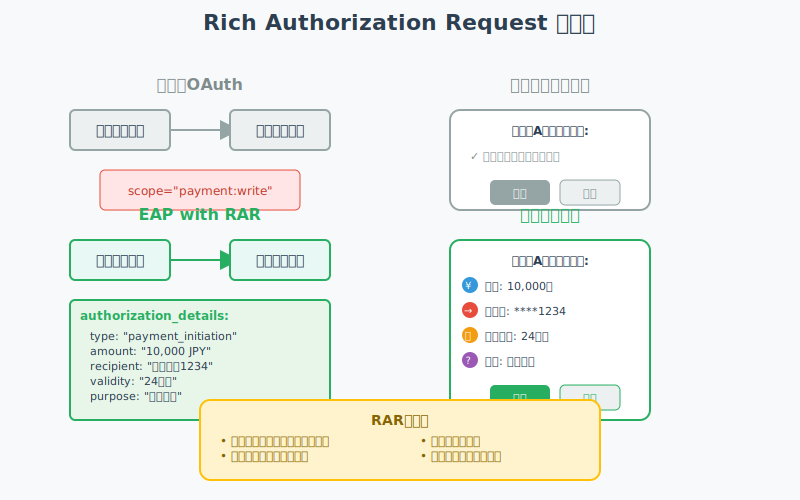

```java
public class RichAuthorizationRequest {

    // 従来のスコープに加えて、詳細な認可要求
    private List<AuthorizationDetail> authorizationDetails;

    public static class AuthorizationDetail {
        private String type;          // 例: "payment", "account_access"
        private List<String> actions; // 例: ["read", "write"]
        private List<String> locations; // リソースの場所
        private Map<String, Object> additionalData;
    }
}

// 実装例
@PostMapping("/oauth/authorize")
public String handleRichAuthorization(@RequestBody String request) {
    // RARリクエストの例
    /*
    {
        "authorization_details": [
            {
                "type": "payment_initiation",
                "actions": ["execute"],
                "locations": ["https://api.bank.com/payments"],
                "instructedAmount": {
                    "currency": "JPY",
                    "amount": "10000"
                },
                "recipient": {
                    "accountNumber": "1234567890"
                }
            }
        ]
    }
    */

    RichAuthorizationRequest rar = parseRequest(request);

    // 詳細な認可内容をユーザーに表示
    return displayDetailedConsent(rar);
}
```

#### 3. 動的な認可管理

ユーザーは付与した認可を後から確認し、個別に取り消したり、制限を追加したりできます。これにより、「全部取り消すか、全部許可するか」という二択ではなく、きめ細かな制御が可能になります。

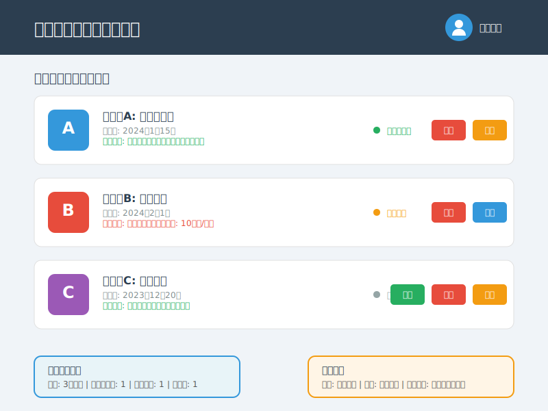

```java
@RestController
@RequestMapping("/api/authorizations")
public class AuthorizationManagementController {

    @GetMapping
    public List<AuthorizationSummary> getUserAuthorizations(
            @AuthenticationPrincipal User user) {
        // ユーザーの全認可を取得
        return authService.findByUserId(user.getId())
            .stream()
            .map(this::toSummary)
            .collect(Collectors.toList());
    }

    @DeleteMapping("/{authorizationId}")
    public void revokeAuthorization(
            @PathVariable String authorizationId,
            @AuthenticationPrincipal User user) {
        // 個別の認可を取り消し
        EnhancedAuthorization auth = authService.findById(authorizationId);

        if (!auth.getUserId().equals(user.getId())) {
            throw new ForbiddenException();
        }

        // 関連するトークンも無効化
        tokenService.revokeTokensForAuthorization(authorizationId);
        authService.revoke(authorizationId);

        // クライアントに通知
        notifyClient(auth.getClientId(), authorizationId);
    }

    @PutMapping("/{authorizationId}/constraints")
    public void updateConstraints(
            @PathVariable String authorizationId,
            @RequestBody List<AuthorizationConstraint> constraints) {
        // 認可に制約を追加（例：時間制限、地理的制限）
        authService.updateConstraints(authorizationId, constraints);
    }
}
```

### EAP のセキュリティ強化機能

#### 1. 認可フィンガープリント

各認可に一意のフィンガープリントを生成し、認可の偽造や改ざんを防ぎます。このフィンガープリントは、認可の詳細情報から生成される暗号学的ハッシュで、後から検証可能です。


```java
@Component
public class AuthorizationFingerprintGenerator {

    public String generateFingerprint(AuthorizationRequest request) {
        // 認可の一意性を保証するフィンガープリント生成
        String data = String.join("|",
            request.getClientId(),
            request.getUserId(),
            request.getScopes().toString(),
            request.getAuthorizationDetails().toString(),
            String.valueOf(System.currentTimeMillis())
        );

        return DigestUtils.sha256Hex(data);
    }

    public boolean verifyFingerprint(String authorizationId,
                                   String providedFingerprint) {
        EnhancedAuthorization auth = repository.findById(authorizationId);
        return MessageDigest.isEqual(
            auth.getAuthorizationFingerprint().getBytes(),
            providedFingerprint.getBytes()
        );
    }

}

```

#### 2. コンテキストベースの認可

認可時の状況（デバイス、場所、時間など）を記録し、通常と異なるパターンを検出します。これにより、アカウント乗っ取りなどの異常を早期に発見できます。


```java
public class ContextAwareAuthorizationService {

    public AuthorizationDecision evaluate(AuthorizationContext context) {
        // デバイス情報の検証
        if (!isKnownDevice(context.getDeviceId())) {
            return AuthorizationDecision.requireDeviceVerification();
        }

        // 地理的位置の検証
        if (isUnusualLocation(context.getLocation())) {
            return AuthorizationDecision.requireAdditionalAuth();
        }

        // 時間帯の検証
        if (isOutsideNormalHours(context.getTimestamp())) {
            return AuthorizationDecision.applyTimeRestriction();
        }

        return AuthorizationDecision.allow();
    }

    private class AuthorizationContext {
        private String deviceId;
        private GeoLocation location;
        private Instant timestamp;
        private String networkType;
        private Map<String, String> additionalFactors;
    }

}

```

#### 3. 認可イベントの監査とアラート

すべての認可イベントを記録し、異常なパターンを検出して管理者やユーザーに通知します。これにより、不正使用を早期に発見し、被害を最小限に抑えることができます。

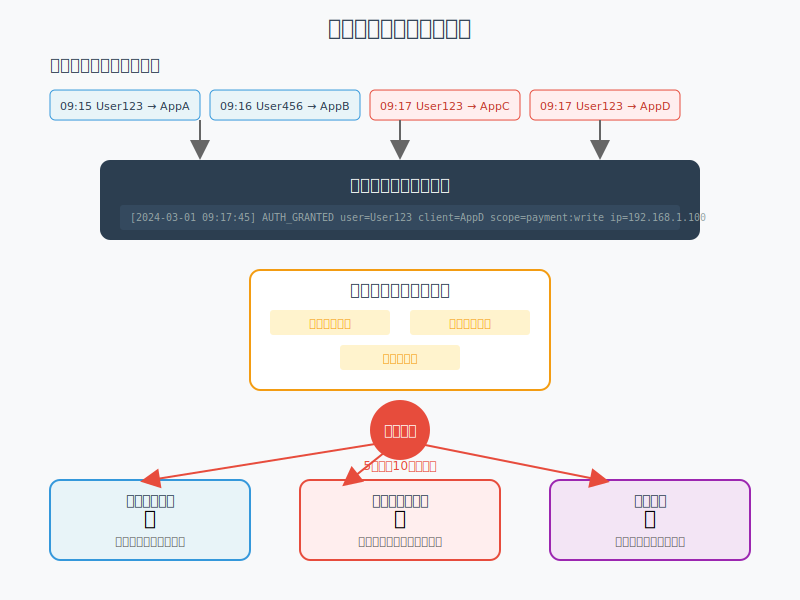

```java
@Component
@EventListener
public class EAPAuditService {

    public void onAuthorizationEvent(AuthorizationEvent event) {
        // 詳細な監査ログ
        AuditLog log = AuditLog.builder()
            .eventType(event.getType())
            .authorizationId(event.getAuthorizationId())
            .userId(event.getUserId())
            .clientId(event.getClientId())
            .details(event.getDetails())
            .timestamp(Instant.now())
            .build();

        auditRepository.save(log);

        // 異常検知
        if (detectAnomaly(event)) {
            alertService.sendAlert(new SecurityAlert(
                "異常な認可パターンを検出",
                event
            ));
        }
    }

    private boolean detectAnomaly(AuthorizationEvent event) {
        // 短時間での大量認可
        long recentCount = getRecentAuthorizationCount(
            event.getUserId(),
            Duration.ofMinutes(5)
        );

        if (recentCount > 10) {
            return true;
        }

        // 異常なスコープの組み合わせ
        if (hasUnusualScopeCombination(event.getScopes())) {
            return true;
        }

        return false;
    }
}
```

### EAP の実装ベストプラクティス

EAP を効果的に実装するには、適切な設定と段階的な展開が重要です。特に、ユーザビリティとセキュリティのバランスを保ちながら、段階的に機能を有効化していくアプローチが推奨されます。

```java
@Configuration
public class EAPConfiguration {

    @Bean
    public EAPSettings eapSettings() {
        return EAPSettings.builder()
            // 認可の有効期限を短く設定
            .authorizationLifetime(Duration.ofDays(30))

            // 詳細な認可要求を必須に
            .requireAuthorizationDetails(true)

            // コンテキスト検証を有効化
            .enableContextValidation(true)

            // 認可履歴の保持期間
            .auditRetentionPeriod(Duration.ofDays(365))

            // リスクベース認証の閾値
            .riskThreshold(0.7)

            .build();
    }
}

// ユーザーインターフェースの実装
@Controller
public class EAPConsentController {

    @GetMapping("/oauth/consent")
    public String showEnhancedConsent(Model model,
                                    @RequestParam String authorizationId) {
        EnhancedAuthorization auth = authService.findById(authorizationId);

        // 詳細な認可内容を分かりやすく表示
        model.addAttribute("clientName", auth.getClientName());
        model.addAttribute("authorizationDetails",
            formatAuthorizationDetails(auth.getAuthorizationDetails()));
        model.addAttribute("constraints", auth.getConstraints());
        model.addAttribute("expiresAt", auth.getExpiresAt());

        return "enhanced-consent";
    }
}
```

EAP は、OAuth/OIDC の基本的なセキュリティを大幅に強化し、ユーザーに認可の完全な制御を提供します。実装には追加の複雑さが伴いますが、特に金融や医療などの高セキュリティが要求される分野では必須の技術となっています。

## 7.2 OAuth/OIDC の FIDO2/WebAuthn との統合

### 概要

OAuth/OIDC と FIDO2/WebAuthn の統合は、パスワードレス認証とフィッシング耐性を組み合わせることで、最高レベルのセキュリティを実現します。従来のパスワードベースの認証を FIDO2/WebAuthn に置き換えることで、認証プロセス全体のセキュリティが根本的に向上し、ユーザビリティも改善されます。

WebAuthn/FIDO2 は、パスワードに代わる認証技術で、指紋認証や顔認証、セキュリティキーなどを使って Web サイトにログインする仕組みです。

### WebAuthn/FIDO2 とは

**FIDO2**は、FIDO Alliance（Fast IDentity Online）が策定した認証標準で、以下の 2 つの仕様から構成されています：

- **WebAuthn**（Web Authentication）：W3C が標準化したブラウザ API
- **CTAP**（Client to Authenticator Protocol）：認証器とデバイス間の通信プロトコル

この技術により、ユーザーは以下のような方法でログインできます：

- スマートフォンの指紋センサーや顔認証
- PC の指紋リーダーや Windows Hello
- YubiKey などの物理的なセキュリティキー

## OAuth/OIDC との違い

根本的な違いは「何を解決するか」にあります：

**WebAuthn/FIDO2**

- 目的：「あなたは誰か」を証明する（認証）
- 動作：サービスに直接ログインする
- 例：GitHub に指紋認証でログイン

**OAuth 2.0**

- 目的：「何にアクセスできるか」を管理する（認可）
- 動作：他のサービスへのアクセス権限を委譲
- 例：写真アプリが Google ドライブの写真にアクセスする許可

**OpenID Connect (OIDC)**

- 目的：「あなたは誰か」を他のサービスに証明する（認証連携）
- 動作：信頼できる第三者（IdP）が身元を保証
- 例：「Google でログイン」ボタンで他サイトにログイン

## 技術的な特徴

WebAuthn/FIDO2 の重要な特徴：

- **公開鍵暗号方式**：パスワードと違い、秘密情報がサーバーに保存されない
- **フィッシング耐性**：偽サイトでは認証が成功しない
- **プライバシー保護**：サイトごとに異なる認証情報を使用

これらの技術は組み合わせて使うこともできます。例えば、Google アカウントに WebAuthn でログインし、その Google アカウントを使って OIDC で他のサービスにログインする、といった使い方が可能です。

### なぜ統合が必要なのか

1. **パスワードの脆弱性排除**：OAuth/OIDC の認証段階でパスワードを使用している限り、フィッシングのリスクは残る
2. **ユーザー体験の向上**：生体認証により、複雑なパスワードを覚える必要がなくなる
3. **規制要件への対応**：金融・医療分野でのフィッシング耐性認証の義務化

### 統合アーキテクチャ

FIDO2/WebAuthn を OAuth/OIDC フローに統合する際は、認証サーバー（IdP）が WebAuthn RP として機能し、ユーザーの認証器と直接やり取りします。

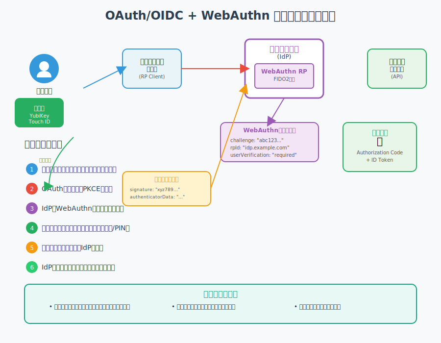

### 統合実装の詳細

#### 1. 認証サーバー（IdP）の WebAuthn 対応

認証サーバーを WebAuthn RP として機能させるには、チャレンジの生成、認証器の登録、署名の検証などの機能を実装する必要があります。


```java
@Service
public class WebAuthnService {

    private final RelyingParty relyingParty;
    private final CredentialRepository credentialRepository;

    public WebAuthnService() {
        this.relyingParty = RelyingParty.builder()
            .identity(RelyingPartyIdentity.builder()
                .id("idp.example.com")
                .name("My OAuth IdP")
                .build())
            .credentialRepository(credentialRepository)
            .origins(Set.of("https://idp.example.com"))
            .build();
    }

    // 登録フローの開始
    public PublicKeyCredentialCreationOptions startRegistration(
            String userId, String username) {

        UserIdentity userIdentity = UserIdentity.builder()
            .name(username)
            .displayName(username)
            .id(new ByteArray(userId.getBytes()))
            .build();

        // 既存の認証器を取得
        List<PublicKeyCredentialDescriptor> excludeCredentials =
            credentialRepository.getCredentialIdsForUsername(username)
                .stream()
                .map(credId -> PublicKeyCredentialDescriptor.builder()
                    .id(credId)
                    .build())
                .collect(Collectors.toList());

        StartRegistrationOptions registrationOptions =
            StartRegistrationOptions.builder()
                .user(userIdentity)
                .excludeCredentials(excludeCredentials)
                .authenticatorSelection(AuthenticatorSelectionCriteria.builder()
                    .userVerification(UserVerificationRequirement.REQUIRED)
                    .authenticatorAttachment(AuthenticatorAttachment.CROSS_PLATFORM)
                    .build())
                .timeout(60000)
                .build();

        return relyingParty.startRegistration(registrationOptions);
    }

    // 登録の完了
    public void finishRegistration(
            String userId,
            PublicKeyCredential<AuthenticatorAttestationResponse> credential,
            PublicKeyCredentialCreationOptions options) {

        try {
            RegistrationResult result = relyingParty.finishRegistration(
                FinishRegistrationOptions.builder()
                    .request(options)
                    .response(credential)
                    .build()
            );

            if (result.isAttestationTrusted()) {
                // 認証器情報を保存
                saveCredential(userId, result);
                logger.info("WebAuthn登録成功: userId={}", userId);
            } else {
                throw new SecurityException("信頼できない認証器です");
            }

        } catch (RegistrationFailedException e) {
            logger.error("WebAuthn登録失敗", e);
            throw new AuthenticationException("登録に失敗しました", e);
        }
    }

}

```

#### 2. OAuth 認証フローへの組み込み

WebAuthn を OAuth の認証フローに組み込む際は、従来のパスワード認証を WebAuthn 認証に置き換えます。


```java
@Controller
@RequestMapping("/oauth")
public class OAuthWebAuthnController {

    private final WebAuthnService webAuthnService;
    private final OAuthService oauthService;

    // OAuth認証エンドポイント（WebAuthn統合）
    @GetMapping("/authorize")
    public String authorize(
            @RequestParam String clientId,
            @RequestParam String redirectUri,
            @RequestParam String state,
            @RequestParam(required = false) String codeChallenge,
            HttpSession session,
            Model model) {

        // OAuth パラメータの検証
        oauthService.validateAuthorizationRequest(
            clientId, redirectUri, state, codeChallenge
        );

        // セッションに保存
        session.setAttribute("oauth_request", OAuthRequest.builder()
            .clientId(clientId)
            .redirectUri(redirectUri)
            .state(state)
            .codeChallenge(codeChallenge)
            .build()
        );

        // WebAuthn認証ページを表示
        model.addAttribute("clientName", getClientName(clientId));
        return "webauthn-login";
    }

    // WebAuthn認証開始
    @PostMapping("/webauthn/authenticate/start")
    @ResponseBody
    public AssertionRequest startAuthentication(
            @RequestParam String username,
            HttpSession session) {

        // WebAuthnチャレンジを生成
        PublicKeyCredentialRequestOptions options =
            webAuthnService.startAuthentication(username);

        // セッションに保存
        session.setAttribute("webauthn_challenge", options);
        session.setAttribute("username", username);

        return AssertionRequest.builder()
            .publicKey(options)
            .build();
    }

    // WebAuthn認証完了
    @PostMapping("/webauthn/authenticate/finish")
    @ResponseBody
    public AuthenticationResponse finishAuthentication(
            @RequestBody PublicKeyCredential<AuthenticatorAssertionResponse> credential,
            HttpSession session) {

        try {
            // セッションから情報を取得
            PublicKeyCredentialRequestOptions options =
                (PublicKeyCredentialRequestOptions) session.getAttribute("webauthn_challenge");
            String username = (String) session.getAttribute("username");

            // WebAuthn認証を検証
            webAuthnService.finishAuthentication(username, credential, options);

            // OAuth認証コードを生成
            OAuthRequest oauthRequest =
                (OAuthRequest) session.getAttribute("oauth_request");
            String authorizationCode =
                oauthService.generateAuthorizationCode(username, oauthRequest);

            // リダイレクトURLを構築
            String redirectUrl = buildRedirectUrl(
                oauthRequest.getRedirectUri(),
                authorizationCode,
                oauthRequest.getState()
            );

            return AuthenticationResponse.builder()
                .success(true)
                .redirectUrl(redirectUrl)
                .build();

        } catch (Exception e) {
            logger.error("WebAuthn認証失敗", e);
            return AuthenticationResponse.builder()
                .success(false)
                .error("認証に失敗しました")
                .build();
        }
    }
}
```

#### 3. 段階的な認証レベル（AAL）の実装

NIST SP 800-63-3 で定義されている認証保証レベル（AAL）に基づき、リソースの重要度に応じて必要な認証レベルを設定します。

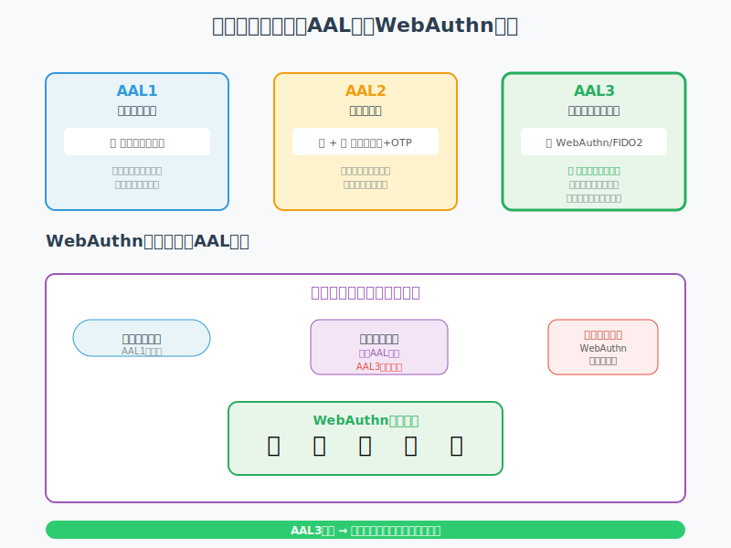

```java
@Service
public class AuthenticationAssuranceLevelService {

    // リソースごとの必要AALを定義
    private static final Map<String, Integer> RESOURCE_AAL_REQUIREMENTS = Map.of(
        "/api/public", 1,
        "/api/profile", 2,
        "/api/payment", 3,
        "/api/admin", 3
    );

    @Component
    public class AALEnforcementInterceptor implements HandlerInterceptor {

        @Override
        public boolean preHandle(HttpServletRequest request,
                               HttpServletResponse response,
                               Object handler) throws Exception {

            String path = request.getRequestURI();
            int requiredAAL = getRequiredAAL(path);
            int currentAAL = getCurrentUserAAL(request);

            if (currentAAL < requiredAAL) {
                // ステップアップ認証が必要
                response.setStatus(HttpStatus.FORBIDDEN.value());
                response.setContentType("application/json");

                StepUpAuthenticationRequired stepUp = StepUpAuthenticationRequired.builder()
                    .currentAAL(currentAAL)
                    .requiredAAL(requiredAAL)
                    .authenticationMethods(getAvailableMethodsForAAL(requiredAAL))
                    .challengeEndpoint("/oauth/stepup/challenge")
                    .build();

                objectMapper.writeValue(response.getWriter(), stepUp);
                return false;
            }

            return true;
        }

        private List<String> getAvailableMethodsForAAL(int aal) {
            return switch (aal) {
                case 1 -> List.of("password");
                case 2 -> List.of("password_otp", "webauthn");
                case 3 -> List.of("webauthn");
                default -> List.of();
            };
        }
    }

    // ステップアップ認証の実装
    @PostMapping("/oauth/stepup/challenge")
    public StepUpChallengeResponse initiateStepUp(
            @RequestParam int targetAAL,
            @AuthenticationPrincipal OAuthUser user) {

        if (targetAAL == 3) {
            // WebAuthn認証を要求
            PublicKeyCredentialRequestOptions options =
                webAuthnService.startAuthentication(user.getUsername());

            return StepUpChallengeResponse.builder()
                .challengeType("webauthn")
                .webAuthnOptions(options)
                .sessionId(generateSessionId())
                .build();
        }

        // 他のAALレベルの処理
        // ...
    }

    // IDトークンにAAL情報を含める
    @Component
    public class AALClaimsEnhancer implements TokenEnhancer {

        @Override
        public OAuth2AccessToken enhance(OAuth2AccessToken accessToken,
                                       OAuth2Authentication authentication) {

            Map<String, Object> additionalInfo = new HashMap<>();
            OAuthUser user = (OAuthUser) authentication.getPrincipal();

            // 認証コンテキストの追加
            additionalInfo.put("acr", getAuthenticationContextReference(user));
            additionalInfo.put("amr", user.getAuthenticationMethods());
            additionalInfo.put("aal", user.getAuthenticationAssuranceLevel());

            ((DefaultOAuth2AccessToken) accessToken).setAdditionalInformation(additionalInfo);
            return accessToken;
        }

        private String getAuthenticationContextReference(OAuthUser user) {
            if (user.getAuthenticationMethods().contains("webauthn")) {
                return "https://www.nist.gov/aal3";
            } else if (user.getAuthenticationMethods().size() > 1) {
                return "https://www.nist.gov/aal2";
            } else {
                return "https://www.nist.gov/aal1";
            }
        }
    }

}

```

### 実装のベストプラクティス

OAuth/OIDC と WebAuthn を統合する際は、後方互換性を保ちながら段階的に導入することが重要です。既存のパスワードユーザーを徐々に WebAuthn に移行させる戦略が必要です。

```java
@Configuration
public class WebAuthnOAuthConfiguration {

    @Bean
    public WebAuthnMigrationStrategy migrationStrategy() {
        return WebAuthnMigrationStrategy.builder()
            // 段階的な移行設定
            .enablePasswordFallback(true)  // 初期はパスワードも許可
            .webAuthnPromptFrequency(LoginFrequency.EVERY_THIRD_LOGIN)
            .mandatoryWebAuthnDate(LocalDate.of(2025, 1, 1))

            // ユーザーグループ別の設定
            .adminUsersMustUseWebAuthn(true)
            .highValueUserThreshold(MonetaryAmount.of(10000, "JPY"))

            // インセンティブ設定
            .webAuthnAdoptionIncentives(List.of(
                "セキュリティバッジの付与",
                "ログイン時間の短縮",
                "追加機能へのアクセス"
            ))
            .build();
    }

    @Component
    public class WebAuthnAdoptionService {

        public void promptForWebAuthnRegistration(OAuthUser user) {
            if (shouldPromptUser(user)) {
                // ユーザーにWebAuthn登録を促す
                notificationService.sendWebAuthnPrompt(user,
                    "パスワードレス認証でより安全に！",
                    "生体認証やセキュリティキーを使って、" +
                    "より簡単で安全なログインを実現しましょう。"
                );
            }
        }

        private boolean shouldPromptUser(OAuthUser user) {
            return !user.hasWebAuthnCredential() &&
                   user.getLoginCount() % 3 == 0 &&
                   user.getLastWebAuthnPrompt()
                       .isBefore(LocalDateTime.now().minusDays(7));
        }
    }
}
```

OAuth/OIDC と FIDO2/WebAuthn の統合により、フィッシング攻撃を技術的に不可能にし、ユーザビリティも向上させることができます。段階的な導入と適切なユーザー教育により、スムーズな移行が可能になります。

## 7.3. パスキー認証との連携

### 概要

パスキー（Passkeys）は、WebAuthn/FIDO2 技術をベースに、Apple、Google、Microsoft などが推進するユーザーフレンドリーな認証方式です。従来の WebAuthn と異なり、**デバイス間での同期**が可能で、**プラットフォーム横断的**に利用できます。OAuth/OIDC と連携することで、シームレスでセキュアな認証体験を提供できます。

### パスキーと WebAuthn の違い

パスキーは WebAuthn の実装の一形態ですが、以下の点で従来の WebAuthn 実装と異なります：

1. **クラウド同期**：iCloud Keychain、Google Password Manager 経由で複数デバイスで利用可能
2. **バックアップ機能**：デバイス紛失時も復旧可能
3. **簡易的な UX**：QR コードや Bluetooth を使った近接デバイス間での認証

### パスキー連携アーキテクチャ

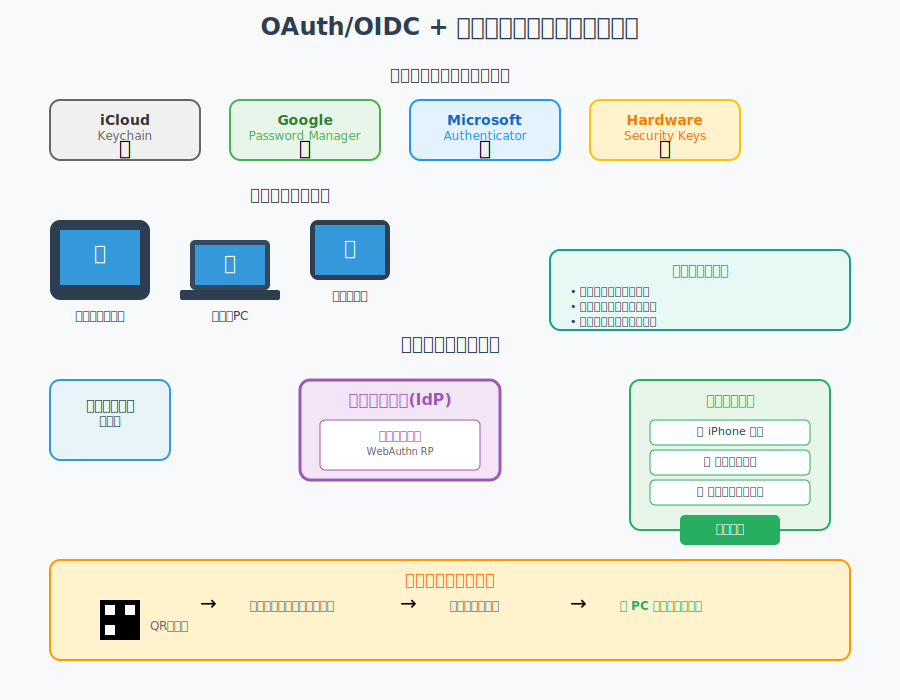

#### 1. パスキー登録フローの実装

パスキーの登録では、ユーザーが選択したプラットフォーム（iCloud、Google 等）と連携して認証情報を保存します。

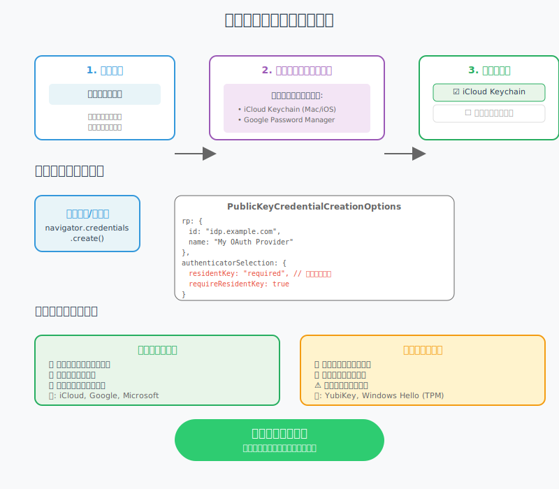

```java
@Service
public class PasskeyService {

    private final RelyingParty relyingParty;
    private final PasskeyRepository passkeyRepository;

    // パスキー登録の開始
    public PasskeyRegistrationOptions startPasskeyRegistration(
            String userId, String username) {

        // パスキー対応のオプションを設定
        StartRegistrationOptions options = StartRegistrationOptions.builder()
            .user(UserIdentity.builder()
                .id(new ByteArray(userId.getBytes()))
                .name(username)
                .displayName(username)
                .build())
            .authenticatorSelection(AuthenticatorSelectionCriteria.builder()
                // パスキーには必須の設定
                .residentKey(ResidentKeyRequirement.REQUIRED)
                .userVerification(UserVerificationRequirement.REQUIRED)
                // クロスプラットフォーム対応
                .authenticatorAttachment(AuthenticatorAttachment.CROSS_PLATFORM)
                .build())
            .attestation(AttestationConveyancePreference.DIRECT)
            .extensions(RegistrationExtensionInputs.builder()
                // クライアント能力の確認
                .credProps(true)
                .build())
            .build();

        PublicKeyCredentialCreationOptions credentialOptions =
            relyingParty.startRegistration(options);

        // セッションに保存
        return PasskeyRegistrationOptions.builder()
            .credentialOptions(credentialOptions)
            .sessionId(generateSessionId())
            .expiresAt(Instant.now().plusMinutes(5))
            .build();
    }

    // パスキー登録の完了
    public PasskeyRegistrationResult finishPasskeyRegistration(
            String userId,
            PublicKeyCredential<AuthenticatorAttestationResponse> credential,
            String sessionId) {

        try {
            // セッションから元のオプションを取得
            PasskeyRegistrationOptions originalOptions =
                getRegistrationOptions(sessionId);

            RegistrationResult result = relyingParty.finishRegistration(
                FinishRegistrationOptions.builder()
                    .request(originalOptions.getCredentialOptions())
                    .response(credential)
                    .build()
            );

            // パスキー情報を保存
            Passkey passkey = Passkey.builder()
                .userId(userId)
                .credentialId(result.getKeyId().getId())
                .publicKey(result.getPublicKeyCose())
                .signatureCount(result.getSignatureCount())
                .isDiscoverable(result.isDiscoverable().orElse(true))
                .backupEligible(isBackupEligible(credential))
                .backupState(isBackedUp(credential))
                .provider(detectProvider(credential))
                .registeredAt(Instant.now())
                .lastUsedAt(null)
                .build();

            passkeyRepository.save(passkey);

            return PasskeyRegistrationResult.builder()
                .success(true)
                .credentialId(passkey.getCredentialId())
                .provider(passkey.getProvider())
                .backupEligible(passkey.isBackupEligible())
                .build();

        } catch (RegistrationFailedException e) {
            logger.error("パスキー登録失敗", e);
            return PasskeyRegistrationResult.builder()
                .success(false)
                .error(e.getMessage())
                .build();
        }
    }

    // プロバイダーの検出
    private PasskeyProvider detectProvider(
            PublicKeyCredential<AuthenticatorAttestationResponse> credential) {

        AuthenticatorData authData = credential.getResponse()
            .getParsedAuthenticatorData();

        // AAGUIDからプロバイダーを判定
        ByteArray aaguid = authData.getAttestationData()
            .map(AttestationData::getAaguid)
            .orElse(ByteArray.fromHex("00000000000000000000000000000000"));

        return PasskeyProviderDetector.detectFromAAGUID(aaguid);
    }

}

```

#### 2. クロスデバイス認証の実装

パスキーの最大の特徴は、QR コードや Bluetooth を使用したクロスデバイス認証です。PC でログインする際に、スマートフォンのパスキーを使用できます。

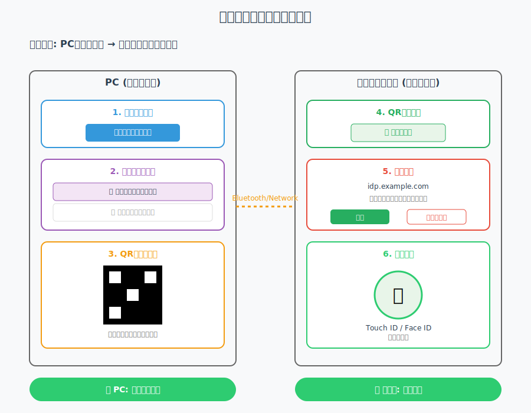

```java
@RestController
@RequestMapping("/oauth/passkey")
public class CrossDeviceAuthController {

    private final PasskeyService passkeyService;
    private final QRCodeService qrCodeService;
    private final WebSocketService webSocketService;

    // クロスデバイス認証の開始
    @PostMapping("/cross-device/start")
    public CrossDeviceAuthResponse startCrossDeviceAuth(
            HttpSession session) {

        // 一意のセッションIDを生成
        String crossDeviceSessionId = UUID.randomUUID().toString();

        // 認証オプションを生成
        PublicKeyCredentialRequestOptions options =
            passkeyService.createAuthenticationOptions();

        // クロスデバイス用の拡張を追加
        options = addCrossDeviceExtensions(options);

        // QRコード用のURLを生成
        String authUrl = generateAuthUrl(crossDeviceSessionId);
        String qrCodeDataUrl = qrCodeService.generateQRCode(authUrl);

        // セッション情報を保存
        CrossDeviceSession crossSession = CrossDeviceSession.builder()
            .sessionId(crossDeviceSessionId)
            .originalSessionId(session.getId())
            .credentialOptions(options)
            .status(AuthStatus.WAITING_FOR_DEVICE)
            .createdAt(Instant.now())
            .expiresAt(Instant.now().plusMinutes(5))
            .build();

        crossDeviceSessionRepository.save(crossSession);

        // WebSocket接続を確立
        String wsEndpoint = "/ws/auth/" + crossDeviceSessionId;

        return CrossDeviceAuthResponse.builder()
            .sessionId(crossDeviceSessionId)
            .qrCodeDataUrl(qrCodeDataUrl)
            .webSocketEndpoint(wsEndpoint)
            .expiresIn(300) // 5分
            .build();
    }

    // モバイルデバイスからの認証処理
    @PostMapping("/cross-device/authenticate/{sessionId}")
    public MobileAuthResponse authenticateFromMobile(
            @PathVariable String sessionId,
            @RequestBody PublicKeyCredential<AuthenticatorAssertionResponse> credential) {

        try {
            // セッション情報を取得
            CrossDeviceSession crossSession =
                crossDeviceSessionRepository.findById(sessionId)
                    .orElseThrow(() -> new SessionNotFoundException());

            // 有効期限チェック
            if (crossSession.isExpired()) {
                throw new SessionExpiredException();
            }

            // パスキー認証を実行
            AuthenticationResult result = passkeyService.authenticate(
                credential,
                crossSession.getCredentialOptions()
            );

            if (result.isSuccess()) {
                // 元のセッションに認証情報を転送
                transferAuthenticationToOriginalSession(
                    crossSession.getOriginalSessionId(),
                    result.getUserId()
                );

                // WebSocketで成功を通知
                webSocketService.sendMessage(
                    crossSession.getSessionId(),
                    AuthMessage.success(result.getUserId())
                );

                return MobileAuthResponse.builder()
                    .success(true)
                    .message("認証が完了しました")
                    .build();
            }

        } catch (Exception e) {
            logger.error("クロスデバイス認証エラー", e);

            // WebSocketでエラーを通知
            webSocketService.sendMessage(
                sessionId,
                AuthMessage.error(e.getMessage())
            );

            return MobileAuthResponse.builder()
                .success(false)
                .error(e.getMessage())
                .build();
        }
    }

    // WebSocket設定
    @Configuration
    @EnableWebSocket
    public class WebSocketConfig implements WebSocketConfigurer {

        @Override
        public void registerWebSocketHandlers(WebSocketHandlerRegistry registry) {
            registry.addHandler(new CrossDeviceAuthHandler(), "/ws/auth/*")
                    .setAllowedOrigins("*")
                    .withSockJS();
        }
    }

    // WebSocketハンドラー
    @Component
    public class CrossDeviceAuthHandler extends TextWebSocketHandler {

        private final Map<String, WebSocketSession> sessions =
            new ConcurrentHashMap<>();

        @Override
        public void afterConnectionEstablished(WebSocketSession session) {
            String sessionId = extractSessionId(session.getUri());
            sessions.put(sessionId, session);

            // 接続確立を通知
            sendMessage(session, AuthMessage.connected());
        }

        @Override
        protected void handleTextMessage(WebSocketSession session,
                                       TextMessage message) {
            // ポーリングやステータス確認の処理
            String payload = message.getPayload();
            if ("ping".equals(payload)) {
                sendMessage(session, AuthMessage.pong());
            }
        }
    }
}
```

#### 3. パスキーの管理とユーザビリティ

ユーザーが複数のパスキーを管理できるようにし、デバイスごとの使用状況を把握できるダッシュボードを提供します。

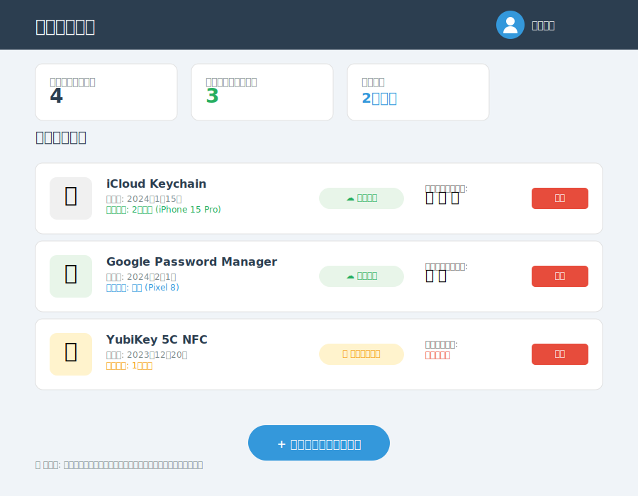

```java
@RestController
@RequestMapping("/api/passkeys")
public class PasskeyManagementController {

    private final PasskeyService passkeyService;
    private final DeviceDetectionService deviceDetectionService;

    // ユーザーのパスキー一覧取得
    @GetMapping
    public PasskeyListResponse getUserPasskeys(
            @AuthenticationPrincipal OAuthUser user) {

        List<Passkey> passkeys = passkeyService.findByUserId(user.getId());

        List<PasskeyInfo> passkeyInfos = passkeys.stream()
            .map(passkey -> PasskeyInfo.builder()
                .credentialId(passkey.getCredentialId())
                .provider(passkey.getProvider())
                .providerName(getProviderDisplayName(passkey.getProvider()))
                .registeredAt(passkey.getRegisteredAt())
                .lastUsedAt(passkey.getLastUsedAt())
                .lastUsedDevice(passkey.getLastUsedDevice())
                .isBackupEligible(passkey.isBackupEligible())
                .isBackedUp(passkey.isBackupState())
                .availableDevices(getAvailableDevices(passkey))
                .build())
            .collect(Collectors.toList());

        return PasskeyListResponse.builder()
            .passkeys(passkeyInfos)
            .totalCount(passkeyInfos.size())
            .activeCount(countActivePasskeys(passkeyInfos))
            .recommendations(generateRecommendations(passkeyInfos))
            .build();
    }

    // パスキーの削除
    @DeleteMapping("/{credentialId}")
    public DeletePasskeyResponse deletePasskey(
            @PathVariable String credentialId,
            @AuthenticationPrincipal OAuthUser user,
            @RequestBody DeletePasskeyRequest request) {

        // 再認証を要求（重要な操作のため）
        if (!verifyReauthentication(request.getReauthToken())) {
            throw new ReauthenticationRequiredException();
        }

        // 最後のパスキーでないことを確認
        long remainingPasskeys = passkeyService.countByUserId(user.getId());
        if (remainingPasskeys <= 1 && !user.hasAlternativeAuth()) {
            throw new LastPasskeyException(
                "最後のパスキーは削除できません。" +
                "先に別の認証方法を設定してください。"
            );
        }

        passkeyService.delete(credentialId, user.getId());

        // 監査ログ
        auditService.log(AuditEvent.PASSKEY_DELETED, user.getId(), credentialId);

        return DeletePasskeyResponse.builder()
            .success(true)
            .remainingPasskeys(remainingPasskeys - 1)
            .build();
    }

    // パスキーの名前変更
    @PutMapping("/{credentialId}/rename")
    public RenamePasskeyResponse renamePasskey(
            @PathVariable String credentialId,
            @RequestBody RenameRequest request,
            @AuthenticationPrincipal OAuthUser user) {

        passkeyService.updateDisplayName(
            credentialId,
            user.getId(),
            request.getNewName()
        );

        return RenamePasskeyResponse.success();
    }

    // 推奨事項の生成
    private List<String> generateRecommendations(List<PasskeyInfo> passkeys) {
        List<String> recommendations = new ArrayList<>();

        // バックアップ可能なパスキーがない場合
        boolean hasBackupEligible = passkeys.stream()
            .anyMatch(PasskeyInfo::isBackupEligible);

        if (!hasBackupEligible) {
            recommendations.add(
                "クラウド同期対応のパスキーを追加することを推奨します"
            );
        }

        // 単一プロバイダーのみの場合
        long providerCount = passkeys.stream()
            .map(PasskeyInfo::getProvider)
            .distinct()
            .count();

        if (providerCount == 1) {
            recommendations.add(
                "異なるプロバイダーのパスキーを追加して冗長性を確保しましょう"
            );
        }

        // 長期間未使用のパスキー
        passkeys.stream()
            .filter(p -> isInactive(p.getLastUsedAt()))
            .forEach(p -> recommendations.add(
                String.format("%sは長期間使用されていません。削除を検討してください。",
                    p.getProviderName())
            ));

        return recommendations;
    }

    // パスキー使用状況の分析
    @GetMapping("/analytics")
    public PasskeyAnalytics getPasskeyAnalytics(
            @AuthenticationPrincipal OAuthUser user) {

        List<PasskeyUsage> usageData = passkeyService.getUsageAnalytics(user.getId());

        return PasskeyAnalytics.builder()
            .totalAuthentications(usageData.stream()
                .mapToInt(PasskeyUsage::getUsageCount)
                .sum())
            .mostUsedProvider(findMostUsedProvider(usageData))
            .deviceDistribution(calculateDeviceDistribution(usageData))
            .authenticationTrend(calculateTrend(usageData))
            .averageAuthTime(calculateAverageAuthTime(usageData))
            .build();
    }

}

```

### パスキー移行戦略

既存のパスワードユーザーをパスキーに移行させるための段階的なアプローチを実装します。


```java
    // パスキー採用状況のモニタリング
    @Scheduled(cron = "0 0 9 * * MON") // 毎週月曜9時
    public void reportPasskeyAdoption() {
        PasskeyAdoptionReport report = PasskeyAdoptionReport.builder()
            .totalUsers(userService.countAll())
            .passkeyEnabledUsers(userService.countWithPasskey())
            .adoptionRate(calculateAdoptionRate())
            .weeklyGrowth(calculateWeeklyGrowth())
            .providerDistribution(getProviderDistribution())
            .deviceTypeDistribution(getDeviceDistribution())
            .averagePasskeysPerUser(calculateAveragePasskeys())
            .build();

        // 管理者に週次レポートを送信
        notificationService.sendAdminReport(
            "パスキー採用状況レポート",
            report
        );

        // 採用率が目標に達していない場合は追加施策を実行
        if (report.getAdoptionRate() < migrationConfig.getTargetAdoptionRate()) {
            implementAdditionalIncentives();
        }
    }

    // インセンティブプログラム
    @Component
    public class PasskeyIncentiveProgram {

        public void onPasskeyRegistered(PasskeyRegisteredEvent event) {
            OAuthUser user = event.getUser();

            // 初回登録ボーナス
            if (isFirstPasskey(user)) {
                rewardService.grantPoints(user, 500, "パスキー登録ボーナス");

                // バッジ付与
                badgeService.grant(user, Badge.SECURITY_PIONEER);
            }

            // 複数プロバイダーボーナス
            if (hasMultipleProviders(user)) {
                rewardService.grantPoints(user, 200, "マルチプロバイダーボーナス");
            }

            // 早期採用者特典
            if (isEarlyAdopter(user)) {
                user.addFeature(Feature.PREMIUM_TRIAL_30DAYS);
            }
        }
    }
}
```

### セキュリティと運用のベストプラクティス

パスキーを安全に運用するための監視とインシデント対応の仕組みを実装します。

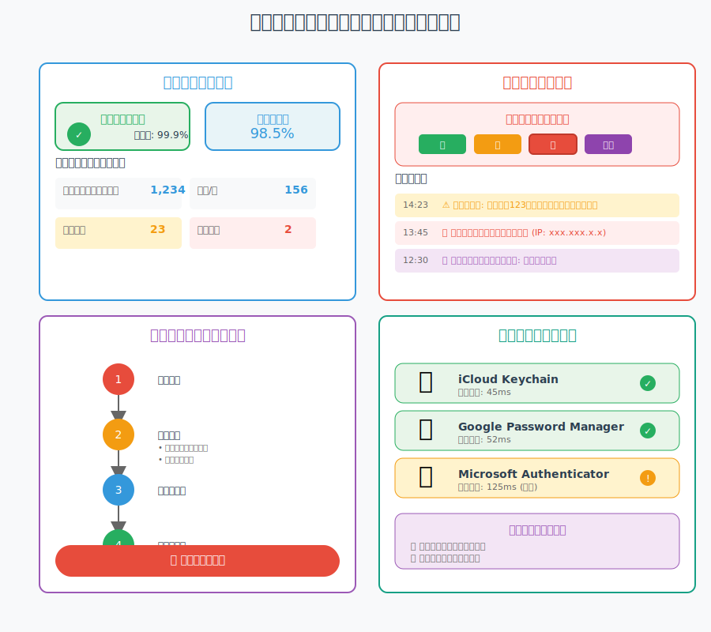

```java
@Component
public class PasskeySecurityMonitor {

    private final AlertService alertService;
    private final AnomalyDetectionService anomalyDetectionService;

    // 異常なパスキー使用パターンの検出
    @EventListener
    public void onPasskeyAuthentication(PasskeyAuthEvent event) {
        // 地理的異常の検出
        if (isGeographicallyAnomalous(event)) {
            alertService.sendSecurityAlert(
                SecurityAlert.builder()
                    .severity(Severity.HIGH)
                    .type("GEOGRAPHICAL_ANOMALY")
                    .userId(event.getUserId())
                    .details("異常な地域からのパスキー認証を検出")
                    .recommendedAction("ユーザーに確認を取る")
                    .build()
            );
        }

        // 短時間での大量認証試行
        if (hasExcessiveAttempts(event.getUserId())) {
            // 一時的にアカウントをロック
            userService.temporaryLock(event.getUserId(), Duration.ofMinutes(30));

            // ユーザーに通知
            notificationService.sendSecurityNotification(
                event.getUserId(),
                "異常なログイン試行を検出しました。" +
                "セキュリティのため一時的にアカウントをロックしました。"
            );
        }
    }

    // パスキーの緊急無効化
    @PostMapping("/api/security/emergency-revoke")
    @PreAuthorize("hasRole('SECURITY_ADMIN')")
    public EmergencyRevokeResponse emergencyRevoke(
            @RequestBody EmergencyRevokeRequest request) {

        logger.warn("緊急パスキー無効化: userId={}, reason={}",
                   request.getUserId(), request.getReason());

        // 指定ユーザーの全パスキーを無効化
        int revokedCount = passkeyService.revokeAllForUser(
            request.getUserId(),
            request.getReason()
        );

        // 代替認証手段を有効化
        userService.enableEmergencyAuth(request.getUserId());

        // 監査ログ
        auditService.logEmergencyAction(
            "PASSKEY_EMERGENCY_REVOKE",
            request
        );

        return EmergencyRevokeResponse.builder()
            .revokedCount(revokedCount)
            .emergencyAuthEnabled(true)
            .build();
    }

    // パスキープロバイダーの可用性監視
    @Scheduled(fixedDelay = 300000) // 5分ごと
    public void monitorProviderAvailability() {
        Map<PasskeyProvider, HealthStatus> healthStatus = new HashMap<>();

        // 各プロバイダーの健全性をチェック
        for (PasskeyProvider provider : PasskeyProvider.values()) {
            HealthStatus status = checkProviderHealth(provider);
            healthStatus.put(provider, status);

            if (status.isUnhealthy()) {
                // フォールバック戦略を有効化
                enableFallbackStrategy(provider);

                // 管理者にアラート
                alertService.sendOperationalAlert(
                    String.format("%s プロバイダーに問題が発生しています",
                                provider.getDisplayName())
                );
            }
        }

        // メトリクスを更新
        metricsService.updateProviderHealth(healthStatus);
    }
}

// 総合的な設定
@Configuration
@EnableConfigurationProperties(PasskeyConfiguration.class)
public class PasskeyOAuthConfiguration {

    @Bean
    public PasskeyIntegrationConfig passkeyIntegrationConfig() {
        return PasskeyIntegrationConfig.builder()
            // 基本設定
            .rpId("idp.example.com")
            .rpName("My OAuth Provider")
            .origins(List.of("https://idp.example.com", "https://app.example.com"))

            // パスキー要件
            .requireResidentKey(true)
            .requireUserVerification(true)
            .preferPlatformAuthenticator(true)

            // クロスデバイス設定
            .enableCrossDeviceAuth(true)
            .crossDeviceTimeout(Duration.ofMinutes(5))
            .qrCodeSize(300)

            // セキュリティ設定
            .attestationPreference(AttestationConveyancePreference.DIRECT)
            .allowedAAGUIDs(getAllowedAuthenticators())
            .maxCredentialsPerUser(10)

            // 移行設定
            .migrationStrategy(MigrationStrategy.GRADUAL)
            .passwordDeprecationDate(LocalDate.of(2025, 12, 31))
            .incentiveProgram(true)

            .build();
    }

    // OAuth設定への統合
    @Bean
    public OAuth2AuthorizationServerConfigurer oauthConfigurer(
            PasskeyService passkeyService) {

        return configurer -> {
            configurer
                // パスキー認証エンドポイントの追加
                .authorizationEndpoint(authorization ->
                    authorization.authenticationProviders(providers -> {
                        providers.add(new PasskeyAuthenticationProvider(passkeyService));
                    })
                )

                // トークンエンドポイントの拡張
                .tokenEndpoint(token ->
                    token.accessTokenResponseHandler((request, response, authentication) -> {
                        // AAL (Authentication Assurance Level) の追加
                        if (authentication.isPasskeyAuthenticated()) {
                            response.getAdditionalParameters().put("aal", "3");
                            response.getAdditionalParameters().put("amr", List.of("passkey", "user_presence"));
                        }
                    })
                );
        };
    }
}
```

### まとめ

OAuth/OIDC とパスキーの連携により、以下のメリットが得られます：

1. **完全なフィッシング耐性**：技術的にフィッシングが不可能
2. **優れたユーザビリティ**：パスワード不要でワンタッチ認証
3. **デバイス間の可搬性**：クラウド同期により複数デバイスで利用可能
4. **段階的な移行**：既存システムとの互換性を保ちながら導入可能

実装時は、ユーザー教育、段階的な展開、適切なフォールバック戦略が成功の鍵となります。

## 7.4. リスクベース認証の実装

## OAuth/OIDC におけるリスクベース認証の実装

### 概要

リスクベース認証（Risk-Based Authentication, RBA）は、ユーザーの行動パターンやコンテキスト情報を分析し、リスクレベルに応じて動的に認証要件を調整する仕組みです。OAuth/OIDC と組み合わせることで、セキュリティとユーザビリティの最適なバランスを実現できます。低リスクの場合は簡易な認証で済ませ、高リスクの場合は追加認証を要求することで、ユーザー体験を損なわずにセキュリティを強化します。

### リスクベース認証の仕組み

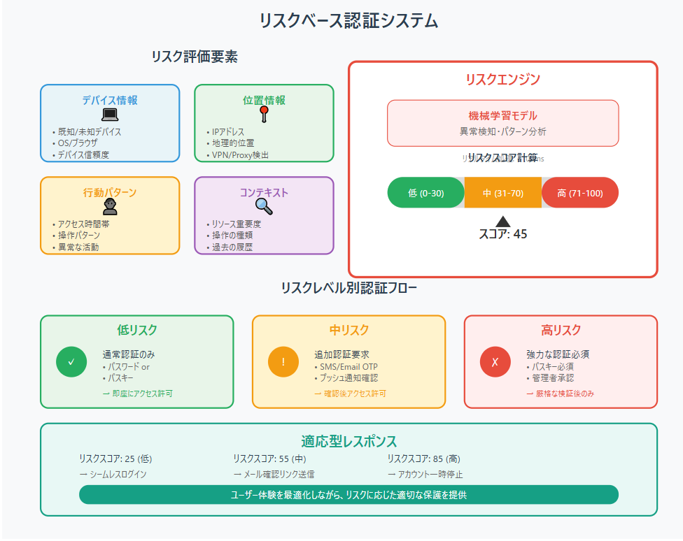

### リスク評価エンジンの実装

リスク評価エンジンは、複数の要因を総合的に分析してリスクスコアを算出します。機械学習を活用して、正常な行動パターンを学習し、異常を検出します。

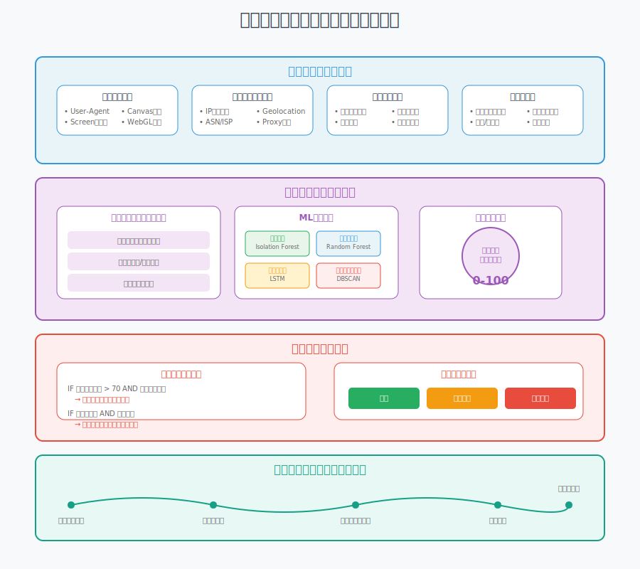

```java
@Service
public class RiskAssessmentEngine {

    private final DeviceFingerprintService deviceService;
    private final GeolocationService geoService;
    private final BehaviorAnalysisService behaviorService;
    private final MLModelService mlService;

    // リスク評価の実行
    public RiskAssessment assessRisk(AuthenticationContext context) {
        // 1. データ収集
        RiskFactors factors = collectRiskFactors(context);

        // 2. 特徴量の計算
        FeatureVector features = engineerFeatures(factors);

        // 3. MLモデルによる評価
        ModelPredictions predictions = runMLModels(features);

        // 4. ルールベースの評価
        RuleEvaluationResult ruleResult = evaluateRules(factors);

        // 5. 総合スコアの計算
        int riskScore = calculateFinalScore(predictions, ruleResult);

        // 6. アクションの決定
        RiskAction action = determineAction(riskScore, context);

        return RiskAssessment.builder()
            .score(riskScore)
            .level(getRiskLevel(riskScore))
            .action(action)
            .factors(factors)
            .reasoning(generateReasoning(predictions, ruleResult))
            .timestamp(Instant.now())
            .build();
    }

    // リスクファクターの収集
    private RiskFactors collectRiskFactors(AuthenticationContext context) {
        return RiskFactors.builder()
            // デバイス情報
            .deviceFingerprint(deviceService.getFingerprint(context.getRequest()))
            .isKnownDevice(deviceService.isKnown(
                context.getUserId(),
                context.getDeviceId()
            ))
            .deviceTrustScore(deviceService.getTrustScore(context.getDeviceId()))

            // 位置情報
            .currentLocation(geoService.getLocation(context.getIpAddress()))
            .locationVelocity(calculateLocationVelocity(context))
            .isVpnOrProxy(geoService.isVpnOrProxy(context.getIpAddress()))

            // 行動パターン
            .loginTime(context.getTimestamp())
            .isNormalTimePattern(behaviorService.isNormalTime(
                context.getUserId(),
                context.getTimestamp()
            ))
            .recentFailedAttempts(getRecentFailedAttempts(context.getUserId()))

            // コンテキスト
            .requestedResource(context.getRequestedResource())
            .resourceSensitivity(getResourceSensitivity(context.getRequestedResource()))
            .transactionAmount(context.getTransactionAmount())

            .build();
    }

    // MLモデルの実行
    private ModelPredictions runMLModels(FeatureVector features) {
        // 異常検出モデル
        double anomalyScore = mlService.
```

```java
    // MLモデルの実行
    private ModelPredictions runMLModels(FeatureVector features) {
        // 異常検出モデル
        double anomalyScore = mlService.runAnomalyDetection(features);

        // 分類モデル
        double fraudProbability = mlService.runFraudClassification(features);

        // 時系列分析
        double timeSeriesAnomaly = mlService.runTimeSeriesAnalysis(features);

        // ユーザー行動クラスタリング
        int behaviorCluster = mlService.runBehaviorClustering(features);

        return ModelPredictions.builder()
            .anomalyScore(anomalyScore)
            .fraudProbability(fraudProbability)
            .timeSeriesAnomaly(timeSeriesAnomaly)
            .behaviorCluster(behaviorCluster)
            .confidence(calculateConfidence(anomalyScore, fraudProbability))
            .build();
    }

    // ルールベース評価
    @Component
    public class RiskRuleEngine {

        public RuleEvaluationResult evaluateRules(RiskFactors factors) {
            List<RuleViolation> violations = new ArrayList<>();

            // 地理的異常ルール
            if (factors.getLocationVelocity() > 500) { // 500km/h以上
                violations.add(RuleViolation.builder()
                    .rule("IMPOSSIBLE_TRAVEL")
                    .severity(Severity.HIGH)
                    .description("物理的に不可能な移動速度を検出")
                    .build());
            }

            // 新規デバイスからの高リスク操作
            if (!factors.isKnownDevice() &&
                factors.getResourceSensitivity() == Sensitivity.HIGH) {
                violations.add(RuleViolation.builder()
                    .rule("NEW_DEVICE_HIGH_RISK")
                    .severity(Severity.MEDIUM)
                    .description("未知のデバイスから重要リソースへのアクセス")
                    .build());
            }

            // 連続失敗後のアクセス
            if (factors.getRecentFailedAttempts() > 3) {
                violations.add(RuleViolation.builder()
                    .rule("MULTIPLE_FAILED_ATTEMPTS")
                    .severity(Severity.HIGH)
                    .description("複数回の認証失敗後のアクセス試行")
                    .build());
            }

            // VPN/Proxy経由での金融取引
            if (factors.isVpnOrProxy() && factors.getTransactionAmount() != null) {
                violations.add(RuleViolation.builder()
                    .rule("VPN_FINANCIAL_TRANSACTION")
                    .severity(Severity.MEDIUM)
                    .description("VPN/Proxy経由での金融取引")
                    .build());
            }

            return RuleEvaluationResult.builder()
                .violations(violations)
                .maxSeverity(getMaxSeverity(violations))
                .build();
        }
    }
}
```

### OAuth/OIDC フローへの統合

リスクベース認証を OAuth/OIDC フローに統合し、認証要求時にリアルタイムでリスク評価を行います。


```java
@Controller
@RequestMapping("/oauth")
public class RiskBasedOAuthController {

    private final RiskAssessmentEngine riskEngine;
    private final OAuthService oauthService;
    private final AdaptiveAuthService adaptiveAuthService;

    @GetMapping("/authorize")
    public String authorize(
            @RequestParam String clientId,
            @RequestParam String redirectUri,
            @RequestParam String state,
            HttpServletRequest request,
            HttpSession session,
            Model model) {

        // OAuth パラメータの検証
        oauthService.validateAuthorizationRequest(clientId, redirectUri, state);

        // リスク評価コンテキストの構築
        AuthenticationContext authContext = AuthenticationContext.builder()
            .userId(getCurrentUserId())
            .ipAddress(getClientIpAddress(request))
            .userAgent(request.getHeader("User-Agent"))
            .deviceId(extractDeviceId(request))
            .requestedResource(redirectUri)
            .timestamp(Instant.now())
            .build();

        // リスク評価の実行
        RiskAssessment assessment = riskEngine.assessRisk(authContext);

        // セッションに保存
        session.setAttribute("risk_assessment", assessment);
        session.setAttribute("oauth_request", OAuthRequest.builder()
            .clientId(clientId)
            .redirectUri(redirectUri)
            .state(state)
            .build()
        );

        // リスクレベルに応じた認証フローへ
        return handleRiskBasedAuthentication(assessment, model);
    }

    private String handleRiskBasedAuthentication(
            RiskAssessment assessment, Model model) {

        switch (assessment.getLevel()) {
            case LOW:
                // 低リスク: 通常の認証
                return "oauth/login";

            case MEDIUM:
                // 中リスク: 追加認証を要求
                model.addAttribute("requiredAuth",
                    adaptiveAuthService.determineAuthMethod(assessment));
                model.addAttribute("riskReason", assessment.getReasoning());
                return "oauth/step-up-auth";

            case HIGH:
                // 高リスク: アクセスをブロック
                model.addAttribute("blockReason", assessment.getReasoning());
                alertService.sendSecurityAlert(assessment);
                return "oauth/access-blocked";

            default:
                throw new IllegalStateException("Unknown risk level");
        }
    }

    // 追加認証の処理
    @PostMapping("/step-up-auth")
    @ResponseBody
    public StepUpAuthResponse handleStepUpAuth(
            @RequestBody StepUpAuthRequest request,
            HttpSession session) {

        RiskAssessment originalAssessment =
            (RiskAssessment) session.getAttribute("risk_assessment");

        // 追加認証の検証
        boolean verified = adaptiveAuthService.verifyStepUpAuth(
            request.getMethod(),
            request.getCredential()
        );

        if (verified) {
            // リスクスコアを再計算
            RiskAssessment updatedAssessment =
                riskEngine.recalculateAfterStepUp(originalAssessment);

            if (updatedAssessment.getLevel() == RiskLevel.LOW) {
                // 認証成功
                String authCode = oauthService.generateAuthorizationCode(
                    getCurrentUserId(),
                    (OAuthRequest) session.getAttribute("oauth_request")
                );

                return StepUpAuthResponse.success(authCode);
            }
        }

        return StepUpAuthResponse.failure("追加認証に失敗しました");
    }

}

```

### リスクベース認証の運用とモニタリング

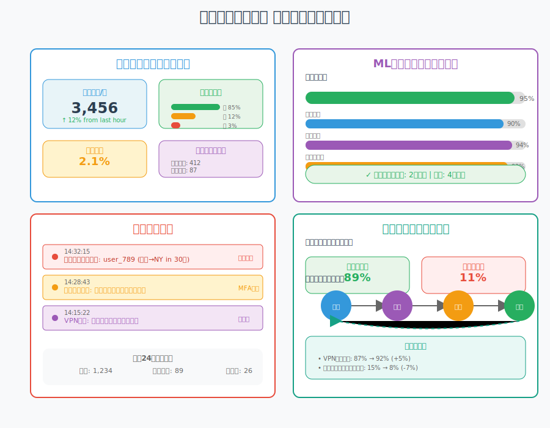

```java
@Service
public class RiskBasedAuthMonitoringService {

    private final MetricsService metricsService;
    private final AlertService alertService;
    private final MLModelService mlModelService;

    // リアルタイムモニタリング
    @EventListener
    public void monitorAuthenticationEvent(AuthenticationEvent event) {
        // メトリクスの更新
        updateMetrics(event);

        // 異常パターンの検出
        detectAnomalousPatterns(event);

        // MLモデルへのフィードバック
        if (event.hasFeedback()) {
            mlModelService.addFeedback(event.toFeedback());
        }
    }

    // ダッシュボードデータの提供
    @GetMapping("/api/risk-auth/dashboard")
    public DashboardData getDashboardData() {
        return DashboardData.builder()
            .realtimeMetrics(getRealtimeMetrics())
            .modelPerformance(getModelPerformance())
            .threatLog(getRecentThreats())
            .feedbackStats(getFeedbackStatistics())
            .build();
    }

    // 定期的なモデル更新
    @Scheduled(fixedDelay = 14400000) // 4時間ごと
    public void updateMLModels() {
        logger.info("MLモデルの更新を開始");

        // フィードバックデータの収集
        List<UserFeedback> feedbacks = collectRecentFeedback();

        // モデルの再トレーニング
        ModelUpdateResult result = mlModelService.retrain(feedbacks);

        // パフォーマンスの検証
        if (result.getImprovement() > 0) {
            mlModelService.deployNewModel(result.getModel());
            logger.info("新しいモデルを展開: 精度向上 {}%",
                       result.getImprovement());
        }
    }

    // 脅威レスポンスの最適化
    @Component
    public class AdaptiveResponseOptimizer {

        public void optimizeResponses() {
            // 誤検知率の分析
            double falsePositiveRate = calculateFalsePositiveRate();

            if (falsePositiveRate > 0.05) { // 5%以上
                // しきい値の調整
                adjustRiskThresholds();

                // 特定のルールの緩和
                relaxOverlyStrictRules();
            }

            // ユーザーエクスペリエンスの改善
            optimizeStepUpAuthFlow();
        }

        private void optimizeStepUpAuthFlow() {
            // よく使われる追加認証方法を優先
            Map<String, Integer> authMethodUsage = getAuthMethodUsage();

            adaptiveAuthService.reorderAuthMethods(
                authMethodUsage.entrySet().stream()
                    .sorted(Map.Entry.<String, Integer>comparingByValue().reversed())
                    .map(Map.Entry::getKey)
                    .collect(Collectors.toList())
            );
        }
    }
}

// 総合的な設定
@Configuration
@EnableConfigurationProperties(RiskBasedAuthProperties.class)
public class RiskBasedAuthConfiguration {

    @Bean
    public RiskBasedAuthConfig riskBasedAuthConfig() {
        return RiskBasedAuthConfig.builder()
            // リスク評価設定
            .riskThresholds(RiskThresholds.builder()
                .low(30)
                .medium(70)
                .high(90)
                .build())

            // MLモデル設定
            .mlModels(MLModelConfig.builder()
                .anomalyDetectionModel("isolation_forest_v2")
                .behaviorAnalysisModel("lstm_behavior_v3")
                .geoAnalysisModel("geo_clustering_v1")
                .ensembleWeights(Map.of(
                    "anomaly", 0.4,
                    "behavior", 0.3,
                    "geo", 0.3
                ))
                .build())

            // アダプティブ認証設定
            .adaptiveAuth(AdaptiveAuthConfig.builder()
                .lowRiskMethods(List.of("password", "passkey"))
                .mediumRiskMethods(List.of("sms_otp", "email_otp", "push"))
                .highRiskMethods(List.of("passkey", "admin_approval"))
                .stepUpTimeout(Duration.ofMinutes(5))
                .build())

            // モニタリング設定
            .monitoring(MonitoringConfig.builder()
                .metricsRetention(Duration.ofDays(30))
                .alertThresholds(Map.of(
                    "false_positive_rate", 0.05,
                    "block_rate", 0.10,
                    "model_accuracy", 0.85
                ))
                .dashboardRefreshInterval(Duration.ofSeconds(30))
                .build())

            // フィードバックループ設定
            .feedbackLoop(FeedbackLoopConfig.builder()
                .enableUserFeedback(true)
                .modelUpdateFrequency(Duration.ofHours(4))
                .minFeedbackForUpdate(100)
                .improvementThreshold(0.02) // 2%以上の改善
                .build())

            .build();
    }
}
```

### まとめ

リスクベース認証を OAuth/OIDC に統合することで、以下のメリットが得られます：

1. **セキュリティの向上**：リスクの高い認証試行を自動的に検出・ブロック
2. **ユーザー体験の最適化**：低リスクユーザーにはシームレスな認証体験を提供
3. **適応的な保護**：脅威の変化に応じて自動的に対策を調整
4. **運用効率の向上**：機械学習による自動化で手動介入を削減

実装時は、誤検知率の管理、ユーザーフィードバックの活用、継続的なモデル改善が成功の鍵となります。

## 7.5. 多要素認証（MFA）の強制

### 概要

多要素認証（Multi-Factor Authentication, MFA）の強制は、OAuth/OIDC において重要なセキュリティ対策です。パスワードのみの認証では不十分な場合に、追加の認証要素を要求することで、アカウント乗っ取りやなりすましを防ぎます。OAuth/OIDC フレームワークでは、ACR（Authentication Context Class Reference）や AMR（Authentication Methods References）を使用して、必要な認証レベルを指定・検証できます。

### MFA 強制の仕組み


### MFA 強制の実装パターン

OAuth/OIDC で MFA を強制する際の実装パターンを詳しく見ていきます。ACR（Authentication Context Class Reference）を使用した要求と検証が重要です。


```java
    // MFA要件の定義
    @Component
    public class MFAPolicyEngine {

        private final Map<String, ACRRequirement> resourceRequirements;

        public MFAPolicyEngine() {
            this.resourceRequirements = new HashMap<>();
            initializePolicies();
        }

        private void initializePolicies() {
            // リソース別のMFA要件
            resourceRequirements.put("/api/public/*", ACRRequirement.NONE);
            resourceRequirements.put("/api/user/*", ACRRequirement.SINGLE_FACTOR);
            resourceRequirements.put("/api/payment/*", ACRRequirement.MULTI_FACTOR);
            resourceRequirements.put("/api/admin/*", ACRRequirement.STRONG_MFA);
        }

        public ACRRequirement getRequiredACR(String resource) {
            return resourceRequirements.entrySet().stream()
                .filter(entry -> pathMatches(resource, entry.getKey()))
                .map(Map.Entry::getValue)
                .findFirst()
                .orElse(ACRRequirement.SINGLE_FACTOR);
        }
    }

    // OAuth認証エンドポイントでのMFA強制
    @Controller
    @RequestMapping("/oauth")
    public class MFAOAuthController {

        @GetMapping("/authorize")
        public String authorize(
                @RequestParam String clientId,
                @RequestParam String redirectUri,
                @RequestParam(required = false) String acrValues,
                HttpSession session,
                Model model) {

            // ACR要求の解析
            Set<String> requestedACRs = parseACRValues(acrValues);

            // 現在の認証コンテキストを確認
            AuthenticationContext currentContext =
                authContextService.getCurrentContext();

            // MFA要件を満たしているか確認
            if (!meetsACRRequirements(currentContext, requestedACRs)) {
                // MFAステップアップが必要
                return handleMFAStepUp(requestedACRs, session, model);
            }

            // 要件を満たしている場合は通常のフローへ
            return processAuthorization(clientId, redirectUri, currentContext);
        }

        private String handleMFAStepUp(Set<String> requestedACRs,
                                      HttpSession session,
                                      Model model) {
            // 利用可能なMFA方式を取得
            List<MFAMethod> availableMethods = getAvailableMFAMethods(
                getCurrentUser(),
                requestedACRs
            );

            model.addAttribute("mfaMethods", availableMethods);
            model.addAttribute("requiredACR", getHighestACR(requestedACRs));

            // セッションに元のリクエストを保存
            session.setAttribute("pending_oauth_request",
                OAuthRequest.builder()
                    .requestedACRs(requestedACRs)
                    .timestamp(Instant.now())
                    .build()
            );

            return "mfa/step-up";
        }
    }

    // MFA実行エンドポイント
    @RestController
    @RequestMapping("/api/mfa")
    public class MFAExecutionController {

        @PostMapping("/initiate/{method}")
        public MFAInitiationResponse initiateMFA(
                @PathVariable String method,
                @RequestBody MFAInitiationRequest request) {

            OAuthUser user = getCurrentUser();

            switch (method.toLowerCase()) {
                case "sms":
                    return initiateSMSOTP(user);
                case "totp":
                    return initiateTOTP(user);
                case "push":
                    return initiatePushNotification(user);
                case "webauthn":
                    return initiateWebAuthn(user);
                default:
                    throw new UnsupportedMFAMethodException(method);
            }
        }

        private MFAInitiationResponse initiateSMSOTP(OAuthUser user) {
            // SMS OTP送信
            String phoneNumber = user.getPhoneNumber();
            String otp = generateSecureOTP();

            // OTPを暗号化してキャッシュに保存
            otpCache.put(user.getId(), encryptOTP(otp), 5, TimeUnit.MINUTES);

            // SMS送信
            smsService.sendOTP(phoneNumber, otp);

            return MFAInitiationResponse.builder()
                .method("sms")
                .status("sent")
                .maskedPhone(maskPhoneNumber(phoneNumber))
                .expiresIn(300) // 5分
                .build();
        }

        @PostMapping("/verify/{method}")
        public MFAVerificationResponse verifyMFA(
                @PathVariable String method,
                @RequestBody MFAVerificationRequest request,
                HttpSession session) {

            boolean verified = false;

            switch (method.toLowerCase()) {
                case "sms":
                case "totp":
                    verified = verifyOTP(request.getCode());
                    break;
                case "push":
                    verified = verifyPushResponse(request.getTransactionId());
                    break;
                case "webauthn":
                    verified = verifyWebAuthnAssertion(request.getAssertion());
                    break;
            }

            if (verified) {
                // 認証コンテキストを更新
                updateAuthenticationContext(method);

                // 保留中のOAuthリクエストを再開
                OAuthRequest pendingRequest =
                    (OAuthRequest) session.getAttribute("pending_oauth_request");

                if (pendingRequest != null) {
                    return MFAVerificationResponse.builder()
                        .success(true)
                        .redirectUrl(buildAuthorizationRedirect(pendingRequest))
                        .build();
                }
            }

            return MFAVerificationResponse.builder()
                .success(false)
                .error("MFA verification failed")
                .build();
        }
    }
}
```

### リソースサーバーでの MFA 検証

リソースサーバー側で ID トークンの ACR/AMR クレームを検証し、適切な MFA が実行されていることを確認します。


```java
@Component
public class MFAResourceProtection {

    // リソースサーバーでのMFA検証インターセプター
    @Component
    public class MFAValidationInterceptor implements HandlerInterceptor {

        private final TokenIntrospectionService introspectionService;
        private final MFAPolicyEngine policyEngine;

        @Override
        public boolean preHandle(HttpServletRequest request,
                               HttpServletResponse response,
                               Object handler) throws Exception {

            // アクセストークンから認証情報を取得
            String accessToken = extractAccessToken(request);
            TokenIntrospectionResponse introspection =
                introspectionService.introspect(accessToken);

            // IDトークンのクレームを取得
            Map<String, Object> idTokenClaims = introspection.getIdTokenClaims();

            // ACR/AMRの検証
            String actualACR = (String) idTokenClaims.get("acr");
            List<String> amr = (List<String>) idTokenClaims.get("amr");

            // リソースの要求ACRを取得
            String requestedResource = request.getRequestURI();
            ACRRequirement requiredACR = policyEngine.getRequiredACR(requestedResource);

            // ACR要件を満たしているか確認
            if (!meetsACRRequirement(actualACR, amr, requiredACR)) {
                // MFA不足エラーを返却
                sendMFARequiredError(response, requiredACR);
                return false;
            }

            // 認証時刻のチェック（セッションタイムアウト）
            Long authTime = (Long) idTokenClaims.get("auth_time");
            if (isAuthenticationExpired(authTime, requiredACR)) {
                sendReauthenticationRequired(response);
                return false;
            }

            return true;
        }

        private void sendMFARequiredError(HttpServletResponse response,
                                         ACRRequirement required) throws IOException {
            response.setStatus(HttpStatus.FORBIDDEN.value());
            response.setContentType("application/json");

            MFAErrorResponse error = MFAErrorResponse.builder()
                .error("insufficient_authentication")
                .errorDescription("MFA required for this resource")
                .requiredAcr(required.getValue())
                .wwwAuthenticate(buildWWWAuthenticateHeader(required))
                .build();

            objectMapper.writeValue(response.getWriter(), error);
        }

        private String buildWWWAuthenticateHeader(ACRRequirement required) {
            return String.format(
                "Bearer realm=\"api\", " +
                "error=\"insufficient_authentication\", " +
                "error_description=\"MFA required\", " +
                "acr_values=\"%s\"",
                required.getValue()
            );
        }
    }

    // ACR要件の評価
    @Component
    public class ACREvaluator {

        private static final Map<String, Integer> ACR_LEVELS = Map.of(
            "0", 0,  // パスワードのみ
            "1", 1,  // 基本的な2要素
            "urn:mfa:sms", 1,
            "urn:mfa:totp", 1,
            "urn:mfa:push", 1,
            "2", 2,  // 強力なMFA
            "urn:mfa:webauthn", 2,
            "urn:mfa:piv", 2
        );

        public boolean meetsRequirement(String actualACR,
                                      List<String> amr,
                                      ACRRequirement required) {
            int actualLevel = ACR_LEVELS.getOrDefault(actualACR, 0);
            int requiredLevel = ACR_LEVELS.getOrDefault(required.getValue(), 0);

            // レベル比較
            if (actualLevel < requiredLevel) {
                return false;
            }

            // 特定のAMR要件がある場合
            if (required.hasSpecificAMRRequirement()) {
                return amr.containsAll(required.getRequiredAMR());
            }

            return true;
        }
    }

}

```

### MFA 管理とユーザビリティ


```java
@Service
public class MFAManagementService {

    private final MFAMethodRepository methodRepository;
    private final NotificationService notificationService;
    private final AuditService auditService;

    // ユーザーのMFA管理
    @RestController
    @RequestMapping("/api/mfa/management")
    public class MFAManagementController {

        @GetMapping("/methods")
        public MFAMethodsResponse getUserMFAMethods(
                @AuthenticationPrincipal OAuthUser user) {

            List<MFAMethod> methods = methodRepository.findByUserId(user.getId());

            return MFAMethodsResponse.builder()
                .methods(methods.stream()
                    .map(this::toMethodInfo)
                    .collect(Collectors.toList()))
                .mfaEnabled(methods.size() > 0)
                .securityLevel(calculateSecurityLevel(methods))
                .recommendations(generateRecommendations(methods))
                .build();
        }

        @PostMapping("/methods/{type}")
        public MFARegistrationResponse registerMFAMethod(
                @PathVariable String type,
                @RequestBody MFARegistrationRequest request,
                @AuthenticationPrincipal OAuthUser user) {

            // 再認証を要求（セキュリティのため）
            if (!verifyRecentAuthentication(user)) {
                throw new ReauthenticationRequiredException();
            }

            switch (type.toLowerCase()) {
                case "sms":
                    return registerSMS(user, request);
                case "totp":
                    return registerTOTP(user);
                case "webauthn":
                    return registerWebAuthn(user, request);
                case "push":
                    return registerPushNotification(user, request);
                default:
                    throw new UnsupportedMFAMethodException(type);
            }
        }

        private MFARegistrationResponse registerTOTP(OAuthUser user) {
            // シークレットキーの生成
            String secret = generateTOTPSecret();

            // QRコードの生成
            String qrCodeUrl = generateTOTPQRCode(user.getEmail(), secret);

            // 一時的に保存（確認後に永続化）
            pendingMFACache.put(user.getId() + ":totp",
                PendingMFA.builder()
                    .type("totp")
                    .secret(encryptSecret(secret))
                    .createdAt(Instant.now())
                    .build(),
                10, TimeUnit.MINUTES
            );

            return MFARegistrationResponse.builder()
                .method("totp")
                .qrCodeUrl(qrCodeUrl)
                .manualEntryKey(formatManualKey(secret))
                .verificationRequired(true)
                .build();
        }

        @DeleteMapping("/methods/{methodId}")
        public void deleteMFAMethod(
                @PathVariable String methodId,
                @AuthenticationPrincipal OAuthUser user) {

            // 最後のMFA方式でないことを確認
            long remainingMethods = methodRepository.countByUserId(user.getId());
            if (remainingMethods <= 1) {
                throw new LastMFAMethodException(
                    "最後のMFA方式は削除できません。" +
                    "先に別のMFA方式を追加してください。"
                );
            }

            // 削除実行
            methodRepository.deleteByIdAndUserId(methodId, user.getId());

            // 監査ログ
            auditService.log(AuditEvent.MFA_METHOD_DELETED,
                user.getId(), methodId);

            // 通知
            notificationService.sendMFAChangeNotification(user,
                "MFA方式が削除されました");
        }
    }

    // MFAポリシーの適用
    @Component
    public class MFAPolicyEnforcer {

        @EventListener
        public void onUserRoleChange(UserRoleChangeEvent event) {
            // 管理者になった場合はMFAを強制
            if (event.getNewRoles().contains("ADMIN")) {
                enforceMFAForUser(event.getUserId());
            }
        }

        @EventListener
        public void onHighValueTransaction(TransactionEvent event) {
            // 高額取引の場合は一時的にMFA要件を引き上げ
            if (event.getAmount().compareTo(HIGH_VALUE_THRESHOLD) > 0) {
                temporaryMFAUpgrade(event.getUserId(), Duration.ofHours(24));
            }
        }

        private void enforceMFAForUser(String userId) {
            User user = userRepository.findById(userId);

            if (!user.hasMFA()) {
                // MFA登録を要求
                user.setMfaRequired(true);
                user.setMfaGracePeriodEnd(Instant.now().plus(7, ChronoUnit.DAYS));
                userRepository.save(user);

                // 通知送信
                notificationService.sendMFAEnforcementNotice(user,
                    "セキュリティポリシーにより、7日以内にMFAの設定が必要です。"
                );
            }
        }
    }

    // バックアップとリカバリー
    @Service
    public class MFARecoveryService {

        public BackupCodesResponse generateBackupCodes(OAuthUser user) {
            // 既存のバックアップコードを無効化
            invalidateExistingBackupCodes(user.getId());

            // 新しいバックアップコードを生成
            List<String> codes = IntStream.range(0, 10)
                .mapToObj(i -> generateSecureBackupCode())
                .collect(Collectors.toList());

            // ハッシュ化して保存
            codes.forEach(code -> {
                backupCodeRepository.save(BackupCode.builder()
                    .userId(user.getId())
                    .codeHash(hashBackupCode(code))
                    .used(false)
                    .createdAt(Instant.now())
                    .build());
            });

            return BackupCodesResponse.builder()
                .codes(codes)
                .warning("これらのコードを安全な場所に保管してください。" +
                        "各コードは一度だけ使用できます。")
                .build();
        }

        public boolean verifyBackupCode(String userId, String code) {
            List<BackupCode> backupCodes =
                backupCodeRepository.findUnusedByUserId(userId);

            for (BackupCode backupCode : backupCodes) {
                if (verifyHash(code, backupCode.getCodeHash())) {
                    // 使用済みにマーク
                    backupCode.setUsed(true);
                    backupCode.setUsedAt(Instant.now());
                    backupCodeRepository.save(backupCode);

                    // セキュリティ通知
                    notificationService.sendSecurityAlert(userId,
                        "バックアップコードが使用されました。" +
                        "心当たりがない場合は、アカウントを確認してください。"
                    );

                    return true;
                }
            }

            return false;
        }
    }
}

// 総合的な設定
@Configuration
@EnableConfigurationProperties(MFAConfiguration.class)
public class MFAConfig {

    @Bean
    public MFASettings mfaSettings() {
        return MFASettings.builder()
            // MFA方式の設定
            .supportedMethods(Set.of(
                "sms", "totp", "webauthn", "push", "backup_codes"
            ))
            .preferredMethods(List.of("webauthn", "totp", "push"))

            // ポリシー設定
            .policies(MFAPolicies.builder()
                .adminRequiresMFA(true)
                .highValueTransactionThreshold(BigDecimal.valueOf(10000))
                .mfaGracePeriod(Duration.ofDays(7))
                .sessionTimeout(Duration.ofHours(8))
                .build())

            // セキュリティ設定
            .security(MFASecuritySettings.builder()
                .totpWindowSize(3)  // 前後3つの時間窓を許容
                .otpLength(6)
                .otpValidityMinutes(5)
                .maxFailedAttempts(5)
                .lockoutDuration(Duration.ofMinutes(30))
                .build())

            // UX設定
            .userExperience(MFAUXSettings.builder()
                .rememberDeviceDays(30)
                .skipMFAForTrustedNetworks(true)
                .allowMFAMethodSwitching(true)
                .showMFAStrengthIndicator(true)
                .build())

            .build();
    }
}
```

### まとめ

OAuth/OIDC における MFA 強制は、以下の要素で構成されます：

1. **ACR/AMR の活用**：標準化された方法で認証レベルを要求・検証
2. **柔軟なポリシー設定**：リソース、リスク、時間に基づく動的な MFA 要求
3. **多様な認証方式**：ユーザビリティとセキュリティのバランスを考慮
4. **適切な管理機能**：ユーザーが自身の MFA を管理できる UI/UX
5. **リカバリー機能**：バックアップコードなどの緊急時対策

実装時は、ユーザビリティを損なわないよう、段階的な導入と適切なユーザー教育が重要です。
